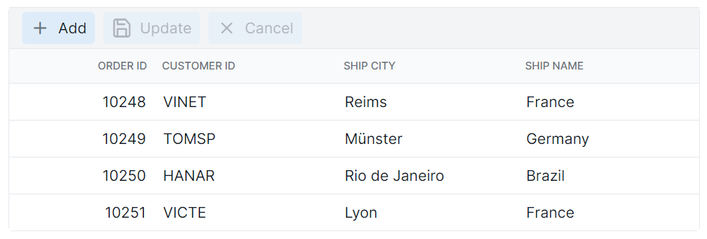

# Toolbar Customization in Angular Grid Component

The appearance of the toolbar in the Angular Grid component can be customized using CSS. Here are examples for customizing the toolbar root element and toolbar button element.

## Customize the toolbar root element

The `.e-toolbar-items` class is used to style the toolbar root element.

```css
.e-grid .e-toolbar-items {
    background-color: #deecf9;
}
```


## Customize the toolbar button element

The `.e-toolbar .e-btn` selector is used to style the toolbar button elements.

```css
.e-grid .e-toolbar .e-btn {
    background-color: #deecf9;
}
```


