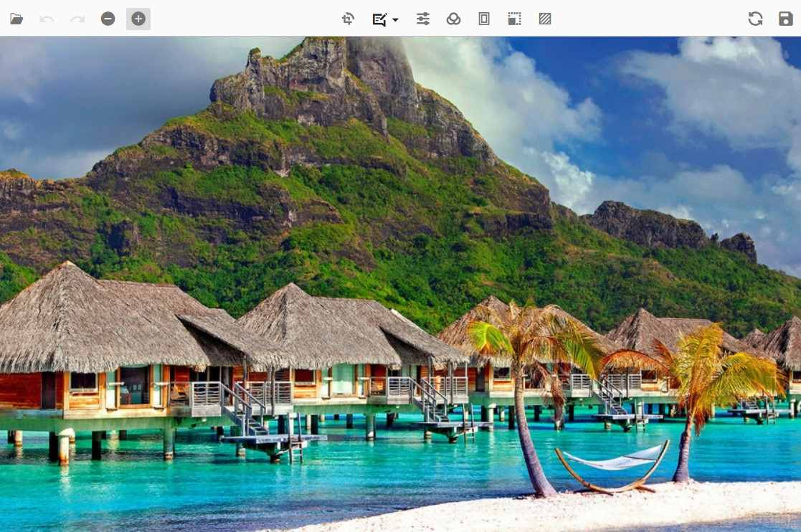

# End User Capabilities in Angular Image Editor

The following operations are available for end-users and are explained briefly in the following sections.

## Open an image

To open an image in the image editor, follow these steps.

* Click the Open icon on the left side of the toolbar.

* The file explorer lists only JPEG, PNG, SVG, WEBP, and BMP format files.

* Select the image from the list in the file explorer window.

## Zooming

Image zooming can be performed in the following ways.

* Using the toolbar.

* Using pinch zoom on touch-enabled devices.

* Using the mouse wheel.

* Using the keyboard.

### Using the toolbar

To zoom in or out of the image in the image editor, follow these steps. Ensure an image is already opened (see [Open an image](#open-an-image)).

* The Zoom In / Zoom Out option is enabled only after opening the image. Click the Zoom In or Zoom Out button to zoom the image.

### Using pinch zoom

To zoom in or out of the image in the image editor, follow these steps.

* Touch with two fingers to perform zooming.

* Zooming in and out is controlled by touch gestures.

### Using the mouse wheel

To zoom in or out of the image in the image editor, follow these steps.

* Press the Ctrl key and scroll the mouse wheel to perform zooming.

* Zooming in and out is controlled by the mouse wheel.

### Using the keyboard

To zoom in or out of the image in the image editor, follow these steps.

* Press <kbd>Ctrl</kbd> + <kbd>+</kbd> to zoom in on an image.

* Press <kbd>Ctrl</kbd> + <kbd>-</kbd> to zoom out of an image.

## Panning

To pan an image in the image editor, follow these steps.

* Click the image and drag to move or pan it.

* The panning option is enabled in the following two cases:

    * When the selection is applied for cropping an image.

    * When the image size exceeds the canvas size while zooming an image.

## Cropping and image transformation

To crop an image in the image editor, follow these steps.

* Cropping can be performed based on the selection in an image editor.

* To perform selection, click the crop button in the toolbar, which opens the contextual toolbar that shows crop selection options, rotate options, flip options, and straightening options.

* Click the crop selection button and select the type of selection, such as custom, circle, square, or ratio selection, from the popup.

* Once the selection is completed, pan to move the image to get the cropped region.

* Use the rotate and flip buttons along with the straighten slider to perform image transformations, including any inserted annotations.

* Once the cropping region is finalized on the image, click the tick icon at the top right of the toolbar to crop the image.

## Annotations

To add annotations to an image in the image editor, follow these steps.

* To add an annotation, click the annotation button in the toolbar and select the type of annotation, such as Line, Rectangle, Ellipse, Path, Arrow, Text, or Freehand drawing, to insert it into the image editor.

* Once the annotation is added to the image, it can be repositioned by clicking and dragging the annotation with the mouse, and resized by clicking and dragging the selection circles placed around the annotation.

* To rotate annotations, drag the rotation handle (circle) located at the bottom of the annotation. Rotation is applicable to all annotations except text annotations.

* Customize the annotations by changing their color and stroke width through the contextual toolbar (text annotations also support font family and font size). The contextual toolbar is enabled whenever an annotation is selected.

* When annotations are selected in the Image Editor, the quick access toolbar becomes active, providing convenient access to various actions such as duplicating, deleting, or editing text associated with the selected annotation. This toolbar enables users to perform these common operations quickly and efficiently, streamlining their workflow and enhancing the overall editing experience.

## Filtering and fine-tune

### Fine-tune

To perform fine-tuning on an image in the image editor, follow these steps.

* Click the fine-tune button, which displays the list of fine-tuning options available in the image editor.

* Click one of the fine-tune options from the list, which shows a slider to adjust the corresponding setting.

* Click on the canvas or the tick icon at the right corner of the toolbar in the image editor to apply the modifications.

### Filters

To apply filters to an image in the image editor, follow these steps.

* Click the filter button, which displays the list of filters available in the image editor.

* Click the filter from the list of options to apply the corresponding filter to the image.

* Click on the canvas or the tick icon at the right corner of the toolbar in the image editor to apply the modifications.

## Undo and redo operations

To undo and redo the actions performed in the image editor, follow these steps.

* The undo button is enabled once an action is performed in the image editor.

* The redo button is enabled once an undo action is performed in the image editor.

* Click the undo or redo button on the left side of the toolbar to perform the undo or redo operation.

* <kbd>Ctrl</kbd> + <kbd>Z</kbd> and <kbd>Ctrl</kbd> + <kbd>Y</kbd> facilitate this process by allowing users to undo and redo actions, respectively.

## Reset an image

To revert all the changes made in the image editor, follow these steps.

* Click the reset button, which is located on the right side of the toolbar.

* This will revert all the changes made in the image editor.

## Export an image

To save the modified image in the Image Editor, follow these steps:

* Click the Save button
    * Locate the Save button on the right side of the toolbar and click it.

* Select the file format
    * In the export popup, choose your preferred file format (PNG, JPEG, SVG, or WEBP) to save the image with all applied modifications.

* Adjust image quality (JPEG format only)
    * If saving in JPEG, use the Image Quality slider to set the desired quality level (0-100). A higher value retains more detail but increases file size.

* Download the image
    * Click Download to save the modified image to your device.

* Use the keyboard shortcut (Ctrl + S)
    * Press <kbd>Ctrl</kbd> + <kbd>S</kbd> to download the image in the same format as the loaded image without opening the Save dialog. For example, if the loaded image is PNG, it will be saved as PNG.

## See Also

* [Prevent Drag-and-Drop Support](https://support.syncfusion.com/kb/article/21286/how-to-prevent-drag-and-drop-support-in-angular-image-editor)