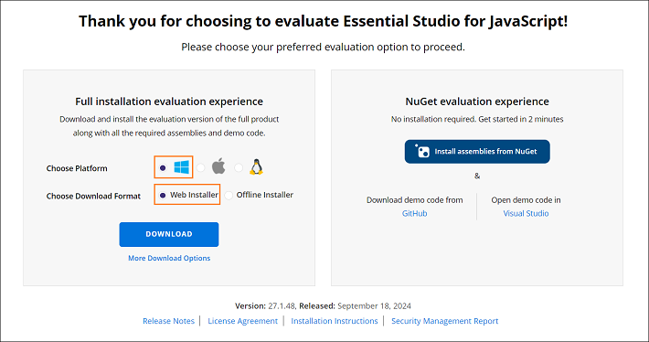
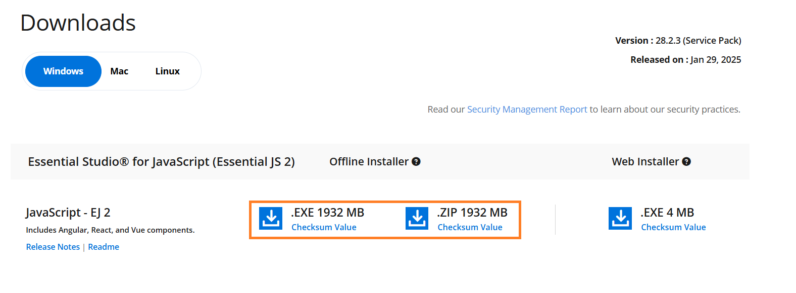
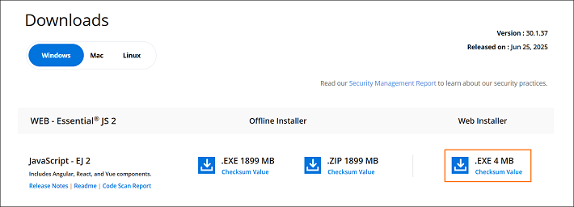

# Download Javascript -EJ2 Installer

The Syncfusion&reg; JavaScript - EJ2 installer can be downloaded from the Syncfusion&reg; website. You can either download the licensed installer or try our trial installer depending on your license.

* Trial Installer
* Licensed Installer

## Download the Trial Version

Our 30-day trial can be downloaded in two ways.

* Download Free Trial Setup
* Start Trials if using components [through npm](https://www.npmjs.com/search?q=%40syncfusion%2Fej2-angular)

### Download Free Trial Setup

1. You can evaluate our 30-day free trial by visiting the [Download Free Trial](https://www.syncfusion.com/downloads) page and select the JavaScript platform.

2. After completing the required form or logging in with your registered Syncfusion&reg; account, you can download the JavaScript - EJ2 trial installer from the confirmation page. (See the screenshot below.)

    

3. With a trial license, only the latest version’s trial installer can be downloaded.

4. After downloading, the Syncfusion&reg; JavaScript - EJ2 trial installer can be unlocked using either the trial unlock key or the Syncfusion&reg; registered login credential. More information on generating an unlock key can be found in [this](https://www.syncfusion.com/kb/8069/how-to-generate-unlock-key-for-essentials-studio-products?) article.

5. Before the trial expires, you can download the trial installer at any time from your registered account’s Trials & Downloads page (See the screenshot below.)

    

6. Click the Download (element 1 in the screenshot below) button to get the Syncfusion&reg; Essential Studio JavaScript – EJ2 web installer.

    

7. Click the More Download Options (element 2 in the above screenshot) button to get the Essential Studio JavaScript installer for various platforms.

- **Windows**

   - Select the **Windows** tab to download the appropriate installer options for Windows 

        - **Offline Installer:** Available in `.EXE` and `.ZIP` formats.

            

        - **Web Installer:** Available in `.EXE` format for minimal download size.

            

- **MAC** 

   * Select the **Mac** tab to download the appropriate installer options for MAC, which are provided in `.DMG` format.

     

**Start Trials if using components through [npm](https://www.npmjs.com/search?q=%40syncfusion%2Fej2-angular)**

You should initiate an evaluation if you have already obtained our components through [npm](https://www.npmjs.com/search?q=%40syncfusion%2Fej2-angular)

1. You can start your 30-day free trial for JavaScript – EJ2 from the [Start Trial](https://www.syncfusion.com/account/manage-trials/start-trials) page from your account.

    

2. To access this page, you must sign up/log in with your Syncfusion&reg; account.

3. Begin your trial by selecting the JavaScript – EJ2 product.

    >Note: If you’ve already used the trial products and they haven’t expired, you won’t be able to start the trial for the same product again.

4. After you’ve started the trial, go to the [Trials & Downloads](https://www.syncfusion.com/account/manage-trials/start-trials) page to get the latest version trial installer. You can generate the [unlock](https://www.syncfusion.com/kb/8069/how-to-generate-unlock-key-for-essentials-studio-products) key here at any time before the trial period expires. (See the screenshot below.)

    

5. You can find your current active trial products on the [Trials & Downloads](https://www.syncfusion.com/account/manage-trials/start-trials) page.

### Download the License Version

1. Syncfusion&reg; licensed products will be available in the [License & Downloads](https://www.syncfusion.com/account/downloads) page under your registered Syncfusion&reg; account.

2. You can view all the licenses (both active and expired) associated with your account.

3. Click the Download (element 1 in the screenshot below) button to download the respective product’s installer.

4. The most recent version of the installer will be downloaded from this page.

5. To download older version installers, go to [Downloads Older Versions](https://www.syncfusion.com/account/downloads/studio) (element 2 in the screenshot below).

6. You can download other platform/add-on installers by going to More Downloads Options (element 3 in the screenshot below).

7. For Windows OS, EXE and Zip formats are available for download. They are both Offline Installers.

    

You can also refer to the [Online installer](../installation-and-upgrade/installation-using-web-installer/) and [Offline installer](../installation-and-upgrade/installation-using-offline-installer/) links for step-by-step installation guidelines.