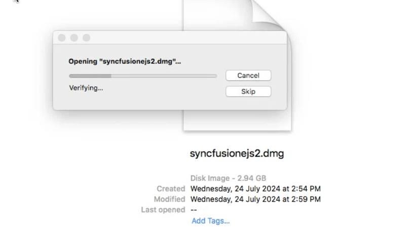
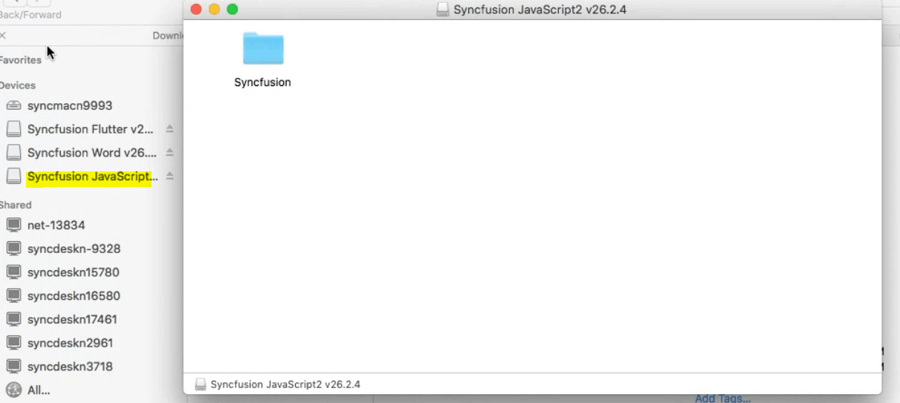
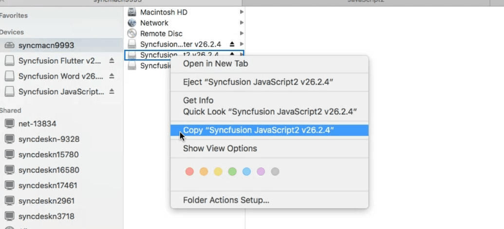
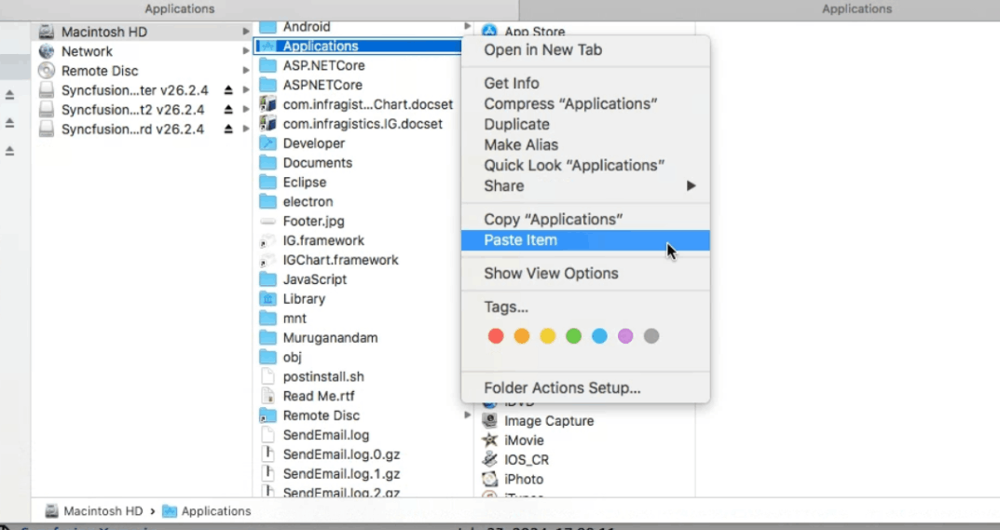
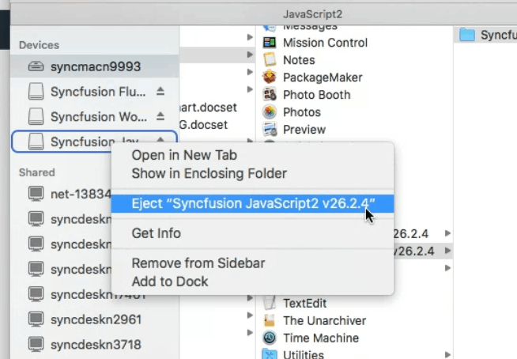

# Installing Syncfusion&reg; JavaScript – EJ2 Mac Installer

## Steps to resolve the warning message in Catalina OS or later

   While running Essential&reg; Studio JavaScript - EJ2 Mac Installer on Catalina MacOS or later, the below alert will be displayed.

     
     
   If you receive this alert, follow the below steps for the easiest solution.   

1. Right-click the downloaded DMG file.
2. Select **Open With** and choose **DiskImageMounter (Default)**. The following pop-up appears.

      

   3. When you click "Open" the installer window will be opened.

## Step-by-Step Installation

The steps below show how to install the Essential&reg; Studio JavaScript - EJ2 Mac installer.

1. Locate the downloaded dmg file and open the file by double click on it.

   

2. This action will automatically mount the disk image and create a virtual drive on your desktop or in the Finder sidebar.

   

3. Copy the mounted disk file.

   

4. And paste it in "Applications" folder shortcut.

   

   N> The Unlock key is not required to install the Mac installer. The Syncfusion&reg; Essential&reg; Studio JavaScript - EJ2 Mac installer can be used for development purposes without registering the Unlock key.

5. Now you can open the folder to explore the Syncfusion&reg; Essential&reg; Studio Mac installer.

   

6. To remove the DMG file, Right-click on the virtual drive on your desktop or in the Finder sidebar and select "Eject." Also delete the folder from the Applications.

   

## License key registration in samples

After installation, a license key is required to run the demo source included with the Mac installer. To learn how to register a license key for the JavaScript – EJ2 Mac installer, refer to the following topics:
* [Register Syncfusion&reg; License key in the project](https://ej2.syncfusion.com/angular/documentation/licensing/license-key-registration#register-syncfusion-license-key-in-the-project)
* [Register the license key using the npx command](https://ej2.syncfusion.com/angular/documentation/licensing/license-key-registration#register-syncfusion-license-key-using-the-npx-command)