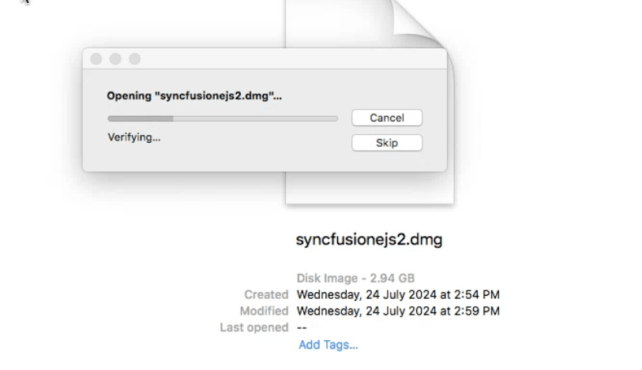
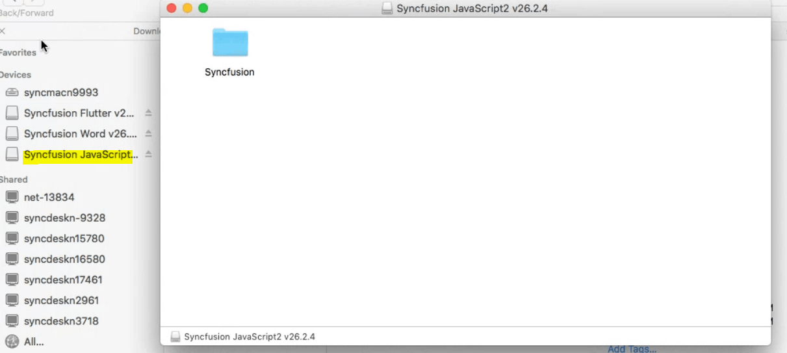
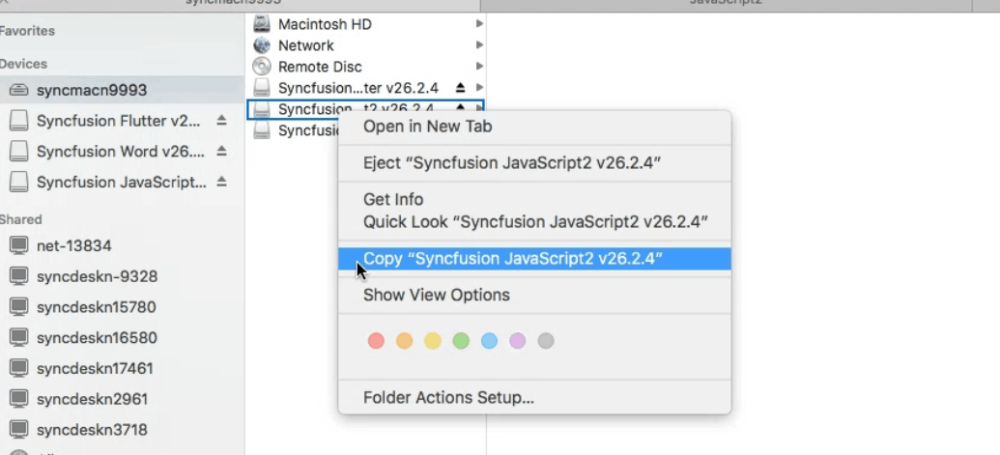
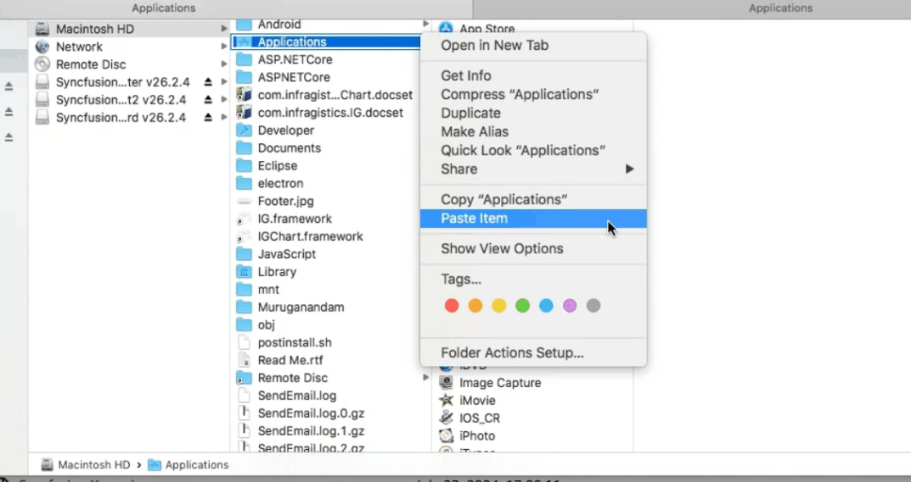
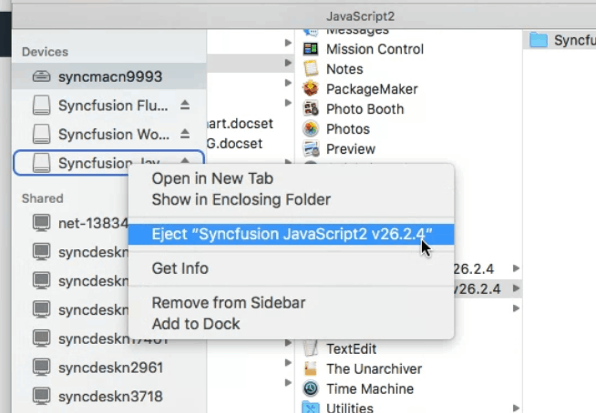

# Installing Syncfusion&reg; JavaScript – EJ2 Mac installer

This guide explains how to install the Syncfusion&reg; Essential JS 2 JavaScript Mac installer on macOS, including how to resolve the macOS Catalina (and later) security warning and how to register your license key in the installed samples.

**Prerequisites**

* A macOS machine running macOS Catalina (10.15) or later. Earlier versions are not officially supported by the current Mac installer.
* An active Syncfusion&reg; account. To download the Mac installer.
* Administrator access on your Mac so that you can copy the installer into the **Applications** folder.

## Steps to resolve the warning message in macOS Catalina or later

When you run the Essential&reg; Studio JavaScript - EJ2 Mac installer on macOS Catalina or later, you may see the following Gatekeeper alert.

If you receive this alert, follow these steps to open the installer:

1. Locate the downloaded `.dmg` file in **Finder** (typically in the **Downloads** folder).
2. Right-click the `.dmg` file (do **not** double-click it).
3. Select **Open With** and choose **DiskImageMounter (Default)**. The following pop-up appears.

   

4. Click **Open** in the pop-up. The installer window opens and you can continue with the step-by-step installation below.

> If you continue to see a "cannot be opened because the developer cannot be verified" message, open **System Settings** → **Privacy & Security**, scroll to the bottom, and click **Open Anyway** next to the blocked installer entry. Then re-run the steps above.

## Step-by-step installation

The steps below show how to install the Essential&reg; Studio JavaScript - EJ2 Mac installer.

1. Locate the downloaded `.dmg` file in **Finder** and double-click it to mount the disk image.

   

2. macOS automatically mounts the disk image and creates a virtual drive on your desktop and in the Finder sidebar. If a license agreement appears, review it and click **Agree** to continue.

   

3. In the mounted disk window, select the Syncfusion&reg; installer application and copy it (right-click → **Copy**, or press **⌘ + C**).

   

4. Open the **Applications** folder (from the Finder sidebar or by pressing **⌘ + Shift + A**) and paste the installer there (right-click → **Paste**, or press **⌘ + V**). Running the installer from **Applications** is required so that macOS Gatekeeper can verify it.

   

   N> The unlock key is not required to install the Mac installer. The Syncfusion&reg; Essential&reg; Studio JavaScript - EJ2 Mac installer can be used for development purposes without registering the unlock key. A license key is only required later to run the bundled samples and demo source without a license-warning message.

5. Open the **Applications** folder, then open the Syncfusion&reg; Essential&reg; Studio installer to explore the included packages and samples.

   

6. To clean up, right-click the virtual drive on your desktop or in the Finder sidebar and select **Eject** to unmount the disk image. You can also delete the installer from the **Applications** folder once you no longer need it.

   

## License key registration in samples

After installation, a license key is required to run the demo source included with the Mac installer without the Syncfusion&reg; license-warning overlay. To learn how to register a license key for the JavaScript – EJ2 Mac installer, refer to the following topics:

* [Register Syncfusion&reg; License key in the project](https://ej2.syncfusion.com/angular/documentation/licensing/license-key-registration#register-syncfusion-license-key-in-the-project)
* [Register the license key using the npx command](https://ej2.syncfusion.com/angular/documentation/licensing/license-key-registration#register-syncfusion-license-key-using-the-npx-command)

> If the sample app still shows a license warning after registration, verify that the license key is registered against the same Syncfusion&reg; account that owns the active subscription, and restart the sample app so that the new key is picked up.

## Troubleshooting

| Issue | Possible Cause | Suggested Fix |
| --- | --- | --- |
| "App is damaged and can't be opened" on macOS Catalina or later. | Gatekeeper is blocking the unsigned installer. | Use the right-click → **Open With** → **DiskImageMounter (Default)** flow described above, or allow the app in **System Settings** → **Privacy & Security**. |
| Installer does not launch after being copied to **Applications**. | The installer was run from the mounted disk image only. | Copy the installer into the **Applications** folder and run it from there. |
| Sample apps display a license-warning overlay. | License key has not been registered for this project/account. | Register the license key in samples. |
| "Image not found" or missing platform files when running a sample. | The installer was not fully extracted, or required runtimes are missing. | Re-run the installer from **Applications**, and confirm that your Node.js version is compatible with the sample. |

For additional help, see [Common Installation Errors](common-installation-errors.md).