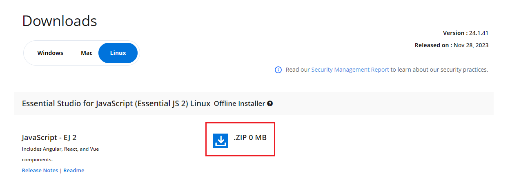

# Download Syncfusion&reg; JavaScript Linux Installer

The Syncfusion&reg; installer can be downloaded from the [Syncfusion](https://www.syncfusion.com/) website. Depending on your license, you can download either the licensed installer or the trial installer.

- Trial installer
- Licensed installer

You can download the Syncfusion&reg; installer from the [Syncfusion.com](https://www.syncfusion.com/) website.

## Download the Trial Version

You can access our 30-day trial in two ways:

- Download Free Trial setup
- Start trials if using components through [NuGet.org](https://www.nuget.org/packages?q=syncfusion)

### Download Free Trial Setup

1. Visit the [Download Free Trial](https://www.syncfusion.com/downloads) page and select the product.
2. After completing the required form or signing in with your registered Syncfusion&reg; account, download the trial installer from the confirmation page (as shown below).

   

3. With a trial license, only the latest version’s trial installer can be downloaded.
4. An unlock key is not required to install the Syncfusion&reg; JavaScript Linux trial installer.
5. Before the trial expires, you can download the trial installer at any time from your account’s [Trials & Downloads](https://www.syncfusion.com/account/manage-trials/downloads) page (as shown below).

   

6. Click **More Download Options** (element 2 in the screenshot above) to get the JavaScript Product Offline trial installer, which is available in ZIP format.

   

### Start Trials if Using Components Through [NuGet.org](https://www.nuget.org/packages?q=syncfusion)

If you have already obtained components through [NuGet.org](https://www.nuget.org/packages?q=syncfusion), initiate a trial as follows:

1. Start your 30-day free trial from the [Start Trial](https://www.syncfusion.com/account/manage-trials/start-trials) page in your account.

   N> You can generate the license key for your active trial products from the [Trials & Downloads](https://www.syncfusion.com/account/manage-trials/downloads) page. This license key is mandatory to use our trial products in your application. To learn more about license keys, refer to this [help topic](https://help.syncfusion.com/common/essential-studio/licensing/overview).

   

2. To access this page, you must sign up/log in with your Syncfusion&reg; account.
3. Begin your trial by selecting the Syncfusion&reg; product.

   N> If you have already used trial products and they have not expired, you cannot start a new trial for the same product.

4. After starting the trial, go to the [Trials & Downloads](https://www.syncfusion.com/account/manage-trials/downloads) page to download the latest version trial installer. You can also generate the [unlock key](https://www.syncfusion.com/kb/8069/how-to-generate-unlock-key-for-essentials-studio-products) and [license key](https://ej2.syncfusion.com/angular/documentation/licensing/license-key-generation) here at any time before the trial period expires (as shown below).

   

5. Your current active trial products are listed on the [Trials & Downloads](https://www.syncfusion.com/account/manage-trials/downloads) page.

## Download the Licensed Version

1. Licensed products are available on the [License & Downloads](https://www.syncfusion.com/account/downloads) page under your registered Syncfusion&reg; account.
2. You can view all licenses (both active and expired) associated with your account.
3. Download the JavaScript Linux licensed installer by clicking **More Download Options** (element 3 in the screenshot below).

   

4. An unlock key is not required to install the Syncfusion&reg; JavaScript Linux installer.
5. For Linux OS, installers are available in ZIP format.

   

After downloading the installer, refer to the [JavaScript Linux installer](https://ej2.syncfusion.com/angular/documentation/installation-and-upgrade/linux-installer/installation-using-linux-installer) for step-by-step installation guidelines.