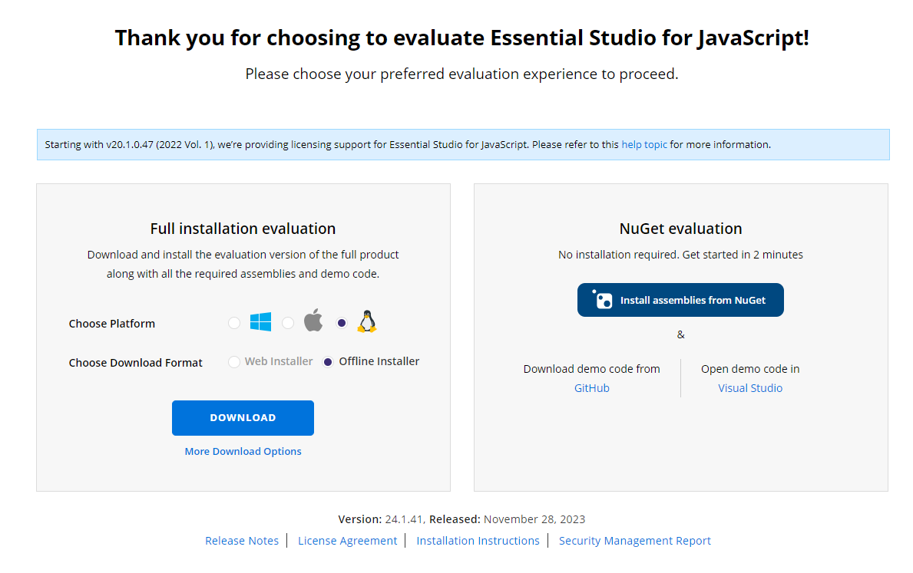
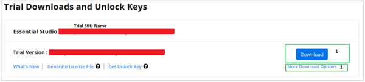
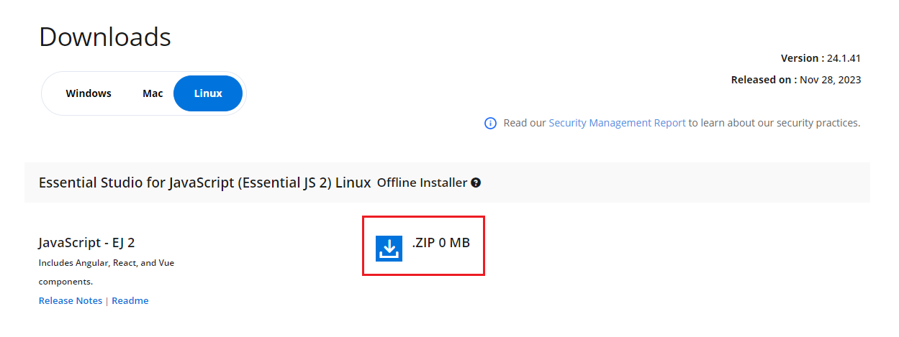
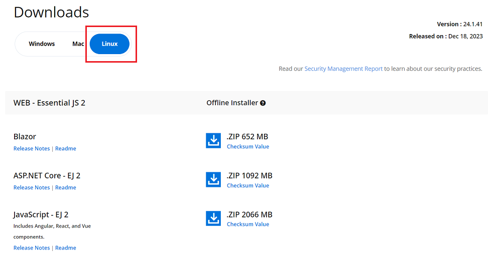

# Download JavaScript Linux installer

The Syncfusion&reg; JavaScript Linux installer can be downloaded from the [Syncfusion](https://www.syncfusion.com/) website. Depending on your license, you can download either the licensed installer or the trial installer. The Linux installer is provided in `.zip` format and does not require an unlock key to install.

**Prerequisites**

* A registered Syncfusion&reg; account. To create one, see the [Syncfusion downloads page](https://www.syncfusion.com/downloads).
* For npm-based JavaScript components (the EJ2 packages): Node.js and npm installed.

This guide covers the following options:

* Trial installer
* Licensed installer

## Download the trial version

You can access our 30-day trial in two ways:

* Download the free trial setup.
* Start trials if using components through [npm](https://www.npmjs.com/search?q=%40syncfusion%2Fej2-angular-) (for Angular EJ2 packages) or [NuGet](https://www.nuget.org/packages?q=syncfusion) (for .NET EJ2 packages).

### Download the free trial setup

1. Visit the [Download Free Trial](https://www.syncfusion.com/downloads) page and select the JavaScript product.
2. After completing the required form or signing in with your registered Syncfusion&reg; account, download the trial installer from the confirmation page (as shown below).

   

3. With a trial license, only the latest version's trial installer can be downloaded.
4. An unlock key is not required to install the Syncfusion&reg; JavaScript Linux trial installer.
5. Before the trial expires, you can download the trial installer at any time from your account's [Trials & Downloads](https://www.syncfusion.com/account/manage-trials/downloads) page (as shown below).

   

6. Click **More Download Options** (element 2 in the screenshot above) to get the JavaScript Product Offline trial installer, which is available in `.zip` format.

   

### Start trials if using components through npm or NuGet

If you have already obtained components through [npm](https://www.npmjs.com/search?q=%40syncfusion%2Fej2-angular-) (for Angular EJ2 packages) or [NuGet](https://www.nuget.org/packages?q=syncfusion) (for .NET EJ2 packages), initiate a trial as follows:

1. Start your 30-day free trial from the [Start Trial](https://www.syncfusion.com/account/manage-trials/start-trials) page in your account.

   N> You can generate the license key for your active trial products from the [Trials & Downloads](https://www.syncfusion.com/account/manage-trials/downloads) page. This license key is mandatory to use our trial products in your application. To learn more about license keys, refer to the [licensing overview](https://help.syncfusion.com/common/essential-studio/licensing/overview).

   

2. To access this page, you must sign up or log in with your Syncfusion&reg; account.
3. Begin your trial by selecting the JavaScript product.

   N> If you have already used trial products and they have not expired, you cannot start a new trial for the same product.

4. After starting the trial, go to the [Trials & Downloads](https://www.syncfusion.com/account/manage-trials/downloads) page to download the latest version trial installer. You can also generate the [unlock key](https://www.syncfusion.com/kb/8069/how-to-generate-unlock-key-for-essentials-studio-products) and [license key](https://ej2.syncfusion.com/angular/documentation/licensing/license-key-generation) at any time before the trial period expires (as shown below).

   

5. Your current active trial products are listed on the [Trials & Downloads](https://www.syncfusion.com/account/manage-trials/downloads) page.

## Download the licensed version

1. Licensed products are available on the [License & Downloads](https://www.syncfusion.com/account/downloads) page under your registered Syncfusion&reg; account.
2. You can view all licenses (both active and expired) associated with your account.
3. Download the JavaScript Linux licensed installer by clicking **More Download Options** (element 3 in the screenshot below).

   

4. An unlock key is not required to install the Syncfusion&reg; JavaScript Linux installer.
5. For Linux, installers are available in `.zip` format.

   

After downloading the installer, refer to [Installation using the Linux installer](installation-using-linux-installer.md) for step-by-step installation instructions.

## Troubleshooting

| Issue | Possible Cause | Suggested Fix |
| --- | --- | --- |
| The Linux installer is not listed under **More Download Options**. | The signed-in account does not own a license, or the product filter is set to a different platform. | Confirm the account owns a JavaScript license, then filter the **More Download Options** list to the JavaScript / Linux platform. |
| The downloaded `.zip` fails to extract or is corrupted. | The download was incomplete, or the file was modified by a download manager. | Re-download the installer from the [License & Downloads](https://www.syncfusion.com/account/downloads) page and verify the file size against the value shown on the page. |
| License warning appears after install. | License key was not registered for the trial or licensed product. | Generate the license key from the [Trials & Downloads](https://www.syncfusion.com/account/manage-trials/downloads) or [License & Downloads](https://www.syncfusion.com/account/downloads) page and register it in the project. See [Common Installation Errors](../common-installation-errors.md). |