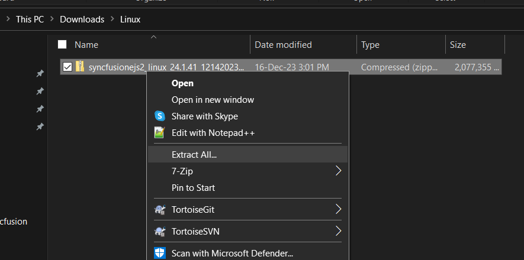
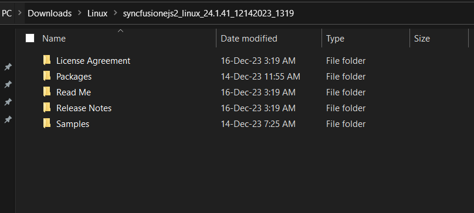

# Installing Syncfusion<sup style="font-size:70%">&reg;</sup> JavaScript Linux installer

This guide explains how to extract and use the Syncfusion<sup style="font-size:70%">&reg;</sup> Essential JS 2 JavaScript Linux installer on a Linux machine.

**Prerequisites**

* The downloaded Syncfusion<sup style="font-size:70%">&reg;</sup> JavaScript Linux installer in `.zip` format.
* A tool to extract `.zip` files, such as `unzip`.
* For running the bundled JavaScript sample applications: a current LTS version of [Node.js](https://nodejs.org/) and npm.

## Step-by-step installation

The steps below show how to install the JavaScript Linux installer.

1. Extract the Syncfusion<sup style="font-size:70%">&reg;</sup> JavaScript Linux installer (`.zip`) file. For example, from a terminal:

   The contents are extracted to the destination directory.

   

2. The Linux installer contains the following folders, used to consume Syncfusion<sup style="font-size:70%">&reg;</sup> JavaScript components on Linux:

   * **`Samples`** – Demo source for each JavaScript component. Open the sample folder and follow its `README` to run it locally (typically `npm install` followed by `npm start`).
   * **`NuGet`** – NuGet packages for the .NET EJ2 components.
   * **`npm`** – Pre-packaged npm archives for the JavaScript EJ2 packages, useful for offline `npm install` scenarios.

   

   N> The unlock key is not required to install or use the Linux installer.

3. To run a bundled sample, navigate to the sample's folder and install its dependencies:

   ```bash
   cd ~/Syncfusion/Samples/<component-sample>
   npm install
   npm start
   ```

   The sample starts on the URL printed in the terminal (commonly `http://localhost:4200` for Angular samples). For non-Node samples, follow the steps in the sample folder's `README`.

4. To use the pre-packaged npm archives in an offline project, point npm at the bundled `npm` folder using the `--registry` or local file path syntax. For example, to install from a local package archive:

   ```bash
   npm install ./npm/@syncfusion/ej2-angular-grids-<version>.tgz --save
   ```

5. You can now launch the demo source and use the packages included in the Linux installer.

## License key registration in samples

After installation, a license key is required to run the demo source included in the Linux installer without a Syncfusion<sup style="font-size:70%">&reg;</sup> license-warning overlay. To learn how to register a license key for the JavaScript - EJ2 Linux installer, refer to the following topics:

* [Register Syncfusion<sup style="font-size:70%">&reg;</sup> License key in the project](https://ej2.syncfusion.com/angular/documentation/licensing/license-key-registration#register-syncfusion-license-key-in-the-project)
* [Register the license key using the npx command](https://ej2.syncfusion.com/angular/documentation/licensing/license-key-registration#register-syncfusion-license-key-using-the-npx-command)

> If the sample still shows a license warning after registration, verify that the license key belongs to the same Syncfusion<sup style="font-size:70%">&reg;</sup> account that owns the active subscription, and restart the sample so the new key is picked up.

## Troubleshooting

| Issue | Possible Cause | Suggested Fix |
| --- | --- | --- |
| `unzip: command not found` while extracting the installer. | The `unzip` package is not installed. | Install it with `sudo apt install unzip` (Debian/Ubuntu) or `sudo dnf install unzip` (Fedora/RHEL). |
| Sample fails to start with "EACCES: permission denied". | The extracted folder is owned by `root` or another user. | Change ownership of the extracted folder to your user, for example `sudo chown -R $USER:$USER ~/Syncfusion`. |
| `npm install` fails with a peer-dependency or Node version error. | The sample requires a different Node.js LTS than the one installed. | Install the required Node.js LTS using [nvm](https://github.com/nvm-sh/nvm) or [Node Version Manager](https://docs.npmjs.com/downloading-and-installing-node-js-and-npm). |
| Sample displays a license-warning overlay. | The license key has not been registered for this account / project. | Generate and register the license key in samples. |
| Bundled npm tarball fails to install with a checksum or 404 error. | The tarball filename in the command does not match the actual file. | List the contents of the `npm` folder (`ls ~/Syncfusion/npm`) and use the exact filename, including version, in the install command. |