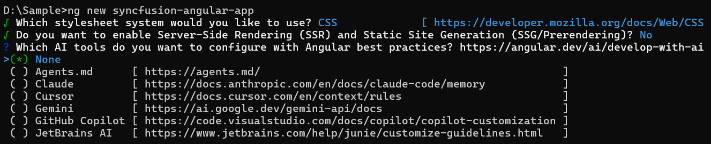

# Getting Started with Angular Kanban Component

The Syncfusion Angular Kanban component is a workflow visualization tool that helps users organize, manage, and track tasks across different stages of a process. This section outlines the steps to create a basic Kanban board in Angular and configure its core features.

> **Ready to streamline your Syncfusion<sup style="font-size:70%">&reg;</sup> Angular development?** Discover the full potential of Syncfusion<sup style="font-size:70%">&reg;</sup> Angular components with Syncfusion<sup style="font-size:70%">&reg;</sup> AI Coding Assistant. Effortlessly integrate, configure, and enhance your projects with intelligent, context-aware code suggestions, streamlined setups, and real-time insights—all seamlessly integrated into your preferred AI-powered IDEs like VS Code, Cursor, Syncfusion<sup style="font-size:70%">&reg;</sup> CodeStudio and more. [Explore Syncfusion<sup style="font-size:70%">&reg;</sup> AI Coding Assistant](https://ej2.syncfusion.com/angular/documentation/ai-coding-assistant/overview)

## Overview

The Kanban component consists of:
- **Cards**: Represent tasks, mapped to a `dataSource` via `cardSettings`.
- **Columns**: Define workflow stages, mapped using `keyField`.
- **Swimlanes**: Group cards by categories, configured with `swimlaneSettings`.

## Setup Angular Environment

Use the [Angular CLI](https://github.com/angular/angular-cli) to set up an Angular application. Install Angular CLI with the following command:

```bash
npm install -g @angular/cli@21.0.1
```

## Create an Angular Application

Create a new Angular application using the Angular CLI:

```bash
ng new my-app
```
This command will prompt you for a few settings for the new project, such as whether to add Angular routing and which stylesheet format to use.


By default, it will create a CSS-based application.

Then the CLI also displays an additional prompt asking whether to enable Server‑Side Rendering (SSR) and Static Site Generation (SSG), as shown below:


For this setup, select **No**, as the Rich Text Editor does not require SSR or SSG for basic configuration.

Then the CLI displays another prompt related to AI tooling support, as shown below:



Any preferred option can be selected based on the development workflow or project needs.

Next, navigate to the project folder:		Next, navigate to the project folder:

```bash
cd my-app
```

## Adding Syncfusion<sup style="font-size:70%">&reg;</sup> Kanban package

All available Essential JS 2 packages are published in the [npmjs.com](https://www.npmjs.com/~syncfusionorg) registry. Install the Kanban component with the following command:

```bash
npm install @syncfusion/ej2-angular-kanban
```

## Adding CSS reference

Add Kanban component’s styles as given in the following `styles.css.`

```css
@import '../node_modules/@syncfusion/ej2-base/styles/tailwind3.css';
@import '../node_modules/@syncfusion/ej2-buttons/styles/tailwind3.css';
@import '../node_modules/@syncfusion/ej2-dropdowns/styles/tailwind3.css';
@import '../node_modules/@syncfusion/ej2-inputs/styles/tailwind3.css';
@import '../node_modules/@syncfusion/ej2-layouts/styles/tailwind3.css';
@import '../node_modules/@syncfusion/ej2-navigations/styles/tailwind3.css';
@import '../node_modules/@syncfusion/ej2-popups/styles/tailwind3.css';
@import '../node_modules/@syncfusion/ej2-kanban/styles/tailwind3.css';
```

## Adding Kanban component

Modify the template in the [src/app/app.component.ts] file to render the Kanban component. Add the Angular Kanban by using the `<ejs-kanban>` selector in the `template` section of the app.component.ts file.

`src/app/app.component.ts`

```typescript

import { KanbanModule } from '@syncfusion/ej2-angular-kanban'
import { Component } from '@angular/core';

@Component({
    imports: [        
        KanbanModule
    ],
    standalone: true,
    selector: 'app-root',
    template: `<ejs-kanban>
                <e-columns>
                    <e-column headerText='To do' keyField='Open'></e-column>
                    <e-column headerText='In Progress' keyField='InProgress'></e-column>
                    <e-column headerText='Testing' keyField='Testing'></e-column>
                    <e-column headerText='Done' keyField='Close'></e-column>
                </e-columns>
            </ejs-kanban>`
    })
export class App { }

```

## Run the application

Run the application in the browser using:

```bash
ng serve --open
```

The application will display an empty Kanban board with the defined columns.














  


## Populating cards

Populate the Kanban with cards by binding a local JSON array or remote data to the [dataSource](https://ej2.syncfusion.com/angular/documentation/api/kanban#datasource) property. To define `dataSource`, the mandatory fields in JSON object should be relevant to [keyField](https://ej2.syncfusion.com/angular/documentation/api/kanban#keyfield). In the following example, you can see the cards defined with default fields such as ID, Summary, and Status.


















  


## Enable swimlane

`Swimlane` can be enabled by mapping the fields [swimlaneSettings.keyField](https://ej2.syncfusion.com/angular/documentation/api/kanban#swimlanesettings) to appropriate column name in dataSource. This enables the grouping of the cards based on the mapped column values.


















  

