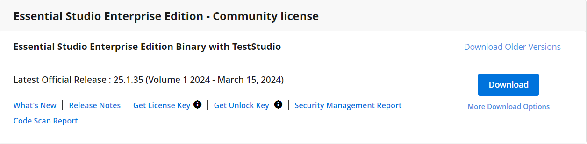

# Licensing troubleshoot in Angular

## Is an internet connection required for license validation

No, Internet connection is not required for the Syncfusion Essential Studio license validation. The Syncfusion license validation is done offline during application execution. Apps registered with a Syncfusion license key can be deployed on any system that does not have an internet connection.

## Upgrade from the trial version after purchasing a license

To upgrade from the trial version, there are two possible solutions:

* Uninstall the trial version and install the fully licensed build from the [License & Downloads](https://www.syncfusion.com/account/downloads) section of the Syncfusion website.

* If you are using Syncfusion controls from the [npm](https://www.npmjs.com/search?q=scope:syncfusion), replace the currently used trial license key with a paid license key that can be generated from the [License & Downloads](https://www.syncfusion.com/account/downloads) section of Syncfusion website. Refer to [this](https://help.syncfusion.com/common/essential-studio/licensing/overview#how-to-register-the-syncfusion-license-key) topic for more information regarding registering the license in the application.

> The license registration is not required if you reference Syncfusion scripts from the Licensed installer. These licensing changes apply to all evaluators who refer to the Syncfusion scripts from the evaluation installer and those who use the Syncfusion NuGet packages form [nuget.org](https://www.nuget.org/).

## Where can I get a License key

License keys can be generated from the [License & Downloads](https://syncfusion.com/account/downloads) or the [Trial & Downloads](https://www.syncfusion.com/account/manage-trials/downloads) section of the Syncfusion website.

The Syncfusion license keys are the **version and platform-specific**, refer to the [KB](https://support.syncfusion.com/kb/article/7898/how-to-generate-license-key-for-licensed-products) to generate the license key for the required version and platform. Also, refer to this [KB](https://support.syncfusion.com/kb/article/7865/which-version-syncfusion-license-key-should-i-use-in-my-application) to know which version of the Syncfusion license key should be used in the application.

> While using the ASP.NET Core controls with the Javascript(ES5) components, you need to register the license key in both the Javascript(ES5) and the [ASP.NET core](https://ej2.syncfusion.com/aspnetcore/documentation/licensing/license-key-registration). Since the license is validated at the client side for Javascript(ES5) components and server-side for the ASP.NET core components.

## Will the registered license key expire

No, the Syncfusion license keys won't expire for a particular version and you can continue to use it. So, you won't face any problems on the live site. If you have used the trial key, it will expire in 30 days and we don't recommend using it in production.

> If you upgrade to newer versions of the Syncfusion packages, you have to generate new license keys and use them.

## When to generate new license key while upgrading

You don't have to generate and change license keys for minor version upgrades. If you upgrade from one major version and another major version, you have to generate new license keys and register in the application.

For example,
* If you upgrade to weekly releases or the SP release in the same major version, you don't have to change license such as if you upgrade from the `20.1.47` version to `20.1.*` you don't have to change the license keys.
* If you upgrade from one major version to another major version, you have to generate new license keys for the latest version and change in the application, such as if you upgrade from the `20.1.*` version to `20.2.*,` you have to generate new license keys for the latest version and change in the application.

## License registration for multiple developers on your project

Syncfusion license key is a version based and it’s not based on the developer. You don’t have to register different keys for each developer. Just register one valid license key when developing and publishing the software.

## Can I use the same key for all the web apps under the project

Yes, you can use the same license key for all the web apps.

## Does the license registration access any resources or data

No, the license registration doesn't access any data or resources.

## License & Downloads shows the "Essential Studio Enterprise Edition Binary with Test Studio" and the "Project License". Which license to use

Use any licenses shown on the [accounts & downloads](https://www.syncfusion.com/account/downloads) page. It shows two licenses because if you are part of your company's enterprise portal Global license and an individual license is also assigned to your account, on your account & downloads page, the individual license and your enterprise portal Global license are shown.

 

Refer to the [KB](https://support.syncfusion.com/kb/article/9940/definition-of-terms-for-syncfusion-licenses) article which explains the Licenses offered by Syncfusion.

## If I registered the license key in both the application and the license text file

The application registered license key is set priority and used for license validation.

## Potential causes of licensing errors in applications.

 Below are the possible reasons that could lead to a license error within the application:

 * The application may have a license issue due to duplicate Syncfusion packages. 

 * An invalid license issue may occur because of Syncfusion packages being referred with multiple versions. 

 * Registering the license key of a different version than the referred Syncfusion package version in the application can also cause licensing errors.

### License issue due to duplicate Syncfusion packages in the application

One of the possible cases on experiencing license issues in your application is due to duplicate packages exists after upgrading packages to next or latest version. To remove the duplicate packages follow the below steps.

* Delete the `@Syncfusion` folder from `node_modules` and `package-lock.json` file from app `root folder`.

* Clear the npm `.cache` by running the command `npm cache clean –force` or you can directly delete the file present in the application.

* It is recommended to update all Syncfusion components in the package.json file to the `same major version`. This ensures consistency and compatibility across the project. For instance, if the updated version being utilized is `v20.4.XX`, it is advised to upgrade all components to the `same version`.

* Run `npm install` Command.

### Invalid license issue because of Syncfusion packages referred with multiple version

It is essential to ensure that all the components used in a project are compatible and work seamlessly together. One common issue that arises in such scenarios is `version mismatch`. Version mismatch occurs when `different components` have `different major versions`, leading to compatibility issues and difficulties in license registration.

For example, consider a situation where one component in the project has a version of `v20.1.XX`, while another component has a version of `v20.2.XX`. When such components are used together, a `version mismatch` occurs, leading to license errors. To avoid version mismatch and ensure smooth functioning of the project, it is crucial to use the `same major version` for all the Syncfusion components. This will ensure compatibility and prevent any licensing issues that may arise due to version incompatibility.

### Registering the license key of a different version than the referred Syncfusion package version in the application

When developing an application with Syncfusion packages, it is important to register the appropriate license key that matches the version of the package installed. Failure to do so may result in license errors within the application. 

For instance, if you are using a component version labeled as `(v20.4.XX)`, it is essential to register the license key generated `specifically` for that version. By doing so, it ensures the smooth functioning of the controls and provides access to all features and functionality without encountering any license validation errors.

