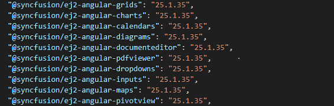
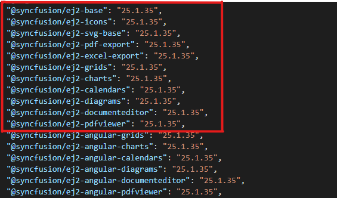

# Licensing troubleshoot in Angular

## Is an internet connection required for license validation

No, an internet connection is not required for Syncfusion&reg; Essential Studio license validation. Syncfusion&reg; license validation is performed offline during application execution. Applications registered with a Syncfusion&reg; license key can be deployed on systems without internet access.

## Upgrade from the trial version after purchasing a license

To upgrade from the trial version, there are two possible solutions:

* Uninstall the trial version and install the fully licensed build from the [License & Downloads](https://www.syncfusion.com/account/downloads) section of the Syncfusion&reg; website.

* If you are using Syncfusion&reg; controls from the [npm](https://www.npmjs.com/search?q=scope:syncfusion), replace the currently used trial license key with a paid license key that can be generated from the [License & Downloads](https://www.syncfusion.com/account/downloads) section of Syncfusion&reg; website. Refer to [this](https://help.syncfusion.com/common/essential-studio/licensing/license-key#how-to-register-the-syncfusion-license-key) topic for more information regarding registering the license in the application.

> The license registration is not required if you reference Syncfusion&reg; scripts from the Licensed installer. These licensing changes apply to all evaluators who refer to the Syncfusion&reg; scripts from the evaluation installer and those who use the Syncfusion&reg; NuGet packages form [nuget.org](https://www.nuget.org/).

## Where can I get a License key

License keys can be generated from the [License & Downloads](https://syncfusion.com/account/downloads) or [Trial & Downloads](https://www.syncfusion.com/account/manage-trials/downloads) section of the Syncfusion&reg; website.

The Syncfusion&reg; license keys are the **version and platform-specific**, refer to the [KB](https://www.syncfusion.com/kb/8976/how-to-generate-license-key-for-licensed-products) to generate the license key for the required version and platform. Also, refer to this [KB](https://www.syncfusion.com/kb/8951/which-version-syncfusion-license-key-should-i-use-in-my-application) to know which version of the Syncfusion&reg; license key should be used in the application.

> While using the ASP.NET Core controls with the Javascript(ES5) components, you need to register the license key in both the Javascript(ES5) and the [ASP.NET core](https://ej2.syncfusion.com/aspnetcore/documentation/licensing/license-key-registration). Since the license is validated at the client side for Javascript(ES5) components and server-side for the ASP.NET core components.

## Will the registered license key expire

No, the Syncfusion&reg; license keys won't expire for a particular version and you can continue to use it. So, you won't face any problems on the live site. If you have used the trial key, it will expire in 30 days and we don't recommend using it in production.

> After upgrading to a newer version of Syncfusion&reg; packages, generate and apply a new license key for that version.

## When to generate new license key while upgrading

You don't need to generate or use a new license key for minor version upgrades. However, when upgrading from one major version to another, generate and apply a new license key.

For example,
* If you are using a version like `25.1.X`, it is important to use the same version for all Syncfusion&reg; components in your application. The license key generated for version `25.X.XX` can be used. This key can be used across all minor versions within that major version, `v25`. This means you can upgrade all packages to `25.2.X` while still using the same license key.

* However, if you upgrade from one major version to another—such as from `25.1.X` to `26.1.X`—you will need to generate a new license key for the latest version and update it in your application.

>Note: The above-mentioned guidelines are not applicable to our packages on version `20.X.XX`, where `20.1` denotes one major version and `20.2` another major version. However, starting with our release version 21, we have adjusted the pattern. So if you are using `20.1.X`, when you upgrade to `20.2.X`, you have to generate new license keys for `20.2.X` and change in the application. Therefore, these guidelines apply to versions `21` and later.

## License registration for multiple developers on your project

Syncfusion&reg; license key is a version based and it’s not based on the developer. You don’t have to register different keys for each developer. Just register one valid license key when developing and publishing the software.

## Can I use the same key for all the web apps under the project

Yes, you can use the same license key for all the web apps.

## Does the license registration access any resources or data

No, the license registration doesn't access any data or resources.

## License & Downloads shows the "Essential Studio&reg; Enterprise Edition Binary with Test Studio" and the "Project License". Which license to use

Use any licenses shown on the [accounts & downloads](https://www.syncfusion.com/account/downloads) page. It shows two licenses because if you are part of your company's enterprise portal Global license and an individual license is also assigned to your account, on your account & downloads page, the individual license and your enterprise portal Global license are shown.

 

Refer to the [KB](https://www.syncfusion.com/kb/11532/definition-of-terms-for-syncfusion-licenses) article which explains the Licenses offered by Syncfusion&reg;.

## If I registered the license key in both the application and the license text file

The application registered license key is set priority and used for license validation.

## Reactivating license once after updating the package version while using npx

It is Essential&reg; to reactivate the license key when upgrading the Syncfusion&reg; packages while the license has been registered through the `npx` command.

## Potential causes of licensing errors in applications.

 Below are the possible reasons that could lead to a license error within the application:

 * The application may have a license issue due to duplicate Syncfusion&reg; packages. 

 * An invalid license issue may occur because of Syncfusion&reg; packages being referred with multiple versions. 

 * Registering the license key of a different version than the referred Syncfusion&reg; package version in the application can also cause licensing errors.

 * Inclusion of [non-Angular](#license-issue-due-to-including-non-angular-packages-in-the-dependencies) packages in the dependencies may lead to licensing errors due to the presence of duplicate instances of our packages.

### License issue due to duplicate Syncfusion&reg; packages in the application

License issues may occur if duplicate packages remain after a version upgrade. To resolve this:

* Delete the `@Syncfusion` folder from `node_modules` and `package-lock.json` file from app `root folder`.

* Clear the npm `.cache` by running the command `npm cache clean –force` or you can directly delete the file present in the application.

* It is recommended to update all Syncfusion&reg; components in the package.json file to the `same major version`. This ensures consistency and compatibility across the project. For instance, if the updated version being utilized is `v20.4.XX`, it is advised to upgrade all components to the `same version`.

* Run `npm install` Command.

### Invalid license issue because of Syncfusion&reg; packages referred with multiple version

It is Essential&reg; to ensure that all the components used in a project are compatible and work seamlessly together. One common issue that arises in such scenarios is `version mismatch`. Version mismatch occurs when `different components` have `different major versions`, leading to compatibility issues and difficulties in license registration.

For example, consider a situation where one component in the project has a version of `v20.1.XX`, while another component has a version of `v20.2.XX`. When such components are used together, a `version mismatch` occurs, leading to license errors. To avoid version mismatch and ensure smooth functioning of the project, it is crucial to use the `same major version` for all the Syncfusion&reg; components. This will ensure compatibility and prevent any licensing issues that may arise due to version incompatibility.

### Registering the license key of a different version than the referred Syncfusion&reg; package version in the application

When developing an application with Syncfusion&reg; packages, it is important to register the appropriate license key that matches the version of the package installed. Failure to do so may result in license errors within the application. 

For instance, if you are using a component version labeled as `(v20.4.XX)`, it is Essential&reg; to register the license key generated `specifically` for that version. By doing so, it ensures the smooth functioning of the controls and provides access to all features and functionality without encountering any license validation errors.

### License issue due to including non-Angular packages in the dependencies

When integrating Syncfusion&reg; with your Angular project, it's Essential&reg; to include only our Angular component packages in the dependencies, as shown in the image below.

Avoid including our TypeScript packages separately.

These are sub-dependencies of our Angular component packages and are automatically installed along with them. Including them separately may sometimes result in duplicate instances of packages, which can lead to issues with license validation. Therefore, to ensure proper license validation and avoid conflicts, stick to including our Angular component packages alone in your project dependencies.

