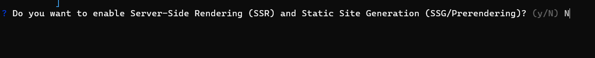

# Getting started with Angular Maps component

This section explains the steps required to create a simple [Angular Maps](https://www.syncfusion.com/angular-components/angular-maps-library) and demonstrates the basic usage of the Maps component in an Angular environment.

> Note: This guide supports **Angular 21** and other recent Angular versions. For detailed compatibility with other Angular versions, please refer to the [Angular version support matrix](https://ej2.syncfusion.com/angular/documentation/system-requirement#angular-version-compatibility). Starting from Angular 19, standalone components are the default, and this guide reflects that architecture.

> **Ready to streamline your Syncfusion<sup style="font-size:70%">&reg;</sup> Angular development?** Discover the full potential of Syncfusion<sup style="font-size:70%">&reg;</sup> Angular components with Syncfusion<sup style="font-size:70%">&reg;</sup> AI Coding Assistant. Effortlessly integrate, configure, and enhance your projects with intelligent, context-aware code suggestions, streamlined setups, and real-time insights—all seamlessly integrated into your preferred AI-powered IDEs like VS Code, Cursor, Syncfusion<sup style="font-size:70%">&reg;</sup> CodeStudio and more. [Explore Syncfusion<sup style="font-size:70%">&reg;</sup> AI Coding Assistant](https://ej2.syncfusion.com/angular/documentation/ai-coding-assistant/overview)

To get started quickly with Angular Maps using CLI and Schematics, view the following video:



## Prerequisites

Ensure your development environment meets the [System Requirements for Syncfusion<sup style="font-size:70%">&reg;</sup> Angular UI Components](https://ej2.syncfusion.com/angular/documentation/system-requirement).

## Setup Angular environment

A straightforward approach to begin with Angular is to create a new application using the [Angular CLI](https://github.com/angular/angular-cli). Install Angular CLI globally with the following command:

```bash
npm install -g @angular/cli
```

> **Angular 21 Standalone Architecture:** Standalone components are the default in Angular 21. This guide uses the modern standalone architecture. If you need more information about the standalone architecture, refer to the [Standalone Guide](https://ej2.syncfusion.com/angular/documentation/getting-started/angular-standalone).

### Installing a specific version

To install a particular version of Angular CLI, use:

```bash
npm install -g @angular/cli@21.0.0
```

## Create an Angular application

With Angular CLI installed, execute this command to generate a new application:

```bash
ng new syncfusion-angular-app
```

* This command will prompt you to configure settings like enabling Angular routing and choosing a stylesheet format.

```bash

? Which stylesheet format would you like to use? (Use arrow keys)
> CSS             [ https://developer.mozilla.org/docs/Web/CSS                     ]
  Sass (SCSS)     [ https://sass-lang.com/documentation/syntax#scss                ]
  Sass (Indented) [ https://sass-lang.com/documentation/syntax#the-indented-syntax ]
  Less            [ http://lesscss.org                                             ]

```

* By default, a CSS-based application is created. Use SCSS if required:

```bash
ng new syncfusion-angular-app --style=scss
```

* During project setup, when prompted for the Server-side rendering (SSR) option, choose the appropriate configuration.



* Select the required AI tool or 'none' if you do not need any AI tool.


* Navigate to your newly created application directory:

```bash
cd syncfusion-angular-app
```

> Note: In Angular 19 and below, the CLI generates files like `app.component.ts`, `app.component.html`, `app.component.css`, etc. In Angular 20+, the CLI generates a simpler structure with `src/app/app.ts`, `app.html`, and `app.css` (no `.component.` suffixes).

## Installing Syncfusion<sup style="font-size:70%">&reg;</sup> Maps package

Syncfusion<sup style="font-size:70%">&reg;</sup>'s Angular component packages are available on [npmjs.com](https://www.npmjs.com/search?q=ej2-angular). To use Syncfusion<sup style="font-size:70%">&reg;</sup> Angular components, install the necessary package.

This guide uses the [Angular Maps component](https://www.syncfusion.com/angular-components/angular-maps-library) for demonstration. Add the Angular Maps component with:

```bash
npm install @syncfusion/ej2-angular-maps --save
```

The above command will perform the following configurations:

- Add the `@syncfusion/ej2-angular-maps` package and peer dependencies to your `package.json`.
- Import the Maps component in your application.

For more details on version compatibility, refer to the [Version Compatibility](https://ej2.syncfusion.com/angular/documentation/upgrade/version-compatibility) section.

Syncfusion<sup style="font-size:70%">&reg;</sup> offers two package structures for Angular components:		
1. Ivy library distribution package [format](https://angular.dev/tools/libraries/angular-package-format)		
2. Angular compatibility compiler (ngcc), which is Angular's legacy compilation pipeline.

### Ivy library distribution package

Syncfusion<sup style="font-size:70%">&reg;</sup>'s latest Angular packages are provided as Ivy-compatible and suited for Angular 12 and above. To install the package, execute:	
	
```bash		
ng add @syncfusion/ej2-angular-maps		
```	

### Angular compatibility compiled package(ngcc)

For applications not compiled with Ivy, use the `ngcc` tagged packages:       

> Note: `ngcc` is the legacy Angular compatibility compiler. For modern projects we recommend using the Ivy-distribution packages (installable via `ng add ...`). ngcc-tagged packages may still be required for some older Angular 12–15 projects, but Angular 16+ favors Ivy-only packages. If you must use an ngcc-tagged package, consult the Syncfusion troubleshooting guide linked below for migration tips.

```bash
npm add @syncfusion/ej2-angular-maps@32.1.19-ngcc
```

Or add the dependency to `package.json`:

```json
{
  "dependencies": {
    "@syncfusion/ej2-angular-maps": "32.1.19-ngcc"
  }
}
```

See the ngcc troubleshooting guide: https://ej2.syncfusion.com/angular/documentation/common/troubleshooting/ngcc-compatibility

## Add Maps component

Modify the template in `app.ts` file to render the Maps component `[src/app/app.ts]`.

Note: `MapsAllModule` exports all maps feature modules and is convenient for examples and quick setup. To reduce bundle size in real apps, import only the feature modules you need (for example, `AnnotationsService`, `BubbleService`, etc.). `MapsModule` is the core module; `MapsAllModule` bundles all features for convenience.

Best practice (selective imports):

```typescript

import { Component } from '@angular/core';
import { MapsModule, AnnotationsService, BubbleService } from '@syncfusion/ej2-angular-maps';

@Component({
  imports: [MapsModule],
  standalone: true,
  selector: 'app-root',
  providers: [AnnotationsService, BubbleService],
  template: `<ejs-maps id='maps-container'></ejs-maps>`
})
export class App { }

```

This keeps the final bundle smaller than importing `MapsAllModule`.

```typescript

import { MapsAllModule } from '@syncfusion/ej2-angular-maps';
import { Component, ViewEncapsulation } from '@angular/core';

@Component({
    imports: [MapsAllModule],
    standalone: true,
    selector: 'app-root',
    template: `<ejs-maps id='maps-container'></ejs-maps>`,
    encapsulation: ViewEncapsulation.None
})
export class App { }

```

Add the `world_map` GeoJSON data to the **app.ts** file.

Note: Refer to the world_map GeoJSON data at Syncfusion Downloads: https://www.syncfusion.com/downloads/support/directtrac/general/ze/world-map-2091224620. This data must be imported into `src/app/app.ts`.

```typescript
import { world_map } from './world-map';
```

Bind the **world_map** data to the **shapeData** property of the **layer** in the Maps component.

```typescript
@Component({
    // specifies the template string for the maps component
    template: `<ejs-maps id='maps-container'>
                <e-layers>
                    <e-layer [shapeData]='shapeData'></e-layer>
                </e-layers>
               </ejs-maps>`
})
export class App {
  public shapeData: object = world_map;
}
```

Now use the `app-root` selector in the `index.html` file instead of the default one.
 
```html
<app-root></app-root>
```

Use the `ng serve` command to run the application in the browser.

```bash
ng serve
```

The below example shows a basic Map.

```typescript

import { MapsModule } from '@syncfusion/ej2-angular-maps';
import { Component } from '@angular/core';
import { world_map } from './world-map';

@Component({
    imports: [MapsModule],
    standalone: true,
    selector: 'app-root',
    template: `<ejs-maps id='maps-container'>
                <e-layers>
                    <e-layer [shapeData]='shapeData'></e-layer>
                </e-layers>
               </ejs-maps>`
})
export class App {
  public shapeData: object = world_map;
}

```

## Render shapes from GeoJSON data

This section explains how to bind GeoJSON data to the map.

```typescript

let usMap: object =
{
    "type": "FeatureCollection",
    "crs": { "type": "name", "properties": { "name": "urn:ogc:def:crs:OGC:1.3:CRS84" } },
    "features": [
        { "type": "Feature", "properties": { "iso_3166_2": "MA", "name": "Massachusetts", "admin": "United States of America" }, "geometry":{
            "type": "MultiPolygon",
            "coordinates": [ [ [ [ -70.801756294617277, 41.248076234530558 ]] ] ] }
        }
    ]
    //..
};

```

Map elements are rendered within layers. Add a layer collection to the Maps using the [`layers`](https://ej2.syncfusion.com/angular/documentation/api/maps/layersettingsmodel) property, then bind the GeoJSON data to the [`shapeData`](https://ej2.syncfusion.com/angular/documentation/api/maps/layersettings#shapedata) property.










  


## Bind data source to map

The following layer properties are used to bind a data source to the map.

* dataSource
* shapeDataPath
* shapePropertyPath

The [`dataSource`](https://ej2.syncfusion.com/angular/documentation/api/maps/layerSettingsModel#datasource) property takes collection value as input. For example, the list of objects can be provided as input. This data is further used in tooltip, data label, bubble, legend and in color mapping.

The [`shapeDataPath`](https://ej2.syncfusion.com/angular/documentation/api/maps/layerSettingsModel#shapedatapath) property refers to the field in the `dataSource` that identifies a shape. The [`shapePropertyPath`](https://ej2.syncfusion.com/angular/documentation/api/maps/layerSettingsModel#shapepropertypath) property refers to the field in `shapeData` that matches `shapeDataPath`. When these values match, the corresponding object from the `dataSource` is bound to the shape.

The JSON object "electionData" is used as data source below.










  


## Add Title for Maps

You can add a title using [`titleSettings`](https://ej2.syncfusion.com/angular/documentation/api/maps/titleSettingsModel) property to the map to provide quick information to the user about the shapes rendered in the map.










  
