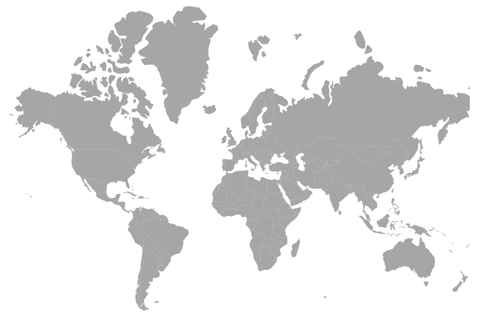

# Getting Started with Angular Maps Component

This section explains the steps required to create a simple [maps](https://www.syncfusion.com/angular-components/angular-maps-library) and demonstrates the basic usage of the maps component.

> **Ready to streamline your Syncfusion<sup style="font-size:70%">&reg;</sup> Angular development?** Discover the full potential of Syncfusion<sup style="font-size:70%">&reg;</sup> Angular components with Syncfusion<sup style="font-size:70%">&reg;</sup> AI Coding Assistant. Effortlessly integrate, configure, and enhance your projects with intelligent, context-aware code suggestions, streamlined setups, and real-time insights—all seamlessly integrated into your preferred AI-powered IDEs like VS Code, Cursor, Syncfusion<sup style="font-size:70%">&reg;</sup> CodeStudio and more. [Explore Syncfusion<sup style="font-size:70%">&reg;</sup> AI Coding Assistant](https://ej2.syncfusion.com/angular/documentation/mcp-server/ai-coding-assistant/getting-started)

To get started quickly with Angular Maps using CLI and Schematics, view the following video:



## Prerequisites

Before getting started, ensure that your development environment meets the [system requirements for Syncfusion® Angular UI components](https://ej2.syncfusion.com/angular/documentation/system-requirement).

## Before You Begin

This guide uses the standalone application structure generated by the latest Angular CLI.

The main files used in this guide are:

- `src/app/app.ts` — Defines the root standalone component.
- `src/index.html` — Contains the Angular root element.

N> In newer Angular CLI standalone projects, the root component may be generated as `src/app/app.ts`. In NgModule-based Angular projects, the equivalent file is typically `src/app/app.component.ts`.

N> If your application uses an older NgModule-based structure, import `MapsModule` in the application module, such as `app.module.ts`, instead of adding it to the standalone component `imports` collection.

## Step 1: Create a Project Folder

Create a folder named `my-project` in your desired location. This folder will contain your Syncfusion Maps Angular project.

## Step 2: Set up the Angular environment

Start by opening your project in the terminal on your system **(Command Prompt, PowerShell, or Terminal)**.

Use [Angular CLI](https://github.com/angular/angular-cli) to create and manage Angular applications. Install Angular CLI globally using the following command:

```bash
npm install -g @angular/cli
```

## Step 3: Create an Angular application

Create a new Angular application using the following command.

```bash
ng new my-maps-app
```

During project creation, Angular CLI may prompt you to choose stylesheet, SSR/SSG, and AI tool configuration options. For this basic Maps sample, you can use the following options:

* **Stylesheet system**: Choose any option. This guide uses `CSS` for simplicity and applies the Syncfusion® Tailwind 3 theme through CSS imports.
* **SSR and SSG/Pre-rendering**: Select `No`.
* **AI tools configuration**: Select `None`.

Navigate to the project folder:

```bash
cd my-maps-app
```

## Step 4: Install the Syncfusion® Angular Maps package

All Syncfusion Essential® JS 2 packages are available in the [npmjs.com](https://www.npmjs.com/~syncfusionorg) registry.

Install the Angular Maps package using the following command:

```bash
npm install @syncfusion/ej2-angular-maps --save
```

N> Installing `@syncfusion/ej2-angular-maps` automatically installs the required dependency packages.

## Step 5: Register the Maps module and add the component

Import `MapsModule` from `@syncfusion/ej2-angular-maps` and add it to the `imports` collection of the standalone component. Then, add the Angular Maps component using the `<ejs-maps>` selector in the component template.

Update the `src/app/app.ts` file as follows:

```typescript
import { Component } from '@angular/core';
import { MapsModule } from '@syncfusion/ej2-angular-maps';

@Component({
  selector: 'app-root',
  standalone: true,
  imports: [MapsModule],
  providers: [],
  template: `<ejs-maps id='maps-container'></ejs-maps>`
})
export class App {}
```

This renders an empty maps in the application.

N> The component selector must match the root element used in the `src/index.html` file. Angular CLI commonly uses `<app-root></app-root>`, so this example uses `selector: 'app-root'`.

## Step 6: Create your first Maps with shape data

This section explains how to create a simple map by binding GeoJSON data and rendering map layers using Angular Maps components.

The following example demonstrates how to visualize geographical data using a map. It shows how to bind shape data using the `shapeData` property and render it through map layers.

Update the `src/app/app.ts` file as follows:

```typescript
import { Component } from '@angular/core';
import { MapsModule } from '@syncfusion/ej2-angular-maps';
import { world_map } from './world-map';

@Component({
    selector: 'app-root',
    standalone: true,
    imports: [MapsModule],
    template: `
      <ejs-maps id='maps-container'>
          <e-layers>
              <e-layer [shapeData]='shapeData'>
              </e-layer>
          </e-layers>
      </ejs-maps>
    `
})
export class App {
  public shapeData: object = world_map;
}
```

Note: Refer to the world_map GeoJSON data at Syncfusion Downloads: https://www.syncfusion.com/downloads/support/directtrac/general/ze/world-map-2091224620. This data must be imported into `src/app/app.ts`.

In this example:

* [`shapeData`](https://ej2.syncfusion.com/angular/documentation/api/maps/layersettingsmodel#shapedata) defines the geographical shape data (GeoJSON) used to render the map.
* [`<e-layers>`] and [`<e-layer>`] directives are used to define and render map layers.

## Step 7: Run the application

Run the application using the following command:

```bash
npm start
```

Open the generated local URL (for example, `http://localhost:4200/`) from terminal in the browser. The application displays the maps as shown below:

 
