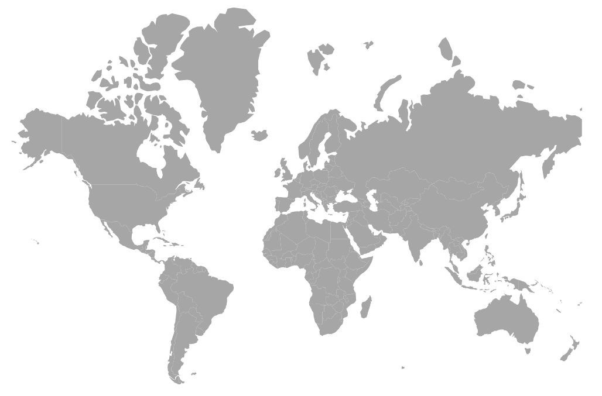

# Getting Started with Angular Maps Component

This section explains the steps required to create a simple [Maps](https://www.syncfusion.com/angular-components/angular-maps-library) and demonstrates the basic usage of the Maps component.

> **Ready to streamline your Syncfusion<sup style="font-size:70%">&reg;</sup> Angular development?** Discover the full potential of Syncfusion<sup style="font-size:70%">&reg;</sup> Angular components with Syncfusion<sup style="font-size:70%">&reg;</sup> AI Coding Assistant. Effortlessly integrate, configure, and enhance your projects with intelligent, context-aware code suggestions, streamlined setups, and real-time insights—all seamlessly integrated into your preferred AI-powered IDEs like VS Code, Cursor, Syncfusion<sup style="font-size:70%">&reg;</sup> CodeStudio and more. [Explore Syncfusion<sup style="font-size:70%">&reg;</sup> AI Coding Assistant](https://ej2.syncfusion.com/angular/documentation/mcp-server/ai-coding-assistant/getting-started)

To get started quickly with Angular Maps using CLI and Schematics, view the following video:



## Prerequisites

Before getting started, ensure that your environment meets the [system requirements for Syncfusion® Angular UI components](https://ej2.syncfusion.com/angular/documentation/system-requirement), which covers supported Node.js, Angular, and `@syncfusion/ej2-angular-maps` versions.

## Before You Begin

This guide uses the standalone application structure generated by the latest Angular CLI.

The main files used in this guide are:

- `src/app/app.ts` — Defines the root standalone component.
- `src/app/world-map.ts` — Contains the GeoJSON data for the world map.
- `src/index.html` — Contains the Angular root element.

> **Note:** In newer Angular CLI standalone projects, the root component may be generated as `src/app/app.ts`. In NgModule-based Angular projects, the equivalent file is typically `src/app/app.component.ts`.

> **Note:** If your application uses an older NgModule-based structure, import `MapsModule` in the application module, such as `app.module.ts`, instead of adding it to the standalone component `imports` collection.

## Step 1: Install Angular CLI

Open your terminal on your system **(Command Prompt, PowerShell, or Terminal)** and use [Angular CLI](https://github.com/angular/angular-cli) to create and manage Angular applications. Install Angular CLI globally using the following command:

```bash
npm install -g @angular/cli
```

Verify the installation:

```bash
ng version
```

## Step 2: Create an Angular application

Create a new Angular application using the following command from your working directory:

```bash
ng new my-maps-app
```

During project creation, Angular CLI may prompt you to choose stylesheet, SSR/SSG, and AI tool configuration options. For this basic Maps sample, use the following options:

* **Stylesheet system**: Choose any option. This guide uses `CSS` for simplicity.
* **SSR and SSG/Pre-rendering**: Select `No`.
* **AI tools configuration**: Select `None`.

Navigate to the project folder:

```bash
cd my-maps-app
```

## Step 3: Install the Syncfusion® Angular Maps package

All Syncfusion Essential® JS 2 packages are available in the [npmjs.com](https://www.npmjs.com/~syncfusionorg) registry.

Install the Angular Maps package using the following command:

```bash
npm install @syncfusion/ej2-angular-maps
```

> **Note:** Installing `@syncfusion/ej2-angular-maps` automatically installs the required dependency packages. For the full list of compatible Syncfusion® Angular component versions by Angular release, see the [Angular version compatibility table](https://ej2.syncfusion.com/angular/documentation/system-requirement).

## Step 4: Register the Maps module and add the component

Import `MapsModule` from `@syncfusion/ej2-angular-maps` and add it to the `imports` collection of the standalone component. Then, add the Angular Maps component using the `<ejs-maps>` selector in the component template.

Update the `src/app/app.ts` file as follows:

```typescript
import { Component } from '@angular/core';
import { MapsModule } from '@syncfusion/ej2-angular-maps';

@Component({
  selector: 'app-root',
  standalone: true,
  imports: [MapsModule],
  template: `<ejs-maps id='maps-container'></ejs-maps>`
})
export class App {}
```

This renders an empty Map in the application.

> **Note:** The component selector must match the root element used in the `src/index.html` file. Angular CLI commonly uses `<app-root></app-root>`, so this example uses `selector: 'app-root'`. The Maps component also requires an explicit `height` and `width`; without them, the element will have zero size and the map will not be visible.

## Step 5: Add the world map shape data

Create a new file at `src/app/world-map.ts` and export the world map GeoJSON as a constant. Download the full GeoJSON from [Syncfusion Downloads](https://www.syncfusion.com/downloads/support/directtrac/general/ze/world-map-2091224620) and paste its contents into the file as follows:

```typescript
export const world_map: object = {
  type: "FeatureCollection",
  features: [
    // ... GeoJSON Feature objects for the world map.
  ]
};
```

> **Note:** The constant name `world_map` is case-sensitive. The import statement in `app.ts` must match the exported name exactly, and the file name `world-map.ts` must match the import path `./world-map`.

## Step 6: Bind the shape data to the map

This section explains how to create a simple map by binding the GeoJSON data and rendering map layers using the Angular Maps component.

Update the `src/app/app.ts` file as follows:

```typescript
import { Component } from '@angular/core';
import { MapsModule } from '@syncfusion/ej2-angular-maps';
import { world_map } from './world-map';

@Component({
    selector: 'app-root',
    standalone: true,
    imports: [MapsModule],
    template: `
      <ejs-maps id='maps-container'>
          <e-layers>
              <e-layer [shapeData]='shapeData'>
              </e-layer>
          </e-layers>
      </ejs-maps>
    `
})
export class App {
  public shapeData: object = world_map;
}
```

In this example:

* [`shapeData`](https://ej2.syncfusion.com/angular/documentation/api/maps/layersettingsmodel#shapedata) defines the geographical shape data (GeoJSON) used to render the Map.
* `<e-layers>` and `<e-layer>` directives are used to define and render map layers.

## Step 7: Run the application

Run the application using the following command:

```bash
npm start
```

Open the generated URL (for example, `http://localhost:4200/`) in your browser. The application displays the Map as shown below:



## Troubleshooting

If the map is not visible, the page is blank, or you receive errors, check the following:

- **Map has zero size or is invisible**: Ensure the `<ejs-maps>` element has an explicit `height` and `width` set in CSS or the `style` attribute.
- **Module not found errors**: Verify that `MapsModule` is added to the `imports` array of the standalone component and that you ran `npm install` after creating the project.
- **`world_map` is undefined**: Confirm that `src/app/world-map.ts` exists and that the file name and export name match the import in `app.ts` exactly (case-sensitive).
- **Large bundle warning during build**: This is expected — the Maps package includes many features. You can code-split using lazy loading if bundle size is a concern.

## See also

- [Maps – Layers](layers.md): Render and configure multiple map layers.
- [Maps – Markers](markers.md): Add markers, tooltips, and labels to the map.
- [Maps – Data Labels](data-labels.md): Display labels on shapes and markers.
- [Maps – Legend](legend.md): Add a legend to describe map colors.
- [Maps – Map Providers](map-providers.md): Use Bing or Azure as the map tile provider.
- [Maps – Populate Data](populate-data.md): Bind remote or JSON data to the map.
- [Maps – API Reference](https://ej2.syncfusion.com/angular/documentation/api/maps): Full API for the Maps component.
- [Angular version compatibility table](https://ej2.syncfusion.com/angular/documentation/system-requirement): Syncfusion® Angular Maps versions by Angular release. 
