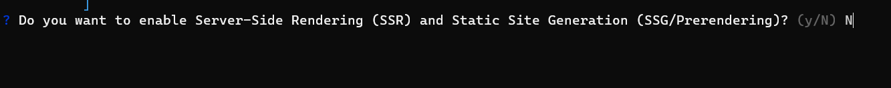

# Getting Started with Angular Maps Component

This section explains the steps required to create a simple [Maps](https://www.syncfusion.com/angular-components/angular-maps-library) and demonstrates the basic usage of the Maps component.

> **Ready to streamline your Syncfusion<sup style="font-size:70%">&reg;</sup> Angular development?** Discover the full potential of Syncfusion<sup style="font-size:70%">&reg;</sup> Angular components with Syncfusion<sup style="font-size:70%">&reg;</sup> AI Coding Assistant. Effortlessly integrate, configure, and enhance your projects with intelligent, context-aware code suggestions, streamlined setups, and real-time insights—all seamlessly integrated into your preferred AI-powered IDEs like VS Code, Cursor, Syncfusion<sup style="font-size:70%">&reg;</sup> CodeStudio and more. [Explore Syncfusion<sup style="font-size:70%">&reg;</sup> AI Coding Assistant](https://ej2.syncfusion.com/angular/documentation/mcp-server/ai-coding-assistant/getting-started)

To get started quickly with Angular Maps using CLI and Schematics, view the following video:



## Prerequisites

Before getting started, ensure that your environment meets the [system requirements for Syncfusion® Angular UI components](https://ej2.syncfusion.com/angular/documentation/system-requirement), which covers supported Node.js, Angular, and `@syncfusion/ej2-angular-maps` versions.

## Before You Begin

This guide uses the standalone application structure generated by the latest Angular CLI.

The main files used in this guide are:

- `src/app/app.ts` — Defines the root standalone component.
- `src/app/world-map.ts` — Contains the GeoJSON data for the world map.
- `src/index.html` — Contains the Angular root element.

> In newer Angular CLI standalone projects, the root component may be generated as `src/app/app.ts`. In NgModule-based Angular projects, the equivalent file is typically `src/app/app.component.ts`.

> If your application uses an older NgModule-based structure, import `MapsModule` in the application module, such as `app.module.ts`, instead of adding it to the standalone component `imports` collection.

## Setup the Angular application

Open your terminal on your system **(Command Prompt, PowerShell, or Terminal)** and use [Angular CLI](https://github.com/angular/angular-cli) to create and manage Angular applications. Install Angular CLI globally using the following command:

```bash
npm install -g @angular/cli
```

Verify the installation:

```bash
ng version
```

> **Angular 21 Standalone Architecture:** Standalone components are the default in Angular 21. This guide uses the modern standalone architecture. If you need more information about the standalone architecture, refer to the [Standalone Guide](https://ej2.syncfusion.com/angular/documentation/getting-started/angular-standalone).

### Installing a specific version

To install a particular version of Angular CLI, use:

```bash
npm install -g @angular/cli@21.0.0
```

## Create an Angular application

With Angular CLI installed, execute this command to generate a new application:

```bash
ng new syncfusion-angular-app
```

* This command will prompt you to configure settings like enabling Angular routing and choosing a stylesheet format.

```bash

? Which stylesheet format would you like to use? (Use arrow keys)
> CSS             [ https://developer.mozilla.org/docs/Web/CSS                     ]
  Sass (SCSS)     [ https://sass-lang.com/documentation/syntax#scss                ]
  Sass (Indented) [ https://sass-lang.com/documentation/syntax#the-indented-syntax ]
  Less            [ http://lesscss.org                                             ]

```

* By default, a CSS-based application is created. Use SCSS if required:

```bash
ng new syncfusion-angular-app --style=scss
```

* During project setup, when prompted for the Server-side rendering (SSR) option, choose the appropriate configuration.



* Select the required AI tool or 'none' if you do not need any AI tool.


* Navigate to your newly created application directory:

```bash
cd syncfusion-angular-app
```

> In Angular 19 and below, the CLI generates files like `app.component.ts`, `app.component.html`, `app.component.css`, etc. In Angular 20+, the CLI generates a simpler structure with `src/app/app.ts`, `app.html`, and `app.css` (no `.component.` suffixes).

## Adding the Syncfusion<sup style="font-size:70%">&reg;</sup> Angular Maps package

To install the **Syncfusion<sup style="font-size:70%">&reg;</sup> Angular Maps** package, use the following command:

```bash
ng add @syncfusion/ej2-angular-maps
```

The `ng add` command installs the package, registers it in `package.json`, and configures the required entries in your workspace automatically.

If `ng add` is unavailable in your setup, install the package manually with:

```bash
npm install @syncfusion/ej2-angular-maps
```

## Add Syncfusion<sup style="font-size:70%">&reg;</sup> Angular Maps component

Modify the template in `src/app/app.ts` (Angular 20+) or `src/app/app.component.ts` (Angular 19 and below) to render the Maps component:

```typescript
import { Component } from '@angular/core';
import { MapsModule } from '@syncfusion/ej2-angular-maps';

@Component({
  selector: 'app-root',
  standalone: true,
  imports: [MapsModule],
  template: `<ejs-maps id='maps-container'></ejs-maps>`
})
export class App {}
```

## Register Modules and Services

Import `MapsModule` from `@syncfusion/ej2-angular-maps` and add it to the `imports` collection of the standalone component. Then, add the Angular Maps component using the `<ejs-maps>` selector in the component template.

Maps components are segregated into individual feature-wise modules. To use a particular feature, you need to inject its feature service in `src/app/app.ts` (Angular 20+) or `src/app/app.component.ts` (Angular 19 and below). This example uses the tooltip feature of the Maps component.

* `MapsTooltipService` - Inject this provider to render the tooltip.

Replace the contents of `src/app/app.ts` (or `src/app/app.component.ts` on Angular 19 and below) with the following:

```typescript
import { Component } from '@angular/core';
import { MapsModule, MapsTooltipService } from '@syncfusion/ej2-angular-maps';

@Component({
  selector: 'app-root',
  standalone: true,
  imports: [ MapsModule ],
  providers: [ MapsTooltipService ],
  template: `<ejs-maps id="maps-container"></ejs-maps>`
})
export class App {}
```

## Add the world map shape data

Create a new file at `src/app/world-map.ts` and export the world map GeoJSON as a constant. Download the full GeoJSON from [Syncfusion Downloads](https://www.syncfusion.com/downloads/support/directtrac/general/ze/world-map-2091224620) and paste its contents into the file as follows:

```typescript
export const world_map: object = {
  type: "FeatureCollection",
  features: [
    // ... GeoJSON Feature objects for the world map.
  ]
};
```

> **Note:** The constant name `world_map` is case-sensitive. The import statement in `app.ts` must match the exported name exactly, and the file name `world-map.ts` must match the import path `./world-map`.

## Bind the shape data to the map

This section explains how to create a simple map by binding the GeoJSON data and rendering map layers using the Angular Maps component.










  


In this example:

* [`shapeData`](https://ej2.syncfusion.com/angular/documentation/api/maps/layersettingsmodel#shapedata) defines the geographical shape data (GeoJSON) used to render the Map.
* `<e-layers>` and `<e-layer>` directives are used to define and render map layers.

## Run the application

Run the application using the following command:

```bash
npm start
```

Open the generated URL (for example, `http://localhost:4200/`) in your browser. The application displays the Map as shown below:


## Troubleshooting

If the map is not visible, the page is blank, or you receive errors, check the following:

- **Map has zero size or is invisible**: Ensure the `<ejs-maps>` element has an explicit `height` and `width` set in CSS or the `style` attribute.
- **Module not found errors**: Verify that `MapsModule` is added to the `imports` array of the standalone component and that you ran `npm install` after creating the project.
- **`world_map` is undefined**: Confirm that `src/app/world-map.ts` exists and that the file name and export name match the import in `app.ts` exactly (case-sensitive).
- **Large bundle warning during build**: This is expected — the Maps package includes many features. You can code-split using lazy loading if bundle size is a concern.

## See also

- [Render and configure multiple map layers](layers)
- [Add markers, tooltips, and labels to the map](marker)
- [Display labels on shapes and markers.](data-labels) 
- [Add a legend to describe map colors](legend)
- [Use Bing or Azure as the map tile provider](map-providers)
- [Bind remote or JSON data to the map](populate-data) 
