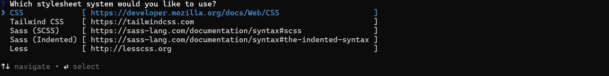

# Getting Started with Angular Markdown Editor Component

The Syncfusion Angular Markdown Editor is a web-based editor that enables users to create, edit, and format Markdown content with features such as table support and structured content formatting. This section explains the steps required to create a simple Angular Markdown Editor component and configure its available functionalities.

To enable the quick Markdown editing feature, inject `MarkdownEditorService` in the provider section of AppComponent.

> **Ready to streamline your Syncfusion<sup style="font-size:70%">&reg;</sup> Angular development?** Discover the full potential of Syncfusion<sup style="font-size:70%">&reg;</sup> Angular components with Syncfusion<sup style="font-size:70%">&reg;</sup> AI Coding Assistant. Effortlessly integrate, configure, and enhance your projects with intelligent, context-aware code suggestions, streamlined setups, and real-time insights—all seamlessly integrated into your preferred AI-powered IDEs like VS Code, Cursor, Syncfusion<sup style="font-size:70%">&reg;</sup> CodeStudio and more. [Explore Syncfusion<sup style="font-size:70%">&reg;</sup> AI Coding Assistant](https://ej2.syncfusion.com/angular/documentation/ai-coding-assistant/overview)

To get started quickly with the Angular Markdown Editor using CLI and Schematics, refer to this video tutorial:



## Prerequisites

This guide uses the Angular CLI to manage Angular applications. It requires Node `24.13.0` or higher. For more information about Angular CLI and its features, refer the [Angular CLI](https://github.com/angular/angular-cli).

## Setup Angular Environment

You can use [Angular CLI](https://github.com/angular/angular-cli) to setup your Angular applications. To install Angular CLI use the following command.

```bash
npm install -g @angular/cli
```

## Create an Angular Application

Start a new Angular application using below Angular CLI command.

```bash
ng new my-app
```
This command will prompt you for a few settings for the new project, such as which stylesheet format to use.



By default, it will create a CSS-based application.

Then the CLI also displays an additional prompt asking whether to enable Server‑Side Rendering (SSR) and Static Site Generation (SSG), as shown below:


For this setup, when prompted for the Server-side rendering (SSR) option, choose the appropriate configuration.

Then the CLI displays another prompt related to AI tooling support, as shown below:


Any preferred option can be selected based on the development workflow or project needs.

Next, navigate to the project folder:

```bash
cd my-app
```
## Adding Syncfusion Rich Text Editor package

All the available Essential JS 2 packages are published in [npmjs.com](https://www.npmjs.com/~syncfusionorg) registry.

To install Rich Text Editor component, use the following command.

```bash
npm install @syncfusion/ej2-angular-richtexteditor
```

## Adding CSS reference

The following CSS files are available in **../node_modules/@syncfusion** package folder.
This can be referenced in **[src/styles.css]** using the following code.

```css
@import '../node_modules/@syncfusion/ej2-base/styles/material3.css';
@import '../node_modules/@syncfusion/ej2-buttons/styles/material3.css';
@import '../node_modules/@syncfusion/ej2-inputs/styles/material3.css';
@import '../node_modules/@syncfusion/ej2-lists/styles/material3.css';
@import '../node_modules/@syncfusion/ej2-navigations/styles/material3.css';
@import '../node_modules/@syncfusion/ej2-popups/styles/material3.css';
@import '../node_modules/@syncfusion/ej2-splitbuttons/styles/material3.css';
@import '../node_modules/@syncfusion/ej2-richtexteditor/styles/material3.css';
```

I> You can also refer to the [themes section](https://ej2.syncfusion.com/angular/documentation/appearance/overview) for details about built-in themes and CSS references for individual controls.

## Module Injection

The following modules are used to utilize the basic capabilities of the Markdown Editor:

* **MarkdownEditor** - Inject this module to use Rich Text Editor as markdown editor.
* **Image** - Inject this module to use image feature in Markdown Editor.
* **Link** - Inject this module to use link feature in Markdown Editor.
* **Toolbar** - Inject this module to use Toolbar feature.

> Additional feature modules are available [here](https://ej2.syncfusion.com/angular/documentation/rich-text-editor/module).

## Adding Markdown Editor component

Modify the template in the [src/app/app.ts] file to render the Markdown Editor component. Add the Angular Markdown Editor by using the `<ejs-richtexteditor>` selector in the `template` section of the app.ts file.














## Run the application

Use the following command to run the application in the browser.

```bash
ng serve --open
```

## See also

* [How to change the editor type](https://ej2.syncfusion.com/angular/documentation/rich-text-editor/editor-types)
* [How to render the iframe](https://ej2.syncfusion.com/angular/documentation/rich-text-editor/editor-types/iframe)
* [How to render the toolbar in inline mode](https://ej2.syncfusion.com/angular/documentation/rich-text-editor/editor-types/inline-editing)
* [How to insert Emoticons](https://ej2.syncfusion.com/angular/demos/#/tailwind3/rich-text-editor/insert-emoticons)
* [Blog posting using Rich Text Editor](https://ej2.syncfusion.com/angular/demos/#/tailwind3/rich-text-editor/blog-posting)
* [Reactive Form with Rich Text Editor](https://ej2.syncfusion.com/angular/demos/#/tailwind3/rich-text-editor/reactive-form)
* [Accessibility in Rich text editor](https://ej2.syncfusion.com/angular/documentation/rich-text-editor/accessibility)
* [Keyboard support in Rich text editor](https://ej2.syncfusion.com/angular/documentation/rich-text-editor/keyboard-support)
* [Globalization in Rich text editor](https://ej2.syncfusion.com/angular/documentation/rich-text-editor/globalization)