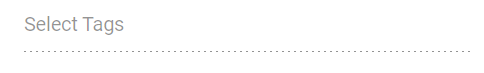

# Disabled Items in Angular MultiSelect component

The MultiSelect provides options for individual items to be either in an enabled or disabled state for specific scenarios. The category of each list item can be mapped through the [disabled](https://ej2.syncfusion.com/angular/documentation/api/multiselect/#fields) field in the data table. Once an item is disabled, it cannot be selected as a value for the component. To configure the disabled item columns, use the [`fields.disabled`](https://ej2.syncfusion.com/angular/documentation/api/multi-select/fieldSettingsModel/#disabled) property.

In the following sample, states are configured with disabled status using the `disabled` field.










  


## Disable Item Method

The [disableItem](https://ej2.syncfusion.com/angular/documentation/api/multi-select/#disableitem) method can be used to handle dynamic changes in the disabled state of a specific item. Only one item can be disabled in this method. To disable multiple items, this method can be iterated with the items list or array. The disabled field state will be updated in the [dataSource](https://ej2.syncfusion.com/angular/documentation/api/multiselect/#datasource) when the item is disabled using this method. If the selected item is disabled dynamically, then the selection will be cleared.

| Parameter | Type | Description |
|------|------|------|
| itemHTMLLIElement |  <code>HTMLLIElement</code> |  It accepts the HTML Li element of the item to be disabled.  |
| itemValue | <code>string</code> \| <code>number</code> \| <code>boolean</code> \| <code>object</code> | It accepts the string, number, boolean and object type value of the item to be disabled. |
| itemIndex | <code>number</code> | It accepts the index of the item to be disabled. |

In the following example, a specific item is disabled using the [`disableItem`](https://ej2.syncfusion.com/angular/documentation/api/multi-select/#disableitem) method by passing a string value in the [created](https://ej2.syncfusion.com/angular/documentation/api/multi-select/#created) event.

```typescript
import { FormsModule, ReactiveFormsModule } from '@angular/forms'
import { MultiSelectModule } from '@syncfusion/ej2-angular-dropdowns'
import { ButtonModule } from '@syncfusion/ej2-angular-buttons'
import { Component, ViewChild } from '@angular/core';
import { MultiSelectComponent } from '@syncfusion/ej2-angular-dropdowns';
@Component({
    imports: [
        FormsModule, ReactiveFormsModule, MultiSelectModule, ButtonModule
    ],
    standalone: true,
    selector: 'app-root',
    // specifies the template string for the MultiSelect component
    template: `<ejs-multiselect id='multiselectelement' #samples [dataSource]='tagData' [fields]='fields' [placeholder]='text' (created)="onCreated()"></ejs-multiselect>`
})
export class AppComponent {
    @ViewChild('samples')
    public status?: MultiSelectComponent;
    constructor() {
    }
    public tagData: { [key: string]: Object }[] = [
        { "Text": "Add to KB", "State": false },
        { "Text": "Crisis", "State": false },
        { "Text": "Enhancement", "State": false },
        { "Text": "Presale", "State": false },
        { "Text": "Needs Approval", "State": false },
        { "Text": "Approved", "State": false },
        { "Text": "Internal Issue", "State": true },
        { "Text": "Breaking Issue", "State": false },
        { "Text": "New Feature", "State": true },
        { "Text": "New Component", "State": false },
        { "Text": "Mobile Issue", "State": false }
    ];
    // maps the appropriate column to fields property
    public fields: Object = { value: 'Text', disabled: 'State' };
    //set the placeholder to MultiSelect input
    public text: string = "Select Tags";
    public onCreated() {
       this.status?.disableItem('Crisis')
    }
}
```

## Enabled

To disable the overall component, set the [enabled](https://ej2.syncfusion.com/angular/documentation/api/multiselect/#enabled) property to false.

```typescript

<ejs-multiselect id='multiselectelement' #samples [dataSource]='tagData' [fields]='fields' [placeholder]='text' [enabled]="false"></ejs-multiselect>

```

