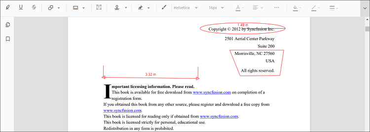
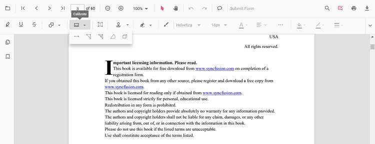
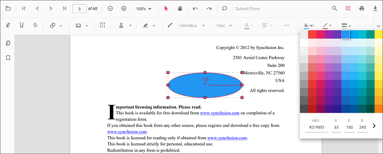
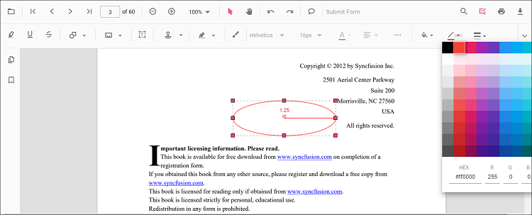
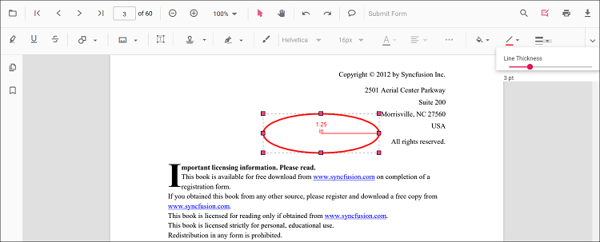
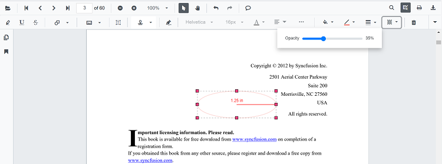
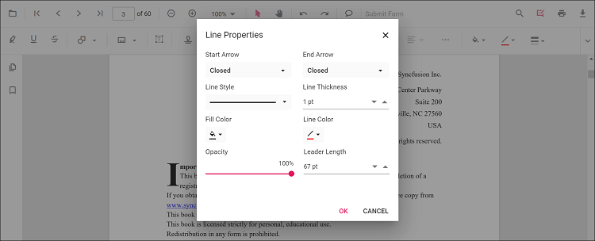
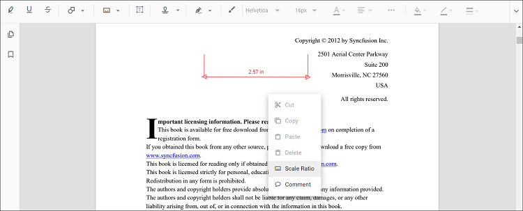
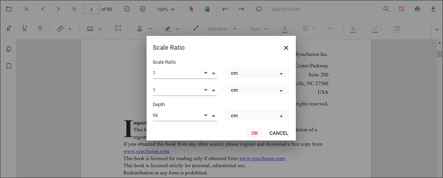

# Measurement Annotation in Angular PDF Viewer component

The PDF Viewer provides the options to add measurement annotations. You can measure the page annotations with the help of measurement annotation. The supported measurement annotations in the PDF Viewer control are:

* Distance
* Perimeter
* Area
* Radius
* Volume

## Adding measurement annotations to the PDF document

The measurement annotations can be added to the PDF document using the annotation toolbar.

* Click the **Edit Annotation** button in the PDF Viewer toolbar. A toolbar appears below it.
* Click the **Measurement Annotation** dropdown button. A dropdown pop-up will appear and shows the measurement annotations to be added.
* Select the measurement type to be added to the page in the dropdown pop-up. It enables the selected measurement annotation mode.
* You can measure and add the annotation over the pages of the PDF document.

In the pan mode, if the measurement annotation mode is entered, the PDF Viewer control will switch to text select mode.

Refer to the following code snippet to switch to distance annotation mode.




import { Component, OnInit } from '@angular/core';
import { LinkAnnotationService, BookmarkViewService,
         MagnificationService, ThumbnailViewService, ToolbarService,
         NavigationService, TextSearchService, TextSelectionService,
         PrintService, FormDesignerService, FormFieldsService, 
         AnnotationService, PageOrganizerService } from '@syncfusion/ej2-angular-pdfviewer';

@Component({
  selector: 'app-root',
  // specifies the template string for the PDF Viewer component
  template: `

  <button (click)="addAnnotation()">Distance</button>
  <ejs-pdfviewer 
    id="pdfViewer" 
    [documentPath]='document' 
    [resourceUrl]='resource' 
    style="height:640px;display:block">
  </ejs-pdfviewer>

`,
  providers: [ LinkAnnotationService, BookmarkViewService, MagnificationService,
               ThumbnailViewService, ToolbarService, NavigationService,
               TextSearchService, TextSelectionService, PrintService,
               AnnotationService, FormDesignerService, FormFieldsService, PageOrganizerService]
})
export class AppComponent implements OnInit {
    public document = 'https://cdn.syncfusion.com/content/pdf/pdf-succinctly.pdf';
    public resource: string = "https://cdn.syncfusion.com/ej2/25.1.35/dist/ej2-pdfviewer-lib";
    ngOnInit(): void {
    }
    addAnnotation() {
      var pdfviewer = (<any>document.getElementById('pdfViewer')).ej2_instances[0];
      pdfviewer.annotationModule.setAnnotationMode('Distance');
  }
}



import { Component, OnInit } from '@angular/core';
import { LinkAnnotationService, BookmarkViewService,
         MagnificationService, ThumbnailViewService, ToolbarService,
         NavigationService, TextSearchService, TextSelectionService,
         PrintService, FormDesignerService, FormFieldsService, 
         AnnotationService, PageOrganizerService } from '@syncfusion/ej2-angular-pdfviewer';

@Component({
  selector: 'app-root',
  // specifies the template string for the PDF Viewer component
  template: `

  <button (click)="addAnnotation()">Distance</button>
  <ejs-pdfviewer 
    id="pdfViewer" 
    [documentPath]='document' 
    [serviceUrl]='service' 
    style="height:640px;display:block">
  </ejs-pdfviewer>

`,
  providers: [ LinkAnnotationService, BookmarkViewService, MagnificationService,
               ThumbnailViewService, ToolbarService, NavigationService,
               TextSearchService, TextSelectionService, PrintService,
               AnnotationService, FormDesignerService, FormFieldsService, PageOrganizerService]
})
export class AppComponent implements OnInit {
    public document = 'https://cdn.syncfusion.com/content/pdf/pdf-succinctly.pdf';
    public service: string = 'https://services.syncfusion.com/angular/production/api/pdfviewer';
    ngOnInit(): void {
    }
    addAnnotation() {
      var pdfviewer = (<any>document.getElementById('pdfViewer')).ej2_instances[0];
      pdfviewer.annotationModule.setAnnotationMode('Distance');
  }
}



## Adding a measurement annotation to the PDF document Programmatically

With the PDF Viewer library, you can add a measurement annotation to the PDF Viewer control programmatically using the [**addAnnotation()**](https://ej2.syncfusion.com/angular/documentation/api/pdfviewer/annotation/#addannotationn) method.

Here's a example of how you can utilize the **addAnnotation()** method to include a measurement annotation programmatically:




import { Component, OnInit } from '@angular/core';
import { LinkAnnotationService, BookmarkViewService,
         MagnificationService, ThumbnailViewService, ToolbarService,
         NavigationService, TextSearchService, TextSelectionService,
         PrintService, FormDesignerService, FormFieldsService, 
         AnnotationService, PageOrganizerService, DistanceSettings, PerimeterSettings, 
         AreaSettings, RadiusSettings, VolumeSettings } from '@syncfusion/ej2-angular-pdfviewer';

@Component({
  selector: 'app-root',
  // specifies the template string for the PDF Viewer component
  template: `

  <button (click)="addDistanceAnnotation()">Add Distance annotation Programmatically</button>
  <button (click)="addPerimeterAnnotation()">Add Perimeter annotation Programmatically</button>
  <button (click)="addAreaAnnotation()">Add Area annotation Programmatically</button>
  <button (click)="addRadiusAnnotation()">Add Radius annotation Programmatically</button>
  <button (click)="addVolumeAnnotation()">Add Volume annotation Programmatically</button>
  <ejs-pdfviewer 
    id="pdfViewer" 
    [documentPath]='document' 
    [resourceUrl]='resource' 
    style="height:640px;display:block">
  </ejs-pdfviewer>

`,
  providers: [ LinkAnnotationService, BookmarkViewService, MagnificationService,
               ThumbnailViewService, ToolbarService, NavigationService,
               TextSearchService, TextSelectionService, PrintService,
               AnnotationService, FormDesignerService, FormFieldsService, PageOrganizerService]
})
export class AppComponent implements OnInit {
    public document = 'https://cdn.syncfusion.com/content/pdf/pdf-succinctly.pdf';
    public resource: string = "https://cdn.syncfusion.com/ej2/25.1.35/dist/ej2-pdfviewer-lib";
    ngOnInit(): void {
    }

  addDistanceAnnotation() {
    var pdfviewer = (<any>document.getElementById('pdfViewer')).ej2_instances[0];
    pdfviewer.annotation.addAnnotation("Distance", {
      offset: { x: 200, y: 230 },
      pageNumber: 1,
      vertexPoints: [{ x: 200, y: 230 }, { x: 350, y: 230 }]
    } as DistanceSettings);
  }

  addPerimeterAnnotation() {
    var pdfviewer = (<any>document.getElementById('pdfViewer')).ej2_instances[0];
    pdfviewer.annotation.addAnnotation("Perimeter", {
    offset: { x: 200, y: 350 },
    pageNumber: 1,
    vertexPoints: [{ x: 200, y: 350 }, { x: 285, y: 350 }, { x: 286, y: 412 }]
    } as PerimeterSettings);
  }

  addAreaAnnotation() {
    var pdfviewer = (<any>document.getElementById('pdfViewer')).ej2_instances[0];
    pdfviewer.annotation.addAnnotation("Area", {
    offset: { x: 200, y: 500 },
    pageNumber: 1,
    vertexPoints: [{ x: 200, y: 500 }, { x: 288, y: 499 }, { x: 289, y: 553 }, { x: 200, y: 500 }]
    } as AreaSettings);
  }

  addRadiusAnnotation() {
    var pdfviewer = (<any>document.getElementById('pdfViewer')).ej2_instances[0];
    pdfviewer.annotation.addAnnotation("Radius", {
    offset: { x: 200, y: 630 },
    pageNumber: 1,
    width: 90,
    height: 90
    } as RadiusSettings);
  }
  addVolumeAnnotation() {
    var pdfviewer = (<any>document.getElementById('pdfViewer')).ej2_instances[0];
    pdfviewer.annotation.addAnnotation("Volume", {
      offset: { x: 200, y: 810 },
      pageNumber: 1,
      vertexPoints: [{ x: 200, y: 810 }, { x: 200, y: 919 }, { x: 320, y: 919 }, { x: 320, y: 809 }, { x: 200, y: 810 }]
    } as VolumeSettings);
  }
}




import { Component, OnInit } from '@angular/core';
import { LinkAnnotationService, BookmarkViewService,
         MagnificationService, ThumbnailViewService, ToolbarService,
         NavigationService, TextSearchService, TextSelectionService,
         PrintService, FormDesignerService, FormFieldsService, 
         AnnotationService, PageOrganizerService, DistanceSettings, PerimeterSettings, 
         AreaSettings, RadiusSettings, VolumeSettings } from '@syncfusion/ej2-angular-pdfviewer';

@Component({
  selector: 'app-root',
  // specifies the template string for the PDF Viewer component
  template: `

  <button (click)="addDistanceAnnotation()">Add Distance annotation Programmatically</button>
  <button (click)="addPerimeterAnnotation()">Add Perimeter annotation Programmatically</button>
  <button (click)="addAreaAnnotation()">Add Area annotation Programmatically</button>
  <button (click)="addRadiusAnnotation()">Add Radius annotation Programmatically</button>
  <button (click)="addVolumeAnnotation()">Add Volume annotation Programmatically</button>
  <ejs-pdfviewer 
    id="pdfViewer" 
    [documentPath]='document' 
    [serviceUrl]='service' 
    style="height:640px;display:block">
  </ejs-pdfviewer>

`,
  providers: [ LinkAnnotationService, BookmarkViewService, MagnificationService,
               ThumbnailViewService, ToolbarService, NavigationService,
               TextSearchService, TextSelectionService, PrintService,
               AnnotationService, FormDesignerService, FormFieldsService, PageOrganizerService]
})
export class AppComponent implements OnInit {
    public document = 'https://cdn.syncfusion.com/content/pdf/pdf-succinctly.pdf';
    public service: string = 'https://services.syncfusion.com/angular/production/api/pdfviewer';
    ngOnInit(): void {
    }

  addDistanceAnnotation() {
    var pdfviewer = (<any>document.getElementById('pdfViewer')).ej2_instances[0];
    pdfviewer.annotation.addAnnotation("Distance", {
      offset: { x: 200, y: 230 },
      pageNumber: 1,
      vertexPoints: [{ x: 200, y: 230 }, { x: 350, y: 230 }]
    } as DistanceSettings);
  }

  addPerimeterAnnotation() {
    var pdfviewer = (<any>document.getElementById('pdfViewer')).ej2_instances[0];
    pdfviewer.annotation.addAnnotation("Perimeter", {
    offset: { x: 200, y: 350 },
    pageNumber: 1,
    vertexPoints: [{ x: 200, y: 350 }, { x: 285, y: 350 }, { x: 286, y: 412 }]
    } as PerimeterSettings);
  }

  addAreaAnnotation() {
    var pdfviewer = (<any>document.getElementById('pdfViewer')).ej2_instances[0];
    pdfviewer.annotation.addAnnotation("Area", {
    offset: { x: 200, y: 500 },
    pageNumber: 1,
    vertexPoints: [{ x: 200, y: 500 }, { x: 288, y: 499 }, { x: 289, y: 553 }, { x: 200, y: 500 }]
    } as AreaSettings);
  }

  addRadiusAnnotation() {
    var pdfviewer = (<any>document.getElementById('pdfViewer')).ej2_instances[0];
    pdfviewer.annotation.addAnnotation("Radius", {
    offset: { x: 200, y: 630 },
    pageNumber: 1,
    width: 90,
    height: 90
    } as RadiusSettings);
  }
  addVolumeAnnotation() {
    var pdfviewer = (<any>document.getElementById('pdfViewer')).ej2_instances[0];
    pdfviewer.annotation.addAnnotation("Volume", {
      offset: { x: 200, y: 810 },
      pageNumber: 1,
      vertexPoints: [{ x: 200, y: 810 }, { x: 200, y: 919 }, { x: 320, y: 919 }, { x: 320, y: 809 }, { x: 200, y: 810 }]
    } as VolumeSettings);
  }
}




## Edit the existing measurement annotation programmatically

To modify existing measurement annotation in the Syncfusion&reg; PDF viewer programmatically, you can use the **editAnnotation()** method.

Here is an example of how you can use the **editAnnotation()** method:




import { Component, OnInit } from '@angular/core';
import { LinkAnnotationService, BookmarkViewService,
         MagnificationService, ThumbnailViewService, ToolbarService,
         NavigationService, TextSearchService, TextSelectionService,
         PrintService, FormDesignerService, FormFieldsService, 
         AnnotationService, PageOrganizerService } from '@syncfusion/ej2-angular-pdfviewer';

@Component({
  selector: 'app-root',
  // specifies the template string for the PDF Viewer component
  template: `

  <button (click)="editDistanceAnnotation()">Edit Distance annotation Programmatically</button>
  <button (click)="editPerimeterAnnotation()">Edit Perimeter annotation Programmatically</button>
  <button (click)="editAreaAnnotation()">Edit Area annotation Programmatically</button>
  <button (click)="editRadiusAnnotation()">Edit Radius annotation Programmatically</button>
  <button (click)="editVolumeAnnotation()">Edit Volume annotation Programmatically</button>
  <ejs-pdfviewer 
    id="pdfViewer" 
    [documentPath]='document' 
    [resourceUrl]='resource' 
    style="height:640px;display:block">
  </ejs-pdfviewer>

`,
  providers: [ LinkAnnotationService, BookmarkViewService, MagnificationService,
               ThumbnailViewService, ToolbarService, NavigationService,
               TextSearchService, TextSelectionService, PrintService,
               AnnotationService, FormDesignerService, FormFieldsService, PageOrganizerService]
})
export class AppComponent implements OnInit {
    public document = 'https://cdn.syncfusion.com/content/pdf/pdf-succinctly.pdf';
    public resource: string = "https://cdn.syncfusion.com/ej2/25.1.35/dist/ej2-pdfviewer-lib";
    ngOnInit(): void {
    }

  editDistanceAnnotation() {
    var pdfviewer = (<any>document.getElementById('pdfViewer')).ej2_instances[0];
    for (let i = 0; i < pdfviewer.annotationCollection.length; i++) {
      if (pdfviewer.annotationCollection[i].subject === "Distance calculation") {
        pdfviewer.annotationCollection[i].annotationSelectorSettings.resizerShape = "Circle"
        pdfviewer.annotationCollection[i].strokeColor = "#0000FF";
        pdfviewer.annotationCollection[i].thickness = 2 ;
        pdfviewer.annotationCollection[i].fillColor = "#FFFF00";
        pdfviewer.annotation.editAnnotation(pdfviewer.annotationCollection[i]);
      }
    }
  }

  editPerimeterAnnotation() {
    var pdfviewer = (<any>document.getElementById('pdfViewer')).ej2_instances[0];
    for (let i = 0; i < pdfviewer.annotationCollection.length; i++) {
      if (pdfviewer.annotationCollection[i].subject === "Perimeter calculation") {
        pdfviewer.annotationCollection[i].annotationSelectorSettings.resizerShape = "Circle"
        pdfviewer.annotationCollection[i].strokeColor = "#0000FF";
        pdfviewer.annotationCollection[i].thickness = 2 ;
        pdfviewer.annotationCollection[i].fillColor = "#FFFF00";
        pdfviewer.annotation.editAnnotation(pdfviewer.annotationCollection[i]);
      }
    }
  }

  editAreaAnnotation() {
    var pdfviewer = (<any>document.getElementById('pdfViewer')).ej2_instances[0];
    for (let i = 0; i < pdfviewer.annotationCollection.length; i++) {
      if (pdfviewer.annotationCollection[i].subject === "Area calculation") {
        pdfviewer.annotationCollection[i].annotationSelectorSettings.resizerShape = "Circle"
        pdfviewer.annotationCollection[i].strokeColor = "#0000FF";
        pdfviewer.annotationCollection[i].thickness = 2 ;
        pdfviewer.annotationCollection[i].fillColor = "#FFFF00";
        pdfviewer.annotation.editAnnotation(pdfviewer.annotationCollection[i]);
      }
    }
  }

  editRadiusAnnotation() {
    var pdfviewer = (<any>document.getElementById('pdfViewer')).ej2_instances[0];
    for (let i = 0; i < pdfviewer.annotationCollection.length; i++) {
      if (pdfviewer.annotationCollection[i].subject === "Radius calculation") {
        pdfviewer.annotationCollection[i].annotationSelectorSettings.resizerShape = "Circle"
        pdfviewer.annotationCollection[i].strokeColor = "#0000FF";
        pdfviewer.annotationCollection[i].thickness = 2 ;
        pdfviewer.annotationCollection[i].fillColor = "#FFFF00";
        pdfviewer.annotation.editAnnotation(pdfviewer.annotationCollection[i]);
      }
    }
  }
  editVolumeAnnotation() {
    var pdfviewer = (<any>document.getElementById('pdfViewer')).ej2_instances[0];
    for (let i = 0; i < pdfviewer.annotationCollection.length; i++) {
      if (pdfviewer.annotationCollection[i].subject === "Volume calculation") {
        pdfviewer.annotationCollection[i].annotationSelectorSettings.resizerShape = "Circle"
        pdfviewer.annotationCollection[i].strokeColor = "#0000FF";
        pdfviewer.annotationCollection[i].thickness = 2 ;
        pdfviewer.annotationCollection[i].fillColor = "#FFFF00";
        pdfviewer.annotation.editAnnotation(pdfviewer.annotationCollection[i]);
      }
    }
  }
}




import { Component, OnInit } from '@angular/core';
import { LinkAnnotationService, BookmarkViewService,
         MagnificationService, ThumbnailViewService, ToolbarService,
         NavigationService, TextSearchService, TextSelectionService,
         PrintService, FormDesignerService, FormFieldsService, 
         AnnotationService, PageOrganizerService } from '@syncfusion/ej2-angular-pdfviewer';

@Component({
  selector: 'app-root',
  // specifies the template string for the PDF Viewer component
  template: `

  <button (click)="editDistanceAnnotation()">Edit Distance annotation Programmatically</button>
  <button (click)="editPerimeterAnnotation()">Edit Perimeter annotation Programmatically</button>
  <button (click)="editAreaAnnotation()">Edit Area annotation Programmatically</button>
  <button (click)="editRadiusAnnotation()">Edit Radius annotation Programmatically</button>
  <button (click)="editVolumeAnnotation()">Edit Volume annotation Programmatically</button>
  <ejs-pdfviewer 
    id="pdfViewer" 
    [documentPath]='document' 
    [serviceUrl]='service' 
    style="height:640px;display:block">
  </ejs-pdfviewer>

`,
  providers: [ LinkAnnotationService, BookmarkViewService, MagnificationService,
               ThumbnailViewService, ToolbarService, NavigationService,
               TextSearchService, TextSelectionService, PrintService,
               AnnotationService, FormDesignerService, FormFieldsService, PageOrganizerService]
})
export class AppComponent implements OnInit {
    public document = 'https://cdn.syncfusion.com/content/pdf/pdf-succinctly.pdf';
    public service: string = 'https://services.syncfusion.com/angular/production/api/pdfviewer';
    ngOnInit(): void {
    }

  editDistanceAnnotation() {
    var pdfviewer = (<any>document.getElementById('pdfViewer')).ej2_instances[0];
    for (let i = 0; i < pdfviewer.annotationCollection.length; i++) {
      if (pdfviewer.annotationCollection[i].subject === "Distance calculation") {
        pdfviewer.annotationCollection[i].annotationSelectorSettings.resizerShape = "Circle"
        pdfviewer.annotationCollection[i].strokeColor = "#0000FF";
        pdfviewer.annotationCollection[i].thickness = 2 ;
        pdfviewer.annotationCollection[i].fillColor = "#FFFF00";
        pdfviewer.annotation.editAnnotation(pdfviewer.annotationCollection[i]);
      }
    }
  }

  editPerimeterAnnotation() {
    var pdfviewer = (<any>document.getElementById('pdfViewer')).ej2_instances[0];
    for (let i = 0; i < pdfviewer.annotationCollection.length; i++) {
      if (pdfviewer.annotationCollection[i].subject === "Perimeter calculation") {
        pdfviewer.annotationCollection[i].annotationSelectorSettings.resizerShape = "Circle"
        pdfviewer.annotationCollection[i].strokeColor = "#0000FF";
        pdfviewer.annotationCollection[i].thickness = 2 ;
        pdfviewer.annotationCollection[i].fillColor = "#FFFF00";
        pdfviewer.annotation.editAnnotation(pdfviewer.annotationCollection[i]);
      }
    }
  }

  editAreaAnnotation() {
    var pdfviewer = (<any>document.getElementById('pdfViewer')).ej2_instances[0];
    for (let i = 0; i < pdfviewer.annotationCollection.length; i++) {
      if (pdfviewer.annotationCollection[i].subject === "Area calculation") {
        pdfviewer.annotationCollection[i].annotationSelectorSettings.resizerShape = "Circle"
        pdfviewer.annotationCollection[i].strokeColor = "#0000FF";
        pdfviewer.annotationCollection[i].thickness = 2 ;
        pdfviewer.annotationCollection[i].fillColor = "#FFFF00";
        pdfviewer.annotation.editAnnotation(pdfviewer.annotationCollection[i]);
      }
    }
  }

  editRadiusAnnotation() {
    var pdfviewer = (<any>document.getElementById('pdfViewer')).ej2_instances[0];
    for (let i = 0; i < pdfviewer.annotationCollection.length; i++) {
      if (pdfviewer.annotationCollection[i].subject === "Radius calculation") {
        pdfviewer.annotationCollection[i].annotationSelectorSettings.resizerShape = "Circle"
        pdfviewer.annotationCollection[i].strokeColor = "#0000FF";
        pdfviewer.annotationCollection[i].thickness = 2 ;
        pdfviewer.annotationCollection[i].fillColor = "#FFFF00";
        pdfviewer.annotation.editAnnotation(pdfviewer.annotationCollection[i]);
      }
    }
  }
  editVolumeAnnotation() {
    var pdfviewer = (<any>document.getElementById('pdfViewer')).ej2_instances[0];
    for (let i = 0; i < pdfviewer.annotationCollection.length; i++) {
      if (pdfviewer.annotationCollection[i].subject === "Volume calculation") {
        pdfviewer.annotationCollection[i].annotationSelectorSettings.resizerShape = "Circle"
        pdfviewer.annotationCollection[i].strokeColor = "#0000FF";
        pdfviewer.annotationCollection[i].thickness = 2 ;
        pdfviewer.annotationCollection[i].fillColor = "#FFFF00";
        pdfviewer.annotation.editAnnotation(pdfviewer.annotationCollection[i]);
      }
    }
  }
}




## Editing the properties of measurement annotation

The fill color, stroke color, thickness, and opacity of the measurement annotation can be edited using the Edit Color tool, Edit Stroke Color tool, Edit Thickness tool, and Edit Opacity tool in the annotation toolbar.

### Editing fill color

The fill color of the annotation can be edited using the color palette provided in the Edit Color tool.

### Editing stroke color

The stroke color of the annotation can be edited using the color palette provided in the Edit Stroke Color tool.

### Editing thickness

The thickness of the border of the annotation can be edited using the range slider provided in the Edit thickness tool.

### Editing opacity

The opacity of the annotation can be edited using the range slider provided in the Edit Opacity tool.

### Editing the line properties

The properties of the line measurements such as distance and perimeter annotations can be edited using the Line properties window. It can be opened by selecting the Properties option in the context menu that appears on right-clicking the distance and perimeter annotations.

## Setting default properties during control initialization

The properties of the measurement annotations can be set before creating the control using distanceSettings, perimeterSettings, areaSettings, radiusSettings and volumeSettings.
Refer to the following code snippet to set the default annotation settings.



import { Component, OnInit } from '@angular/core';
import { LinkAnnotationService, BookmarkViewService,
         MagnificationService, ThumbnailViewService, ToolbarService,
         NavigationService, TextSearchService, TextSelectionService,
         PrintService, FormDesignerService, FormFieldsService, 
         AnnotationService, PageOrganizerService } from '@syncfusion/ej2-angular-pdfviewer';

@Component({
  selector: 'app-root',
  // specifies the template string for the PDF Viewer component
  template: `

  <ejs-pdfviewer 
    id="pdfViewer" 
    [documentPath]='document' 
    [resourceUrl]='resource'
    [distanceSettings]='distanceSettings'
    [perimeterSettings]='perimeterSettings'
    [areaSettings]='areaSettings'
    [radiusSettings]='radiusSettings'
    [volumeSettings]='volumeSettings'	
    style="height:640px;display:block">
  </ejs-pdfviewer>

`,
  providers: [ LinkAnnotationService, BookmarkViewService, MagnificationService,
               ThumbnailViewService, ToolbarService, NavigationService,
               TextSearchService, TextSelectionService, PrintService,
               AnnotationService, FormDesignerService, FormFieldsService, PageOrganizerService]
})
export class AppComponent implements OnInit {
    public document = 'https://cdn.syncfusion.com/content/pdf/pdf-succinctly.pdf';
    public resource: string = "https://cdn.syncfusion.com/ej2/25.1.35/dist/ej2-pdfviewer-lib";
    public distanceSettings = { fillColor: 'blue', opacity: 0.6, strokeColor: 'green' };
    public perimeterSettings = { fillColor: 'green', opacity: 0.6, strokeColor: 'blue' };
    public areaSettings = { fillColor: 'yellow', opacity: 0.6, strokeColor: 'orange' };
    public radiusSettings = { fillColor: 'orange', opacity: 0.6, strokeColor: 'pink' };
    public volumeSettings = { fillColor: 'pink', opacity: 0.6, strokeColor: 'yellow' };
    ngOnInit(): void {
    }
}


import { Component, OnInit } from '@angular/core';
import { LinkAnnotationService, BookmarkViewService,
         MagnificationService, ThumbnailViewService, ToolbarService,
         NavigationService, TextSearchService, TextSelectionService,
         PrintService, FormDesignerService, FormFieldsService, 
         AnnotationService, PageOrganizerService } from '@syncfusion/ej2-angular-pdfviewer';

@Component({
  selector: 'app-root',
  // specifies the template string for the PDF Viewer component
  template: `

  <ejs-pdfviewer 
    id="pdfViewer" 
    [documentPath]='document' 
    [serviceUrl]='service' 
    [distanceSettings]='distanceSettings'
    [perimeterSettings]='perimeterSettings'
    [areaSettings]='areaSettings'
    [radiusSettings]='radiusSettings'
    [volumeSettings]='volumeSettings'	
    style="height:640px;display:block">
  </ejs-pdfviewer>

`,
  providers: [ LinkAnnotationService, BookmarkViewService, MagnificationService,
               ThumbnailViewService, ToolbarService, NavigationService,
               TextSearchService, TextSelectionService, PrintService,
               AnnotationService, FormDesignerService, FormFieldsService, PageOrganizerService]
})
export class AppComponent implements OnInit {
    public document = 'https://cdn.syncfusion.com/content/pdf/pdf-succinctly.pdf';
    public service: string = 'https://services.syncfusion.com/angular/production/api/pdfviewer';
    public distanceSettings = { fillColor: 'blue', opacity: 0.6, strokeColor: 'green' };
    public perimeterSettings = { fillColor: 'green', opacity: 0.6, strokeColor: 'blue' };
    public areaSettings = { fillColor: 'yellow', opacity: 0.6, strokeColor: 'orange' };
    public radiusSettings = { fillColor: 'orange', opacity: 0.6, strokeColor: 'pink' };
    public volumeSettings = { fillColor: 'pink', opacity: 0.6, strokeColor: 'yellow' };
    ngOnInit(): void {
    }
}



## Editing scale ratio and unit of the measurement annotation

The scale ratio and unit of measurement can be modified using the scale ratio option provided in the context menu of the PDF Viewer control.

The Units of measurements support for the measurement annotations in the PDF Viewer are

* Inch
* Millimeter
* Centimeter
* Point
* Pica
* Feet

## Setting default scale ratio settings during control initialization

The properties of scale ratio for measurement annotation can be set before creating the control using ScaleRatioSettings as shown in the following code snippet,



import { Component, OnInit } from '@angular/core';
import { LinkAnnotationService, BookmarkViewService,
         MagnificationService, ThumbnailViewService, ToolbarService,
         NavigationService, TextSearchService, TextSelectionService,
         PrintService, FormDesignerService, FormFieldsService, 
         AnnotationService, PageOrganizerService } from '@syncfusion/ej2-angular-pdfviewer';

@Component({
  selector: 'app-root',
  // specifies the template string for the PDF Viewer component
  template: `

  <ejs-pdfviewer 
    id="pdfViewer" 
    [documentPath]='document' 
    [resourceUrl]='resource'
    [measurementSettings]='measurementSettings'
    style="height:640px;display:block">
  </ejs-pdfviewer>

`,
  providers: [ LinkAnnotationService, BookmarkViewService, MagnificationService,
               ThumbnailViewService, ToolbarService, NavigationService,
               TextSearchService, TextSelectionService, PrintService,
               AnnotationService, FormDesignerService, FormFieldsService, PageOrganizerService]
})
export class AppComponent implements OnInit {
    public document = 'https://cdn.syncfusion.com/content/pdf/pdf-succinctly.pdf';
    public resource: string = "https://cdn.syncfusion.com/ej2/25.1.35/dist/ej2-pdfviewer-lib";
    public measurementSettings = { scaleRatio: 2, conversionUnit: 'cm', displayUnit: 'cm' };
    ngOnInit(): void {
    }
}


import { Component, OnInit } from '@angular/core';
import { LinkAnnotationService, BookmarkViewService,
         MagnificationService, ThumbnailViewService, ToolbarService,
         NavigationService, TextSearchService, TextSelectionService,
         PrintService, FormDesignerService, FormFieldsService, 
         AnnotationService, PageOrganizerService } from '@syncfusion/ej2-angular-pdfviewer';

@Component({
  selector: 'app-root',
  // specifies the template string for the PDF Viewer component
  template: `

  <ejs-pdfviewer 
    id="pdfViewer" 
    [documentPath]='document' 
    [serviceUrl]='service' 
    [measurementSettings]='measurementSettings'
    style="height:640px;display:block">
  </ejs-pdfviewer>

`,
  providers: [ LinkAnnotationService, BookmarkViewService, MagnificationService,
               ThumbnailViewService, ToolbarService, NavigationService,
               TextSearchService, TextSelectionService, PrintService,
               AnnotationService, FormDesignerService, FormFieldsService, PageOrganizerService]
})
export class AppComponent implements OnInit {
    public document = 'https://cdn.syncfusion.com/content/pdf/pdf-succinctly.pdf';
    public service: string = 'https://services.syncfusion.com/angular/production/api/pdfviewer';
    public measurementSettings = { scaleRatio: 2, conversionUnit: 'cm', displayUnit: 'cm' };
    ngOnInit(): void {
    }
}


