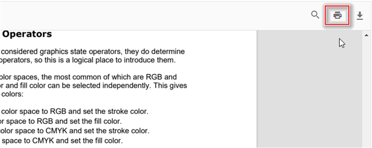

# Print in Angular PDF Viewer component

The PDF Viewer supports printing the loaded PDF file. You can enable/disable the print using the following code snippet.




import { Component, OnInit } from '@angular/core';
import { LinkAnnotationService, BookmarkViewService, MagnificationService,
         ThumbnailViewService, ToolbarService, NavigationService,
         TextSearchService, AnnotationService, TextSelectionService,
         PrintService
       } from '@syncfusion/ej2-angular-pdfviewer';
@Component({
  selector: 'app-container',
  // specifies the template string for the PDF Viewer component
  template: `<div class="content-wrapper">
                  <ejs-pdfviewer id="pdfViewer"
                            [documentPath]='document'
                            [enablePrint]='true'
                            style="height:640px;display:block">
                  </ejs-pdfviewer>
              </div>`,
  providers: [ LinkAnnotationService, BookmarkViewService, MagnificationService,
               ThumbnailViewService, ToolbarService, NavigationService,
               AnnotationService, TextSearchService, TextSelectionService,
               PrintService]
  })
  export class AppComponent implements OnInit {
    public document = 'https://cdn.syncfusion.com/content/pdf/pdf-succinctly.pdf';
  }





import { Component, OnInit } from '@angular/core';
import { LinkAnnotationService, BookmarkViewService, MagnificationService,
         ThumbnailViewService, ToolbarService, NavigationService,
         TextSearchService, AnnotationService, TextSelectionService,
         PrintService
       } from '@syncfusion/ej2-angular-pdfviewer';
@Component({
  selector: 'app-container',
  // specifies the template string for the PDF Viewer component
  template: `<div class="content-wrapper">
                  <ejs-pdfviewer id="pdfViewer"
                            [serviceUrl]='service'
                            [documentPath]='document'
                            [enablePrint]='true'
                            style="height:640px;display:block">
                  </ejs-pdfviewer>
              </div>`,
  providers: [ LinkAnnotationService, BookmarkViewService, MagnificationService,
               ThumbnailViewService, ToolbarService, NavigationService,
               AnnotationService, TextSearchService, TextSelectionService,
               PrintService]
  })
  export class AppComponent implements OnInit {
    public service = 'https://services.syncfusion.com/angular/production/api/pdfviewer';
    public document = 'https://cdn.syncfusion.com/content/pdf/pdf-succinctly.pdf';
  }






You can invoke print action using the following code snippet.,

```html
<script>
    window.onload = function () {
        var pdfViewer = document.getElementById('pdfviewer').ej2_instances[0];
        pdfViewer.print.print();
    }
</script>

```

## Print the PDF document in the new window.

PDF Viewer extension supports printing functionality for loaded PDF files directly within the browser. You can utilize the [printMode](https://ej2.syncfusion.com/angular/documentation/api/pdfviewer/printMode/) parameter to specify the printing mode, with the option to choose [NewWindow](https://ej2.syncfusion.com/angular/documentation/api/pdfviewer/printMode/) for printing. Below is a code snippet demonstrating how to implement this functionality




import { Component, OnInit } from '@angular/core';
import { LinkAnnotationService, BookmarkViewService, MagnificationService,
         ThumbnailViewService, ToolbarService, NavigationService,
         TextSearchService, AnnotationService, TextSelectionService,
         PrintService
       } from '@syncfusion/ej2-angular-pdfviewer';
@Component({
  selector: 'app-container',
  // specifies the template string for the PDF Viewer component
  template: `<div class="content-wrapper">
                  <ejs-pdfviewer id="pdfViewer"
                            [documentPath]='document'
                            [printMode] = "printMode"
                            style="height:640px;display:block">
                  </ejs-pdfviewer>
              </div>`,
  providers: [ LinkAnnotationService, BookmarkViewService, MagnificationService,
               ThumbnailViewService, ToolbarService, NavigationService,
               AnnotationService, TextSearchService, TextSelectionService,
               PrintService]
  })
  export class AppComponent implements OnInit {
    public document: string = 'https://cdn.syncfusion.com/content/pdf/pdf-succinctly.pdf';
    public resource: string = "https://cdn.syncfusion.com/ej2/23.1.43/dist/ej2-pdfviewer-lib";
    public printMode: string = "NewWindow";
  }





import { Component, OnInit } from '@angular/core';
import { LinkAnnotationService, BookmarkViewService, MagnificationService,
         ThumbnailViewService, ToolbarService, NavigationService,
         TextSearchService, AnnotationService, TextSelectionService,
         PrintService
       } from '@syncfusion/ej2-angular-pdfviewer';
@Component({
  selector: 'app-container',
  // specifies the template string for the PDF Viewer component
  template: `<div class="content-wrapper">
                  <ejs-pdfviewer id="pdfViewer"
                            [serviceUrl]='service'
                            [documentPath]='document'
                            [printMode] = "printMode"
                            style="height:640px;display:block">
                  </ejs-pdfviewer>
              </div>`,
  providers: [ LinkAnnotationService, BookmarkViewService, MagnificationService,
               ThumbnailViewService, ToolbarService, NavigationService,
               AnnotationService, TextSearchService, TextSelectionService,
               PrintService]
  })
  export class AppComponent implements OnInit {
    public service = 'https://services.syncfusion.com/angular/production/api/pdfviewer';
    public document = 'https://cdn.syncfusion.com/content/pdf/pdf-succinctly.pdf';
    public printMode: string = "NewWindow";
  }




By setting the printMode to [NewWindow](https://ej2.syncfusion.com/angular/documentation/api/pdfviewer/printMode/), the extension will open a new window for printing the PDF document, providing a seamless and user-friendly printing experience.

## Limiting the Dialog Opening for Printing

In the Syncfusion PDF Viewer, you can control the printing process by leveraging the [printStart](https://ej2.syncfusion.com/angular/documentation/api/pdfviewer/printStartEventArgs/) event. This event enables you to customize the printing behavior, particularly restricting the dialog opening. Below is a code snippet demonstrating how to utilize this event




import { Component, OnInit } from '@angular/core';
import { LinkAnnotationService, BookmarkViewService, MagnificationService,
         ThumbnailViewService, ToolbarService, NavigationService,
         TextSearchService, AnnotationService, TextSelectionService,
         PrintService
       } from '@syncfusion/ej2-angular-pdfviewer';
@Component({
  selector: 'app-container',
  // specifies the template string for the PDF Viewer component
  template: `<div class="content-wrapper">
                  <ejs-pdfviewer id="pdfViewer"
                            [documentPath]='document'
                            (printStart)="printStart($event)"
                            style="height:640px;display:block">
                  </ejs-pdfviewer>
              </div>`,
  providers: [ LinkAnnotationService, BookmarkViewService, MagnificationService,
               ThumbnailViewService, ToolbarService, NavigationService,
               AnnotationService, TextSearchService, TextSelectionService,
               PrintService]
  })
  export class AppComponent implements OnInit {
    public document: string = 'https://cdn.syncfusion.com/content/pdf/pdf-succinctly.pdf';
    public resource: string = "https://cdn.syncfusion.com/ej2/23.1.43/dist/ej2-pdfviewer-lib";
    ngOnInit(): void {
    }
    printStart(args: any){
      console.log(args);
      args.cancel = true; 
    }
}





import { Component, OnInit } from '@angular/core';
import { LinkAnnotationService, BookmarkViewService, MagnificationService,
         ThumbnailViewService, ToolbarService, NavigationService,
         TextSearchService, AnnotationService, TextSelectionService,
         PrintService
       } from '@syncfusion/ej2-angular-pdfviewer';
@Component({
  selector: 'app-container',
  // specifies the template string for the PDF Viewer component
  template: `<div class="content-wrapper">
                  <ejs-pdfviewer id="pdfViewer"
                            [serviceUrl]='service'
                            [documentPath]='document'
                            (printStart)="printStart($event)"
                            style="height:640px;display:block">
                  </ejs-pdfviewer>
              </div>`,
  providers: [ LinkAnnotationService, BookmarkViewService, MagnificationService,
               ThumbnailViewService, ToolbarService, NavigationService,
               AnnotationService, TextSearchService, TextSelectionService,
               PrintService]
  })
  export class AppComponent implements OnInit {
    public service = 'https://services.syncfusion.com/angular/production/api/pdfviewer';
    public document = 'https://cdn.syncfusion.com/content/pdf/pdf-succinctly.pdf';

    ngOnInit(): void {
    }
    printStart(args: any){
      console.log(args);
      args.cancel = true; 
    }
}




In this code snippet, the [printStart](https://ej2.syncfusion.com/angular/documentation/api/pdfviewer/#printstart) function is defined to handle the printStart event. By setting args.cancel to **true**, the print dialog opening is restricted. By default, the [cancel](https://ej2.syncfusion.com/angular/documentation/api/pdfviewer/printStartEventArgs/) property is set to `false`. 

## See also

* [Toolbar items](./toolbar)
* [Feature Modules](./feature-module)