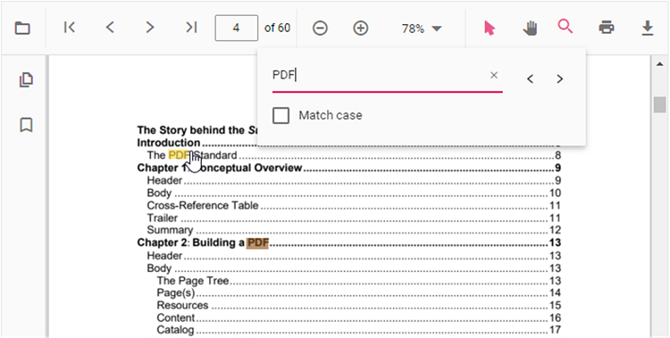

# Text Search in Angular PDF Viewer component

The Text Search option in PDF Viewer is used to find and highlight the text content from the document. You can enable/disable the text search using the following code snippet.




import { Component, OnInit } from '@angular/core';
import { LinkAnnotationService, BookmarkViewService, MagnificationService,
         ThumbnailViewService, ToolbarService, NavigationService,
         TextSearchService, AnnotationService, TextSelectionService, 
         PrintService
       } from '@syncfusion/ej2-angular-pdfviewer';
@Component({
  selector: 'app-container',
  // specifies the template string for the PDF Viewer component
  template: `

                <ejs-pdfviewer id="pdfViewer"
                              [documentPath]='document'
                              [enableTextSearch]='true'
                              style="height:640px;display:block">
                </ejs-pdfviewer>
            
`,
  providers: [ LinkAnnotationService, BookmarkViewService, MagnificationService,
               ThumbnailViewService, ToolbarService, NavigationService,
               AnnotationService, TextSearchService, TextSelectionService,
               PrintService]
  })
  export class AppComponent implements OnInit {
      public document = 'https://cdn.syncfusion.com/content/pdf/pdf-succinctly.pdf';
  }





import { Component, OnInit } from '@angular/core';
import { LinkAnnotationService, BookmarkViewService, MagnificationService,
         ThumbnailViewService, ToolbarService, NavigationService,
         TextSearchService, AnnotationService, TextSelectionService, 
         PrintService
       } from '@syncfusion/ej2-angular-pdfviewer';
@Component({
  selector: 'app-container',
  // specifies the template string for the PDF Viewer component
  template: `

                <ejs-pdfviewer id="pdfViewer"
                              [serviceUrl]='service'
                              [documentPath]='document'
                              [enableTextSearch]='true'
                              style="height:640px;display:block">
                </ejs-pdfviewer>
            
`,
  providers: [ LinkAnnotationService, BookmarkViewService, MagnificationService,
               ThumbnailViewService, ToolbarService, NavigationService,
               AnnotationService, TextSearchService, TextSelectionService,
               PrintService]
  })
  export class AppComponent implements OnInit {
      public service = 'https://services.syncfusion.com/angular/production/api/pdfviewer';
      public document = 'https://cdn.syncfusion.com/content/pdf/pdf-succinctly.pdf';
  }




## See also

* [Toolbar items](./toolbar)
* [Feature Modules](./feature-module)