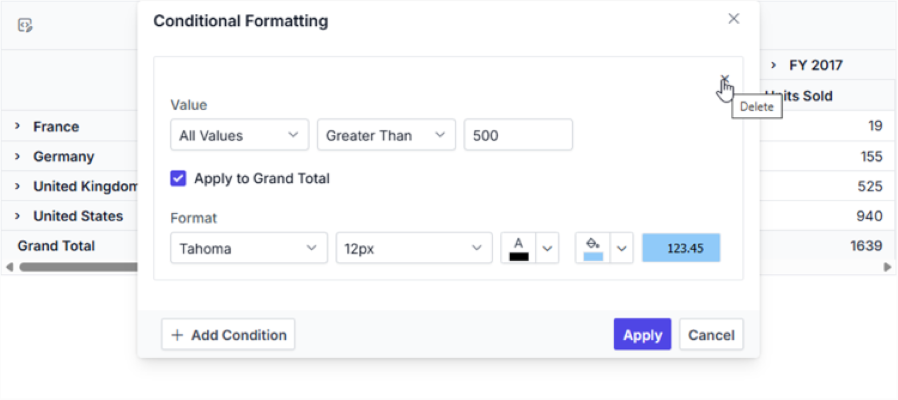

# Conditional formatting in Angular Pivotview component

The conditional formatting feature enables users to customize the appearance of pivot table value cells by modifying background color, font color, font family, and font size based on specific conditions. This powerful visualization feature helps highlight important value cells and makes them stand out in the pivot table.

The conditional formatting can be applied at runtime through the built-in dialog, invoked from the toolbar. To enable this functionality, set the [allowConditionalFormatting](https://ej2.syncfusion.com/angular/documentation/api/pivotview/index-default#allowconditionalformatting) and [showToolbar](https://ej2.syncfusion.com/angular/documentation/api/pivotview/index-default#showtoolbar) properties to **true**. Additionally, include the **ConditionalFormatting** item within the [toolbar](https://ej2.syncfusion.com/angular/documentation/api/pivotview/index-default#toolbar) property. Users will see the "Conditional Formatting" icon in the toolbar UI automatically, which opens the formatting dialog when clicked.










  


## Configure conditional formatting through code-behind

Conditional formatting can also be applied programmatically during component initialization using the [conditionalFormatSettings](https://ej2.syncfusion.com/angular/documentation/api/pivotview/conditionalformatsettings) property in the [`dataSourceSettings`](https://ej2.syncfusion.com/angular/documentation/api/pivotview/datasourcesettings). This approach allows you to define formatting rules directly in the code-behind, ensuring that specific styling conditions are automatically applied when the pivot table loads. The required properties to apply a new conditional formatting are,

* [applyGrandTotals](https://ej2.syncfusion.com/angular/documentation/api/pivotview/conditionalformatsettings#applygrandtotals): This boolean property allows you to restrict conditional formatting for grand totals in the row and column axes. By default, this property is set to true.
* [measure](https://ej2.syncfusion.com/angular/documentation/api/pivotview/conditionalformatsettings#measure): Specifies the value field name for which style will be applied.
* [conditions](https://ej2.syncfusion.com/angular/documentation/api/pivotview/conditionalformatsettings#conditions): Defines the operator type used for conditional formatting, such as equals, greater than, less than, etc.
* [value1](https://ej2.syncfusion.com/angular/documentation/api/pivotview/conditionalformatsettings#value1): Specifies the starting value for the conditional formatting.
* [value2](https://ej2.syncfusion.com/angular/documentation/api/pivotview/conditionalformatsettings#value2): Specifies the ending value for the conditional formatting range. This property is applicable only for conditions like **Between** and **NotBetween**.
* [style](https://ej2.syncfusion.com/angular/documentation/api/pivotview/conditionalformatsettings#style): Specifies the custom styling applied to the cell.

The [style](https://ej2.syncfusion.com/angular/documentation/api/pivotview/style) object includes the following properties, which you can use to customize the appearance of value cells:

* [backgroundColor](https://ej2.syncfusion.com/angular/documentation/api/pivotview/style#backgroundcolor): It allows to set the background color to the value cell in the pivot table.
* [color](https://ej2.syncfusion.com/angular/documentation/api/pivotview/style#color): It allows to set the font color to the value cell in the pivot table.
* [fontFamily](https://ej2.syncfusion.com/angular/documentation/api/pivotview/style#fontfamily): It allows to set the font family to the value cell in the pivot table.
* [fontSize](https://ej2.syncfusion.com/angular/documentation/api/pivotview/style#fontsize): It allows to set the font size to the value cell in the pivot table.

## Opening conditional formatting dialog programmatically

Users can also access the conditional formatting dialog through external UI elements by calling the `showConditionalFormattingDialog` method. In the following example, an external button is used to open the conditional formatting dialog programmatically.

To enable conditional formatting, the `ConditionalFormattingService` must be added to the `@NgModule.providers` section.










  


## Conditional formatting for all fields

The Pivot Table component allows you to apply conditional formatting to all value fields simultaneously. This approach ensures consistent highlighting and styling of value cells across the entire pivot table, removing the need to configure formatting for each value field individually.

To format all value fields together, use the [conditionalFormatSettings](https://ej2.syncfusion.com/angular/documentation/api/pivotview/conditionalformatsettings) property without specifying the [measure](https://ej2.syncfusion.com/angular/documentation/api/pivotview/conditionalformatsettings#measure) property. When the [measure](https://ej2.syncfusion.com/angular/documentation/api/pivotview/conditionalformatsettings#measure) property is omitted, the formatting rules are automatically applied to every value field in your pivot table, resulting in a uniform appearance for all value cells.










  


## Conditional formatting for specific value field

To apply conditional formatting exclusively to a particular value field, set the [measure](https://ej2.syncfusion.com/angular/documentation/api/pivotview/conditionalformatsettings#measure) property with the specific value field name in [conditionalFormatSettings](https://ej2.syncfusion.com/angular/documentation/api/pivotview/conditionalformatsettings#measure).










  


## Editing and removing existing conditional format

Editing and removing existing conditional format can be done through the UI at runtime. To do so, open the conditional formatting dialog and edit the "Value", "Condition" and "Format" options based on user requirement and click "OK". To remove a conditional format, click the "Delete" icon besides the respective condition.  

## Event

### ConditionalFormatting

The [conditionalFormatting](https://ej2.syncfusion.com/angular/documentation/api/pivotview/index-default#conditionalformatting) event is triggered when the “ADD CONDITION” button is clicked in the conditional formatting dialog, enabling users to define custom conditions instead of default conditions at runtime. To utilize this event, the [allowConditionalFormatting](https://ej2.syncfusion.com/angular/documentation/api/pivotview/index-default#allowconditionalformatting) property of the Pivot Table component must be set to **true**. This event provides the following parameters:

* `applyGrandTotals` - Allows to apply conditional formatting to the grand totals of row and column axis in the pivot table.
* `conditions` - Allows you to choose the operator type such as equals, greater than, less than, etc. for conditional formatting.
* `label` - Allows to set the header text of a specific row/column field to apply conditional formatting.
* `measure` - Allows to set the value field name to apply conditional formatting.
* `style` - Allows to set the custom styles for the formatting applied values in the pivot table.
* `value1` - Allows you to set the start value for applying conditional formatting.
* `value2` - Allows you to set the end value for applying conditional formatting. This property is applicable only for conditions like **Between** and **NotBetween**.










  


## See Also

* [Apply conditional formatting for specific row or column](./how-to/apply-conditional-formatting-for-specific-row-or-column)