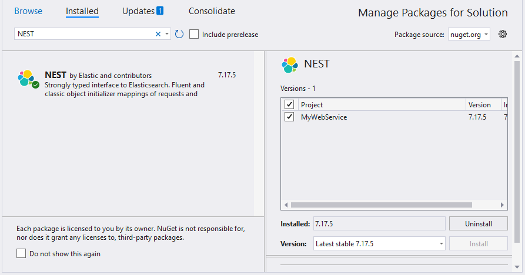
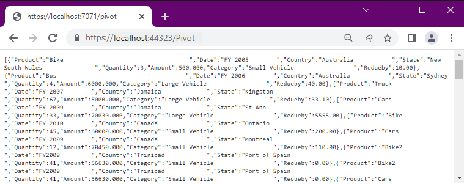
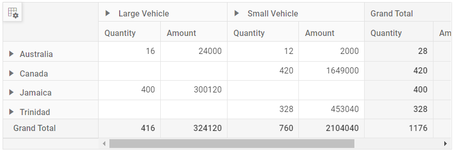

# Elasticsearch in EJ2 Angular Pivotview Component

This guide explains how to connect an Elasticsearch database to the Pivot Table component using the [NEST](https://www.nuget.org/packages/Nest) library and a Web API controller to fetch and bind data to the Pivot Table.

## Create a Web API service to fetch Elasticsearch data

Follow these steps to create a Web API service that retrieves data from an Elasticsearch database and prepares it for the Pivot Table.

### Step 1: Create an ASP.NET Core Web Application
1. Open Visual Studio and create a new **ASP.NET Core Web App** project named **MyWebService**.
2. Follow the instructions in the [Microsoft documentation](https://learn.microsoft.com/en-us/visualstudio/get-started/csharp/tutorial-aspnet-core?view=vs-2022) to set up the project.


### Step 2: Install the NEST NuGet Package
1. Open the **NuGet Package Manager** in your project solution.
2. Search for the **NEST** package and install it to enable connectivity with the Elasticsearch server.



### Step 3: Create a Web API Controller
1. In the **Controllers** folder, create a new Web API controller named **PivotController.cs**.
2. This controller will facilitate data communication between the Elasticsearch database and the Pivot Table.

### Step 4: Configure Elasticsearch Connection
1. In the **PivotController.cs** file, use the **ElasticClient** class from the NEST library to establish a connection to the Elasticsearch database.
2. Use the **Search** method to query an Elasticsearch index and retrieve data.

### Step 5: Implement Data Retrieval Logic
1. In the **PivotController.cs** file, define a **Get()** method that calls the **FetchElasticsearchData** method to retrieve data from Elasticsearch.
2. Serialize the retrieved data into JSON format using **JsonConvert.SerializeObject()**.

Here’s the sample code for the **PivotController.cs** file:

```csharp
    using Microsoft.AspNetCore.Mvc;
    using Nest;
    using Newtonsoft.Json;

    namespace MyWebService.Controllers
    {
        [ApiController]
        [Route("[controller]")]
        public class PivotController : ControllerBase
        {
            [HttpGet(Name = "GetElasticSearchData")]
            public object Get()
            {
                return JsonConvert.SerializeObject(FetchElasticsearchData());
            }

            private static object FetchElasticsearchData()
            {
                // Replace with your Elasticsearch connection string.
                var connectionString = "<Enter your valid connection string here>";
                var uri = new Uri(connectionString);
                var connectionSettings = new ConnectionSettings(uri);
                var client = new ElasticClient(connectionSettings);
                var searchResponse = client.Search<object>(s => s
                    .Index("product")
                    .Size(1000)
                );
                return searchResponse.Documents;
            }
        }
    }

```

### Step 6: Run the Web Application
1. Build and run the web application.
2. The application will be hosted at the URL `https://localhost:44323`.

### Step 7: Verify the Data
1. Access the Web API endpoint at `https://localhost:44323/Pivot` to view the JSON data retrieved from the Elasticsearch database.
2. The browser will display the JSON data, as shown below.



## Connecting the Pivot Table to an Elasticsearch Database Using the Web API Service

This section explains how to connect the Pivot Table component to an Elasticsearch database by retrieving data from the Web API service created in the previous section.

### Step 1: Create a Pivot Table in Angular
1. Set up a basic Angular Pivot Table by following the [Getting Started](../getting-started) documentation.
2. Ensure your Angular project is configured with the necessary EJ2 Pivot Table dependencies.

### Step 2: Configure the Web API URL in the Pivot Table
1. In the **app.component.ts** file, map the Web API URL (`https://localhost:44323/Pivot`) to the Pivot Table using the [url](https://ej2.syncfusion.com/angular/documentation/api/pivotview/datasourcesettings#url) property within the [dataSourceSettings](https://ej2.syncfusion.com/angular/documentation/api/pivotview/datasourcesettings).
2. Below is the sample code to configure the Pivot Table to fetch data from the Web API:

```typescript
import { Component, OnInit } from '@angular/core';
import { FieldListService, IDataSet } from '@syncfusion/ej2-angular-pivotview';
import { DataSourceSettingsModel } from '@syncfusion/ej2-pivotview/src/model/datasourcesettings-model';

@Component({
    selector: 'app-root',
    template: `<ejs-pivotview #pivotview id='PivotView' height='350' [dataSourceSettings]=dataSourceSettings></ejs-pivotview>`,
    providers: [FieldListService]
})
export class AppComponent implements OnInit {
    public pivotData: IDataSet[] | undefined;
    public dataSourceSettings: DataSourceSettingsModel | undefined;

    ngOnInit(): void {
        this.dataSourceSettings = {
            url: 'https://localhost:44323/Pivot'
            // Additional configuration will be added in the next step
        };
    }
}
```

### Step 3: Define the Pivot Table Report
1. Configure the Pivot Table report in the **app.component.ts** file to structure the data retrieved from the Elasticsearch database.
2. Add fields to the [rows](https://ej2.syncfusion.com/angular/documentation/api/pivotview/datasourcesettings#row), [columns](https://ej2.syncfusion.com/angular/documentation/api/pivotview/datasourcesettings#columns), [values](https://ej2.syncfusion.com/angular/documentation/api/pivotview/datasourcesettings#values), and [filters](https://ej2.syncfusion.com/angular/documentation/api/pivotview/datasourcesettings#filters) properties of [dataSourceSettings](https://ej2.syncfusion.com/angular/documentation/api/pivotview/datasourcesettings) to define the report structure, specifying how data fields are organized and aggregated in the Pivot Table.
3. Enable the field list by setting the [showFieldList](https://ej2.syncfusion.com/angular/documentation/api/pivotview/index-default#showfieldlist) property to **true** and including the `FieldListService` module in the providers section. This allows users to dynamically add or rearrange fields across the columns, rows, and values axes using an interactive user interface.

Here’s the updated sample code for **app.component.ts** with the report configuration and field list support:

```typescript
import { Component, OnInit } from '@angular/core';
import { FieldListService, IDataSet } from '@syncfusion/ej2-angular-pivotview';
import { DataSourceSettingsModel } from '@syncfusion/ej2-pivotview/src/model/datasourcesettings-model';

@Component({
    selector: 'app-root',
    template: `<ejs-pivotview #pivotview id='PivotView' height='350' [dataSourceSettings]=dataSourceSettings [showFieldList]="true"></ejs-pivotview>`,
    providers: [FieldListService]
})
export class AppComponent implements OnInit {
    public pivotData: IDataSet[] | undefined;
    public dataSourceSettings: DataSourceSettingsModel | undefined;

    ngOnInit(): void {

        this.dataSourceSettings = {
            url: 'https://localhost:44323/Pivot',
            expandAll: false,
            enableSorting: true,
            columns: [{ name: 'Product' }],
            values: [
                { name: 'Quantity' },
                { name: 'Amount', caption: 'Sold Amount' }
            ],
            rows: [
                { name: 'Country' },
                { name: 'State' }
            ],
            formatSettings: [{ name: 'Amount', format: 'C0' }],
            filters: []
        };
    }
}

```

### Step 4: Run and Verify the Pivot Table
1. Run the Angular application.
2. The Pivot Table will display the data fetched from the Elasticsearch database via the Web API, structured according to the defined report.
3. The resulting Pivot Table will look like this:



### Additional Resources
Explore a complete example of the Angular Pivot Table integrated with an ASP.NET Core Web Application to fetch data from an Elasticsearch database in this [GitHub](https://github.com/SyncfusionExamples/how-to-bind-Elasticsearch-database-to-pivot-table) repository.