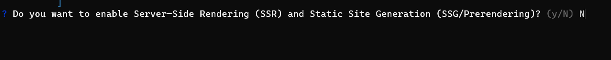
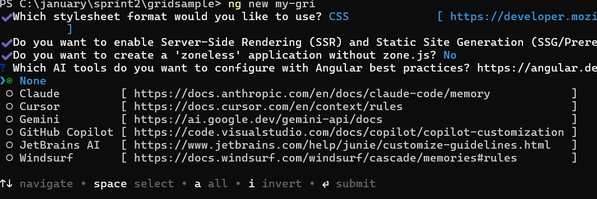

# Getting started with Angular Pivotview component

The [Pivot Table component](https://www.syncfusion.com/angular-components/angular-pivot-table) allows you to transform and analyze data by organizing it into a meaningful tabular format with interactive features. This section provides a step-by-step guide to help you create a simple pivot table and understand the basic usage of the Pivot Table component in an Angular environment.

> **Ready to streamline your Syncfusion<sup style="font-size:70%">&reg;</sup> Angular development?** Discover the full potential of Syncfusion<sup style="font-size:70%">&reg;</sup> Angular components with Syncfusion<sup style="font-size:70%">&reg;</sup> AI Coding Assistant. Effortlessly integrate, configure, and enhance your projects with intelligent, context-aware code suggestions, streamlined setups, and real-time insights—all seamlessly integrated into your preferred AI-powered IDEs like VS Code, Cursor, Syncfusion<sup style="font-size:70%">&reg;</sup> CodeStudio and more. [Explore Syncfusion<sup style="font-size:70%">&reg;</sup> AI Coding Assistant](https://ej2.syncfusion.com/angular/documentation/ai-coding-assistant/overview)

To get started quickly with Angular Pivot Table, you can watch this video:



## Setup Angular Environment

Setting up the Angular environment properly ensures smooth development and deployment of your Pivot Table application. To streamline this process, you can use the [`Angular CLI`](https://github.com/angular/angular-cli), which provides a comprehensive toolkit for Angular application development.

Install Angular CLI globally on your system using the following command:

```bash
npm install -g @angular/cli
```

### Installing a Specific Version

To install a particular version of Angular CLI, use:

```bash
npm install -g @angular/cli@21.0.0
```

## Create an Angular Application

Creating a new Angular application provides the foundation for integrating the Syncfusion Angular Pivot Table component. With Angular CLI installed, you can now generate a new project using the command below:

```bash
ng new my-app
```

This command will prompt you for a few settings for the new project, such as whether to add Angular routing and which stylesheet format to use.

```bash

? Which stylesheet format would you like to use? (Use arrow keys)
> CSS             [ https://developer.mozilla.org/docs/Web/CSS                     ]
  Sass (SCSS)     [ https://sass-lang.com/documentation/syntax#scss                ]
  Sass (Indented) [ https://sass-lang.com/documentation/syntax#the-indented-syntax ]
  Less            [ http://lesscss.org                                             ]

```

* By default, a CSS-based application is created. Use SCSS if required:

```bash
ng new my-app --style=scss
```

* During project setup, when prompted for the Server-side rendering (SSR) option, choose the appropriate configuration.



* Select the required AI tool or 'none' if you do not need any AI tool.



Once the project is created, navigate to the project folder to begin working with your new Angular application:

```bash
cd my-app
```

## Dependencies

Understanding the dependency structure helps you identify the required packages for implementing the Pivot Table component effectively in your Angular application. The Pivot Table component relies on a structured hierarchy of dependencies that provide essential functionality for data processing, user interface elements, and export capabilities.

The following dependency tree shows the required packages for the Angular Pivot Table component:

```javascript
|-- @syncfusion/ej2-angular-pivotview
    |-- @syncfusion/ej2-base
    |-- @syncfusion/ej2-data
    |-- @syncfusion/ej2-pivotview
        |-- @syncfusion/ej2-buttons
        |-- @syncfusion/ej2-dropdowns
        |-- @syncfusion/ej2-excel-export
          |-- @syncfusion/ej2-file-utils
          |-- @syncfusion/ej2-compression
        |-- @syncfusion/ej2-pdf-export
          |-- @syncfusion/ej2-file-utils
          |-- @syncfusion/ej2-compression
        |-- @syncfusion/ej2-grids
        |-- @syncfusion/ej2-inputs
        |-- @syncfusion/ej2-lists
        |-- @syncfusion/ej2-navigations
        |-- @syncfusion/ej2-popups
|-- @syncfusion/ej2-angular-base
```

The main package `@syncfusion/ej2-angular-pivotview` serves as the primary Angular wrapper for the Pivot Table component. This package automatically includes all the necessary sub-dependencies shown in the tree structure above. When you install the main package, npm will automatically resolve and install these dependencies, ensuring your Pivot Table component functions properly with all its supported operations, including data binding, user interactions, and export options.

## Installing Syncfusion<sup style="font-size:70%">&reg;</sup> PivotView package

To build interactive PivotTable in Angular, you need to install the Syncfusion<sup style="font-size:70%">&reg;</sup> PivotTable package. Syncfusion packages are available on npm as `@syncfusion` scoped packages. You can find all Syncfusion Angular packages in the npm [registry](https://www.npmjs.com/search?q=@syncfusion/ej2-angular-).

Syncfusion<sup style="font-size:70%">&reg;</sup> offers two distinct package structures to accommodate different Angular development environments and ensure compatibility across various Angular versions:

1. **Ivy Library Distribution Package** - Modern format for Angular 12 and above
2. **Angular Compatibility Compiler (ngcc) Package** - Legacy support for Angular versions below 12

### Ivy library distribution package

The Ivy library distribution package represents the modern approach to Angular development, designed specifically for the Angular [Ivy](https://v12.angular.io/guide/ivy) rendering engine. This package format offers improved performance, smaller bundle sizes, and an enhanced development experience for applications built with Angular 12 and later versions.

Syncfusion<sup style="font-size:70%">&reg;</sup> Angular packages (version 20.2.36 and above) utilize the Ivy distribution format to ensure full compatibility with Angular's latest rendering capabilities. To install the Ivy-compatible package, add the [`@syncfusion/ej2-angular-pivotview`](https://www.npmjs.com/package/@syncfusion/ej2-angular-pivotview/v/20.2.38) package to your application using the following command:

```bash
npm install @syncfusion/ej2-angular-pivotview --save
```

### Angular compatibility compiled package(ngcc)

For projects using Angular versions below 12, the Angular Compatibility Compiler (ngcc) package ensures seamless integration with the legacy Angular compilation and rendering pipeline. This package maintains full functionality while supporting older Angular environments that have not yet migrated to the Ivy rendering engine.

To install the ngcc-compatible package, add the [`@syncfusion/ej2-angular-pivotview@ngcc`](https://www.npmjs.com/package/@syncfusion/ej2-angular-pivotview/v/20.2.38-ngcc) package to your application:

```bash
npm install @syncfusion/ej2-angular-pivotview@ngcc --save
```

When specifying the ngcc package in your `package.json` file, include the `-ngcc` suffix with the package version as shown below:

```json
"@syncfusion/ej2-angular-pivotview": "20.2.38-ngcc"
```

> **Note**: Installing the package without the `-ngcc` suffix will automatically install the Ivy library package, which may generate compatibility warnings in Angular versions below 12. If you have further questions regarding ngcc compatibility, please refer to the following [FAQ](https://ej2.syncfusion.com/angular/documentation/common/troubleshooting/ngcc-compatibility).

## Adding CSS reference

Adding the required CSS files ensures that your Angular Pivot Table component displays with the proper styling and visual elements. These CSS files contain the necessary styles for all dependent components to render correctly.

The following CSS files are available in the `../node_modules/@syncfusion` package folder. Add these CSS imports to your **src/styles.css** file to apply the tailwind3 theme styling:

```css
@import '../node_modules/@syncfusion/ej2-base/styles/material3.css';
@import '../node_modules/@syncfusion/ej2-buttons/styles/material3.css';
@import '../node_modules/@syncfusion/ej2-dropdowns/styles/material3.css';
@import '../node_modules/@syncfusion/ej2-grids/styles/material3.css';
@import '../node_modules/@syncfusion/ej2-inputs/styles/material3.css';
@import '../node_modules/@syncfusion/ej2-lists/styles/material3.css';
@import '../node_modules/@syncfusion/ej2-navigations/styles/material3.css';
@import '../node_modules/@syncfusion/ej2-popups/styles/material3.css';
@import "../node_modules/@syncfusion/ej2-splitbuttons/styles/material3.css";
@import '../node_modules/@syncfusion/ej2-angular-pivotview/styles/material3.css';
```

## Browser compatibility

The Pivot Table component provides broad browser compatibility to ensure your application works seamlessly across different environments. For optimal performance in Internet Explorer 11, you will need to include specific polyfills in your Angular application.

To add the necessary polyfills, refer to the comprehensive [browser support documentation](https://ej2.syncfusion.com/angular/documentation/browser), which provides detailed instructions for configuring polyfills and ensuring compatibility across all supported browsers.

## Initializing pivot table component in an application

Setting up the Pivot Table component in your Angular application is straightforward and allows you to create powerful data analysis interfaces with minimal configuration. The component integrates seamlessly with Angular's component architecture and provides a robust foundation for data visualization.

To initialize the Pivot Table component, add the following code to your **src/app/app.ts** file. This example demonstrates how to set up the basic component structure using the `<ejs-pivotview>` selector:

```typescript
import { PivotViewAllModule, PivotFieldListAllModule } from '@syncfusion/ej2-angular-pivotview'
import { Component, OnInit } from '@angular/core';
import { IDataSet } from '@syncfusion/ej2-angular-pivotview';
import { DataSourceSettingsModel } from '@syncfusion/ej2-pivotview/src/model/datasourcesettings-model';

@Component({
  imports: [        
    PivotViewAllModule,
    PivotFieldListAllModule
  ],
  standalone: true,
  selector: 'app-root',
  // specifies the template string for the pivot table component
  template: `<ejs-pivotview #pivotview id='PivotView' height='350'></ejs-pivotview>`
})
export class App implements OnInit {
    public pivotData!: IDataSet[];
    public dataSourceSettings!: DataSourceSettingsModel;

    ngOnInit(): void {
    }
}
```

## Assigning sample data to the pivot table

Providing appropriate data to the Pivot Table component enables users to perform meaningful analysis and generate actionable insights from their datasets. To achieve this, the Pivot Table component requires a well-structured data source that contains the information you want to analyze and visualize.

For demonstration purposes, we'll use a collection of objects containing sales details for various products across different periods and regions. This sample data is assigned to the Pivot Table component through the [`dataSource`](https://ej2.syncfusion.com/angular/documentation/api/pivotview/datasourcesettings#datasource) property under the [`dataSourceSettings`](https://ej2.syncfusion.com/angular/documentation/api/pivotview/datasourcesettings) configuration.

```typescript
import { PivotViewAllModule, PivotFieldListAllModule } from '@syncfusion/ej2-angular-pivotview'
import { Component, OnInit } from '@angular/core';
import { IDataSet } from '@syncfusion/ej2-angular-pivotview';
import { DataSourceSettingsModel } from '@syncfusion/ej2-pivotview/src/model/datasourcesettings-model';

@Component({
  imports: [        
    PivotViewAllModule,
    PivotFieldListAllModule
  ],
  standalone: true,
  selector: 'app-root',
  // specifies the template string for the Pivot Table component
  template: `<ejs-pivotview #pivotview id='PivotView' height='350' [dataSourceSettings]=dataSourceSettings></ejs-pivotview>`
})
export class App implements OnInit {
    public pivotData!: IDataSet[];
    public dataSourceSettings!: DataSourceSettingsModel;

    ngOnInit(): void {
        this.pivotData = [
            { 'Sold': 31, 'Amount': 52824, 'Country': 'France', 'Products': 'Mountain Bikes', 'Year': 'FY 2015', 'Quarter': 'Q1' },
            { 'Sold': 51, 'Amount': 86904, 'Country': 'France', 'Products': 'Mountain Bikes', 'Year': 'FY 2015', 'Quarter': 'Q2' },
            { 'Sold': 90, 'Amount': 153360, 'Country': 'France', 'Products': 'Mountain Bikes', 'Year': 'FY 2015', 'Quarter': 'Q3' },
            { 'Sold': 25, 'Amount': 42600, 'Country': 'France', 'Products': 'Mountain Bikes', 'Year': 'FY 2015', 'Quarter': 'Q4' },
            { 'Sold': 27, 'Amount': 46008, 'Country': 'France', 'Products': 'Mountain Bikes', 'Year': 'FY 2016', 'Quarter': 'Q1' }
        ];

        this.dataSourceSettings = {
            dataSource: this.pivotData
        };
    }
}
```

## Adding fields to row, column, value and filter axes

Organizing fields into appropriate axes transforms raw data into a structured, meaningful Pivot Table that enables users to analyze patterns and trends effectively. With the Pivot Table now initialized and populated with sample data, the next logical step involves organizing the appropriate fields into row, column, value, and filter axes to create a functional data analysis tool.

In the [`dataSourceSettings`](https://ej2.syncfusion.com/angular/documentation/api/pivotview/datasourcesettings) configuration, four primary axes play a crucial role in defining and organizing fields from the bound data source to render the Pivot Table component in the desired format.

**Understanding the four axes:**

- [`rows`](https://ej2.syncfusion.com/angular/documentation/api/pivotview/datasourcesettings#rows) – Collection of fields that will be displayed along the row axis of the Pivot Table.

- [`columns`](https://ej2.syncfusion.com/angular/documentation/api/pivotview/datasourcesettings#columns) – Collection of fields that will be displayed along the column axis of the Pivot Table.

- [`values`](https://ej2.syncfusion.com/angular/documentation/api/pivotview/datasourcesettings#values) – Collection of fields that will be displayed as aggregated numeric values within the Pivot Table.

- [`filters`](https://ej2.syncfusion.com/angular/documentation/api/pivotview/datasourcesettings#filters) – Collection of fields that act as master filters over the data bound to the row, column, and value axes of the Pivot Table.

**Essential field properties:**

To define each field in its respective axis, configure the following basic properties:

* [`name`](https://ej2.syncfusion.com/angular/documentation/api/pivotview/fieldoptionsmodel#name): Sets the field name from the bound data source. The casing must match exactly as it appears in the data source, otherwise the Pivot Table will not render correctly.

* [`caption`](https://ej2.syncfusion.com/angular/documentation/api/pivotview/fieldoptionsmodel#caption): Sets the field caption, which serves as the display name for the field in the Pivot Table.

* [`type`](https://ej2.syncfusion.com/angular/documentation/api/pivotview/fieldoptionsmodel#type): Sets the summary type for the field. By default, the **Sum** aggregation is applied.

In this example, "Year" and "Quarter" are positioned in the column axis, "Country" and "Products" are placed in the row axis, and "Sold" and "Amount" are configured as values respectively.

```typescript
import { PivotViewAllModule, PivotFieldListAllModule } from '@syncfusion/ej2-angular-pivotview'
import { Component, OnInit } from '@angular/core';
import { IDataSet } from '@syncfusion/ej2-angular-pivotview';
import { DataSourceSettingsModel } from '@syncfusion/ej2-pivotview/src/model/datasourcesettings-model';

@Component({
  imports: [        
    PivotViewAllModule,
    PivotFieldListAllModule
  ],
  standalone: true,
  selector: 'app-root',
  // specifies the template string for the Pivot Table component
  template: `<ejs-pivotview #pivotview id='PivotView' height='350' [dataSourceSettings]=dataSourceSettings></ejs-pivotview>`
})
export class App implements OnInit {
    public pivotData!: IDataSet[];
    public dataSourceSettings!: DataSourceSettingsModel;

    ngOnInit(): void {
        this.pivotData = [
            { 'Sold': 31, 'Amount': 52824, 'Country': 'France', 'Products': 'Mountain Bikes', 'Year': 'FY 2015', 'Quarter': 'Q1' },
            { 'Sold': 51, 'Amount': 86904, 'Country': 'France', 'Products': 'Mountain Bikes', 'Year': 'FY 2015', 'Quarter': 'Q2' },
            { 'Sold': 90, 'Amount': 153360, 'Country': 'France', 'Products': 'Mountain Bikes', 'Year': 'FY 2015', 'Quarter': 'Q3' },
            { 'Sold': 25, 'Amount': 42600, 'Country': 'France', 'Products': 'Mountain Bikes', 'Year': 'FY 2015', 'Quarter': 'Q4' },
            { 'Sold': 27, 'Amount': 46008, 'Country': 'France', 'Products': 'Mountain Bikes', 'Year': 'FY 2016', 'Quarter': 'Q1' }
        ];

        this.dataSourceSettings = {
            dataSource: this.pivotData,
            expandAll: false,
            columns: [{ name: 'Year', caption: 'Production Year' }, { name: 'Quarter' }],
            values: [{ name: 'Sold', caption: 'Units Sold' }, { name: 'Amount', caption: 'Sold Amount' }],
            rows: [{ name: 'Country' }, { name: 'Products' }]
        };
    }
}
```

## Applying formatting to a value field

Formatting allows you to present numerical data in a more readable and meaningful way, making your Pivot Table more user-friendly and professional. For example, you can display amount values with currency symbols or show numerical values with specific decimal places.

To apply formatting to value fields in the Pivot Table, use the [`formatSettings`](https://ej2.syncfusion.com/angular/documentation/api/pivotview/formatsettings) property. This property accepts an array of format objects, where each object defines formatting rules for a specific field in your data.

Within each format object in the [`formatSettings`](https://ej2.syncfusion.com/angular/documentation/api/pivotview/formatsettings) array, set the [`name`](https://ej2.syncfusion.com/angular/documentation/api/pivotview/formatsettings#name) property to match the exact field name from your value section. Then, specify the desired display format using the [`format`](https://ej2.syncfusion.com/angular/documentation/api/pivotview/formatsettings#format) property. In the example below, the **Amount** field is configured to display values in currency format using the "C0" pattern, which shows currency symbols without decimal places.

> **Note:** Formatting can only be applied to numeric fields in the value section of the Pivot Table.

```typescript
import { PivotViewAllModule, PivotFieldListAllModule } from '@syncfusion/ej2-angular-pivotview'
import { Component, OnInit } from '@angular/core';
import { IDataSet } from '@syncfusion/ej2-angular-pivotview';
import { DataSourceSettingsModel } from '@syncfusion/ej2-pivotview/src/model/datasourcesettings-model';

@Component({
imports: [        
        PivotViewAllModule,
        PivotFieldListAllModule
    ],
  standalone: true,
  selector: 'app-root',
  // specifies the template string for the pivot table component
  template: `<ejs-pivotview #pivotview id='PivotView' height='350' [dataSourceSettings]=dataSourceSettings></ejs-pivotview>`
})
export class App implements OnInit {
    public pivotData!: IDataSet[];
    public dataSourceSettings!: DataSourceSettingsModel;

    ngOnInit(): void {

        this.pivotData = [
                { 'Sold': 31, 'Amount': 52824, 'Country': 'France', 'Products': 'Mountain Bikes', 'Year': 'FY 2015', 'Quarter': 'Q1' },
                { 'Sold': 51, 'Amount': 86904, 'Country': 'France', 'Products': 'Mountain Bikes', 'Year': 'FY 2015', 'Quarter': 'Q2' },
                { 'Sold': 90, 'Amount': 153360, 'Country': 'France', 'Products': 'Mountain Bikes', 'Year': 'FY 2015', 'Quarter': 'Q3' },
                { 'Sold': 25, 'Amount': 42600, 'Country': 'France', 'Products': 'Mountain Bikes', 'Year': 'FY 2015', 'Quarter': 'Q4' },
                { 'Sold': 27, 'Amount': 46008, 'Country': 'France', 'Products': 'Mountain Bikes', 'Year': 'FY 2016', 'Quarter': 'Q1' }];

        this.dataSourceSettings = {
            dataSource: this.pivotData,
            expandAll: false,
            columns: [{ name: 'Year', caption: 'Production Year' }, { name: 'Quarter' }],
            values: [{ name: 'Sold', caption: 'Units Sold' }, { name: 'Amount', caption: 'Sold Amount' }],
            rows: [{ name: 'Country' }, { name: 'Products' }],
            formatSettings: [{ name: 'Amount', format: 'C0' }],
            filters: []
        };
    }
}
```

This approach allows you to apply different formatting patterns to multiple value fields by adding additional objects to the [`formatSettings`](https://ej2.syncfusion.com/angular/documentation/api/pivotview/formatsettings) array. Each object in the array can target a different field, giving you complete control over how your numerical data appears in the Pivot Table.

## Module Injection

Module injection enhances the Pivot Table by providing access to additional functionality through specialized service modules. To enable specific features in your Pivot Table implementation, inject the required service modules into your Angular application.

The following service modules are available to extend the basic Pivot Table functionality:

* **GroupingBarService** - Inject this module to enable the grouping bar, which allows users to drag and drop fields between different axes of the pivot table.
* **FieldListService** - Inject this module to enable the field list, providing an interactive interface for users to add, remove, and rearrange fields dynamically.
* **CalculatedFieldService** - Inject this module to enable calculated fields, allowing users to create custom formulas and expressions for data analysis.

To make these services available in your application, inject them into the `providers` section of your root `NgModule` or component class. By injecting only the modules you need, your application loads faster and uses fewer resources, as unnecessary service code is excluded from the final bundle.

```typescript
providers: [GroupingBarService, FieldListService, CalculatedFieldService]
```

> **Note:** Only inject the service modules that you plan to use in your application. This approach helps maintain optimal bundle size and application performance.

## Enable Field List

The field list enhances user interaction by allowing you to dynamically add, remove, and rearrange fields across different axes **including column, row, value, and filter axes**. This user-friendly interface also provides sorting and filtering options that can be applied at runtime without requiring code changes.

To enable the field list, set the [`showFieldList`](https://ej2.syncfusion.com/angular/documentation/api/pivotview/index-default#showfieldlist) property to **true** and inject the `FieldListService` module into your component. This combination activates the field list interface, making it accessible to users to modify PivotTable report settings. For comprehensive details about field list functionality, [`refer`](./field-list) to the dedicated field list documentation.

> The `FieldListService` module must be injected for the field list to render properly with the Pivot Table component. Without this service, the field list will not be available.














  


## Enable Grouping Bar

The grouping bar allows users to easily manage and modify the report settings of the Pivot Table directly through the user interface. With the grouping bar, users can instantly move fields between columns, rows, values, and filters by dragging them, allowing for quick arrangement and analysis of the data.

Users can also use the grouping bar to sort, filter, or remove fields quickly without needing to write any code. To enable the grouping bar, set the [`showGroupingBar`](https://ej2.syncfusion.com/angular/documentation/api/pivotview/index-default#showgroupingbar) property to **true**, and make sure to inject the `GroupingBarService` module in your application. For more details about using the grouping bar, see the [Grouping Bar documentation](./grouping-bar).

> The `GroupingBarService` module must be injected for the grouping bar to render properly with the Pivot Table component. Without this service, the grouping bar will not be available.














  


## Exploring Filter Axis

The filter axis helps users display only the most relevant information in the Pivot Table for easier analysis. Users can add fields to the filter axis, which act as a master filter over the data displayed in the row, column, and value axes. You can set these fields and their filter items in two ways: by configuring them in your [dataSourceSettings](https://ej2.syncfusion.com/angular/documentation/api/pivotview/datasourcesettings) through code, or by simply dragging and dropping fields from other axes to the filter axis using the grouping bar or the field list at runtime. This makes it easier to analyze targeted subsets of data without modifying the underlying structure of the Pivot Table.

The following example shows how to add fields to the filter axis in an Angular Pivot Table:














  


## Calculated field

The calculated field feature enables users to create custom value fields using mathematical formulas and existing fields from their data source. Users can perform complex calculations with basic arithmetic operators and seamlessly integrate these custom fields into their pivot table for enhanced data visualization and reporting.

Users can add calculated fields in two ways:
- **Using code:** Set up calculated fields through the [`calculatedFieldSettings`](https://ej2.syncfusion.com/angular/documentation/api/pivotview/index-default#calculatedfieldsettings) property when configuring the Pivot Table.
- **Using the user interface:** Alternatively, calculated fields can be added at runtime through a built-in dialog by setting the [`allowCalculatedField`](https://ej2.syncfusion.com/angular/documentation/api/pivotview/index-default#allowcalculatedfield) property to **true**. When enabled, a button appears in the Field List UI. Clicking this button opens a dialog that allows users to create, edit, or remove calculated fields at runtime. To learn more about calculated fields, [`refer`](./calculated-field) here.

> To use the calculated field dialog, make sure the `CalculatedFieldService` module is injected. If it is not injected, the popup dialog will not be shown with the Pivot Table.

> By default, calculated fields created through code-behind are only added to the field list and calculated field dialog UI. To display a calculated field in the Pivot Table UI, you must add it to the [`values`](https://ej2.syncfusion.com/angular/documentation/api/pivotview/datasourcesettings#values) property, as shown in the code below. Additionally, calculated fields can only be added to the value axis.

Below is a sample code that shows how to set up calculated fields both through code-behind and using the popup dialog:














  


## Run the application

Running the Pivot Table application allows you to see your changes and data in real time directly in the browser, making it easy to check your results.

To start the application, open a command prompt in your project folder and run the following command. This will compile the project and automatically open it in your browser.

```sh
ng serve --open
```

## Building in Production Mode

If you want to build and view the application in production mode, make sure to set **optimization** to **false** under the production configuration in your **angular.json** file. This change helps resolve Angular CLI–related issues in some cases.

```json
"configurations": {
  "production": {
    "optimization": false
  }
}
```

Additionally, when using Syncfusion Pivot Table, you need to increase the bundle size limits in the budgets array to prevent build failures. Update the `maximumWarning` and `maximumError` values to accommodate Syncfusion dependencies:

```json
"budgets": [
  {
    "type": "initial",
    "maximumWarning": "2MB",
    "maximumError": "5MB"
  }
]
```

Now run the application in production mode:

```sh
ng serve --configuration=production
```

Or use the shorter syntax:

```sh
ng serve -c production
```

















<!-- markdownlint-disable MD028 -->
> In Angular, the `ViewChild` method lets you access the Pivot Table component instance directly in your code. It has the following parameters:
> * `selector`: The name or directive type for querying the component.
> * `read`: Read a different token from the queried elements, if needed.
> * `static`: If set to **true**, resolves the query before change detection; if set to **false** (default), after change detection.
>
> For Angular versions below 8, the `static` parameter is optional:
>
> ```ts
> @ViewChild('pivotview')
> ```
>
> For Angular 8 and above, the `static` parameter is required:
>
> ```ts
> @ViewChild('pivotview', { static: false })
> ```

For more details and to access a ready-to-use project, see the [GitHub Repository](https://github.com/SyncfusionExamples/getting-started-with-the-angular-pivot-table-component-in-angular-18).

> You can also explore our [Angular Pivot Table example](https://ej2.syncfusion.com/angular/demos/#/tailwind3/pivot-table/default) to see an interactive sample with drill-up and drill-down options, and [API documentation](https://ej2.syncfusion.com/angular/documentation/api/pivotview/index-default) for more properties and methods.
