# Grouping in Angular Pivotview component

> This feature is applicable only for the relational data source.

Grouping is one of the most useful features in the pivot table component, automatically organizing date, time, number, and string data types into meaningful categories. For example, date fields can be formatted and displayed based on year, quarter, month, and other time periods. Similarly, number fields can be grouped into ranges, such as 1-5, 6-10, and so on. These grouped fields function as individual fields, allowing users to drag them between different axes including columns, rows, values, and filters to create dynamic pivot tables at runtime.

The grouping feature can be enabled by setting the [`allowGrouping`](https://ej2.syncfusion.com/angular/documentation/api/pivotview/#allowgrouping) property to **true** in the pivot table component.

To perform grouping actions through the user interface, right-click on the pivot table's row or column header and select **Group**. A dialog will appear where you can configure the appropriate options to group the data. To ungroup data, right-click on the pivot table's row or column header and select **Ungroup**.

To use the grouping feature, you need to inject the `GroupingService` module in the pivot table component. The component supports three different types of grouping:

* Number Grouping
* Date Grouping
* Custom Grouping

> Similar to Excel, only one type of grouping can be applied to a field at a time.










  


## Number Grouping

Number grouping allows users to organize numerical data into different ranges, such as 1–5, 6–10, and so on. This can be configured via the UI by right-clicking a number-based header in the pivot table and selecting the **Group** option from the context menu.










  


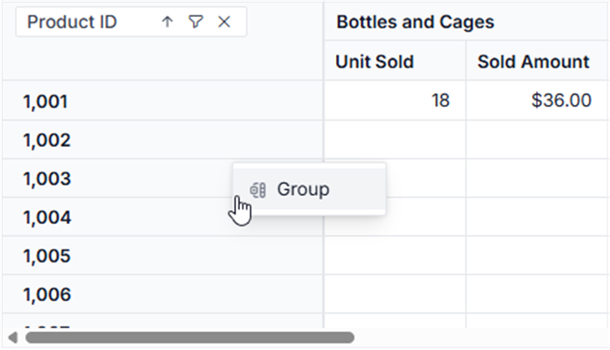

### Range selection

The "**Starting at**" and "**Ending at**" options are used to set the number range depending on which the headers will be grouped. For example, if the "Product_ID" field holds the number from "1001" to "1010" and the user chooses to group the number range by setting "**1004**" to "**Starting at**" and "**1008**" to "**Ending at**" options on their own. Then the specified number range will be used for number grouping and the rest will be grouped as "**Out of Range**".

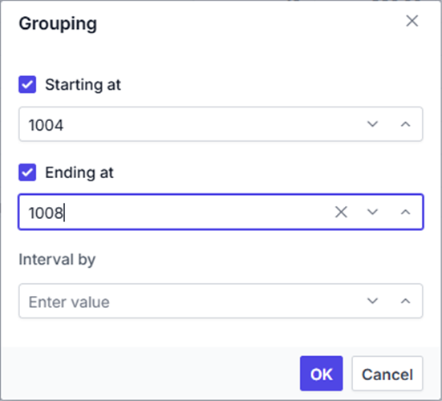

### Range interval

The "**Interval by**" option is used to separate the selected number data type field into range-wise such as 1-5, 6-10, etc.
For example, if the user wants to display the "Product_ID" data field with a group interval of "**2**" by setting the "**Interval by**" option on their own. The "Product_ID" field will then be grouped by the specified range of intervals, such as "**1004-1005**", "**1006-1007**", etc.

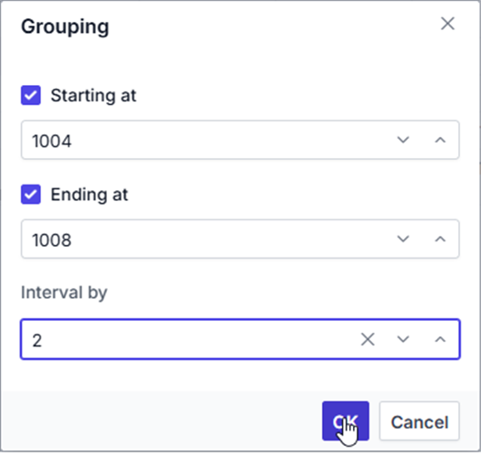
 

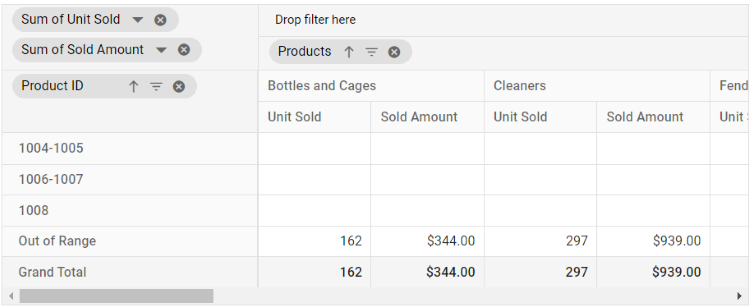

### Configuring Number Grouping Programmatically

You can configure number grouping through code-behind using the [`groupSettings`](https://ej2.syncfusion.com/angular/documentation/api/pivotview/groupSettings/#groupsettings) property. This allows you to define how numbers are grouped without relying on the UI. Below are the key settings you need:

* [`name`](https://ej2.syncfusion.com/angular/documentation/api/pivotview/groupSettings/#name): Allows user to set the field name.
* [`rangeInterval`](https://ej2.syncfusion.com/angular/documentation/api/pivotview/groupSettings/#rangeinterval): Allows user to set the interval between two numbers.
* [`startingAt`](https://ej2.syncfusion.com/angular/documentation/api/pivotview/groupSettings/#startingat): Allows user to set the starting number.
* [`endingAt`](https://ej2.syncfusion.com/angular/documentation/api/pivotview/groupSettings/#endingat): Allows user to set the ending number.
* [`type`](https://ej2.syncfusion.com/angular/documentation/api/pivotview/groupSettings/#type): Allows user to set the group type. For number grouping, **Number** is set.

> If starting and ending numbers specified in [`startingAt`](https://ej2.syncfusion.com/angular/documentation/api/pivotview/groupSettings/#startingat) and [`endingAt`](https://ej2.syncfusion.com/angular/documentation/api/pivotview/groupSettings/#endingat) properties are in-between the number range, then rest of the numbers will be grouped and placed in “Out of Range” section introduced specific to this feature.










  


### Ungrouping the existing number groups

To remove an applied number grouping, simply right-click on the grouped header in the pivot table and select **Ungroup** option from the context menu. This action will break apart the grouped ranges and display the original, ungrouped values in the table.

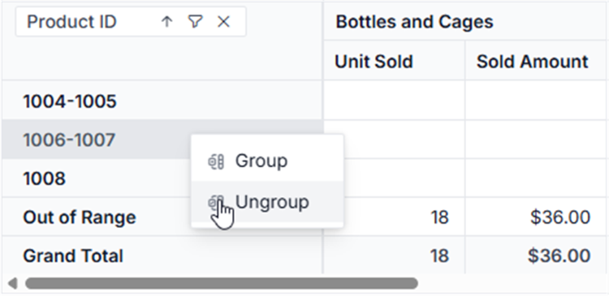

## Date Grouping

Date grouping organizes date and time data into hierarchical segments, such as years, quarters, months, days, hours, minutes, or seconds. Users can configure date grouping through the UI by right-clicking a date or time-based header in the pivot table and selecting **Group** option from the context menu. A dialog will appear, allowing users to choose the desired grouping intervals.










  


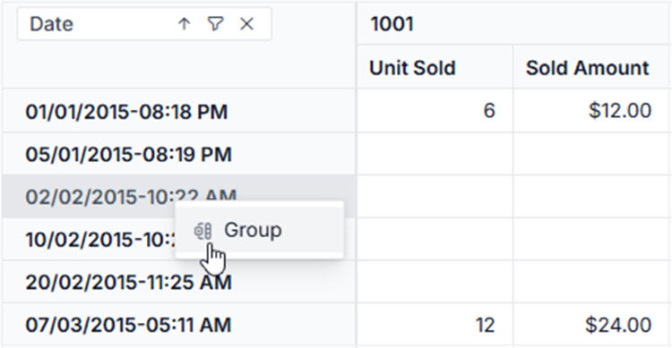

### Range Selection

The **Starting at** and **Ending at** options allow users to define the date range for grouping headers. For example, if the "Date" field contains data from "01/01/2015" to "02/12/2018" and the user sets **Starting at** to "**01/07/2015**" and **Ending at** to "**31/07/2017**", only records within this range will be grouped according to the selected settings. Dates outside this range are labeled as **Out of Range**.

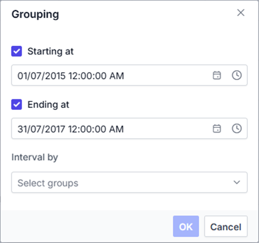

### Group Interval

The **Interval by** option allows users to split date fields into years, quarters, months, days, hours, minutes, or seconds. For example, selecting **Years** and **Months** as intervals for the "Date" field results in two new fields: **Years (Date)**, containing the year values, and **Months (Date)**, containing the month values. These grouped fields can be used for report manipulations in the pivot table at runtime.

> If no options are selected in the **Interval by** section, the **OK** button in the dialog remains disabled. At least one interval must be chosen to enable date grouping.

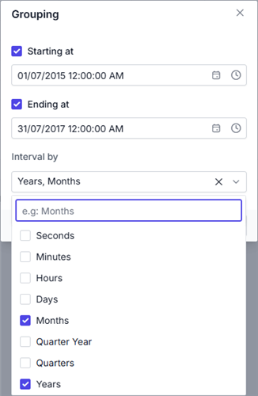
 

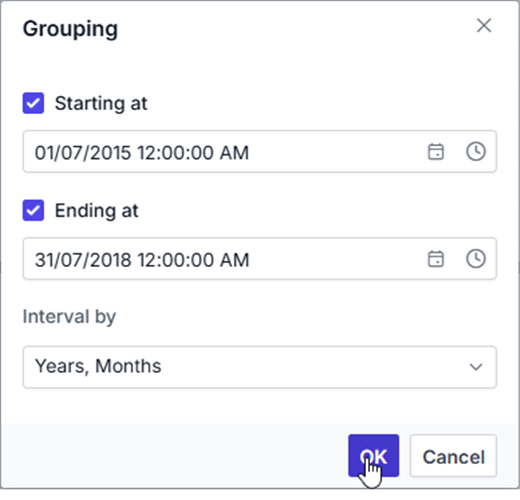
 

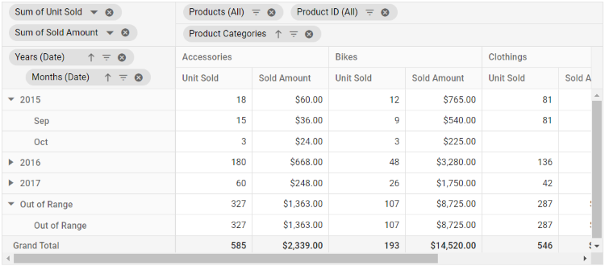

### Configuring Date Grouping Programmatically

You can configure date grouping programmatically using the [`groupSettings`](https://ej2.syncfusion.com/angular/documentation/api/pivotview/groupSettings/#groupsettings) property. This allows you to define how dates are grouped without using the UI. The key settings are:

* [`name`](https://ej2.syncfusion.com/angular/documentation/api/pivotview/groupSettings/#name): Allows user to set the field name.
* [`type`](https://ej2.syncfusion.com/angular/documentation/api/pivotview/groupSettings/#type): Allows user to set the group type. For date grouping, **Date** is set.
* [`startingAt`](https://ej2.syncfusion.com/angular/documentation/api/pivotview/groupSettings/#startingat): Allows user to set starting date.
* [`endingAt`](https://ej2.syncfusion.com/angular/documentation/api/pivotview/groupSettings/#endingat): Allows user to set ending date.
* [`groupInterval`](https://ej2.syncfusion.com/angular/documentation/api/pivotview/groupSettings/#groupinterval): Allows user to set interval in year, quarter, month, day, hour, minute, or second pattern.

> For example, if your date format is "YYYY-DD-MM HH:MM:SS" and you want to group only by year and month, set the `groupInterval` property with just **Years** and **Months**. You can also rearrange the order of the intervals (Year, Quarter, Month, Day, etc.) as needed—this order will reflect in the pivot table display.










  


Furthermore, in the field list UI, these date group fields **Years (Date)**, **Quarters (Date)**, **Months (Date)**, etc... will be automatically grouped and displayed under the **Date** folder name.

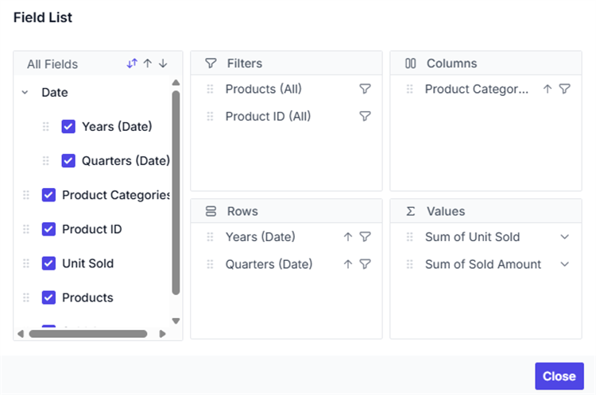

### Ungrouping the existing date groups

To remove a previously applied date grouping, simply right-click the relevant date-based header within the pivot table and select the **Ungroup** option from the context menu. This action will revert the grouped dates back to their original, ungrouped state, allowing you to view and analyze the raw date values in the PivotView component.

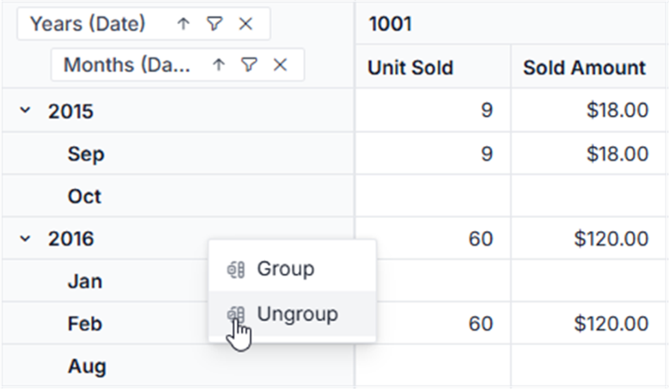

## Custom Grouping

Custom grouping is an option that enables users to group data types (date, time, number, or string) into custom fields based on specific requirements. This functionality can be accessed through the user interface by right-clicking a header in the pivot table.










  


### Creating a Custom Group

To create a custom group in the pivot table, select at least two headers from the same field. Hold the **CTRL** key to select multiple headers individually or the **SHIFT** key to select a range of headers. Then, right-click and choose **Group** from the context menu.

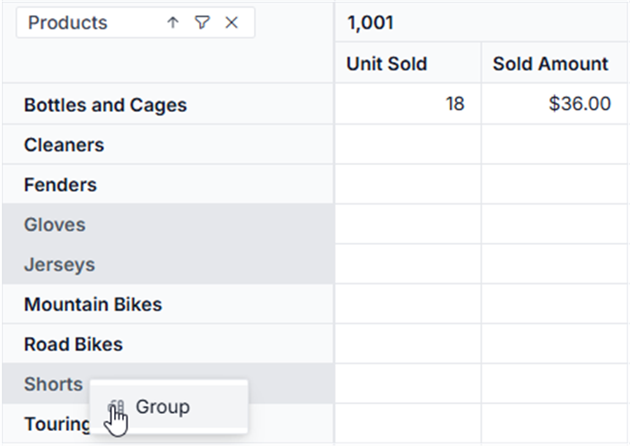

In the dialog box:
- **Field Caption**: Set an alias name for the new custom field, which will appear in the pivot table.
- **Group Name**: Define the top-level name for the group that will contain the selected headers.

For example, to group the headers "Gloves," "Jerseys," and "Shorts" in the "Products" field under a single group, set the **Group Name** to "Clothings." The selected headers will then appear under "Clothings" in the pivot table.

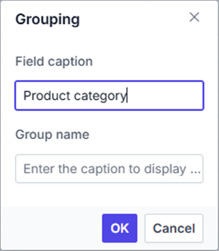
 

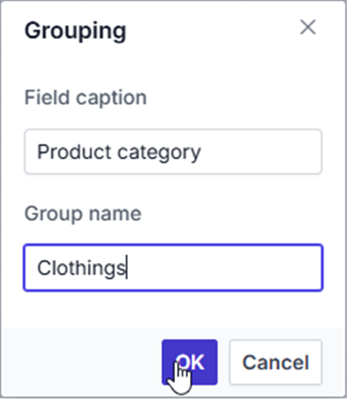
 

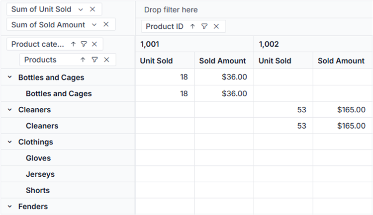

### Nested Custom Grouping

User can also apply new custom grouping options to an existing custom field by right-clicking on the custom group header in the pivot table. For example, if the user wants to create a new custom group for the current custom group headers such as "**Bottles and Cages**", "**Cleaners**" and "**Fenders**" by setting the top level name as "**Accessories**" to "**Group Name**" on their own. The selected headers will then be grouped in the pivot table under the name "**Accessories**" with a new custom field called "**Product category 1**".

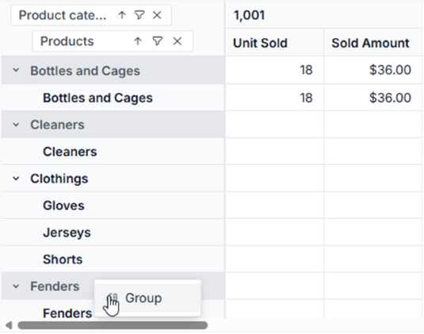
 

 

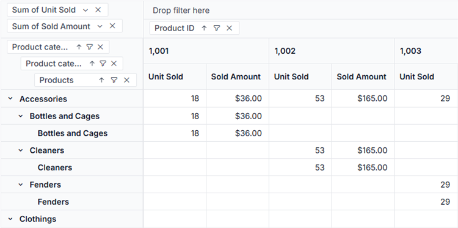

### Configuring Custom Grouping Programmatically

You can configure custom grouping programmatically using the [`groupSettings`](https://ej2.syncfusion.com/angular/documentation/api/pivotview/groupSettings/#groupsettings) property in the pivot table component. This property allows you to define how fields are grouped in the pivot table without using the UI. The available properties are:

* [`name`](https://ej2.syncfusion.com/angular/documentation/api/pivotview/groupSettings/#name): Allows user to set the field name.
* [`caption`](https://ej2.syncfusion.com/angular/documentation/api/pivotview/groupSettings/#caption): Allows user to set the caption name for custom grouping field.
* [`customGroups`](https://ej2.syncfusion.com/angular/documentation/api/pivotview/customGroups/): Allows user to set the custom groups.
* [`type`](https://ej2.syncfusion.com/angular/documentation/api/pivotview/groupSettings/#type): Allows user to set the group type. For custom grouping, **Custom** is set.

The [`customGroups`](https://ej2.syncfusion.com/angular/documentation/api/pivotview/customGroups/) property includes:

* [`groupName`](https://ej2.syncfusion.com/angular/documentation/api/pivotview/customGroups/#groupname): Allows user to set the group name (or title) for selected headers.
* [`items`](https://ej2.syncfusion.com/angular/documentation/api/pivotview/customGroups/#items): It allows to set the headers which needs to be grouped from display.

> Headers listed in [`items`](https://ej2.syncfusion.com/angular/documentation/api/pivotview/customGroups/#items) are grouped under the specified [`groupName`](https://ej2.syncfusion.com/angular/documentation/api/pivotview/customGroups/#groupname) in the pivot table. Headers not included in [`items`](https://ej2.syncfusion.com/angular/documentation/api/pivotview/customGroups/#items) are displayed under their original names.

Here’s an example of configuring custom grouping programmatically:










  


### Ungrouping Existing Custom Groups

To remove a custom group in the pivot table, simply right-click on the grouped header and select the "**Ungroup**" option from the context menu. This action will separate the grouped items back into their individual headers within the pivot table.

> After ungrouping, if you remove the related field from the report, any custom group fields associated with it will also be removed from the pivot table.

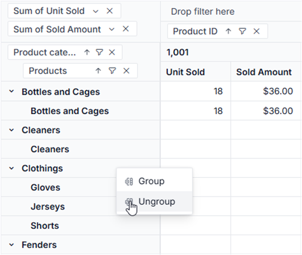