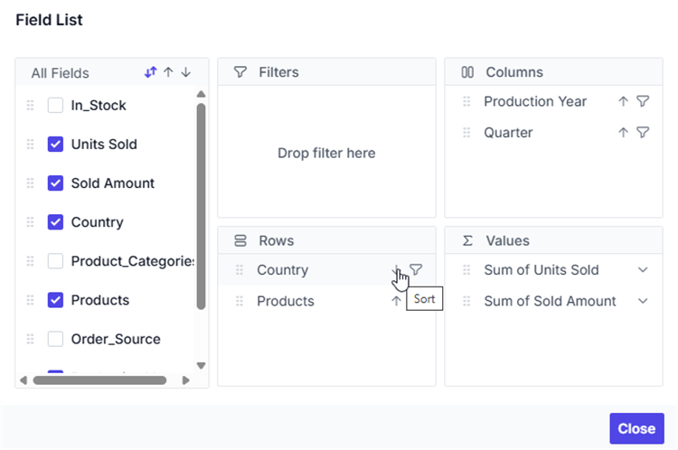
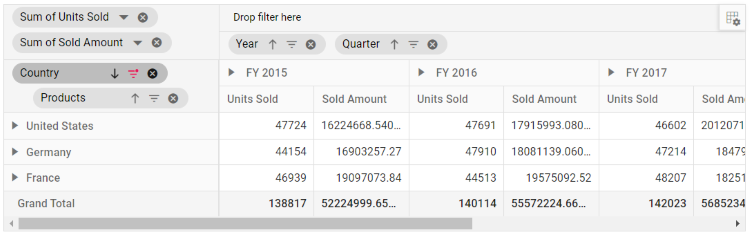
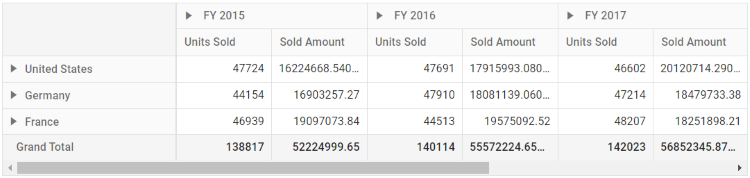

# Sorting in Angular Pivotview component

## Member Sorting

Allows to order field members in rows and columns either in ascending or descending order. By default, field members in rows and columns are in ascending order.

Member sorting can be enabled by setting the [`enableSorting`](https://ej2.syncfusion.com/angular/documentation/api/pivotview/dataSourceSettings/#enablesorting) property in [`dataSourceSettings`](https://ej2.syncfusion.com/angular/documentation/api/pivotview/dataSourceSettings/) to **true**. After enabling this API, click the sort icon besides each field in row or column axis, available in field list or grouping bar UI for re-arranging members either in ascending or descending order.

> By default the [`enableSorting`](https://ej2.syncfusion.com/angular/documentation/api/pivotview/dataSourceSettings/#enablesorting) property in [`dataSourceSettings`](https://ej2.syncfusion.com/angular/documentation/api/pivotview/dataSourceSettings/) set as **true**. If we set it as **false**, then the field members arrange in pivot table as its data source order. And, the sort icons in grouping bar and field list buttons will be removed.

 

 

Member sorting can also be configured using the [`sortSettings`](https://ej2.syncfusion.com/angular/documentation/api/pivotview/sort/) through code behind, during initial rendering. The settings required to sort are:

* [`name`](https://ej2.syncfusion.com/angular/documentation/api/pivotview/sort/#name): It allows to set the field name.
* [`order`](https://ej2.syncfusion.com/angular/documentation/api/pivotview/sort/#order): It allows to set the sort direction either to ascending or descending of the respective field.

> By default the [`order`](https://ej2.syncfusion.com/angular/documentation/api/pivotview/sort/#order) property in the [`sortSettings`](https://ej2.syncfusion.com/angular/documentation/api/pivotview/sort/) set as **Ascending**. Meanwhile, we can arrange the field members as its order in data source by setting it as **None** where the sort icons in grouping bar and field list buttons for the corresponding field will be removed.










  


### Alphanumeric Sorting

Usually string sorting is applied to field members even if it starts with numbers. But this kind of field members can also be sorted on the basis of numbers that are placed at the beginning of the member name. This can be achieved by setting the [`dataType`](https://ej2.syncfusion.com/angular/documentation/api/pivotview/fieldOptions/#datatype) property as **number** to the desired field.










  


### Custom Sorting

Allows to sort field headers (aka, members) in rows and columns based on user-defined order. This can be configured mainly using the [`membersOrder`](https://ej2.syncfusion.com/angular/documentation/api/pivotview/sort/#membersorder) in the [`sortSettings`](https://ej2.syncfusion.com/angular/documentation/api/pivotview/sortModel/) through code behind, during initial rendering. The other settings required to sort are:

* [`name`](https://ej2.syncfusion.com/angular/documentation/api/pivotview/sort/#name) : It allows to set the field name.
* [`membersOrder`](https://ej2.syncfusion.com/angular/documentation/api/pivotview/sort/#membersOrder) : It holds an array of headers in the order specified by the user.
* [`order`](https://ej2.syncfusion.com/angular/documentation/api/pivotview/sort/#order) : It allows to specify whether the array of headers should be sorted ascending or descending.










  


## Value Sorting

Allows to sort individual value field and its aggregated values either in row or column axis in both ascending and descending order. It can been enabled by setting the [`enableValueSorting`](https://ej2.syncfusion.com/angular/documentation/api/pivotview/#enablevaluesorting) property in pivot table to **true**. On enabling, end user can sort the values by directly clicking the value field header positioned either in row or column axis of the pivot table component.

The value sorting can also be configured using the [`valueSortSettings`](https://ej2.syncfusion.com/angular/documentation/api/pivotview/valueSortSettings/) option through code behind. The settings required to sort value fields are:

* [`headerText`](https://ej2.syncfusion.com/angular/documentation/api/pivotview/valueSortSettings/#headertext): It allows to set the header names with delimiters, that is used for value sorting. The header names are arranged from Level 1 to Level N, down the hierarchy with a delimiter for better specification.
* [`headerDelimiter`](https://ej2.syncfusion.com/angular/documentation/api/pivotview/valueSortSettings/#headerdelimiter): It allows to set the delimiters string to separate the header text between levels.
* [`sortOrder`](https://ej2.syncfusion.com/angular/documentation/api/pivotview/valueSortSettings/#sortorder): It allows to set the sort direction of the value field.

> Value fields are set to the column axis by default. In such cases, the value sorting applied will have an effect on the column alone. You need to place the value fields in the row axis to do so in row wise. For more information, please [`refer here`](https://ej2.syncfusion.com/angular/documentation/pivotview/data-binding#values-in-row-axis).










  


### Multiple Axis Sorting

You can apply value sorting to both row and column axes simultaneously for more dynamic and precise data analysis. The following settings are used to configure sorting:

* [`columnHeaderText`](https://ej2.syncfusion.com/angular/documentation/api/pivotview/valueSortSettingsModel/#columnheaderText): Specifies the column header hierarchy for value sorting. Header levels are defined from Level 1 to N using a delimiter for clarity.
* [`headerDelimiter`](https://ej2.syncfusion.com/angular/documentation/api/pivotview/valueSortSettingsModel/#headerdelimiter): It allows to set the delimiters string to separate the header text between levels.
* [`columnSortOrder`](https://ej2.syncfusion.com/angular/documentation/api/pivotview/valueSortSettingsModel/#columnsortOrder): Determines the sorting direction for the specified column header.
* [`rowHeaderText`](https://ej2.syncfusion.com/angular/documentation/api/pivotview/valueSortSettingsModel/#rowHeadertext): Defines the specific row header for which the value sorting should be applied.
* [`rowSortOrder`](https://ej2.syncfusion.com/angular/documentation/api/pivotview/valueSortSettingsModel/#rowSortorder): Determines the sorting direction for the specified row header.

>Note: This feature is applicable only to relational data sources and operates exclusively with client-side engine.










  


## Event

### OnHeadersSort

When sorting is applied, the event [`onHeadersSort`](https://ej2.syncfusion.com/angular/documentation/api/pivotview/#onheaderssort) triggers every time while rendering each row and column header cell. This allows the user to re-arrange the order in which the pivot table's headers appear. It has the following parameters:

* `fieldName`: It holds the field name where the sort settings applied.

* `sortOrder`: It holds the current sort order of the field.

* `members`: It holds the sorted headers according to the specified sort order.

* `levelName`: It holds the specific field's unique level name.Note: This option is applicable only for OLAP data.

* `isOrderChanged`: By setting this boolean property to true, it allows to display the modified members order.










  


### ActionBegin

The event [`actionBegin`](https://ej2.syncfusion.com/angular/documentation/api/pivotview/#actionbegin) triggers when clicking the value sort icon or the sort icon in the field button, which is present in both grouping bar and field list UI. This allows user to identify the current action being performed at runtime. It has the following parameters:

* `dataSourceSettings`: It holds the current data source settings such as input data source, rows, columns, values, filters, format settings and so on.

* `actionName`: It holds the name of the current action began. The following are the UI actions and their names:

   | Action | Action Name|
   |------|-------------|
   | [`Sort field`](./sorting#member-sorting)| Sort field |
   | [`Value sort icon`](./sorting#value-sorting)| Sort value|

* `fieldInfo`: It holds the selected field information.

>Note: This option is applicable only when the field based UI actions are performed such as filtering, sorting, removing field from grouping bar, editing and aggregation type change.

* `cancel`: It allows user to restrict the current action.

In the below sample, sort action can be restricted by setting the **args.cancel** option to **true** in the `actionBegin` event.










  


### ActionComplete

The event [`actionComplete`](https://ej2.syncfusion.com/angular/documentation/api/pivotview/#actioncomplete) triggers when the UI actions such as value sorting or sorting via the field button, which is present in both grouping bar and field list UI, is completed. This allows user to identify the current UI actions being completed at runtime. It has the following parameters:

* `dataSourceSettings`:  It holds the current data source settings such as input data source, rows, columns, values, filters, format settings and so on.

* `actionName`: It holds the name of the current action completed. The following are the UI actions and their names:

   | Action | Action Name|
   |------|-------------|
   | [`Sort field`](./sorting#member-sorting)| Field sorted|
   | [`Value sort icon`](./sorting#value-sorting)| Value sorted|

* `fieldInfo`: It holds the selected field information.

>Note: This option is applicable only when the field based UI actions are performed such as filtering, sorting, removing field from grouping bar, editing and aggregation type change.

* `actionInfo`: It holds the unique information about the current UI action. For example, if sorting is completed, the event argument contains information such as sort order and the field name.










  


### ActionFailure

The event [`actionFailure`](https://ej2.syncfusion.com/angular/documentation/api/pivotview/#actionfailure) triggers when the current UI action fails to achieve the desired result. It has the following parameters:

* `actionName`: It holds the name of the current action failed. The following are the UI actions and their names:

    | Action | Action Name|
    |------|-------------|
    | [`Sort field`](./sorting#member-sorting)| Sort field |
    | [`Value sort icon`](./sorting#value-sorting)| Sort value|

* `errorInfo`: It holds the error information of the current UI action.










  
