# Tool bar in Angular Pivotview component

The toolbar in the Angular Pivot Table component provides easy access to commonly used features, such as switching between a pivot table and a pivot chart, changing chart types, applying conditional formatting, exporting data, and more. To enable the toolbar, set the [`showToolbar`](https://ej2.syncfusion.com/angular/documentation/api/pivotview/index-default#showtoolbar) property to **true**. Additionally, the [`toolbar`](https://ej2.syncfusion.com/angular/documentation/api/pivotview/index-default#toolbar) property accepts a collection of built-in toolbar options, allowing users to interact with the Pivot Table efficiently at runtime.

The following table lists the built-in toolbar options and their actions:

| Built-in Toolbar Options | Actions |
|--------------------------|---------|
| New | Creates a new report |
| Save | Saves the current report |
| Save As | Saves the current report with a new name |
| Rename | Changes the name of the current report |
| Delete | Removes the current report |
| Load | Opens a report from the report list |
| Grid | Displays the pivot table |
| Chart | Shows a pivot chart with options to select different chart types and enable or disable multiple axes |
| Exporting | Exports the pivot table as PDF, Excel, or CSV, or the pivot chart as a PDF or image |
| Sub-total | Shows or hides subtotals in the pivot table |
| Grand Total | Shows or hides grand totals in the pivot table |
| Conditional Formatting | Opens a pop-up to apply formatting to cells based on conditions |
| Number Formatting | Opens a pop-up to apply number formatting to cells |
| Field List | Opens the field list pop-up to configure the [`dataSourceSettings`](https://ej2.syncfusion.com/angular/documentation/api/pivotview/datasourcesettings) |
| MDX | Displays the MDX query used to retrieve data from an OLAP data source. **Note**: This option applies only to OLAP data sources. |

> The order of toolbar options can be changed by simply moving the position of items in the **ToolbarItems** collection. Also if end user wants to remove any toolbar option from getting displayed, it can be simply ignored from adding into the **ToolbarItems** collection.










  


## Show desired chart types in the dropdown menu

By default, the dropdown menu in the toolbar displays all available chart types. However, you may want to show only specific chart types in the dropdown menu based on your application’s needs. To do this, use the [`chartTypes`](https://ej2.syncfusion.com/angular/documentation/api/pivotview/#charttypes) property. This property allows you to define a list of chart types that will appear in the dropdown menu, ensuring users see only the options you select.

For example, if you want the dropdown menu to show only the Column, Bar, Line, and Area chart types, you can set the [`chartTypes`](https://ej2.syncfusion.com/angular/documentation/api/pivotview/#charttypes) property to include these specific options. This makes the pivot chart easier to use by limiting the choices to those most relevant for your data.

To learn more about the supported chart types, see the [Pivot Chart documentation](https://ej2.syncfusion.com/angular/documentation/pivotview/pivot-chart#chart-types).










  


## Switch the chart to multiple axes

In the pivot chart, users can switch between a single axis and multiple axes using a built-in checkbox located in the chart type dropdown menu on the toolbar. This option allows users to display data on multiple axes for better visualization. For more details, [refer here](https://ej2.syncfusion.com/angular/documentation/pivotview/pivot-chart#multiple-axis).

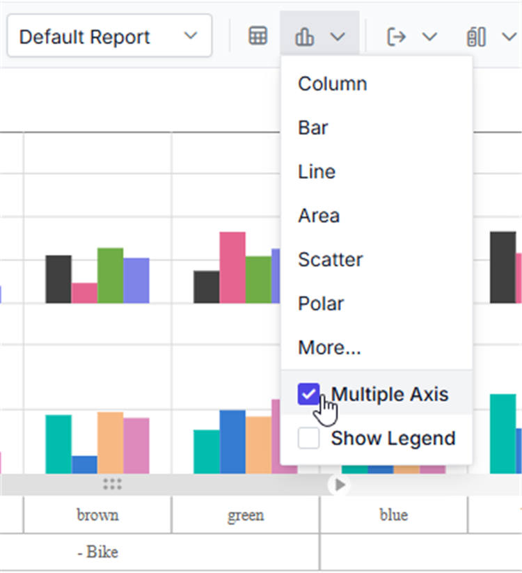

The pivot chart supports three modes for multiple axes: `Stacked`, `Single`, and `Combined`. Users can select a mode from the "Multiple Axis Mode" dropdown list, which appears after clicking the **More...** option in the chart type dropdown menu.

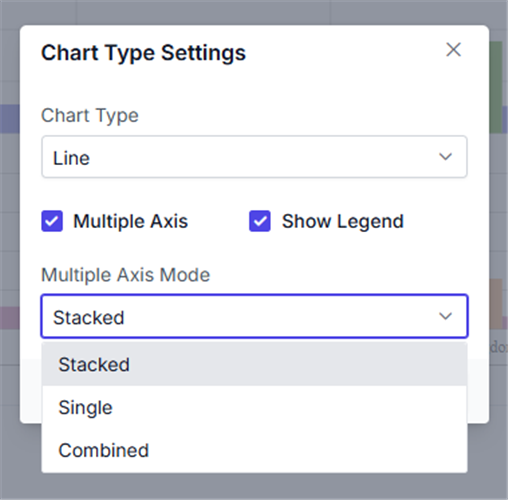

## Show or hide legend

In the pivot chart, you can show or hide the legend dynamically using an option in the chart type drop-down menu on the toolbar. This allows you to control whether the legend appears alongside the chart. For accumulation chart types, such as pie, doughnut, pyramid, and funnel, the legend is hidden by default. You can enable or disable the legend using a built-in checkbox available in the drop-down menu.

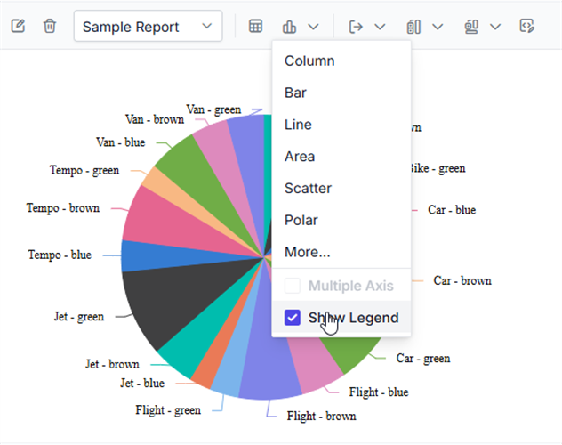

## Adding custom option to the toolbar

You can add new items to the toolbar in the Angular Pivot Table component beyond the built-in options. This is done using the [`toolbarRender`](https://ej2.syncfusion.com/angular/documentation/api/pivotview/#toolbarrender) event. Within this event, you can define the new toolbar item and specify what action it performs when clicked. Additionally, you can place the new item at a specific position in the toolbar using the `splice` method.

Here’s an example of how to add a custom toolbar item:










  


In this example, a custom icon is added to the toolbar. The [`toolbarRender`](https://ej2.syncfusion.com/angular/documentation/api/pivotview/#toolbarrender) event helps position and define the action for the new item. Next, we will explore how to fully customize the toolbar panel using a template and include custom controls.

### Toolbar Template

You can customize the entire toolbar panel by using the [`toolbarTemplate`](https://ej2.syncfusion.com/angular/documentation/api/pivotview/#toolbartemplate) property. This allows you to design the toolbar with HTML elements and include any custom control, such as buttons or dropdowns, as toolbar items. The HTML structure for the toolbar is defined separately and linked to the Pivot Table by setting the `id` of the HTML element in the [`toolbarTemplate`](https://ej2.syncfusion.com/angular/documentation/api/pivotview/#toolbartemplate) property.

Below is an example of a custom toolbar with buttons to expand or collapse all rows in the Pivot Table:










  


Another option allows framing a custom toolbar item using HTML elements and including it in the toolbar panel at the desired position. Custom toolbar items can be declared as a control **instance** or element **ID** in the [`toolbar`](https://ej2.syncfusion.com/angular/documentation/api/pivotview/index-default#toolbar) property in the pivot table.










  


> Note: For both options, the actions for the toolbar template items can be defined in the [`toolbarClick`](https://ej2.syncfusion.com/angular/documentation/api/pivotview/#toolbarclick) event. Additionally, if the toolbar item is a custom control, its built-in events can also be accessed.

## Save and load report as a JSON file

You can save the current Pivot Table report as a JSON file and load it back into the Pivot Table whenever needed. This allows you to store your report settings, such as row, column, and value configurations, and reuse them later.

To save a report, use the [`getPersistData`](https://ej2.syncfusion.com/angular/documentation/api/pivotview/#getpersistdata) method to retrieve the current Pivot Table settings. These settings are then converted to a JSON file and downloaded to your chosen location. To load a report, select a JSON file containing the saved settings, and the Pivot Table will update to reflect those settings using the [`dataSourceSettings`](https://ej2.syncfusion.com/angular/documentation/api/pivotview/index-default#datasourcesettings) property.

The following code example shows how to save and load a Pivot Table report as a JSON file. By clicking an external "Save" button, the `saveData` method is triggered to save the current report settings as a JSON file. Similarly, clicking an external "Load" button triggers the `readBlob` method to load a JSON file and restore the report settings.










  


## Save and load reports to a SQL database

SQL Server is a relational database management system (RDBMS) that can be used to store and manage large amounts of data. In this topic, we will see how to save, save as, rename, load, delete, and add reports between a SQL Server database and a Angular Pivot Table at runtime.

### Create a Web API service to connect to a SQL Server database

**1.** Open Visual Studio and create an ASP.NET Core Web App project type, naming it **MyWebService**. To create an ASP.NET Core Web application, follow the document [link](https://learn.microsoft.com/en-us/visualstudio/get-started/csharp/tutorial-aspnet-core?view=vs-2022).

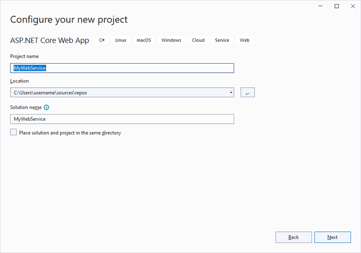

**2.** To connect a SQL Server database using the Microsoft SqlClient in our application, we need to install the [Microsoft.Data.SqlClient](https://www.nuget.org/packages/Microsoft.Data.SqlClient) NuGet package. To do so, open the NuGet package manager of the project solution, search for the package **Microsoft.Data.SqlClient** and install it.

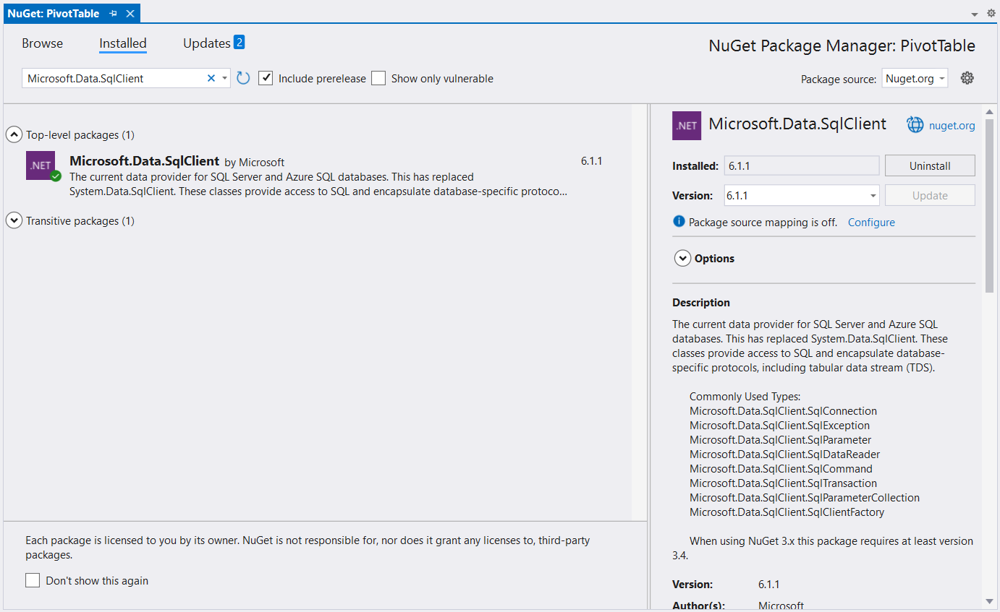

**3.** Under the **Controllers** folder, create a Web API controller (aka, PivotController.cs) file that aids in data communication with the Pivot Table.

**4.** In the Web API Controller (aka, PivotController), the **OpenConnection** method is used to connect to the SQL database. The **GetDataTable** method then processes the specified SQL query string, retrieves data from the database, and converts it into a **DataTable** using **SqlCommand** and **SqlDataAdapter**. This **DataTable** can be used to retrieve saved reports and modify them further as shown in the code block below.

[PivotController.cs]

```csharp

using Microsoft.AspNetCore.Mvc;
using Microsoft.Data.SqlClient;
using System.Data;

namespace MyWebService.Controllers
{
    [ApiController]
    [Route("[controller]")]
    public class PivotController : ControllerBase
    {
        [HttpPost]
        [Route("Pivot/SaveReport")]
        public void SaveReport([FromBody] Dictionary<string, string> reportArgs)
        {
            SaveReportToDB(reportArgs["reportName"], reportArgs["report"]);
        }

        [HttpPost]
        [Route("Pivot/FetchReport")]
        public IActionResult FetchReport()
        {
            return Ok((FetchReportListFromDB()));
        }

        [HttpPost]
        [Route("Pivot/LoadReport")]
        public IActionResult LoadReport([FromBody] Dictionary<string, string> reportArgs)
        {
            return Ok((LoadReportFromDB(reportArgs["reportName"])));
        }

        [HttpPost]
        [Route("Pivot/RemoveReport")]
        public void RemoveReport([FromBody] Dictionary<string, string> reportArgs)
        {
            RemoveReportFromDB(reportArgs["reportName"]);
        }

        [HttpPost]
        [Route("Pivot/RenameReport")]
        public void RenameReport([FromBody] RenameReportDB reportArgs)
        {
            RenameReportInDB(reportArgs.ReportName, reportArgs.RenameReport, reportArgs.isReportExists);
        }

        public class RenameReportDB
        {
            public string ReportName { get; set; }
            public string RenameReport { get; set; }
            public bool isReportExists { get; set; }
        }

        private void SaveReportToDB(string reportName, string report)
        {
            SqlConnection sqlConn = OpenConnection();
            bool isDuplicate = true;
            SqlCommand cmd1 = null;
            foreach (DataRow row in GetDataTable(sqlConn).Rows)
            {
                if ((row["ReportName"] as string).Equals(reportName))
                {
                    isDuplicate = false;
                    cmd1 = new SqlCommand("update ReportTable set Report=@Report where ReportName like @ReportName", sqlConn);
                }
            }
            if (isDuplicate)
            {
                cmd1 = new SqlCommand("insert into ReportTable (ReportName,Report) Values(@ReportName,@Report)", sqlConn);
            }
            cmd1.Parameters.AddWithValue("@ReportName", reportName);
            cmd1.Parameters.AddWithValue("@Report", report.ToString());
            cmd1.ExecuteNonQuery();
            sqlConn.Close();
        }

        private string LoadReportFromDB(string reportName)
        {
            SqlConnection sqlConn = OpenConnection();
            string report = string.Empty;
            foreach (DataRow row in GetDataTable(sqlConn).Rows)
            {
                if ((row["ReportName"] as string).Equals(reportName))
                {
                    report = (string)row["Report"];
                    break;
                }
            }
            sqlConn.Close();
            return report;
        }

        private List<string> FetchReportListFromDB()
        {
            SqlConnection sqlConn = OpenConnection();
            List<string> reportNames = new List<string>();
            foreach (DataRow row in GetDataTable(sqlConn).Rows)
            {
                if (!string.IsNullOrEmpty(row["ReportName"] as string))
                {
                    reportNames.Add(row["ReportName"].ToString());
                }
            }
            sqlConn.Close();
            return reportNames;
        }

        private void RenameReportInDB(string reportName, string renameReport, bool isReportExists)
        {
            SqlConnection sqlConn = OpenConnection();
            SqlCommand cmd1 = null;
            if (isReportExists)
            {
                foreach (DataRow row in GetDataTable(sqlConn).Rows)
                {
                    if ((row["ReportName"] as string).Equals(reportName))
                    {
                        cmd1 = new SqlCommand("delete from ReportTable where ReportName like '%" + reportName + "%'", sqlConn);
                        break;
                    }
                }
                cmd1.ExecuteNonQuery();
            }
            foreach (DataRow row in GetDataTable(sqlConn).Rows)
            {
                if ((row["ReportName"] as string).Equals(reportName))
                {
                    cmd1 = new SqlCommand("update ReportTable set ReportName=@RenameReport where ReportName like '%" + reportName + "%'", sqlConn);
                    break;
                }
            }
            cmd1.Parameters.AddWithValue("@RenameReport", renameReport);
            cmd1.ExecuteNonQuery();
            sqlConn.Close();
        }

        private void RemoveReportFromDB(string reportName)
        {
            SqlConnection sqlConn = OpenConnection();
            SqlCommand cmd1 = null;
            foreach (DataRow row in GetDataTable(sqlConn).Rows)
            {
                if ((row["ReportName"] as string).Equals(reportName))
                {
                    cmd1 = new SqlCommand("delete from ReportTable where ReportName like '%" + reportName + "%'", sqlConn);
                    break;
                }
            }
            cmd1.ExecuteNonQuery();
            sqlConn.Close();
        }

        private SqlConnection OpenConnection()
        {
            // Replace with your own connection string.
            string connectionString = @"<Enter your valid connection string here>";
            SqlConnection sqlConn = new SqlConnection(connectionString);
            sqlConn.Open();
            return sqlConn;
        }

        private DataTable GetDataTable(SqlConnection sqlConn)
        {
            string xquery = "select * from ReportTable";
            SqlCommand cmd = new SqlCommand(xquery, sqlConn);
            SqlDataAdapter da = new SqlDataAdapter(cmd);
            DataTable dt = new DataTable();
            da.Fill(dt);
            return dt;
        }
    }
}

```

**5.** When you run the app, it will be hosted at `https://localhost:44313`. You can use the hosted URL to save and load reports in the SQL database from the Pivot Table.

Further, let us explore more on how to save, load, rename, delete, and add reports using the built-in toolbar options via Web API controller (aka, PivotController) one-by-one.

#### Saving a report

When you select the **"Save a report"** option from the toolbar, the [saveReport](#savereport) event is triggered. In this event, an AJAX request is made to the Web API controller's **SaveReport** method, passing the name of the current report and the current report, which you can use to check and save in the SQL database.

For example, the report shown in the following code snippet will be passed to the **SaveReport** method along with the report name **"Sample Report"** and saved in the SQL database.

[app.component.ts]

```typescript

import { Component, OnInit, ViewChild } from '@angular/core';
import {
  PivotView, FieldListService, CalculatedFieldService,
  ToolbarService, ConditionalFormattingService, ToolbarItems, DisplayOption, IDataSet,
  NumberFormattingService,
  FetchReportArgs,
  LoadReportArgs,
  RemoveReportArgs,
  RenameReportArgs,
  SaveReportArgs
} from '@syncfusion/ej2-angular-pivotview';
import { GridSettings } from '@syncfusion/ej2-pivotview/src/pivotview/model/gridsettings';
import { enableRipple } from '@syncfusion/ej2-base';
import { ChartSettings } from '@syncfusion/ej2-pivotview/src/pivotview/model/chartsettings';
import { DataSourceSettingsModel } from '@syncfusion/ej2-pivotview/src/model/datasourcesettings-model';
enableRipple(false);

@Component({
  selector: 'app-root',
  // specifies the template string for the pivot table component
  providers: [CalculatedFieldService, ToolbarService, ConditionalFormattingService, FieldListService, NumberFormattingService],
  templateUrl: `./app.component.html`
})

export class AppComponent implements OnInit {
  public dataSourceSettings: DataSourceSettingsModel | undefined;
  public gridSettings: GridSettings | undefined;
  public toolbarOptions: ToolbarItems[] | undefined;
  public chartSettings: ChartSettings | undefined;
  public displayOption: DisplayOption | undefined;

  @ViewChild('pivotview')
  public pivotTableObj: PivotView | undefined;

   saveReport(args: SaveReportArgs) {
      var report = JSON.parse(args.report as string);
      report.dataSourceSettings.dataSource = [];
      fetch('https://localhost:44313/Pivot/SaveReport', {
         method: 'POST',
         headers: {
         'Accept': 'application/json',
         'Content-Type': 'application/json',
         },
         body: JSON.stringify({ reportName: args.reportName, report: JSON.stringify(report) })
      }).then(response => {
         this.fetchReport(args as any);
      });
   }

  ngOnInit(): void {
    this.chartSettings = {
      chartSeries: { type: 'Column', animation: { enable: false } },
      enableMultipleAxis: false, value: 'Amount', enableExport: true
    } as ChartSettings;

    this.displayOption = { view: 'Both' } as DisplayOption;
    this.gridSettings = {
      columnWidth: 140
    } as GridSettings;

    this.toolbarOptions = ['New', 'Save', 'SaveAs', 'Rename', 'Remove', 'Load',
      'Grid', 'Chart', 'MDX', 'Export', 'SubTotal', 'GrandTotal', 'ConditionalFormatting', 'FieldList'] as ToolbarItems[];

    this.dataSourceSettings = {
      columns: [{ name: 'Year', caption: 'Production Year' }, { name: 'Quarter' }],
      dataSource: this.getPivotData(),
      expandAll: false,
      filters: [],
      formatSettings: [{ name: 'Amount', format: 'C0' }],
      rows: [{ name: 'Country' }, { name: 'Products' }],
      values: [{ name: 'Sold', caption: 'Units Sold' }, { name: 'Amount', caption: 'Sold Amount' }]
    };
  }
}

```

[PivotController.cs]

```csharp
namespace MyWebApp.Controllers
{
    [ApiController]
    [Route("[controller]")]
    public class PivotController : ControllerBase
    {
        [HttpPost]
        [Route("Pivot/SaveReport")]
        public void SaveReport([FromBody] Dictionary<string, string> reportArgs)
        {
            SaveReportToDB(reportArgs["reportName"], reportArgs["report"]);
        }

        private void SaveReportToDB(string reportName, string report)
        {
            SqlConnection sqlConn = OpenConnection();
            bool isDuplicate = true;
            SqlCommand cmd1 = null;
            foreach (DataRow row in GetDataTable(sqlConn).Rows)
            {
                if ((row["ReportName"] as string).Equals(reportName))
                {
                    isDuplicate = false;
                    cmd1 = new SqlCommand("update ReportTable set Report=@Report where ReportName like @ReportName", sqlConn);
                }
            }
            if (isDuplicate)
            {
                cmd1 = new SqlCommand("insert into ReportTable (ReportName,Report) Values(@ReportName,@Report)", sqlConn);
            }
            cmd1.Parameters.AddWithValue("@ReportName", reportName);
            cmd1.Parameters.AddWithValue("@Report", report.ToString());
            cmd1.ExecuteNonQuery();
            sqlConn.Close();
        }

        private SqlConnection OpenConnection()
        {
            // Replace with your own connection string.
            string connectionString = @"<Enter your valid connection string here>";
            SqlConnection sqlConn = new SqlConnection(connectionString);
            sqlConn.Open();
            return sqlConn;
        }

        private DataTable GetDataTable(SqlConnection sqlConn)
        {
            string xquery = "select * from ReportTable";
            SqlCommand cmd = new SqlCommand(xquery, sqlConn);
            SqlDataAdapter da = new SqlDataAdapter(cmd);
            DataTable dt = new DataTable();
            da.Fill(dt);
            return dt;
        }
    }
}

```

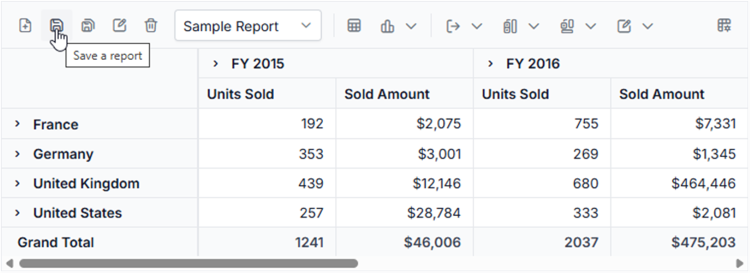

In the meantime, you can save a duplicate of the current report to the SQL Server database with a different name by selecting **"Save as current report"** from the toolbar. The [saveReport](#savereport) event will then be triggered with the new report name **"Sample Report 1"** and the current report. You can save them to the SQL Server database after passing them to the Web API service, as mentioned above.

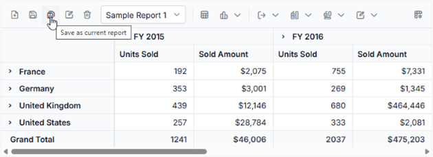

#### Loading a report

When you select the dropdown menu item from the toolbar, the [loadReport](#loadreport) event is triggered. In this event, an AJAX request is made to the **LoadReport** method of the Web API controller, passing the name of the selected report. The method uses this information to search for the report in the SQL database, fetch it, and load it into the pivot table.

For example, if the report name **"Sample Report 1"** is selected from a dropdown menu and passed, the **LoadReport** method will use that name to search for the report in the SQL database, retrieve it, and then load it into the pivot table.

[app.component.ts]

```typescript

import { Component, OnInit, ViewChild } from '@angular/core';
import {
  PivotView, FieldListService, CalculatedFieldService,
  ToolbarService, ConditionalFormattingService, ToolbarItems, DisplayOption, IDataSet,
  NumberFormattingService,
  FetchReportArgs,
  LoadReportArgs,
  RemoveReportArgs,
  RenameReportArgs,
  SaveReportArgs
} from '@syncfusion/ej2-angular-pivotview';
import { GridSettings } from '@syncfusion/ej2-pivotview/src/pivotview/model/gridsettings';
import { enableRipple } from '@syncfusion/ej2-base';
import { ChartSettings } from '@syncfusion/ej2-pivotview/src/pivotview/model/chartsettings';
import { DataSourceSettingsModel } from '@syncfusion/ej2-pivotview/src/model/datasourcesettings-model';
enableRipple(false);

@Component({
  selector: 'app-root',
  // specifies the template string for the pivot table component
  providers: [CalculatedFieldService, ToolbarService, ConditionalFormattingService, FieldListService, NumberFormattingService],
  templateUrl: `./app.component.html`
})

export class AppComponent implements OnInit {
  public dataSourceSettings: DataSourceSettingsModel | undefined;
  public gridSettings: GridSettings | undefined;
  public toolbarOptions: ToolbarItems[] | undefined;
  public chartSettings: ChartSettings | undefined;
  public displayOption: DisplayOption | undefined;

  @ViewChild('pivotview')
  public pivotTableObj: PivotView | undefined;

   loadReport(args: LoadReportArgs) {
      fetch('https://localhost:44313/Pivot/LoadReport', {
         method: 'POST',
         headers: {
         'Accept': 'application/json',
         'Content-Type': 'application/json',
         },
         body: JSON.stringify({ reportName: args.reportName })
      }).then(res => res.json())
         .then(response => {
         if (response) {
            var report = JSON.parse(response);
            report.dataSourceSettings.dataSource = (this.pivotTableObj as PivotView).dataSourceSettings.dataSource;
            (this.pivotTableObj as PivotView).dataSourceSettings = report.dataSourceSettings;
         }
      });
   }

  ngOnInit(): void {
    this.chartSettings = {
      chartSeries: { type: 'Column', animation: { enable: false } },
      enableMultipleAxis: false, value: 'Amount', enableExport: true
    } as ChartSettings;

    this.displayOption = { view: 'Both' } as DisplayOption;
    this.gridSettings = {
      columnWidth: 140
    } as GridSettings;

    this.toolbarOptions = ['New', 'Save', 'SaveAs', 'Rename', 'Remove', 'Load',
      'Grid', 'Chart', 'MDX', 'Export', 'SubTotal', 'GrandTotal', 'ConditionalFormatting', 'FieldList'] as ToolbarItems[];

    this.dataSourceSettings = {
      columns: [{ name: 'Year', caption: 'Production Year' }, { name: 'Quarter' }],
      dataSource: this.getPivotData(),
      expandAll: false,
      filters: [],
      formatSettings: [{ name: 'Amount', format: 'C0' }],
      rows: [{ name: 'Country' }, { name: 'Products' }],
      values: [{ name: 'Sold', caption: 'Units Sold' }, { name: 'Amount', caption: 'Sold Amount' }]
    };
  }
}

```

[PivotController.cs]

```csharp
using Microsoft.AspNetCore.Mvc;
using Microsoft.Data.SqlClient;
using System.Data;

namespace MyWebApp.Controllers
{
    [ApiController]
    [Route("[controller]")]
    public class PivotController : ControllerBase
    {
        [HttpPost]
        [Route("Pivot/LoadReport")]
        public IActionResult LoadReport([FromBody] Dictionary<string, string> reportArgs)
        {
            return Ok((LoadReportFromDB(reportArgs["reportName"])));
        }

        private string LoadReportFromDB(string reportName)
        {
            SqlConnection sqlConn = OpenConnection();
            string report = string.Empty;
            foreach (DataRow row in GetDataTable(sqlConn).Rows)
            {
                if ((row["ReportName"] as string).Equals(reportName))
                {
                    report = (string)row["Report"];
                    break;
                }
            }
            sqlConn.Close();
            return report;
        }

        private SqlConnection OpenConnection()
        {
            // Replace with your own connection string.
            string connectionString = @"<Enter your valid connection string here>";
            SqlConnection sqlConn = new SqlConnection(connectionString);
            sqlConn.Open();
            return sqlConn;
        }

        private DataTable GetDataTable(SqlConnection sqlConn)
        {
            string xquery = "select * from ReportTable";
            SqlCommand cmd = new SqlCommand(xquery, sqlConn);
            SqlDataAdapter da = new SqlDataAdapter(cmd);
            DataTable dt = new DataTable();
            da.Fill(dt);
            return dt;
        }
    }
}

```

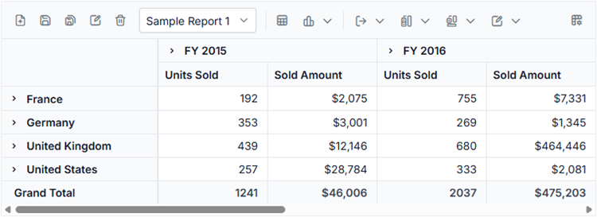

#### Renaming a report

When you select the **"Rename a current report"** option from the toolbar, the [renameReport](#renamereport) event is triggered. In this event, an AJAX request is made to the **RenameReport** method of the Web API controller, passing the current and new report names, where you can use the current report name to identify the report and resave it with the new report name in the SQL database.

For example, if we rename the current report from **"Sample Report 1"** to **"Sample Report 2"**, both **"Sample Report 1"** and **"Sample Report 2"** will be passed to the **RenameReport** method, which will rename the current report with the new report name **"Sample Report 2"** in the SQL database.

[app.component.ts]

```typescript

import { Component, OnInit, ViewChild } from '@angular/core';
import {
  PivotView, FieldListService, CalculatedFieldService,
  ToolbarService, ConditionalFormattingService, ToolbarItems, DisplayOption, IDataSet,
  NumberFormattingService,
  FetchReportArgs,
  LoadReportArgs,
  RemoveReportArgs,
  RenameReportArgs,
  SaveReportArgs
} from '@syncfusion/ej2-angular-pivotview';
import { GridSettings } from '@syncfusion/ej2-pivotview/src/pivotview/model/gridsettings';
import { enableRipple } from '@syncfusion/ej2-base';
import { ChartSettings } from '@syncfusion/ej2-pivotview/src/pivotview/model/chartsettings';
import { DataSourceSettingsModel } from '@syncfusion/ej2-pivotview/src/model/datasourcesettings-model';
enableRipple(false);

@Component({
  selector: 'app-root',
  // specifies the template string for the pivot table component
  providers: [CalculatedFieldService, ToolbarService, ConditionalFormattingService, FieldListService, NumberFormattingService],
  templateUrl: `./app.component.html`
})

export class AppComponent implements OnInit {
  public dataSourceSettings: DataSourceSettingsModel | undefined;
  public gridSettings: GridSettings | undefined;
  public toolbarOptions: ToolbarItems[] | undefined;
  public chartSettings: ChartSettings | undefined;
  public displayOption: DisplayOption | undefined;

  @ViewChild('pivotview')
  public pivotTableObj: PivotView | undefined;

   renameReport(args: RenameReportArgs) {
      fetch('https://localhost:44313/Pivot/RenameReport', {
         method: 'POST',
         headers: {
         'Accept': 'application/json',
         'Content-Type': 'application/json',
         },
         body: JSON.stringify({ reportName: args.reportName, renameReport: args.rename, isReportExists: args.isReportExists })
      }).then(response => {
         this.fetchReport(args as any);
      });
   }

  ngOnInit(): void {
    this.chartSettings = {
      chartSeries: { type: 'Column', animation: { enable: false } },
      enableMultipleAxis: false, value: 'Amount', enableExport: true
    } as ChartSettings;

    this.displayOption = { view: 'Both' } as DisplayOption;
    this.gridSettings = {
      columnWidth: 140
    } as GridSettings;

    this.toolbarOptions = ['New', 'Save', 'SaveAs', 'Rename', 'Remove', 'Load',
      'Grid', 'Chart', 'MDX', 'Export', 'SubTotal', 'GrandTotal', 'ConditionalFormatting', 'FieldList'] as ToolbarItems[];

    this.dataSourceSettings = {
      columns: [{ name: 'Year', caption: 'Production Year' }, { name: 'Quarter' }],
      dataSource: this.getPivotData(),
      expandAll: false,
      filters: [],
      formatSettings: [{ name: 'Amount', format: 'C0' }],
      rows: [{ name: 'Country' }, { name: 'Products' }],
      values: [{ name: 'Sold', caption: 'Units Sold' }, { name: 'Amount', caption: 'Sold Amount' }]
    };
  }
}

```

[PivotController.cs]

```csharp
using Microsoft.AspNetCore.Mvc;
using Microsoft.Data.SqlClient;
using System.Data;

namespace MyWebApp.Controllers
{
    [ApiController]
    [Route("[controller]")]
    public class PivotController : ControllerBase
    {
        [HttpPost]
        [Route("Pivot/RenameReport")]
        public void RenameReport([FromBody] RenameReportDB reportArgs)
        {
            RenameReportInDB(reportArgs.ReportName, reportArgs.RenameReport, reportArgs.isReportExists);
        }

        public class RenameReportDB
        {
            public string ReportName { get; set; }
            public string RenameReport { get; set; }
            public bool isReportExists { get; set; }
        }

        private void RenameReportInDB(string reportName, string renameReport, bool isReportExists)
        {
            SqlConnection sqlConn = OpenConnection();
            SqlCommand cmd1 = null;
            if (isReportExists)
            {
                foreach (DataRow row in GetDataTable(sqlConn).Rows)
                {
                    if ((row["ReportName"] as string).Equals(reportName))
                    {
                        cmd1 = new SqlCommand("delete from ReportTable where ReportName like '%" + reportName + "%'", sqlConn);
                        break;
                    }
                }
                cmd1.ExecuteNonQuery();
            }
            foreach (DataRow row in GetDataTable(sqlConn).Rows)
            {
                if ((row["ReportName"] as string).Equals(reportName))
                {
                    cmd1 = new SqlCommand("update ReportTable set ReportName=@RenameReport where ReportName like '%" + reportName + "%'", sqlConn);
                    break;
                }
            }
            cmd1.Parameters.AddWithValue("@RenameReport", renameReport);
            cmd1.ExecuteNonQuery();
            sqlConn.Close();
        }

        private SqlConnection OpenConnection()
        {
            // Replace with your own connection string.
            string connectionString = @"<Enter your valid connection string here>";
            SqlConnection sqlConn = new SqlConnection(connectionString);
            sqlConn.Open();
            return sqlConn;
        }

        private DataTable GetDataTable(SqlConnection sqlConn)
        {
            string xquery = "select * from ReportTable";
            SqlCommand cmd = new SqlCommand(xquery, sqlConn);
            SqlDataAdapter da = new SqlDataAdapter(cmd);
            DataTable dt = new DataTable();
            da.Fill(dt);
            return dt;
        }
    }
}

```

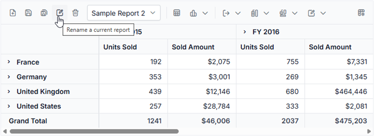

#### Deleting a report

When you select the **"Delete a current report"** option from the toolbar, the [removeReport](#removereport) event is triggered. In this event, an AJAX request is made to the **RemoveReport** method of the Web API controller, passing the current report name to identify and delete the appropriate report from the SQL database.

N> * If the current report **n** from the pivot table is deleted, the pivot table will automatically load the last report from the report list.
N> * When a report is removed from a pivot table with only one report, the SQL database refreshes; however, the pivot table will continue to show the removed report until a new report is added to the pivot table.

For example, if we delete the current report **"Sample Report 2"** from the pivot table, the current report name **"Sample Report 2"** is passed to the **RemoveReport** method, which allows you to identify and delete the report from the SQL database.

[app.component.ts]

```typescript

import { Component, OnInit, ViewChild } from '@angular/core';
import {
  PivotView, FieldListService, CalculatedFieldService,
  ToolbarService, ConditionalFormattingService, ToolbarItems, DisplayOption, IDataSet,
  NumberFormattingService,
  FetchReportArgs,
  LoadReportArgs,
  RemoveReportArgs,
  RenameReportArgs,
  SaveReportArgs
} from '@syncfusion/ej2-angular-pivotview';
import { GridSettings } from '@syncfusion/ej2-pivotview/src/pivotview/model/gridsettings';
import { enableRipple } from '@syncfusion/ej2-base';
import { ChartSettings } from '@syncfusion/ej2-pivotview/src/pivotview/model/chartsettings';
import { DataSourceSettingsModel } from '@syncfusion/ej2-pivotview/src/model/datasourcesettings-model';
enableRipple(false);

@Component({
  selector: 'app-root',
  // specifies the template string for the pivot table component
  providers: [CalculatedFieldService, ToolbarService, ConditionalFormattingService, FieldListService, NumberFormattingService],
  templateUrl: `./app.component.html`
})

export class AppComponent implements OnInit {
  public dataSourceSettings: DataSourceSettingsModel | undefined;
  public gridSettings: GridSettings | undefined;
  public toolbarOptions: ToolbarItems[] | undefined;
  public chartSettings: ChartSettings | undefined;
  public displayOption: DisplayOption | undefined;

  @ViewChild('pivotview')
  public pivotTableObj: PivotView | undefined;

   removeReport(args: RemoveReportArgs): void {
      fetch('https://localhost:44313/Pivot/RemoveReport', {
         method: 'POST',
         headers: {
         'Accept': 'application/json',
         'Content-Type': 'application/json',
         },
         body: JSON.stringify({ reportName: args.reportName })
      }).then(response => {
         this.fetchReport(args as any);
      });
   }

  ngOnInit(): void {
    this.chartSettings = {
      chartSeries: { type: 'Column', animation: { enable: false } },
      enableMultipleAxis: false, value: 'Amount', enableExport: true
    } as ChartSettings;

    this.displayOption = { view: 'Both' } as DisplayOption;
    this.gridSettings = {
      columnWidth: 140
    } as GridSettings;

    this.toolbarOptions = ['New', 'Save', 'SaveAs', 'Rename', 'Remove', 'Load',
      'Grid', 'Chart', 'MDX', 'Export', 'SubTotal', 'GrandTotal', 'ConditionalFormatting', 'FieldList'] as ToolbarItems[];

    this.dataSourceSettings = {
      columns: [{ name: 'Year', caption: 'Production Year' }, { name: 'Quarter' }],
      dataSource: this.getPivotData(),
      expandAll: false,
      filters: [],
      formatSettings: [{ name: 'Amount', format: 'C0' }],
      rows: [{ name: 'Country' }, { name: 'Products' }],
      values: [{ name: 'Sold', caption: 'Units Sold' }, { name: 'Amount', caption: 'Sold Amount' }]
    };
  }
}

```

[PivotController.cs]

```csharp
using Microsoft.AspNetCore.Mvc;
using Microsoft.Data.SqlClient;
using System.Data;

namespace MyWebApp.Controllers
{
    [ApiController]
    [Route("[controller]")]
    public class PivotController : ControllerBase
    {
        [HttpPost]
        [Route("Pivot/RemoveReport")]
        public void RemoveReport([FromBody] Dictionary<string, string> reportArgs)
        {
            RemoveReportFromDB(reportArgs["reportName"]);
        }

        private void RemoveReportFromDB(string reportName)
        {
            SqlConnection sqlConn = OpenConnection();
            SqlCommand cmd1 = null;
            foreach (DataRow row in GetDataTable(sqlConn).Rows)
            {
                if ((row["ReportName"] as string).Equals(reportName))
                {
                    cmd1 = new SqlCommand("delete from ReportTable where ReportName like '%" + reportName + "%'", sqlConn);
                    break;
                }
            }
            cmd1.ExecuteNonQuery();
            sqlConn.Close();
        }
        
        private SqlConnection OpenConnection()
        {
            // Replace with your own connection string.
            string connectionString = @"<Enter your valid connection string here>";
            SqlConnection sqlConn = new SqlConnection(connectionString);
            sqlConn.Open();
            return sqlConn;
        }

        private DataTable GetDataTable(SqlConnection sqlConn)
        {
            string xquery = "select * from ReportTable";
            SqlCommand cmd = new SqlCommand(xquery, sqlConn);
            SqlDataAdapter da = new SqlDataAdapter(cmd);
            DataTable dt = new DataTable();
            da.Fill(dt);
            return dt;
        }
    }
}

```

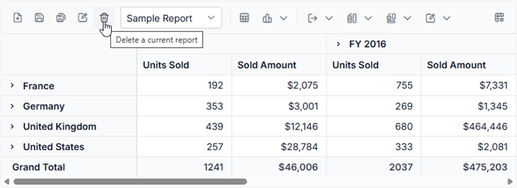

#### Adding a report

When you select the **"Create a new report"** option from the toolbar, the [newReport](#newreport) event is triggered, followed by the [saveReport](#savereport) event. To save this new report to the SQL database, use the [saveReport](#savereport) event triggered later, and then follow the save report briefing in the preceding [topic](#saving-a-report).

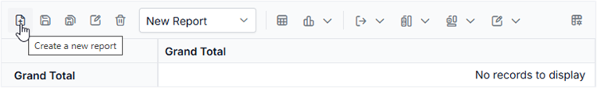

### Limitations with respect to report manipulation

Below points need to be considered when saving the report to SQL Server database.

* **Data source**: Both raw data and aggregated data won't be saved and loaded from the database.
* **Hyperlinks**: Option to link external facts via pivot table cells won't be saved and loaded from the database.
* The pivot table should always load reports from the SQL database based on the data source that is currently bound to it.

> In [this](https://github.com/SyncfusionExamples/Save-and-load-report-from-SQL-database-to-pivot-table) GitHub repository, you can find our Angular Pivot Table sample and ASP.NET Core Web Application to save and load reports from SQL Server database.

## Events

### FetchReport

The [`fetchReport`](https://ej2.syncfusion.com/angular/documentation/api/pivotview/#fetchreport) event is triggered when a user clicks the dropdown list in the toolbar to retrieve saved reports. It includes the [`reportName`](https://ej2.syncfusion.com/angular/documentation/api/pivotview/fetchReportArgs/#reportname) parameter, which holds the name of the selected report. This event allows users to fetch report names from local storage and populate the dropdown list for easy selection.

### LoadReport

The [`loadReport`](https://ej2.syncfusion.com/angular/documentation/api/pivotview/#loadreport) event occurs when a user selects a report from the dropdown list in the toolbar of the Pivot Table. This event allows the user to load the chosen report into the Pivot Table for viewing or analysis. It includes two parameters: [`report`](https://ej2.syncfusion.com/angular/documentation/api/pivotview/loadReportArgs/#report), which contains the details of the selected report, and [`reportName`](https://ej2.syncfusion.com/angular/documentation/api/pivotview/loadReportArgs/#reportname), which specifies the name of the report. These parameters allow the user to load the selected report into the Pivot Table, updating the displayed data based on the chosen report.

### NewReport

The [`newReport`](https://ej2.syncfusion.com/angular/documentation/api/pivotview/#newreport) event is triggered when a user clicks the **New Report** icon in the toolbar. This event allows the user to create a new report and add it to the report list. The event provides a parameter, [`report`](https://ej2.syncfusion.com/angular/documentation/api/pivotview/newReportArgs/#report), which contains details about the new report. By using this event, users can easily start fresh with a new set of data configurations in the Pivot Table, managed through the [`dataSourceSettings`](https://ej2.syncfusion.com/angular/documentation/api/pivotview/index-default#datasourcesettings) property.

### RenameReport

The [`renameReport`](https://ej2.syncfusion.com/angular/documentation/api/pivotview/#renamereport) event is triggered when a user clicks the rename report icon in the toolbar. This event allows users to change the name of a selected report from the report list. It includes the following parameters: [`rename`](https://ej2.syncfusion.com/angular/documentation/api/pivotview/renameReportArgs/#rename), which holds the new report name entered by the user; [`report`](https://ej2.syncfusion.com/angular/documentation/api/pivotview/renameReportArgs/#report), which contains the details of the current report; and [`reportName`](https://ej2.syncfusion.com/angular/documentation/api/pivotview/renameReportArgs/#reportname), which stores the original name of the report.

### RemoveReport

The [`removeReport`](https://ej2.syncfusion.com/angular/documentation/api/pivotview/#removereport) event is triggered when a user clicks the remove report icon in the toolbar. It includes two parameters: [`report`](https://ej2.syncfusion.com/angular/documentation/api/pivotview/removeReportArgs/#report) and [`reportName`](https://ej2.syncfusion.com/angular/documentation/api/pivotview/removeReportArgs/#reportname). These parameters allow the user to identify and remove a selected report from the report list in the Pivot Table.

### SaveReport

The [`saveReport`](https://ej2.syncfusion.com/angular/documentation/api/pivotview/#savereport) event triggers when a user clicks the save report icon in the toolbar. It allows the user to save changes made to the current report. The event includes two parameters: [`report`](https://ej2.syncfusion.com/angular/documentation/api/pivotview/saveReportArgs/#report), which contains the report details, and [`reportName`](https://ej2.syncfusion.com/angular/documentation/api/pivotview/saveReportArgs/#reportname), which specifies the name of the saved report.

### ToolbarRender

The [`toolbarRender`](https://ej2.syncfusion.com/angular/documentation/api/pivotview/#toolbarrender) event triggers when the toolbar is displayed in the Pivot Table. It includes the [`customToolbar`](https://ej2.syncfusion.com/angular/documentation/api/pivotview/toolbarArgs/#customtoolbar) parameter, which allows users to modify existing toolbar items or [add new toolbar items](https://ej2.syncfusion.com/angular/documentation/pivotview/tool-bar#adding-custom-option-to-the-toolbar).













### BeforeExport

The Pivot Table component allows users to export data as PDF, Excel, or CSV files using the toolbar options. The [`beforeExport`](https://ej2.syncfusion.com/angular/documentation/api/pivotview/#beforeexport) event lets users customize settings for the exported document before the export process begins. For instance, users can add a header or footer to a PDF document by setting the [`header`](https://ej2.syncfusion.com/angular/documentation/api/grid/pdfExportProperties/#header) and [`footer`](https://ej2.syncfusion.com/angular/documentation/api/grid/pdfExportProperties/#footer) properties in the [`pdfExportProperties`](https://ej2.syncfusion.com/angular/documentation/api/grid/pdfExportProperties/) object within this event. Similarly, for Excel exports, users can define headers using the [`excelExportProperties`](https://ej2.syncfusion.com/angular/documentation/api/grid/excelExportProperties/) object.

Here’s an example of how to use the `beforeExport` event to customize headers and footers for both PDF and Excel exports:










  


### ActionBegin

The [`actionBegin`](https://ej2.syncfusion.com/angular/documentation/api/pivotview/index-default#actionbegin) event triggers when a user starts an action in the toolbar, such as switching between the pivot table and pivot chart, changing chart types, applying conditional formatting, or exporting data. This event helps users identify the action being performed and provides options to control it. It includes the following parameters:

* [`dataSourceSettings`](https://ej2.syncfusion.com/angular/documentation/api/pivotview/pivotactionbegineventargs#datasourcesettings): Contains the current report settings of the pivot table, including the data source, rows, columns, values, filters, and format settings.
* [`actionName`](https://ej2.syncfusion.com/angular/documentation/api/pivotview/pivotactionbegineventargs#actionname): Indicates the name of the action being performed. Below is a list of toolbar actions and their corresponding names:

   | Action | Action Name |
   |------|-------------|
   | New report | Add new report |
   | Save report | Save current report |
   | Save as report | Save as current report |
   | Rename report | Rename current report |
   | Remove report | Remove current report |
   | Report change | Report change |
   | Conditional Formatting | Open conditional formatting dialog |
   | Number Formatting | Open number formatting dialog |
   | Export menu | PDF export, Excel export, CSV export |
   | Show Fieldlist | Open field list |
   | Show Table | Show table view |
   | Chart menu | Show chart view |
   | Sub-totals menu | Hide sub-totals, Show row sub-totals, Show column sub-totals, Show sub-totals |
   | Grand totals menu | Hide grand totals, Show row grand totals, Show column grand totals, Show grand totals |

* [`cancel`](https://ej2.syncfusion.com/angular/documentation/api/pivotview/pivotactionbegineventargs#cancel): Allows users to stop the current action by setting this option to **true**.

In the example below, the [`actionBegin`](https://ej2.syncfusion.com/angular/documentation/api/pivotview/index-default#actionbegin) event is used to prevent the "Add new report" and "Save current report" actions by setting `args.cancel` to **true**. This stops these specific toolbar actions from proceeding. The code demonstrates how to control toolbar interactions effectively.













### ActionComplete

The [`actionComplete`](https://ej2.syncfusion.com/angular/documentation/api/pivotview/index-default#actioncomplete) event triggers after a toolbar action, such as switching between a pivot table and pivot chart, changing chart types, applying conditional formatting, or exporting data, is completed. This event helps users track the completion of these actions at runtime. It includes the following parameters:

- [`dataSourceSettings`](https://ej2.syncfusion.com/angular/documentation/api/pivotview/pivotactioncompleteeventargs#datasourcesettings): Contains the current data source settings, including the input data, rows, columns, values, filters, and format settings.
- [`actionName`](https://ej2.syncfusion.com/angular/documentation/api/pivotview/pivotactioncompleteeventargs#actionname): Indicates the name of the completed action. The table below lists the toolbar actions and their corresponding names:

   | Action | Action Name |
   |------|-------------|
   | New report | New report added |
   | Save report | Report saved |
   | Save as report | Report re-saved |
   | Rename report | Report renamed |
   | Remove report | Report removed |
   | Report change | Report changed |
   | Conditional Formatting | Conditionally formatted |
   | Number Formatting | Number formatted |
   | Export menu | PDF exported, Excel exported, CSV exported |
   | Show Fieldlist | Field list closed |
   | Show Table | Table view shown |
   | Sub-totals menu | Sub-totals hidden, Row sub-totals shown, Column sub-totals shown, Sub-totals shown |
   | Grand totals menu | Grand totals hidden, Row grand totals shown, Column grand totals shown, Grand totals shown |

- [`actionInfo`](https://ej2.syncfusion.com/angular/documentation/api/pivotview/pivotactioncompleteeventargs#actioninfo): Provides specific details about the completed action, such as the report name when adding a new report.













### ActionFailure

The [`actionFailure`](https://ej2.syncfusion.com/angular/documentation/api/pivotview/index-default#actionfailure) event occurs when a user action in the Pivot Table does not complete as expected. This event helps users understand what went wrong during interactions with the grouping bar.

- [`actionName`](https://ej2.syncfusion.com/angular/documentation/api/pivotview/pivotactionfailureeventargs#actionname): Identifies which user action did not succeed. The table below lists the actions and their corresponding names:

   | Action | Action Name | 
   |------|-------------|
   | New report | Add new report |
   | Save report | Save current report |
   | Save as report | Save as current report |
   | Rename report | Rename current report |
   | Remove report | Remove current report |
   | Report change | Report change |
   | Conditional Formatting | Open conditional formatting dialog |
   | Number Formatting | Open number formatting dialog |
   | Export menu | PDF export, Excel export, CSV export |
   | Show Fieldlist | Open field list |
   | Show Table | Show table view |
   | Chart menu | Show chart view |
   | Sub-totals menu | Hide sub-totals, Show row sub-totals, Show column sub-totals, Show sub-totals |
   | Grand totals menu | Hide grand totals, Show row grand totals, Show column grand totals, Show grand totals |

- [`errorInfo`](https://ej2.syncfusion.com/angular/documentation/api/pivotview/pivotactionfailureeventargs#errorinfo): Provides details about the error that occurred for the specific user action.










  


## See Also

* [Toolbar Component](../toolbar/getting-started)