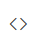

# Basic Text Styling in Angular Rich Text Editor component

The Rich Text Editor's basic styles feature provides essential formatting options, including bold, italic, underline, strikethrough, subscript, superscript, and case changes. These fundamental tools enable users to enhance and customize their text effortlessly. By leveraging these options, users can ensure their content is both visually appealing and well-structured.

## Available Text Styles

The table below lists the available text styles in the Rich Text Editor's toolbar.

| Name | Icons | Summary | Initialization |
|----------------|---------|---------|------------------------------------------|
| Bold  |  | Makes text thicker and darker | toolbarSettings: { items: ['Bold']} | `<b>bold</b>` |
| Italic |  | Slants text to the right | toolbarSettings: { items: ['Italic']} | `<em>italic</em>` |
| Underline |  | Adds a line beneath the text | toolbarSettings: { items: ['Underline']} |
| StrikeThrough |  | Applies a line through the text. |toolbarSettings: { items: ['StrikeThrough']}|
| InlineCode | | Formats text as inline code | toolbarSettings: { items: ['InlineCode']} | `<code>inline code</code>`|
| SubScript |  | Positions text slightly below the normal line |toolbarSettings: { items: ['SubScript']}|
| SuperScript |  | Positions text slightly above the normal line |toolbarSettings: { items: ['SuperScript’']}|
| LowerCase |  |  Converts text to lowercase |toolbarSettings: { items: ['LowerCase']}|
| UpperCase |  | Converts text to uppercase |toolbarSettings: { items: ['UpperCase’']}|

Please refer to the sample below to add these basic text styling options in the Rich Text Editor.













## See Also

[Customizing Font Family, Size, and Color in Rich Text Editor](https://ej2.syncfusion.com/angular/documentation/rich-text-editor/font-styling)