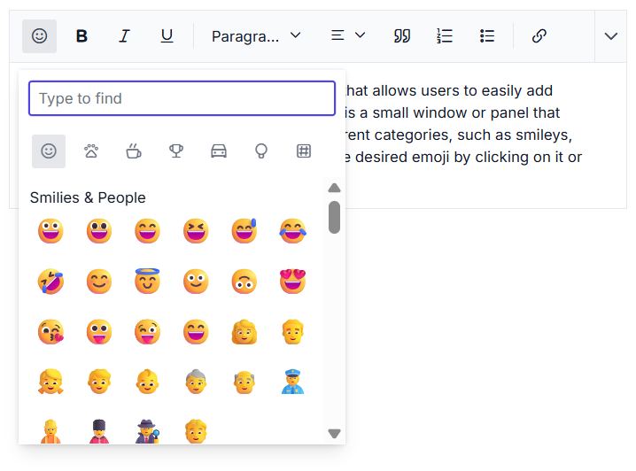

# Emoji Picker in Angular RichTextEditor component

An emoji picker is a tool that allows users to add emojis or emoticons to their text easily. Typically, it is a small window or panel that displays a variety of emojis arranged in different categories, such as smileys, animals, food, and so on. Users can select the desired emoji by clicking on it or by typing its name in a search bar.

## Enabling the toolbar option and custom emojis.

Add the `EmojiPicker` tool to the toolbar of the RichTextEditor by utilizing the `toolbarSettings` [items](../api/rich-text-editor/toolbarSettings/#items) property.

By default, a predefined set of emojis is configured. However, you can customize these icons according to your needs. To achieve this, utilize the [emojiPickerSettings](../api/rich-text-editor/richTextEditorModel/#emojiPickerSettings) property.

```ts

import { Component, ViewChild, ViewEncapsulation } from '@angular/core';
import { RichTextEditorComponent, ToolbarService, HtmlEditorService, ImageService, QuickToolbarService, LinkService, EmojiPickerService } from '@syncfusion/ej2-angular-richtexteditor';

@Component({
    selector: 'control-content',
    templateUrl: 'insert-emoticons.html',
    encapsulation: ViewEncapsulation.None,
    styleUrls: ['style.css'],
    providers: [ToolbarService, LinkService, ImageService, HtmlEditorService, QuickToolbarService, EmojiPickerService]
})

export class AppComponent {

    @ViewChild('emojiPickerRTE')
    public emojiPickerRTE: RichTextEditorComponent;

    public toolbarSettings: ToolbarSettingsModel = {
        items: ['Bold', 'Italic', 'Underline', '|', 'Formats', 'Alignments', 'OrderedList',
        'UnorderedList', '|', 'CreateLink', 'Image', '|', 'SourceCode', 'EmojiPicker', '|', 'Undo', 'Redo'
    ]
    };
    public emojiPickerSettings: EmojiSettingsModel =
    {
        iconsSet: [{name: 'Smilies & People', code: '1F600', iconCss: 'e-emoji', 
        icons: [{ code: '1F600', desc: 'Grinning face' },
        { code: '1F603', desc: 'Grinning face with big eyes' },
        { code: '1F604', desc: 'Grinning face with smiling eyes' },
        { code: '1F606', desc: 'Grinning squinting face' },
        { code: '1F605', desc: 'Grinning face with sweat' },
        { code: '1F602', desc: 'Face with tears of joy' },
        { code: '1F923', desc: 'Rolling on the floor laughing' },
        { code: '1F60A', desc: 'Smiling face with smiling eyes' }]
        }, {
        name: 'Animals & Nature', code: '1F435', iconCss: 'e-animals',
        icons: [{ code: '1F436', desc: 'Dog face' },
        { code: '1F431', desc: 'Cat face' },
        { code: '1F42D', desc: 'Mouse face' },
        { code: '1F439', desc: 'Hamster face' },
        { code: '1F430', desc: 'Rabbit face' },
        { code: '1F98A', desc: 'Fox face' }]
        }, {
        name: 'Food & Drink', code: '1F347', iconCss: 'e-food-and-drinks',
         icons: [{ code: '1F34E', desc: 'Red apple' },
        { code: '1F34C', desc: 'Banana' },
        { code: '1F347', desc: 'Grapes' },
        { code: '1F353', desc: 'Strawberry' },
        { code: '1F35E', desc: 'Bread' },
        { code: '1F950', desc: 'Croissant' },
        { code: '1F955', desc: 'Carrot' },
        { code: '1F354', desc: 'Hamburger' }]
        }, {
        name: 'Activities', code: '1F383', iconCss: 'e-activities',
        icons: [{ code: '26BD', desc: 'Soccer ball' },
        { code: '1F3C0', desc: 'Basketball' },
        { code: '1F3C8', desc: 'American football' },
        { code: '26BE', desc: 'Baseball' },
        { code: '1F3BE', desc: 'Tennis' },
        { code: '1F3D0', desc: 'Volleyball' },
        { code: '1F3C9', desc: 'Rugby football' }]
        }, {
        name: 'Travel & Places', code: '1F30D', iconCss: 'e-travel-and-places',
        icons: [{ code: '2708', desc: 'Airplane' },
        { code: '1F697', desc: 'Automobile' },
        { code: '1F695', desc: 'Taxi' },
        { code: '1F6B2', desc: 'Bicycle' },
        { code: '1F68C', desc: 'Bus' }]
        }, {
        name: 'Objects', code: '1F507', iconCss: 'e-objects', icons: [{ code: '1F4A1', desc: 'Light bulb' },
        { code: '1F526', desc: 'Flashlight' },
        { code: '1F4BB', desc: 'Laptop computer' },
        { code: '1F5A5', desc: 'Desktop computer' },
        { code: '1F5A8', desc: 'Printer' },
        { code: '1F4F7', desc: 'Camera' },
        { code: '1F4F8', desc: 'Camera with flash' },
        { code: '1F4FD', desc: 'Film projector' }]
        }, {
        name: 'Symbols', code: '1F3E7', iconCss: 'e-symbols', icons: [{ code: '274C', desc: 'Cross mark' },
        { code: '2714', desc: 'Check mark' },
        { code: '26A0', desc: 'Warning sign' },
        { code: '1F6AB', desc: 'Prohibited' },
        { code: '2139', desc: 'Information' },
        { code: '267B', desc: 'Recycling symbol' },
        { code: '1F6AD', desc: 'No smoking' }]
        }]
    }
}

```

Additionally, you have the option to customize the icons of toolbar items using the [iconCss](../api/rich-text-editor/emojiIconsSet/#iconCss) and [code](../api/rich-text-editor/emojiIconsSet/#code) properties. The `iconCSS` property allows you to define a custom CSS class for the toolbar item icon, while the `code` property enables you to specify the Unicode character code for the icon.

When both `iconCSS` and `code` properties are provided, the `iconCSS` property takes precedence in determining the appearance of the toolbar item icon.

Additionally, you have the option to enhance the user experience by implementing a filtering feature for efficiently managing a large dataset of emojis. By setting the [showSearchBox](../api/rich-text-editor/emojiSettings/#showSearchBox) property to true (which is the default value), users will be able to utilize a search box to filter the displayed emojis according to their preferences.

The following code example shows how to add the emoji picker tool in the RichTextEditor.










  


> Rich Text Editor features are segregated into individual feature-wise modules. In this demo, we have used the following injectable service `EmojiPickerService` in the `@NgModule.providers section`.

## Using the shortcut key to open the emoji picker

Quickly access the emoji picker by pressing the colon (:) key while typing a word prefix in an editor, allowing instant emoji selection and display. Moreover, continue typing in the editor after the colon (:) to filter and refine your search for the desired emojis.



## Navigating and selecting emojis using the keyboard

The emoji picker popup offers keyboard navigation options, allowing you to move the emoji focus from one emoji to another. The following keys are used for navigation:

`Arrow keys`: Use the arrow keys (up, down, left, right) to move the emoji focus in the corresponding direction.

`Enter`: Press Enter key to select the currently focused emoji.

`Escape`: Press Escape to close the emoji picker popup without selecting an emoji.