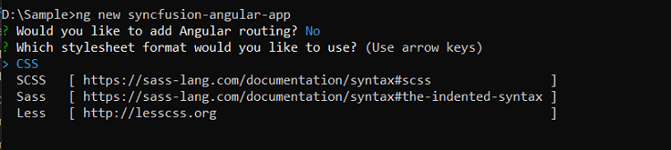

# Getting started with Angular Rich text editor component

This section explains the steps required to create a simple Angular Rich Text Editor component and configure its available functionalities.

To get start quickly with Angular Rich Text Editor using CLI and Schematics, you can check on this video:



## Setup Angular Environment

You can use [Angular CLI](https://github.com/angular/angular-cli) to setup your Angular applications. To install Angular CLI use the following command.

```bash
npm install -g @angular/cli@16.0.1
```

## Create an Angular Application

Start a new Angular application using below Angular CLI command.

```bash
ng new my-app
```
This command will prompt you for a few settings for the new project, such as whether to add Angular routing and which stylesheet format to use.



By default, it will create a CSS-based application.

Next, navigate to the created project folder:

```
cd my-app
```
## Adding Syncfusion Rich Text Edior package

All the available Essential JS 2 packages are published in [npmjs.com](https://www.npmjs.com/~syncfusionorg) registry.

To install Rich Text Editor component, use the following command.

```bash
npm install @syncfusion/ej2-angular-richtexteditor --save
```

> The **--save** will instruct NPM to include the rich text editor package inside of the **dependencies** section of the **package.json**.

## Adding CSS reference

The following CSS files are available in **../node_modules/@syncfusion** package folder.
This can be referenced in [src/styles.css] using following code.

```css

  @import '../../node_modules/@syncfusion/ej2-base/styles/material.css';
  @import '../../node_modules/@syncfusion/ej2-icons/styles/material.css';
  @import '../../node_modules/@syncfusion/ej2-buttons/styles/material.css';
  @import '../../node_modules/@syncfusion/ej2-splitbuttons/styles/material.css';
  @import '../../node_modules/@syncfusion/ej2-inputs/styles/material.css';
  @import '../../node_modules/@syncfusion/ej2-lists/styles/material.css';
  @import '../../node_modules/@syncfusion/ej2-navigations/styles/material.css';
  @import '../../node_modules/@syncfusion/ej2-popups/styles/material.css';
  @import '../../node_modules/@syncfusion/ej2-dropdowns/styles/material.css';
  @import '../../node_modules/@syncfusion/ej2-richtexteditor/styles/material.css';

```

## Adding Rich Text Editor component

Modify the template in the [src/app/app.component.ts] file to render the Rich Text Editor component. Add the Angular Rich Text Editor by using the `<ejs-richtexteditor>` selector in the `template` section of the app.component.ts file.

```typescript

import { Component } from '@angular/core';
import { ToolbarService, LinkService, ImageService, HtmlEditorService } from '@syncfusion/ej2-angular-richtexteditor';
import { RichTextEditorAllModule } from '@syncfusion/ej2-angular-richtexteditor'
@Component({
  imports: [
    RichTextEditorAllModule
  ],
  standalone: true,
  selector: 'app-root',
  template: `<ejs-richtexteditor id='defaultRTE'>
  <ng-template #valueTemplate>
  <p>The Rich Text Editor component is WYSIWYG ("what you see is what you get") editor that provides the best user experience to create and update the content.
  Users can format their content using standard toolbar commands.</p>
  <p><b>Key features:</b></p>
  <ul><li><p>Provides &lt;IFRAME&gt; and &lt;DIV&gt; modes.</p></li>
  <li><p>Capable of handling markdown editing.</p></li>
  <li><p>Contains a modular library to load the necessary functionality on demand.</p></li>
  <li><p>Provides a fully customizable toolbar.</p></li>
  <li><p>Provides HTML view to edit the source directly for developers.</p></li>
  <li><p>Supports third-party library integration.</p></li>
  <li><p>Allows preview of modified content before saving it.</p></li>
  <li><p>Handles images, hyperlinks, video, hyperlinks, uploads, etc.</p></li>
  <li><p>Contains undo/redo manager. </p></li>
  <li><p>Creates bulleted and numbered lists.</p></li>
  </ul>
  </ng-template>
  </ejs-richtexteditor>`,
  providers: [ToolbarService, LinkService, ImageService, HtmlEditorService]
})

export class AppComponent {

}

```

## Module Injection

To create Rich Text Editor with additional features, inject the required modules. The following modules are used to extend Rich Text Editor's basic functionality.

* **HtmlEditor** - Inject this module to use Rich Text Editor as html editor.
* **Image** - Inject this module to use image feature in Rich Text Editor.
* **Link** - Inject this module to use link feature in Rich Text Editor.
* **QuickToolbar** - Inject this module to use quick toolbar feature for the target element.
* **Toolbar** - Inject this module to use Toolbar feature.

These modules should be injected into the **providers** section of root **NgModule** or component class.

> Additional feature modules are available [here](./module.md).

## Configure the Toolbar

Configure the toolbar with custom tools using items field of toolbarSettings property in your application.










  


## Insert images and links

The image module inserts an image into Rich Text Editor’s content area, and the link module links external resources such as website URLs, to selected text in the Rich Text Editor’s content, respectively.

The link inject module adds a link icon to the toolbar and the image inject module adds an image icon to the toolbar.

Specifies the items to be rendered in the quick toolbar based on the target element such image, link, and text element. The quick toolbar opens to customize the element by clicking the target element.










  


## Run the application

Use the following command to run the application in the browser.

```bash
ng serve --open
```

## Retrieve the formatted content

To retrieve the editor contents, use the value property of Rich Text Editor.

```typescript

  let rteValue: string = this.rteObj.value;

```

Or, you can use the [getHtml](https://ej2.syncfusion.com/angular/documentation/api/rich-text-editor/#gethtml) public method to retrieve the Rich Text Editor content.

```typescript

  let rteValue: string = this.rteObj.getHtml();

```

To fetch the Rich Text Editor's text content, use [getText](https://ej2.syncfusion.com/angular/documentation/api/rich-text-editor/#gettext) method.

```typescript
  
  let rteValue: string = this.rteObj.contentModule.getText();

```

## Retrieve the number of characters in the Rich Text Editor

To get the maximum number of characters in the Rich Text Editor's content, use [`getCharCount`](https://ej2.syncfusion.com/angular/documentation/api/rich-text-editor/#getcharcount)

```typescript

  let rteCount: number = this.rteObj.getCharCount();

```

> You can refer to our [Angular Rich Text Editor](https://www.syncfusion.com/angular-components/angular-wysiwyg-rich-text-editor) feature tour page for its groundbreaking feature representations. You can also explore our [Angular Rich Text Editor example](https://ej2.syncfusion.com/angular/demos/#/bootstrap4/rich-text-editor/rich-text-editor) to knows how to render and configure the rich text editor tools.

## See Also

* [How to change the editor type](https://ej2.syncfusion.com/angular/documentation/rich-text-editor/editor-modes)
* [How to render the iframe](https://ej2.syncfusion.com/angular/documentation/rich-text-editor/iframe)
* [How to render the toolbar in inline mode](https://ej2.syncfusion.com/angular/documentation/rich-text-editor/inline-mode)
* [How to insert Emoticons](https://ej2.syncfusion.com/angular/demos/#/material/rich-text-editor/insert-emoticons)
* [Blog posting using Rich Text Editor](https://ej2.syncfusion.com/angular/demos/#/material/rich-text-editor/blog-posting)
* [Reactive Form with Rich Text Editor](https://ej2.syncfusion.com/angular/demos/#/material/rich-text-editor/reactive-form)
* [Accessibility in Rich text editor](https://ej2.syncfusion.com/angular/documentation/rich-text-editor/accessibility)
* [Keyboard support in Rich text editor](https://ej2.syncfusion.com/angular/documentation/rich-text-editor/keyboard-support)
* [Globalization in Rich text editor](https://ej2.syncfusion.com/angular/documentation/rich-text-editor/globalization)