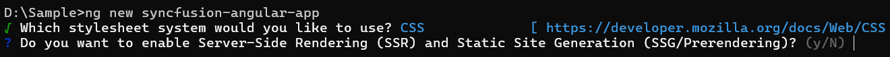
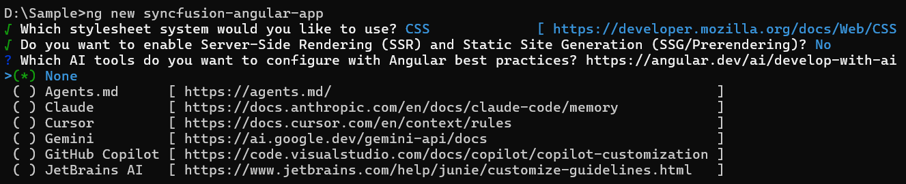
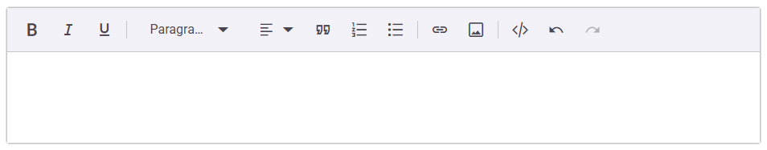

# Getting Started with Angular Rich Text Editor

The Syncfusion Angular Rich Text Editor is a WYSIWYG (What You See Is What You Get) editor that enables users to create, edit, and format rich text content with features like multimedia insertion, lists, and links. This section describes how to create a basic Angular Rich Text Editor component and configure its core features.

> **Ready to streamline your Syncfusion<sup style="font-size:70%">&reg;</sup> Angular development?** Discover the full potential of Syncfusion<sup style="font-size:70%">&reg;</sup> Angular components with Syncfusion<sup style="font-size:70%">&reg;</sup> AI Coding Assistant. Effortlessly integrate, configure, and enhance your projects with intelligent, context-aware code suggestions, streamlined setups, and real-time insights—all seamlessly integrated into your preferred AI-powered IDEs like VS Code, Cursor, Syncfusion<sup style="font-size:70%">&reg;</sup> CodeStudio and more. [Explore Syncfusion<sup style="font-size:70%">&reg;</sup> AI Coding Assistant](https://ej2.syncfusion.com/angular/documentation/mcp-server/ai-coding-assistant/getting-started)

To get started quickly with the Angular Rich Text Editor using CLI and Schematics, refer to this video tutorial:



## Prerequisites

This guide uses the Angular CLI to manage Angular applications. It requires Node `24.13.0` or higher. For more information about Angular CLI and its features, refer the [Angular CLI](https://github.com/angular/angular-cli).

N> For information about supported Angular versions and Syncfusion package compatibility, refer to the [Version Compatibility](https://ej2.syncfusion.com/angular/documentation/upgrade/version-compatibility) documentation.

## Setup Angular Environment

You can use [Angular CLI](https://github.com/angular/angular-cli) to set up your Angular applications. To install Angular CLI use the following command.

```bash
npm install -g @angular/cli
```

## Create an Angular Application

Create a new Angular application using the following Angular CLI command:

```bash
ng new my-app
```
This command will prompt you for a few settings for the new project, such as which stylesheet format to use.


By default, the Angular CLI creates a CSS-based application.

Then the CLI also displays an additional prompt asking whether to enable Server‑Side Rendering (SSR) and Static Site Generation (SSG), as shown below:



For this setup, when prompted for the Server-side rendering (SSR) option, choose the appropriate configuration.

Then the CLI displays another prompt related to AI tooling support, as shown below:



Any preferred option can be selected based on the development workflow or project needs.

Next, navigate to the project folder:

```bash
cd my-app
```

## Adding Syncfusion Rich Text Editor package

All available Essential JS 2 packages are published in the [npmjs.com](https://www.npmjs.com/~syncfusionorg) registry. Install the Rich Text Editor component with the following command:

```bash
npm install @syncfusion/ej2-angular-richtexteditor
```

## Adding CSS reference

Syncfusion provides multiple themes for the Rich Text Editor component. For a complete list of available themes, refer to the [themes packages](https://ej2.syncfusion.com/angular/documentation/appearance/overview#theme-packages). 

To apply the [Material 3](https://www.npmjs.com/package/@syncfusion/ej2-material3-theme) theme, install the corresponding theme package by using the following command:

```bash
npm install @syncfusion/ej2-material3-theme
```

The installed theme package includes an `index.css` file that automatically imports all the required dependency styles. Import the following stylesheet into `src/styles.css`.

```css
@import '../node_modules/@syncfusion/ej2-material3-theme/styles/rich-text-editor/index.css';
```

## Module Injection

The following modules are used to utilize the basic capabilities of the Rich Text Editor:

* **HtmlEditorService** - Inject this module to use the Rich Text Editor as HTML editor.
* **ImageService** - Inject this module to use the image feature in Rich Text Editor.
* **LinkService** - Inject this module to use the link feature in Rich Text Editor.
* **QuickToolbarService** - Inject this module to use the quick toolbar feature for the target element.
* **ToolbarService** - Inject this module to use the Toolbar feature.

These modules can be injected as `services` through the component's `providers` array, as demonstrated in the following example.







T> Additional feature modules are available [here](https://ej2.syncfusion.com/angular/documentation/rich-text-editor/module).

## Adding Rich Text Editor component

Modify the template in the `src/app/app.ts` file to render the Rich Text Editor component. Add the Angular Rich Text Editor by using the `<ejs-richtexteditor>` selector in the `template` section of the app.ts file.











## Run the Application

Use the following command to run the application in the browser.

```bash
ng serve --open
```

The Syncfusion<sup style="font-size:70%">&reg;</sup> Angular Rich Text Editor is displayed in the browser as shown below.



## See Also

**Documentation links**

* [How to change the editor type](./editor-types/editor-mode.md)
* [How to render the iframe](./editor-types/iframe.md)
* [How to render the toolbar in inline mode](./editor-types/inline-editing.md)
* [Accessibility in Rich Text Editor](./accessibility.md)
* [Keyboard support in Rich Text Editor](./keyboard-support.md)
* [Globalization in Rich Text Editor](./globalization.md)

**Live samples**

* [How to insert Emoticons](https://ej2.syncfusion.com/angular/demos/#/tailwind3/rich-text-editor/insert-emoticons)
* [Blog posting using Rich Text Editor](https://ej2.syncfusion.com/angular/demos/#/tailwind3/rich-text-editor/blog-posting)
* [Reactive Form with Rich Text Editor](https://ej2.syncfusion.com/angular/demos/#/tailwind3/rich-text-editor/reactive-form)