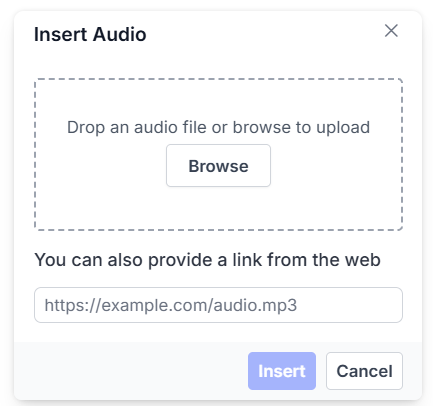
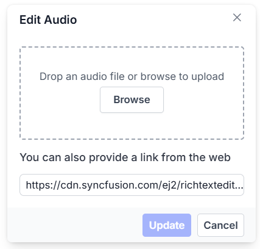
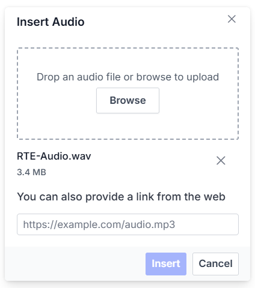

# Audios in Angular Rich Text Editor Component

The Rich Text Editor enables insertion of audio files from online sources or local machines. You can insert the audio with the following list of options in the [insertAudioSettings](https://ej2.syncfusion.com/angular/documentation/api/rich-text-editor/#insertaudiosettings) property.

## Configuring the audio toolbar item

The audio feature is enabled by adding the `Audio` item to the toolbar using the [toolbarSettings.items](https://ej2.syncfusion.com/angular/documentation/api/rich-text-editor/toolbarSettings/#items) property. The `AudioService` must be injected into the Angular module as shown below:

> To use Audio feature, inject `AudioService` in the provider section.

The following example demonstrates configuring the audio toolbar item:










  


## Audio save formats

The audio files can be saved as `Blob` or `Base64` URL by using the [insertAudioSettings.saveFormat](https://ej2.syncfusion.com/angular/documentation/api/rich-text-editor/audioSettingsModel/#saveformat) property, which is of enum type, and the generated URL will be set to the `src` attribute of the `<source>` tag.

> By default, the `saveFormat` is set to `Blob`.

```html

<audio>
    <source src="blob:http://ej2.syncfusion.com/3ab56a6e-ec0d-490f-85a5-f0aeb0ad8879" type="audio/mp3">
</audio>

<audio>
    <source src="data:audio/mp3;base64,iVBORw0KGgoAAAANSUhEUgAAADAAAAAwCAYAAABXAvmHA" type="audio/mp3">
</audio>

```

## Inserting audio

You can insert audio from either the hosted link or the local machine, by clicking the audio button in the editor's toolbar. On clicking the audio button, a dialog opens, which allows you to insert audio from the web URL.

### Inserting audio from web URLs

By default, the audio toolbar item opens a dialog for inserting audio from an online source. Entering a valid URL will be added to the `src` attribute of the `<source>` tag.



### Uploading audio from local machine

The audio dialog includes a `browse` option to select audio file from a local machine and insert it into the Rich Text Editor content.

If the [insertAudioSettings.path](https://ej2.syncfusion.com/angular/documentation/api/rich-text-editor/#insertaudiosettings) is not specified, the audio is converted to a `Blob` or `Base64` URL and inserted into the editor.

## Maximum file size restriction

You can restrict the audio uploaded from the local machine when the uploaded audio file size is greater than the allowed size by using the [insertAudioSettings.maxFileSize](https://ej2.syncfusion.com/angular/documentation/api/rich-text-editor/audioSettingsModel/#maxfilesize) property. By default, the maximum file size is 30000000 bytes. You can configure this size as follows.

In the following illustration, the audio size has been validated before uploading, and it is determined whether the audio has been uploaded or not.

```typescript

import { Component } from '@angular/core';
import { ToolbarService, QuickToolbarService, LinkService, HtmlEditorService, AudioService } from '@syncfusion/ej2-angular-richtexteditor';
import { RichTextEditorAllModule } from '@syncfusion/ej2-angular-richtexteditor'

@Component( {
    imports: [
    RichTextEditorAllModule
    ],
    selector: 'app-root',
    standalone: true,
    template: `<ejs-richtexteditor id='' [toolbarSettings]='toolbarSettings' [insertAudioSettings] ='insertAudioSettings'>
    </ejs-richtexteditor>`,
    providers: [ToolbarService, LinkService, ImageService, HtmlEditorService, QuickToolbarService, AudioService, TableService, PasteCleanupService],
} )

export class AppComponent {
    private toolbarSettings: object = {
        items: [ 'Audio', 'Bold', 'Italic', 'Underline', '|', 'Formats', 'Alignments', 'Blockquote', 'OrderedList', 'UnorderedList', '|', 'CreateLink', 'CreateTable', 'Image', '|', 'SourceCode', '|', 'Undo', 'Redo' ]
    };
    private  insertAudioSettings: Object = {
        maxFileSize: 30000000
    };
}

```

## Saving audio to the server

[saveFormat](https://ej2.syncfusion.com/angular/documentation/api/rich-text-editor/audioSettings/#saveformat) sets the default save format of the audio element when inserted. Possible options are: `Blob` and `Base64`.

[saveUrl](https://ej2.syncfusion.com/angular/documentation/api/rich-text-editor/audioSettings/#saveurl) provides URL to map the action result method to save the audio.

[removeUrl](https://ej2.syncfusion.com/angular/documentation/api/rich-text-editor/audioSettings/#removeurl) provides URL to map the action result method to remove the audio.

### Server-side action

The selected audio can be uploaded to the required destination using the controller action below. Map this method name in [insertAudioSettings.saveUrl](https://ej2.syncfusion.com/angular/documentation/api/rich-text-editor/audioSettingsModel/#saveurl) and provide the required destination path through [insertAudioSettings.path](https://ej2.syncfusion.com/angular/documentation/api/rich-text-editor/audioSettingsModel/#path) properties.

> If you want to insert lower-sized audio files in the editor and don't want a specific physical location for saving the audio, you can opt to save the format as `Base64`.

In the following code blocks, the audio module has been injected and can insert the audio files saved in the specified path.

```typescript

import { Component } from '@angular/core';
import { ToolbarService, QuickToolbarService, LinkService, HtmlEditorService, AudioService } from '@syncfusion/ej2-angular-richtexteditor';

@Component( {
    selector: 'app-root',
    template: `<ejs-richtexteditor [toolbarSettings] = "toolbarSettings" [insertAudioSettings] = "insertAudioSettings"></ejs-richtexteditor>`,
    providers: [ToolbarService, QuickToolbarService, LinkService, AudioService, HtmlEditorService,],
})
export class AppComponent {
    public toolbarSettings: object = {
        items: ['Audio']
    };
    public insertAudioSettings: Object = {
        saveUrl: "[SERVICE_HOSTED_PATH]/api/uploadbox/SaveFiles",
        path: "[SERVICE_HOSTED_PATH]/Files/"
    };
}
```

The server-side action for saving audio in ASP.NET Core:

```csharp

using System;
using System.IO;
using FileUpload.Models;
using System.Diagnostics;
using System.Net.Http.Headers;
using Microsoft.AspNetCore.Mvc;
using Microsoft.AspNetCore.Http;
using System.Collections.Generic;
using Microsoft.AspNetCore.Hosting;

namespace FileUpload.Controllers
{
    public class HomeController : Controller
    {
        private IHostingEnvironment hostingEnv;

        public HomeController(IHostingEnvironment env)
        {
            hostingEnv = env;
        }

        public IActionResult Index()
        {
            return View();
        }

        [AcceptVerbs("Post")]
        public void SaveFiles(IList<IFormFile> UploadFiles)
        {
            try
            {
                foreach (IFormFile file in UploadFiles)
                {
                    if (UploadFiles != null)
                    {
                        string filename = ContentDispositionHeaderValue.Parse(file.ContentDisposition).FileName.Trim('"');
                        filename = hostingEnv.WebRootPath + "\\Files" + $@"\{filename}";

                        // Create a new directory, if it does not exists
                        if (!Directory.Exists(hostingEnv.WebRootPath + "\\Files"))
                        {
                            Directory.CreateDirectory(hostingEnv.WebRootPath + "\\Files");
                        }

                        if (!System.IO.File.Exists(filename))
                        {
                            using (FileStream fs = System.IO.File.Create(filename))
                            {
                                file.CopyTo(fs);
                                fs.Flush();
                            }
                            Response.StatusCode = 200;
                        }
                    }
                }
            }
            catch (Exception)
            {
                Response.StatusCode = 204;
            }
        }

        [ResponseCache(Duration = 0, Location = ResponseCacheLocation.None, NoStore = true)]
        public IActionResult Error()
        {
            return View(new ErrorViewModel { RequestId = Activity.Current?.Id ?? HttpContext.TraceIdentifier });
        }
    }
}

```

### Renaming audio before inserting

You can use the [insertAudioSettings](https://ej2.syncfusion.com/angular/documentation/api/rich-text-editor/#insertaudiosettings) property, to specify the server handler to upload the selected audio. Then by binding the [fileUploadSuccess](https://ej2.syncfusion.com/angular/documentation/api/rich-text-editor/#fileuploadsuccess) event allows renaming audio files before insertion by updating the file name in the audio dialog:

```HTML

<ejs-richtexteditor [toolbarSettings]='toolbarSettings' [insertAudioSettings] = 'insertAudioSettings' (fileUploadSuccess) = 'onAudioUploadSuccess($event)' >
<ng-template #valueTemplate>
    <p>The Rich Text Editor is WYSIWYG ("what you see is what you get") editor useful to create and edit content, and return the valid <a href="https://ej2.syncfusion.com/home/" target="_blank">HTML markup</a> or <a href="https://ej2.syncfusion.com/home/" target="_blank">markdown</a> of the content</p>
</ng-template>
</ejs-richtexteditor>

```

```typescript

import { Component } from '@angular/core';
import { ToolbarService, QuickToolbarService, LinkService, HtmlEditorService, AudioService,} from '@syncfusion/ej2-angular-richtexteditor';

@Component({
  selector: 'app-root',
  templateUrl: `app.component.html`,
  providers: [ ToolbarService, QuickToolbarService, LinkService, AudioService, HtmlEditorService ],
})

export class AppComponent {
    public toolbarSettings: object = {
        items: ['Audio'],
    };
    public insertAudioSettings: Object = {
        saveUrl: "[SERVICE_HOSTED_PATH]/api/uploadbox/Rename",
        path: "[SERVICE_HOSTED_PATH]/Files/"
    };
    public onAudioUploadSuccess = (args: any) => {
            alert("Get the new file name here");
            if( args.e.currenTarget.getResponseHeader('name') != null ){
                args.file.name = args.e.currentTarget.getResponseHeader('name');
                let fileName : any = document.querySelector(".e-file-name")[0];
                fileName.innerHTML = args.fileData.name.replace(document.querySelectorAll(".e-file-type")[0].innerHTML , '');
                fileName.title = args.fileData.name;
            }
    };
}

```

To configure the server-side handler, refer to the below code.

```csharp
int x = 0;
string file;
[AcceptVerbs("Post")]
public void Rename()
{
    try
    {
        var httpPostedFile = System.Web.HttpContext.Current.Request.Files["UploadFiles"];
        fileName = httpPostedFile.FileName;
        if (httpPostedFile != null)
        {
            var fileSave = System.Web.HttpContext.Current.Server.MapPath("~/Files");
            if (!Directory.Exists(fileSave))
            {
                Directory.CreateDirectory(fileSave);
            }
            var fileName = Path.GetFileName(httpPostedFile.FileName);
            var fileSavePath = Path.Combine(fileSave, fileName);
            while (System.IO.File.Exists(fileSavePath))
            {
                fileName = "rteFiles" + x + "-" + fileName;
                fileSavePath = Path.Combine(fileSave, fileName);
                x++;
            }
            if (!System.IO.File.Exists(fileSavePath))
            {
                httpPostedFile.SaveAs(fileSavePath);
                HttpResponse Response = System.Web.HttpContext.Current.Response;
                Response.Clear();
                Response.Headers.Add("name", fileName);
                Response.ContentType = "application/json; charset=utf-8";
                Response.StatusDescription = "File uploaded succesfully";
                Response.End();
            }
        }
    }
    catch (Exception e)
    {
        HttpResponse Response = System.Web.HttpContext.Current.Response;
        Response.Clear();
        Response.ContentType = "application/json; charset=utf-8";
        Response.StatusCode = 204;
        Response.Status = "204 No Content";
        Response.StatusDescription = e.Message;
        Response.End();
    }
}

```

### Uploading audio with authentication

You can add additional data with the audio uploaded from the Rich Text Editor on the client side, which can even be received on the server side by using the [fileUploading](https://ej2.syncfusion.com/angular/documentation/api/rich-text-editor/#fileuploading) event and its `customFormData` argument, you can pass parameters to the controller action. On the server side, you can fetch the custom headers by accessing the form collection from the current request, which retrieves the values sent using the POST method.

> By default, it doesn't support the `UseDefaultCredentials` property; we need to manually append the default credentials with the upload request.


```typescript

import { Component } from '@angular/core';
import { ToolbarService, QuickToolbarService, LinkService, HtmlEditorService, AudioService,} from '@syncfusion/ej2-angular-richtexteditor';
import { UploadingEventArgs } from '@syncfusion/ej2-angular-inputs';

@Component({
  selector: 'app-root',
  template: `<ejs-richtexteditor [toolbarSettings]= "toolbarSettings" [insertAudioSettings] = "insertAudioSettings" (fileUploading) = "onAudioUpload($event)"></ejs-richtexteditor>`,
  providers: [ ToolbarService, QuickToolbarService, LinkService, AudioService, HtmlEditorService ],
})

export class AppComponent {
  public toolbarSettings: object = {
    items: ['Audio']
  };
  public insertAudioSettings: Object = {
    saveUrl: "[SERVICE_HOSTED_PATH]/api/uploadbox/SaveFiles",
    path: "[SERVICE_HOSTED_PATH]/Files/"
  };
  public onAudioUpload = (args: UploadingEventArgs) => {
    let accessToken = "Authorization_token";
    // adding custom form Data
    args.customFormData = [{ 'Authorization': accessToken}];
  };
}

```

```csharp

public void SaveFiles(IList<IFormFile> UploadFiles)
{
    string currentPath = Request.Form["Authorization"].ToString();
}

```

## Audio replacement functionality

The [quickToolbarSettings.audioReplace](https://ej2.syncfusion.com/angular/documentation/api/rich-text-editor/quickToolbarSettings/#quicktoolbarsettings) option enables replacing an inserted audio file through the quick toolbar, using either a web URL or the browse option in the audio dialog.



## Deleting audios

To delete an audio file, select it and click the `audioRemove` button in the quick toolbar. It will delete the audio from the Rich Text Editor content as well as from the service location if the [insertAudioSettings.removeUrl](https://ej2.syncfusion.com/angular/documentation/api/rich-text-editor/audioSettingsModel/#removeurl) is given.

When an audio file is selected from the local machine, a URL is generated for it. You can remove the audio from the service location by clicking the cross icon in the audio dialog.



## Configuring audio display position

Sets the default display property for audio when it is inserted in the Rich Text Editor using the [insertAudioSettings.layoutOption](https://ej2.syncfusion.com/angular/documentation/api/rich-text-editor/audioSettingsModel/#layoutOption) property. It has two possible options: `Inline` and `Break`. When updating the display positions, it updates the audio elements layout position.

> The default `layoutOption` property is set to `Inline`.

```typescript

import { Component } from '@angular/core';
import { ToolbarService, QuickToolbarService, LinkService, HtmlEditorService, AudioService } from '@syncfusion/ej2-angular-richtexteditor';

@Component( {
    selector: 'app-root',
    template: `<ejs-richtexteditor [toolbarSettings]="toolbarSettings" [insertAudioSettings] = "insertAudioSettings" >
    </ejs-richtexteditor>`,
    providers: [ ToolbarService, QuickToolbarService, LinkService, AudioService, HtmlEditorService, ],
} )

export class AppComponent {
    public toolbarSettings: object = {
        items: ['Audio'],
    };
    public insertAudioSettings: Object = {
        layoutOption: 'Inline'
    };
}

```

## Drag and drop audio insertion

By default, the Rich Text Editor allows you to insert audios by drag-and-drop from the local file system such as Windows Explorer into the content editor area. And, you can upload the audios to the server before inserting into the editor by configuring the saveUrl property.

In the following sample, you can see feature demo.










  


### Disabling audio drag and drop

You can prevent drag-and-drop action by setting the actionBegin argument cancel value to true. The following code shows how to prevent the drag-and-drop.

``` typescript

    actionBegin: function (args: any): void {
        if(args.type === 'drop' || args.type === 'dragstart') {
            args.cancel =true;
        }
    }

```

## See also

* [Audio Quick Toolbar](../toolbar/quick-toolbar)
* [How to Use the Video Editing Option in Toolbar Items](https://ej2.syncfusion.com/angular/documentation/rich-text-editor/video)
* [How to Use the Image Editing Option in Toolbar Items](https://ej2.syncfusion.com/angular/documentation/rich-text-editor/insert-images)