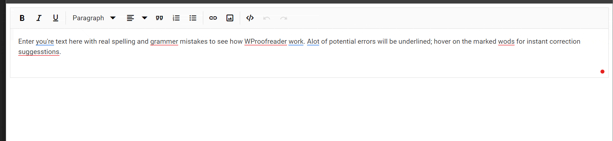

# Integrate WProofreader into the Angular Rich Text Editor Component

WProofreader is a powerful tool that enhances content quality by detecting and correcting spelling and grammar errors in real-time as users type. This functionality significantly improves the professionalism of your content and ensures error-free text.

**Key Features of WProofreader:**

* Real-time Spell Checking: Instantly detects spelling mistakes as users type, providing immediate corrections and suggestions.

* Multilingual Support: Supports multiple languages, allowing users to check and correct text in different language contexts.

* Customization Options: Users can customize dictionary settings, add specific terms, and adjust spell-checking rules to match their writing style and requirements.

* Integration Capabilities: Seamlessly integrates with various content management systems (CMS) and applications, enhancing editing workflows without requiring users to leave their editing environment.

## Set up the WProofreader

For integrating the `WProofreader` refer the following link : https://webspellchecker.com, you need to install the[@webspellchecker/wproofreader-sdk-js](https://www.npmjs.com/package/@webspellchecker/wproofreader-sdk-js) package using NPM or Yarn:

```bash
npm install @webspellchecker/wproofreader-sdk-js

Or

yarn add @webspellchecker/wproofreader-sdk-js

```
## Configure WProofreader for Rich Text Editor

After installing the package, you can integrate WProofreader with the Angular Rich Text Editor by following these steps:

1. Import the WProofreader module into your Angular component.
2. Configure the `container` property of WProofreader as the editable element of the Rich Text Editor's inputElement.
3. Use the `ViewChild` decorator to access the Angular Rich Text Editor instance.
4. Set the `lang` property to specify the language of the text to be checked.
5. Configure the activation key in the `serviceId` property.

Below is an example code snippet to integrate WProofreader with the Syncfusion Angular Rich Text Editor

```typescript

import { Component, AfterViewInit, ViewChild } from '@angular/core';
import { RichTextEditorModule, RichTextEditorComponent } from '@syncfusion/ej2-angular-richtexteditor';
import { ToolbarService, LinkService, ImageService, HtmlEditorService, QuickToolbarService, TableService, PasteCleanupService } from '@syncfusion/ej2-angular-richtexteditor';
import WProofreader from '@webspellchecker/wproofreader-sdk-js';

@Component({
    imports: [RichTextEditorModule],
    standalone: true,
    selector: 'app-root',
    template: `<ejs-richtexteditor #spellEditor id='editor' [value]='value'>
  </ejs-richtexteditor>`,
    providers: [ToolbarService, LinkService, ImageService, HtmlEditorService, QuickToolbarService, TableService, PasteCleanupService]
})
export class AppComponent implements AfterViewInit {
    @ViewChild("spellEditor")
    public spellEditor!: RichTextEditorComponent;
    title = 'WebSpellChecker-RichTextEditor';
    ngAfterViewInit(): void {
        WProofreader.init({
            container: this.spellEditor.inputElement,
            lang: 'en_US',
            serviceId: "TDHiXV50gZlQaDw"
        });
    }
    public value: string = "<p>Enter you\'re text here with real spelling and grammer mistakes to see how WProofreader work. Alot of potential errors will be underlined; hover on the marked wods for instant correction suggesstions.</p>";
}

```

Below is a GIF demonstrating how to integrate WProofreader with the Syncfusion Angular Rich Text Editor

