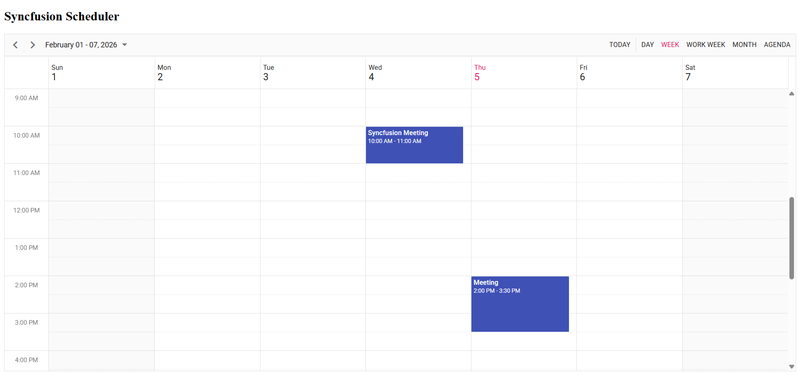

# Getting Started with Angular and Electron with Syncfusion Scheduler

This guide explains how to build a basic Angular application using a standalone component structure with the Electron framework and integrate the `Syncfusion<sup style="font-size:70%">&reg;</sup> Schedule component`.

## Prerequisites

Before getting started, ensure the following software is installed:

* Angular version 17 or later  
* TypeScript version 5.4 or later  
* Electron CLI version 34.0.0 or later

If the `Electron CLI` is not installed, refer to the [Electron package](https://www.npmjs.com/package/electron-cli) for installation instructions.

## Set Up Angular Environment

Refer to the [Setting up the local environment and workspace](https://angular.dev/installation#prerequisites) guide for Angular setup instructions.

Create an **Angular Application**
```bash
ng new my-app
```

Install the Electron framework with the following command:

```bash
npm install -g electron
```
> Note: See the [getting started guide](https://electronjs.org/docs/tutorial/installation) to learn more about Electron installation.

## Installing Syncfusion<sup style="font-size:70%">&reg;</sup> Schedule package

Syncfusion<sup style="font-size:70%">&reg;</sup> packages are available on npm under the `@syncfusion` scope. Explore all Angular Syncfusion<sup style="font-size:70%">&reg;</sup> packages [here](https://www.npmjs.com/search?q=%40syncfusion%2Fej2-angular-).

To install the Schedule package, execute the following command:

```bash
npm install @syncfusion/ej2-angular-schedule --save
```

## Adding CSS References

To incorporate styles for the Schedule component, add the following imports to `styles.css`:
```css
@import '../node_modules/@syncfusion/ej2-base/styles/material3.css';
@import '../node_modules/@syncfusion/ej2-buttons/styles/material3.css';
@import '../node_modules/@syncfusion/ej2-calendars/styles/material3.css';
@import '../node_modules/@syncfusion/ej2-dropdowns/styles/material3.css';
@import '../node_modules/@syncfusion/ej2-inputs/styles/material3.css';
@import '../node_modules/@syncfusion/ej2-lists/styles/material3.css';
@import '../node_modules/@syncfusion/ej2-popups/styles/material3.css';
@import '../node_modules/@syncfusion/ej2-navigations/styles/material3.css';
@import '../node_modules/@syncfusion/ej2-angular-schedule/styles/material3.css';
```
## Adding Syncfusion<sup style="font-size:70%">&reg;</sup> Schedule Component
To integrate the Syncfusion<sup style="font-size:70%">&reg;</sup> Schedule component, update the template in `app.ts`.

```typescript
import { Component } from '@angular/core';
import { CommonModule } from '@angular/common';
import {
  ScheduleModule,
  EventSettingsModel,
  View,
  DayService,
  WeekService,
  WorkWeekService,
  MonthService,
  AgendaService
} from '@syncfusion/ej2-angular-schedule';

@Component({
  selector: 'app-root',
  standalone: true,
  imports: [CommonModule, ScheduleModule],
  providers: [DayService, WeekService, WorkWeekService, MonthService, AgendaService],
  template: `
    <h2>Syncfusion Scheduler</h2>

    <ejs-schedule
      width="100%"
      height="650px"
      [selectedDate]="selectedDate"
      [currentView]="currentView"
      [eventSettings]="eventSettings"
    >
      <e-views>
        <e-view option="Day"></e-view>
        <e-view option="Week"></e-view>
        <e-view option="WorkWeek"></e-view>
        <e-view option="Month"></e-view>
        <e-view option="Agenda"></e-view>
      </e-views>
    </ejs-schedule>
  `
})
export class App {
  public selectedDate: Date = new Date(2026, 1, 4); // Feb 4, 2026
  public currentView: View = 'Week';

  private data: object[] = [
    {
      Id: 1,
      Subject: 'Syncfusion Meeting',
      StartTime: new Date(2026, 1, 4, 10, 0),
      EndTime: new Date(2026, 1, 4, 11, 0)
    },
    {
      Id: 2,
      Subject: 'Meeting',
      StartTime: new Date(2026, 1, 5, 14, 0),
      EndTime: new Date(2026, 1, 5, 15, 30)
    }
  ];

  public eventSettings: EventSettingsModel = {
    dataSource: this.data,
    allowAdding: true,
    allowEditing: true,
    allowDeleting: true
  };
}

```
## Create main.js File
Create a `main.js` file in your project's root directory and add the following code:
```javascript
const { app, BrowserWindow } = require('electron');
const path = require('node:path');

function createWindow() {
  const win = new BrowserWindow({
    width: 1100,
    height: 800
  });

  // Load Angular build output (common location)
  win.loadFile(path.join(__dirname, 'dist', 'my-app', 'browser', 'index.html'));

  // Optional
  win.webContents.openDevTools();
}

app.whenReady().then(() => {
  createWindow();

  app.on('activate', () => {
    if (BrowserWindow.getAllWindows().length === 0) createWindow();
  });
});

app.on('window-all-closed', () => {
  if (process.platform !== 'darwin') app.quit();
});
```
## Update index.html
In `/src/index.html`, change `<base href="/">` to `<base href="./">` to ensure Electron locates the built Angular files correctly.

## Update package.json
Modify `package.json` to include the `main` entry and update scripts:

```json
{
  "main": "main.js",
  "scripts": {
    "ng": "ng",
    "start": "ng serve",
    "build": "ng build",
    "watch": "ng build --watch --configuration development",
    "test": "ng test",
    "electron-build": "ng build --configuration production",
    "electron": "electron ."
  }
}
```

## Running the application

To build and launch the application, execute these commands sequentially:

```bash
npm run electron-build
npm run electron
```
The Syncfusion<sup style="font-size:70%">&reg;</sup> Essential<sup style="font-size:70%">&reg;</sup> JS 2 Schedule component will render within the Electron window.

## Output


> Note: For a complete example, see the [Angular sample with Electron in GitHub](https://github.com/SyncfusionExamples/How-to-integrate-Syncfusion-Angular-Scheduler-with-Electron).
## Troubleshooting
**Problem:**
Angular **Bundle Exceeded Maximum Budge** Error

**Solution:**
Change the budget of the **maximumWarning** and **maximumError** size to high.

**EG** 
```bash
"maximumWarning": "5MB",
"maximumError": "6MB"
```
---

## See Also

* [Electron Browser Window](https://www.electronjs.org/docs/latest/api/browser-window)  
* [Angular 10 Electron Tutorial](https://www.techiediaries.com/angular-electron)  
* [Build Angular Desktop Apps With Electron Tutorial](https://fireship.io/lessons/desktop-apps-with-electron-and-angular)  
* [Getting Started with Angular CLI](../getting-started/angular-cli)
