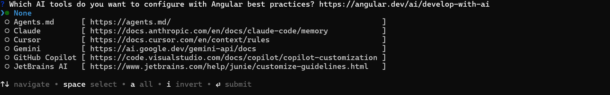

# Getting started with Angular Schedule component

This section explains how to create [**Angular Scheduler**](https://www.syncfusion.com/angular-components/angular-scheduler) and configure its features in an Angular environment.

> **Ready to streamline your Syncfusion<sup style="font-size:70%">&reg;</sup> Angular development?** Discover the full potential of Syncfusion<sup style="font-size:70%">&reg;</sup> Angular components with Syncfusion<sup style="font-size:70%">&reg;</sup> AI Coding Assistant. Effortlessly integrate, configure, and enhance your projects with intelligent, context-aware code suggestions, streamlined setups, and real-time insights—all seamlessly integrated into your preferred AI-powered IDEs like VS Code, Cursor, Syncfusion<sup style="font-size:70%">&reg;</sup> CodeStudio and more. [Explore Syncfusion<sup style="font-size:70%">&reg;</sup> AI Coding Assistant](https://ej2.syncfusion.com/angular/documentation/ai-coding-assistant/overview)

For a quick start with the Angular Schedule component using CLI and Schematics, you can watch this video:



## Prerequisites

You can use [`Angular CLI`](https://github.com/angular/angular-cli) to set up your Angular applications. To install the Angular CLI, use the following command.

```bash
npm install -g @angular/cli
```

## Create an Angular application

Create a new Angular application using the following Angular CLI command.

```bash
ng new my-app
```

This command will prompt you for a few settings for the new project, such as which stylesheet format to use.


By default, it will create a CSS-based application.

Then the CLI also displays an additional prompt whether to enable Server Side Rendering (SSR), and Static Site Generation (SSG) as shown below:


For this setup, when prompted for the Server-side rendering (SSR) option, choose the appropriate configuration.

Then the CLI displays another prompt related to AI tooling support, as shown below:



Any preferred option can be selected based on the development workflow or project needs.

Next, navigate to the project folder:

```bash
cd my-app
```

## Installing Syncfusion<sup style="font-size:70%">&reg;</sup> Schedule package

Syncfusion<sup style="font-size:70%">&reg;</sup> packages are distributed on npm as `@syncfusion` scoped packages. To use the Schedule component in your Angular application, install the [@syncfusion/ej2-angular-schedule](https://www.npmjs.com/package/@syncfusion/ej2-angular-schedule/) package from npm.

```bash
npm install @syncfusion/ej2-angular-schedule --save
```

## Adding CSS reference

The necessary CSS files for the Schedule component are located in the `ej2-angular-schedule` package. You can reference them in your `[src/styles.css]` file.

```css
@import '../node_modules/@syncfusion/ej2-base/styles/material3.css';
@import '../node_modules/@syncfusion/ej2-buttons/styles/material3.css';
@import '../node_modules/@syncfusion/ej2-calendars/styles/material3.css';
@import '../node_modules/@syncfusion/ej2-dropdowns/styles/material3.css';
@import '../node_modules/@syncfusion/ej2-inputs/styles/material3.css';
@import '../node_modules/@syncfusion/ej2-lists/styles/material3.css';
@import '../node_modules/@syncfusion/ej2-popups/styles/material3.css';
@import '../node_modules/@syncfusion/ej2-navigations/styles/material3.css';
@import '../node_modules/@syncfusion/ej2-angular-schedule/styles/material3.css';
```

## Initialize the Schedule component and configure module injection

This section explains how to set up the Syncfusion Angular Schedule component in your application by registering the necessary services (such as Day, Week, WorkWeek, Month, and Agenda) in the providers array, and rendering the Scheduler component in the template.

`[src/app/app.ts]`

```typescript
import { Component } from '@angular/core';
import { ScheduleModule, DayService, WeekService, WorkWeekService, MonthService, AgendaService } from '@syncfusion/ej2-angular-schedule';

@Component({
	imports: [
		ScheduleModule
	],
	standalone: true,
	selector: 'app-root',
	providers: [DayService, WeekService, WorkWeekService, MonthService, AgendaService],
	// Specifies the template string for the Schedule component
	template: `<ejs-schedule></ejs-schedule>`
})
export class App { }
```

Run the following command in the terminal to start the development server. This compiles the project, launches a local server, and allowing you to view changes in real time during development.

```
ng serve
```

> Above demo will display the empty scheduler.

## Populating appointments

To populate the Schedule with appointments, you can use either a local JSON array or a remote data service. Assign the data to the [`dataSource`](https://ej2.syncfusion.com/angular/documentation/api/schedule/eventSettings#datasource) property, which is part of the [`eventSettings`](https://ej2.syncfusion.com/angular/documentation/api/schedule/eventSettings) configuration.

The `StartTime` and `EndTime` fields are mandatory for each appointment. The following example uses default fields like `Id`, `Subject`, `StartTime`, and `EndTime`.

`[src/app/app.ts]`

```typescript
import { Component } from '@angular/core';
import { ScheduleModule, DayService, WeekService, WorkWeekService, MonthService, AgendaService, EventSettingsModel } from '@syncfusion/ej2-angular-schedule';

@Component({
	imports: [
		ScheduleModule
	],
	standalone: true,
	selector: 'app-root',
	providers: [DayService, WeekService, WorkWeekService, MonthService, AgendaService],
	// specifies the template string for the Schedule component
	template: `<ejs-schedule [eventSettings]='eventSettings'></ejs-schedule>`
})
export class App {
	public data: object[] = [{
		Id: 1,
		Subject: 'Meeting',
		StartTime: new Date(new Date().setHours(9, 0, 0)),
		EndTime: new Date(new Date().setHours(10, 0, 0))
	}];
	public eventSettings: EventSettingsModel = {
		dataSource: this.data
	};
}
```

## Setting the date

By default, the Schedule component displays the current system date. To set a specific date, use the [`selectedDate`](https://ej2.syncfusion.com/angular/documentation/api/schedule#selecteddate) property.

`[src/app/app.ts]`

```typescript
import { Component } from '@angular/core';
import { ScheduleModule, DayService, WeekService, WorkWeekService, MonthService, AgendaService } from '@syncfusion/ej2-angular-schedule';

@Component({
	imports: [
		ScheduleModule
	],
	standalone: true,
	selector: 'app-root',
	providers: [DayService, WeekService, WorkWeekService, MonthService, AgendaService],
	// specifies the template string for the Schedule component
	template: `<ejs-schedule [selectedDate]='selectedDate'></ejs-schedule>`
})
export class App {
	public selectedDate: Date = new Date(2026, 4, 18);
}
```

## Setting the view

The default view of the Schedule is `Week`. To change the current view, set the [`currentView`](https://ej2.syncfusion.com/angular/documentation/api/schedule#currentview) property to one of the following default view names:

*   Day
*   Week
*   WorkWeek
*   Month
*   Agenda

```typescript
import { Component } from '@angular/core';
import { ScheduleModule, DayService, WeekService, WorkWeekService, MonthService, AgendaService, View } from '@syncfusion/ej2-angular-schedule';

@Component({
	imports: [
		ScheduleModule
	],
	standalone: true,
	selector: 'app-root',
	providers: [DayService, WeekService, WorkWeekService, MonthService, AgendaService],
	// specifies the template string for the Schedule component
	template: `<ejs-schedule [currentView]='currentView' ></ejs-schedule>`
})
export class App {
	public currentView: View = 'Day';
}
```

## See also

* [Explore available views and their customization options](./views.md)
* [Explore appointments and event data handling](./appointments.md)