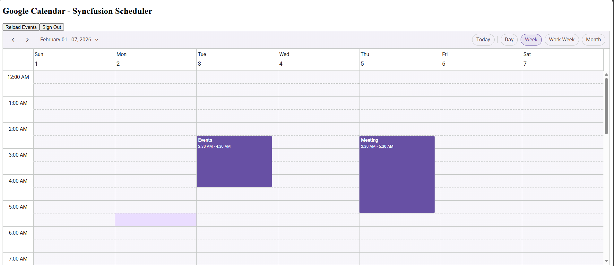

# Google Calendar API Integration with Syncfusion Angular Scheduler

This [Angular Scheduler](https://www.syncfusion.com/angular-components/angular-scheduler) allows users to manage their [Google Calendar](https://www.google.com/calendar/about/) events directly within the Scheduler. Changes made in the Scheduler are synced to Google Calendar, and existing Google events are displayed in the Scheduler interface.


## Prerequisites

- [Node.js](https://nodejs.org/en/download) & [Angular CLI](https://angular.dev/installation): Must be installed on your local machine to create, manage, and run the Angular application.
- **Google Account:** Required to access the Google Cloud Console to enable APIs and generate [OAuth 2.0](https://developers.google.com/identity/protocols/oauth2) credentials.


## High-level flow

1. The Scheduler displays events using data from Google Calendar.
2. The app uses Google Identity Services (GIS) to obtain short-lived access tokens.
3. CRUD operations from the Scheduler are converted into [Google Calendar API](https://developers.google.com/calendar/api/v3/reference) calls.
4. After each successful operation the app reload events from Google.


## Create Google Cloud credentials

### Step 1: Setup Google Calendar API
- Open [Google Cloud Console](https://console.cloud.google.com)..
- Click the **Project Dropdown** > **New Project**.
- Name it (e.g., Scheduler-Integration) and click **Create**.

### Step 2: Enable the Google Calendar API
- Navigate to **APIs & Services** → **Library** → search **"Calendar"** → Click **Enable**.

### Step 3: Configure OAuth consent screen (External or Internal depending on your audience).
- Navigate to **APIs & Services** → **OAuth consent screen** → select **External** → Click **Create**.
- Provide the **App name** and **Support email**

### Step 4: Add Test Users
- Navigate to **APIs & Services** → **Audience** → Add mail in **Test User** → Click **Save**.
### Step 5: Generate Credentials
- Navigate to **APIs & Services** → **Credentials** → Click **Create Credentials** → **OAuth client ID**.
- Set Application Type to **Web application**.
- Add `http://localhost:4200` to **Authorized JavaScript origins**.
- **Note**: Copy the generated **Client ID** for your Angular configuration.

## Scaffold the Angular project and install packages
Create a new angular application with the following commands.
```bash
ng new sf-scheduler-google --routing=false --style=css
cd sf-scheduler-google
npm install @syncfusion/ej2-angular-schedule 
```

(If you use Yarn, replace `npm install` with `yarn add`.)

## Add Google Identity script

The Google Identity Services (GIS) script enables OAuth authentication in your app.

Add the GIS script in the `<head>` section of `public/index.html` file:

```html
<script src="https://accounts.google.com/gsi/client" async defer></script>
```

## Add the Syncfusion CSS References
Styles make your Scheduler look professional. Add these imports at the top of `src/styles.css`:

```css
/* You can add global styles to this file, and also import other style files */
@import '../node_modules/@syncfusion/ej2-base/styles/material3.css';
@import '../node_modules/@syncfusion/ej2-buttons/styles/material3.css';
@import '../node_modules/@syncfusion/ej2-calendars/styles/material3.css';
@import '../node_modules/@syncfusion/ej2-dropdowns/styles/material3.css';
@import '../node_modules/@syncfusion/ej2-inputs/styles/material3.css';
@import '../node_modules/@syncfusion/ej2-lists/styles/material3.css';
@import '../node_modules/@syncfusion/ej2-popups/styles/material3.css';
@import '../node_modules/@syncfusion/ej2-navigations/styles/material3.css';
@import '../node_modules/@syncfusion/ej2-angular-schedule/styles/material3.css';
```

## Configuring the Syncfusion Angular Scheduler
1. Adding the **Syncfusion Angular Scheduler** in `src/app.ts`

      This part adds the core Scheduler component with toolbar controls for signing in, reloading events, and signing out.
    ```ts
    @Component({
      standalone: true,
      selector: 'app-root',
      imports: [CommonModule, ScheduleModule],
      providers: [
        DayService, WeekService, WorkWeekService, MonthService, AgendaService,
        ResizeService, DragAndDropService, GoogleCalendarService
      ],
      template: `
        <div class="app-container">
          <div class="header">
            <h2>Google Calendar - Syncfusion Scheduler</h2>
            <div class="controls">
              <button class="btn btn-signin" (click)="signIn()" *ngIf="!isSignedIn">Sign In with Google</button>
              <button class="btn btn-reload" (click)="loadEvents()" *ngIf="isSignedIn">Reload Events</button>
              <button class="btn btn-signout" (click)="signOut()" *ngIf="isSignedIn">Sign Out</button>
            </div>
          </div>

          <ejs-schedule
            #scheduleObj
            width="100%"
            height="650px"
            [allowDragAndDrop]="true"
            [allowResizing]="true"
            [showQuickInfo]="true"
            (actionComplete)="onActionComplete($event)"
            [eventSettings]="eventSettings"
            currentView="Week"
            [views]="scheduleViews"
            [selectedDate]="selectedDate">
          </ejs-schedule>
        </div>
      `,
    })
    ```

2. Configure Your **Google Calendar** with the **Syncfusion Scheduler** using the **API key**, **Client-id** and **Calendar-id** in the `src/app.ts` file.
    > All credential values are case-sensitive.Paste the Google OAuth Client ID, API Key, and Calendar ID exactly as issued

    ```ts
    export const CONFIG = {
      clientId: 'YOUR_CLIENT_ID',//Enter Your Client-ID
      apiKey: 'YOUR_API_KEY',//Enter Your API Key
      calendarId: 'YOUR_CALENDAR_ID'//Enter Your Calendar-ID
    };
    ```

3. **Integration of Google Calendar**

    Integrating the **Google Calendar** with the **Syncfusion Scheduler** in the `src/app.ts` file using the **GoogleCalendarService** class.

    The service handles **OAuth token generation**,Fetching logged-in **user info**, Initializing the **Google Identity Token Client**

    ```ts
    import { Component, OnInit, Injectable, ViewChild } from '@angular/core';
    import { CommonModule } from '@angular/common';
    import { HttpClient, HttpHeaders } from '@angular/common/http';
    import { BehaviorSubject, Observable } from 'rxjs';
    import { ScheduleModule, DayService, WeekService, WorkWeekService, MonthService, AgendaService, ResizeService, DragAndDropService, ScheduleComponent } from '@syncfusion/ej2-angular-schedule';

    @Injectable({ providedIn: 'root' })
    export class GoogleCalendarService {
      private tokenClient: any = null;
      private accessToken: string | null = null;
      public signedIn$ = new BehaviorSubject<boolean>(false);
      public userEmail$ = new BehaviorSubject<string>('');
      public lastGsiError$ = new BehaviorSubject<string | null>(null);
      private scope = 'https://www.googleapis.com/auth/calendar https://www.googleapis.com/auth/userinfo.email';
      public calendarId: string = CONFIG.calendarId;

      constructor(private http: HttpClient) {}

      private initializeTokenClient() {
        const clientId = CONFIG.clientId;
        if (!clientId) return;
        try {
          this.tokenClient = (window as any).google.accounts.oauth2.initTokenClient({
            client_id: clientId,
            scope: this.scope,
            callback: (response: any) => {
              if (response.error) {
                this.lastGsiError$.next(response.error_description || response.error);
                this.signedIn$.next(false);
                return;
              }
              this.accessToken = response.access_token;
              this.lastGsiError$.next(null);
              this.signedIn$.next(!!this.accessToken);
              this.getUserInfo();
            }
          });
        } catch {}
      }

      private ensureGsiReady(timeout = 10000): Promise<void> {
        return new Promise((resolve, reject) => {
          if ((window as any).google?.accounts?.oauth2) return resolve();
          const interval = 200;
          let waited = 0;
          const h = setInterval(() => {
            if ((window as any).google?.accounts?.oauth2) {
              clearInterval(h);
              return resolve();
            }
            waited += interval;
            if (waited >= timeout) {
              clearInterval(h);
              return reject();
            }
          }, interval);
        });
      }

      private getUserInfo() {
        if (!this.accessToken) return;
        this.http.get('https://www.googleapis.com/oauth2/v2/userinfo', { 
          headers: new HttpHeaders({ Authorization: `Bearer ${this.accessToken}` }) 
        }).subscribe({
          next: (user: any) => this.userEmail$.next(user.email || ''),
          error: () => this.userEmail$.next('')
        });
      }

      public signIn(prompt = 'consent') {
        this.ensureGsiReady().then(() => {
          if (!this.tokenClient) this.initializeTokenClient();
          if (!this.tokenClient) return;
          this.tokenClient.requestAccessToken({ prompt });
        }).catch(() => {
          this.signedIn$.next(false);
        });
      }

      public async signOut(): Promise<void> {
        if (this.accessToken) {
          try { await fetch(`https://oauth2.googleapis.com/revoke?token=${this.accessToken}`, { method: 'POST' }); } catch {}
        }
        this.accessToken = null;
        this.signedIn$.next(false);
        this.userEmail$.next('');
      }

      private authHeaders(): HttpHeaders {
        return new HttpHeaders({ Authorization: `Bearer ${this.accessToken}` });
      }
    ```

4. Configuring the **CRUD** Operations with the **Syncfusion Scheduler** in the `src/app.ts` file in **GoogleCalendarService** class.

    To **load events** from **Google Calendar** into the **Syncfusion Scheduler**, the application uses the **getEvents** method from the **GoogleCalendarService**
    ```ts
    public getEvents(timeMin?: string, timeMax?: string, expandRecurring: boolean = true): Observable<any> {
        const params: any = { 
          singleEvents: expandRecurring ? 'true' : 'false', 
          orderBy: expandRecurring ? 'startTime' : undefined,
          maxResults: '2500'
        };
        if (timeMin) params.timeMin = timeMin;
        if (timeMax) params.timeMax = timeMax;
        const url = `https://www.googleapis.com/calendar/v3/calendars/${encodeURIComponent(this.calendarId)}/events`;
        return this.http.get(url, { headers: this.authHeaders(), params });
      }
    ```
    To **insert events** between **Google Calendar** and **Syncfusion Scheduler**, the application uses the **insertEvent** method from the **GoogleCalendarService**
    ```ts
      public insertEvent(event: any): Observable<any> {
        const url = `https://www.googleapis.com/calendar/v3/calendars/${encodeURIComponent(this.calendarId)}/events`;
        return this.http.post(url, event, { headers: this.authHeaders() });
      }
    ```
    To **update events** between **Google Calendar** and **Syncfusion Scheduler**, the application uses the **updateEvent** method from the **GoogleCalendarService**
    ```ts
      public updateEvent(eventId: string, event: any): Observable<any> {
        const url = `https://www.googleapis.com/calendar/v3/calendars/${encodeURIComponent(this.calendarId)}/events/${encodeURIComponent(eventId)}`;
        return this.http.patch(url, event, { headers: this.authHeaders() });
      }
    ```
    To **delete events** between **Google Calendar** and **Syncfusion Scheduler**, the application uses the **deleteEvent** method from the **GoogleCalendarService**
    ```ts
      public deleteEvent(eventId: string): Observable<any> {
        const url = `https://www.googleapis.com/calendar/v3/calendars/${encodeURIComponent(this.calendarId)}/events/${encodeURIComponent(eventId)}`;
        return this.http.delete(url, { headers: this.authHeaders() });
      }
    }
    ```

5. To **load google events** into the scheduler and syncs all **create/update/delete** actions back to **Google Calendar** after user sign-in, using **App** class.
    >  Handled the AllDay conversion between Syncfusion Scheduler and Google Calendar.
    ```ts
    export class App implements OnInit {
      @ViewChild('scheduleObj') public scheduleObj?: ScheduleComponent;

      public events: any[] = [];
      public eventSettings: any = { dataSource: [], allowAdding: true, allowEditing: true, allowDeleting: true };
      public isSignedIn = false;
      public selectedDate: Date = new Date();
      public scheduleViews: Array<any> = [
        { option: 'Day' }, { option: 'Week' }, { option: 'WorkWeek' }, { option: 'Month' }
      ];

      constructor(private gcal: GoogleCalendarService) {}

      ngOnInit(): void {
        this.gcal.signedIn$.subscribe(signedIn => {
          this.isSignedIn = signedIn;
          if (signedIn) {
            this.loadEvents();
          } else {
            this.events = [];
            this.eventSettings = { ...this.eventSettings, dataSource: [] };
          }
        });
      }

      private parseDateOnly(dateStr: string): Date {
        const [y, m, d] = dateStr.split('-').map(Number);
        return new Date(y, m - 1, d);
      }

      private toLocalDateString(d: Date): string {
        return `${d.getFullYear()}-${String(d.getMonth() + 1).padStart(2,'0')}-${String(d.getDate()).padStart(2,'0')}`;
      }

      private addDays(d: Date, days: number): Date {
        const nd = new Date(d.getFullYear(), d.getMonth(), d.getDate());
        nd.setDate(nd.getDate() + days);
        return nd;
      }

      private mapEventFromGoogle(ge: any) {
        const event: any = {
          Id: ge.id,
          Subject: ge.summary || '(no title)',
          Description: ge.description || '',
          IsAllDay: !!ge.start?.date,
          _raw: ge
        };

        if (ge.start?.date) {
          event.StartTime = this.parseDateOnly(ge.start.date);
          event.EndTime = this.parseDateOnly(ge.end?.date ?? ge.start.date);
        } else {
          event.StartTime = ge.start?.dateTime ? new Date(ge.start.dateTime) : null;
          event.EndTime = ge.end?.dateTime ? new Date(ge.end.dateTime) : null;
        }

        if (ge.recurrence && ge.recurrence.length > 0) {
          let rrule = ge.recurrence[0];
          if (rrule.startsWith('RRULE:')) rrule = rrule.substring(6);
          event.RecurrenceRule = rrule;
        }

        if (ge.recurringEventId) event.RecurrenceID = ge.recurringEventId;

        return event;
      }

      private mapEventToGoogle(e: any) {
        const googleEvent: any = { 
          summary: e.Subject || '(no title)', 
          description: e.Description || '' 
        };

        if (e.IsAllDay) {
          const s = e.StartTime instanceof Date ? e.StartTime : new Date(e.StartTime);
          const en = e.EndTime instanceof Date ? e.EndTime : new Date(e.EndTime);
          const sLocal = new Date(s.getFullYear(), s.getMonth(), s.getDate());
          let eLocal = new Date(en.getFullYear(), en.getMonth(), en.getDate());
          if (eLocal <= sLocal) eLocal = this.addDays(sLocal, 1);
          googleEvent.start = { date: this.toLocalDateString(sLocal) };
          googleEvent.end   = { date: this.toLocalDateString(eLocal) };
        } else {
          googleEvent.start = { dateTime: e.StartTime instanceof Date ? e.StartTime.toISOString() : e.StartTime, timeZone: 'UTC' };
          googleEvent.end   = { dateTime: e.EndTime instanceof Date ? e.EndTime.toISOString() : e.EndTime, timeZone: 'UTC' };
        }

        if (e.RecurrenceRule) {
          let rrule = e.RecurrenceRule.startsWith('RRULE:') ? e.RecurrenceRule : 'RRULE:' + e.RecurrenceRule;
          googleEvent.recurrence = [rrule];
        }

        return googleEvent;
      }

      public loadEvents() {
        const now = new Date();
        const timeMin = new Date(now.getFullYear() - 1, 0, 1).toISOString();
        const timeMax = new Date(now.getFullYear() + 1, 11, 31).toISOString();
        
        this.gcal.getEvents(timeMin, timeMax).subscribe({
          next: (res: any) => {
            const items = res.items || [];
            this.events = items.map((it: any) => this.mapEventFromGoogle(it));
            this.eventSettings = { 
              dataSource: this.events, 
              allowAdding: true, 
              allowEditing: true, 
              allowDeleting: true 
            };
            setTimeout(() => this.scheduleObj?.refresh(), 100);
          },
          error: () => {}
        });
      }

      
      public signIn() { this.gcal.signIn(); }
      public signOut() { this.gcal.signOut(); }
    }
    ```

6. Performing **CRUD** operations in the **App** class using **onActionComplete** method in `src/app.ts file`

    To **insert** the **created events** form **Syncfusion Scheduler** to **Google Calendar**, the application uses the **eventCreated** requesttype.
    ```ts
    public onActionComplete(args: any) {
        if (args.requestType === 'eventCreated') {
          const added = args.addedRecords || [];
          for (const a of added) {
            const body = this.mapEventToGoogle(a);
            this.gcal.insertEvent(body).subscribe({
              next: (created: any) => {
                a.Id = created.id;
                (a as any)._raw = created;

                const idx = this.events.findIndex(ev =>
                  ev === a ||
                  (ev.Subject === a.Subject &&
                    +new Date(ev.StartTime) === +new Date(a.StartTime) &&
                    +new Date(ev.EndTime) === +new Date(a.EndTime))
                );
                if (idx > -1) {
                  this.events[idx].Id = created.id;
                  this.events[idx]._raw = created;
                  this.eventSettings = { ...this.eventSettings, dataSource: [...this.events] };
                }

                setTimeout(() => this.loadEvents(), 300);
              },
              error: () => setTimeout(() => this.loadEvents(), 500)
            });
          }
        }
    ```
    To **update** the events form **Syncfusion Scheduler** to **Google Calendar**, the application uses the **eventChanged** requesttype.
    ```ts
        if (args.requestType === 'eventChanged') {
          const changed = args.changedRecords || [];
          for (const c of changed) {
            if (!c.Id) continue;
            const body = this.mapEventToGoogle(c);
            this.gcal.updateEvent(c.Id, body).subscribe({
              next: () => {
                if (body.recurrence || c.RecurrenceRule) setTimeout(() => this.loadEvents(), 1000);
              },
              error: () => this.loadEvents()
            });
          }
        }
    ```
    To **delete** the events form **Syncfusion Scheduler** to **Google Calendar**, the application uses the **eventRemoved** requesttype.
    ```ts
        if (args.requestType === 'eventRemoved') {
          const removed =
            (Array.isArray(args.deletedRecords) && args.deletedRecords.length ? args.deletedRecords :
              (args.data ? (Array.isArray(args.data) ? args.data : [args.data]) : [])) as any[];

          for (const r of removed) {
            const eventId = r?.Id || r?._raw?.id;
            if (!eventId) continue;

            this.gcal.deleteEvent(eventId).subscribe({
              next: () => setTimeout(() => this.loadEvents(), 300),
              error: () => this.loadEvents()
            });
          }
        }
      }

    ```

## Running the Application
```bash
ng serve
```

## Output


> For additional help, see the [Google Calendar Integration sample on GitHub](https://github.com/SyncfusionExamples/How-to-integrate-Goolge-calendar-with-Syncfusion-Angular-Scheduler)

## Testing and verification

- Use `ng serve` to run locally: `http://localhost:4200`.
- Verify OAuth consent and that `http://localhost:4200` appears in Authorized JavaScript origins.

## TroubleShooting
### Google Sign‑In Button Does Not Work
**Problem :**
- Clicking “Sign In with Google” does nothing.
- No popup appears.

**Errors :**
```bash
google is not defined
accounts.oauth2 is undefined
```
**Solution :**

Make sure this **script** exists inside `index.html`
```html
<script src="https://accounts.google.com/gsi/client" async defer></script>
```
Make sure the application in running on the exact URL `http://localhost:4200`

### Origin mismatch Error During Sign‑In
**Problem :**
- origin_mismatch
- Unauthorized origin

**Solution :**

Add the `http://localhost:4200` URL to **Authorized JavaScript origins** on the **Google Cloud Console**