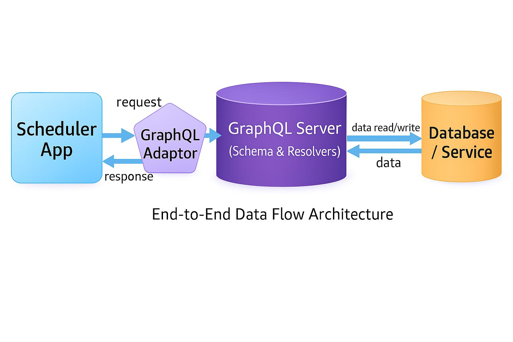
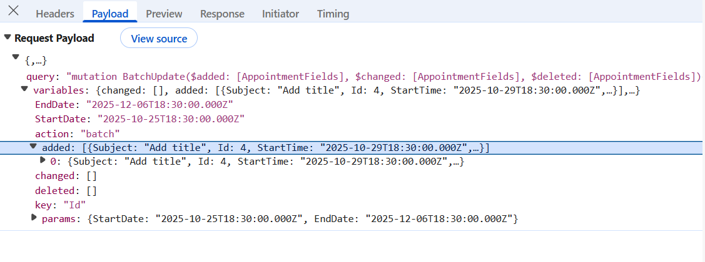
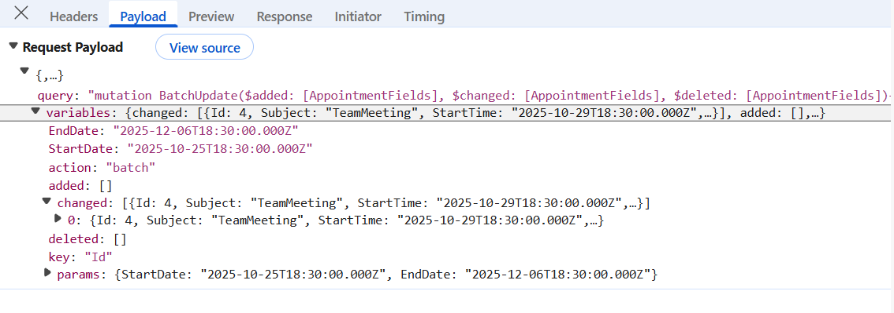
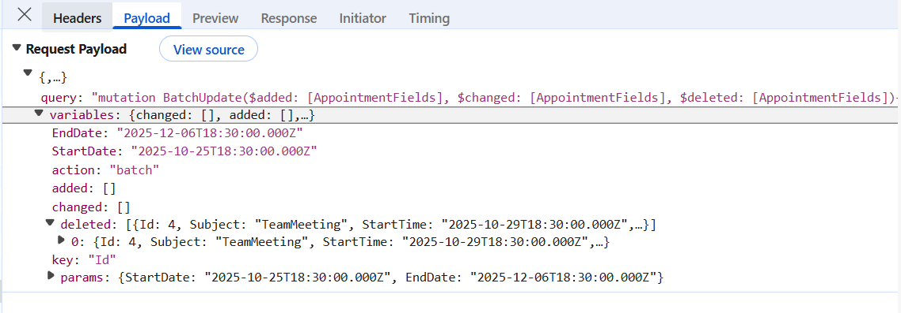

# Connecting Syncfusion Angular Scheduler to GraphQL backend in Node.js

[GraphQL](https://graphql.org/learn/introduction) is a query language that allows applications to request exactly the data needed, nothing more and nothing less. Unlike traditional REST APIs that return fixed data structures, GraphQL enables the client to specify the shape and content of the response.

**Traditional REST APIs** and `GraphQL` differ mainly in the way data is requested and returned: **REST APIs expose** multiple endpoints that return fixed data structures, often including unnecessary fields and requiring several requests to fetch related data, while `GraphQL` uses a single endpoint where queries define the exact fields needed, enabling precise responses and allowing related data to be retrieved efficiently in one request. This makes `GraphQL` especially useful for **[Angular Scheduler](https://www.syncfusion.com/angular-components/angular-scheduler) integration**, the **reason** is that data‑centric UI components require well‑structured and selective datasets to minimize network usage and ensure smooth, high‑performance interactions.

**Key GraphQL concepts:**

- **Queries**: A query is a request to read data. Queries do not modify data; they only retrieve it.
- **Mutations**: A mutation is a request to modify data. Mutations create, update, or delete records.
- **Resolvers**: Each query or mutation is handled by a resolver, which is a function responsible for fetching data or executing an operation. **Query resolvers** handle **read operations**, while **mutation resolvers** handle **write operations**.
- **Schema**: Defines the structure of the API. The schema describes available data types, the fields within those types, and the operations that can be executed. Query definitions specify the way data can be retrieved, and mutation definitions specify the way data can be modified. 

[Node.js](https://nodejs.org/learn/getting-started/introduction-to-nodejs) is a fast and efficient JavaScript runtime built on Google’s V8 engine. It enables JavaScript to run on the server, making it a popular platform for building web APIs, real‑time applications, and modern backend services. Node.js offers a non‑blocking, event‑driven architecture that supports high performance and scalability.

## Prerequisites

| Software / Package          | Recommended version          |
|-----------------------------|------------------------------|
| Node.js                     | 20.x LTS or later            |
| npm                         | Latest (11.x+)               |
| Angular CLI                 | 18.x or later                |

## Setting up the GraphQL backend using Node.js

The `GraphQL` backend acts as the central data service, handling queries and mutations that power the Syncfusion Angular Scheduler.

### Step 1: Create the GraphQL server and install required packages

Before configuring the `GraphQL` API, a new folder must be created to host the `GraphQL` server. This folder will contain the server configuration, required dependencies, and sample data used for processing `GraphQL` queries.

For this guide, a `GraphQL` server named **GraphQLServer** is created using Node.js.

**Create project folder**

Open a terminal (for example, an integrated terminal in Visual Studio Code or Windows Command Prompt opened with  <kbd>(Win+R)</kbd>, or macOS Terminal launched with <kbd>(Cmd+Space)</kbd>) and run the following command to create and navigate to the project folder:

```bash
mkdir GraphQLServer
cd GraphQLServer
```

**Initialize and Install required packages**

The `GraphQL` server is set up using graphpack, a lightweight development tool for building GraphQL APIs. The Syncfusion `ej2-data` package is included to support the Scheduler’s data operations, enabling structured and selective data retrieval that minimizes network usage and ensures smooth, high‑performance event loading and updates.

Run the following commands in the terminal window to initialize and install the required packages:

```bash
npm init -y
npm i graphpack
npm install @syncfusion/ej2-data --save
```
- **npm init -y** – Initializes a new Node.js project by automatically generating a default package.json file without prompting for user input.
- **graphpack** – Lightweight `GraphQL` server and development environment.
- **@syncfusion/ej2-data** – Provides data utilities for advanced data operations.

Add this lines in `scripts` in `package.json` to defines commands with npm

```

"scripts": {
      "dev": "graphpack --port 4400",
      "build": "graphpack build"
    }

```
**Create src folder**

Open a terminal (for example, an integrated terminal in Visual Studio Code or Windows Command Prompt opened with  <kbd>(Win+R)</kbd>, or macOS Terminal launched with <kbd>(Cmd+Space)</kbd>) and run the following command to create and navigate to the `src` folder:

```bash
mkdir src
cd src
```

**Create sample datasource** 

After installing the required packages, create a new file named **db.js** inside the **src** folder. This file acts as an in‑memory datasource for the `GraphQL` server.

[db.js]

```js

export let eventsData = [
     {
       Id: 1,
       Subject: 'Server Maintenance',
       StartTime: new Date(2026, 1, 11, 10, 0).toISOString(),
       EndTime: new Date(2026, 1, 11, 11, 30).toISOString(),
       Location: 'Seattle'
     }, {
       Id: 2,
       Subject: 'Art & Painting Gallery',
       StartTime: new Date(2026, 1, 12, 12, 0).toISOString(),
       EndTime: new Date(2026, 1, 12, 14, 0).toISOString(),
       Location: 'Costa Rica'
     }, {
       Id: 3,
       Subject: 'Dany Birthday Celebration',
       StartTime: new Date(2026, 1, 13, 10, 0).toISOString(),
       EndTime: new Date(2026, 1, 13, 11, 30).toISOString(),
       Location: 'Kirkland'
     }
];

```
The **GraphQLServer** folder is now created, required packages are installed, and a sample data source is configured. The project is ready for defining the `GraphQL` schema, resolvers, and server configuration.

### Step 2: Configuring schema in GraphQL

The `GraphQL` schema defines the structure of the "Appointment" data model and the server‑side operations available for performing CRUD actions.

**Instructions:**
1. Create a new schema file (**src/schema.graphql**) in the **GraphQLServer** folder.
2. Add type definition for "Appointment".

    ```
    # --- Appointment type definition ---
    type Appointment {
      Id: Int!
      Subject: String
      StartTime: String!
      EndTime: String!
      Location: String
      IsAllDay: Boolean
      RecurrenceRule: String
      StartTimezone: String
      EndTimezone: String
      RecurrenceID: Int
      RecurrenceException: String
      FollowingID: Int
      IsReadonly:String
      IsBlock:String
    }
    ```
3. Add type definition for "ReturnType".

    ```
    type ReturnType {
      result: [Appointment]
    }
    ```
4. Add type definition for "DataManager".

    ```
    # --- Syncfusion DataManager payload ---
    input DataManager {
        skip: Int
        take: Int
        sorted: [Sort]
        group: [String]
        table: String
        select: [String]
        where: String
        search: String
        requiresCounts: Boolean
        aggregates: [Aggregate]
        params: String
    }
    ```
> For detailed information about **DataManager** type refer to [Configuring Syncfusion DataManager schema](#step-3-configuring-syncfusion-DataManager-schema).

5. Add type definition for "Appointment field names".

    ```
    # --- Schedule Appointment field names ---
    input AppointmentFields {
      Id: Int!
      Subject: String
      StartTime: String!
      EndTime: String!
      Location: String
      IsAllDay: Boolean
      Guid: String
      RecurrenceRule: String
      StartTimezone: String
      EndTimezone: String
      RecurrenceID: Int
      RecurrenceException: String
      FollowingID: Int
      IsReadonly:String
      IsBlock:String
    }
    ```

6. Define the Query type to expose the "getEvents" operation that returns the list of "Events".

    ```
    type Query {
      getEvents(datamanager: DataManager): ReturnType 
    }
    ```
7. Define Mutation types for CRUD operations.

    ```
    type Mutation {
      batchUpdate(added: [AppointmentFields],changed: [AppointmentFields],deleted: [AppointmentFields]): [Appointment]
    }
    ```


### Step 3: Configuring Syncfusion DataManager schema

Syncfusion Scheduler sends all operation details as a single request object. `GraphQL` requires a clear, typed structure to understand these values. 

Since Syncfusion’s [DataManager](https://ej2.syncfusion.com/angular/documentation/data/getting-started) already has a fixed structure for sending operation details, the `GraphQL` backend define a matching typical input type.

**DataManager** serves as the input type that matches the structure of the `DataManager` request, ensuring that all operation details are correctly received by the `GraphQL` API.

**Purpose:**
The **DataManager** schema provides a standard format for delivering Scheduler operation parameters to the `GraphQL` server.
This structure allows the backend to return only the required records, improving performance, reducing payload size, and enabling efficient data handling.

### Step 4: GraphQL Query resolvers

A resolver in `GraphQL` is a function responsible for fetching the data for a specific field in a `GraphQL` schema.

When a client sends a `GraphQL` query, resolvers run behind the scenes to retrieve the requested information from a database, API, or any data source and return it in the format defined by the schema. 

**Instructions:**
1. Create a new resolver file **(src/resolvers.js)** inside the **GraphQLServer** folder.
2. Import the required data source **(e.g., AppointmentDetails)** from the data file.
3. Implement the "getEvents" resolver to handle the logic for the "getEvents" query defined in the schema.
4. Ensure the resolver returns the processed list of "Appointments" in the structure specified by the schema.

    [resolvers.js]

    ```js
    import { eventsData } from "./db";
    Query: {
    getEvents: (parent, datamanager, context, info) => { 
          const dataArgs = datamanager;
          const params = JSON.parse(dataArgs.datamanager.params);
          console.log('startDate: ' + params.StartDate + ' EndDate: ' + params.EndDate);
          var data = eventsData.filter(x => new Date(x.StartTime) >= new Date(params.StartDate) && new Date(x.EndTime) <= new Date(params.EndDate));
          return {result: data || eventsData};
        }
    },
    ```
### Step 5: GraphQL Mutation resolvers

Mutations in `GraphQL` are used to modify data on the server, such as creating, updating, or deleting records.

Previously, the CRUD mutation types were defined in the (**schema.graphql**) file. The next step is to implement these mutation actions inside the (**resolver.js**) file.

**Instructions:**
1. Open the **(src/resolvers.js)** file.
2. Implement the **Scheduler Resolvers**:

    [resolvers.js]

    ```js
    import { eventsData } from "./db";
    function sameId(a, b) {
      if (a === undefined || a === null || b === undefined || b === null) return false;
      return String(a) === String(b);
    }
    const resolvers = {
      Query: {
        getEvents: (parent, datamanager, context, info) => { 
          const dataArgs = datamanager;
          const params = JSON.parse(dataArgs.datamanager.params);
          console.log('startDate: ' + params.StartDate + ' EndDate: ' + params.EndDate);
          var data = eventsData.filter(x => new Date(x.StartTime) >= new Date(params.StartDate) && new Date(x.EndTime) <= new Date(params.EndDate));
          return {result: data || eventsData};
        }
      },
       Mutation: {
        batchUpdate: (argument, { added = [], changed = [], deleted = [] }) => {
          for (const item of [...added, ...changed]) {
            const id = item.Id;
            const recId = item.RecurrenceID;
            const start = item.StartTime;

            const idx = eventsData.findIndex(e => sameId(e.Id, id));

            if (idx === -1) {
              if (recId) {
                const parent = eventsData.find(p => sameId(p.Id, recId));
                if (parent && start) {
                  const stamp = new Date(start).toISOString()
                    .replace(/[-:T.]/g, '')
                    .slice(0, 15) + 'Z';

                  let ex = (parent.RecurrenceException || '').split(',').filter(Boolean);
                  if (!ex.includes(stamp)) {
                    parent.RecurrenceException = ex.length ? ex.concat(stamp).join(',') : stamp;
                  }
                }
              }
              eventsData.push({ ...item });
              continue;
            }

            Object.assign(eventsData[idx], item);

            if (eventsData[idx].RecurrenceID && eventsData[idx].StartTime) {
              const parent = eventsData.find(p => sameId(p.Id, eventsData[idx].RecurrenceID));
              if (parent) {
                const stamp = new Date(eventsData[idx].StartTime).toISOString()
                  .replace(/[-:T.]/g, '')
                  .slice(0, 15) + 'Z';

                let ex = (parent.RecurrenceException || '').split(',').filter(Boolean);
                if (!ex.includes(stamp)) {
                  parent.RecurrenceException = ex.length ? ex.concat(stamp).join(',') : stamp;
                }
              }
            }
          }
          for (const item of deleted) {
            let id = (typeof item === 'object' && item !== null) ? item.Id : item;
            if (!id) continue;

            const isOccurrenceDelete = (typeof item === 'object' && !!item.RecurrenceID);

            if (isOccurrenceDelete) {
              const idx = eventsData.findIndex(e => sameId(e.Id, id));
              if (idx !== -1) eventsData.splice(idx, 1);
            } else {

              for (let i = eventsData.length - 1; i >= 0; i--) {
                const ev = eventsData[i];
                if (sameId(ev.Id, id) || sameId(ev.RecurrenceID, id)) {
                  eventsData.splice(i, 1);
                }
              }
            }
          }

          return eventsData;
        }
      }
    };
    export default resolvers;
    ```
3. batchUpdate — Code Breakdown

This single mutation covers the three CRUD actions via three optional arrays: **added, changed, deleted**.

### A) Added (Create)

| Step | Purpose | Definition |
|------|----------|-------------|
| **1. Detect Added Items** | Ensure the added array contains new records to process. | Validate that `added` exists and has length. |
| **2. Determine New vs Existing** | Identify whether the incoming event is new or already exists by Id. | Use Id comparison to check if a record already exists. |
| **3. Handle New Normal Event** | Insert a new event that is not part of a recurrence override. | Add the item directly into the event collection. |
| **4. Handle New Occurrence Override** | When an added item belongs to a recurring series (`RecurrenceID` present). | Find the parent event and mark the overridden occurrence as excluded by updating `RecurrenceException`. |
| **5. Insert Added Item** | Persist the new event or override. | Push the new event into the collection. |

---

### B) Changed (Update)

| Step | Purpose | Definition |
|------|----------|-------------|
| **1. Detect Changed Items** | Ensure the changed array contains updates to process. | Validate that `changed` exists and has length. |
| **2. Locate Event to Update** | Identify the event to be updated using its Id. | Compare Ids to find the correct event. |
| **3. Handle Missing Target** | Process an update even if the target does not exist (may be an override creation). | If the event doesn’t exist, treat it like a new insert. |
| **4. Merge Updates** | Apply all fields from the incoming event to the existing event. | Perform shallow merge of updated fields. |
| **5. Handle Recurrence Override Update** | Maintain correct exclusion list for modified occurrence. | Add/update the exception stamp in the parent’s `RecurrenceException` when `RecurrenceID` is present. |

---

### C) Deleted (Delete)

| Step | Purpose | Definition |
|------|----------|-------------|
| **1. Detect Deleted Items** | Ensure the deleted array contains items to process. | Validate that `deleted` exists and has length. |
| **2. Normalize Input** | Allow deletion via either a full event object or raw Id. | Extract Id whether the input is an object or primitive. |
| **3. Identify Occurrence Delete** | Determine if deletion targets a single overridden instance. | Check if the deleted item has a `RecurrenceID`. |
| **4. Remove Occurrence** | Safely remove only the overridden instance. | Delete only the row whose Id matches the override. |
| **5. Remove Normal Event or Entire Series** | Cleanly delete one-time events or full recurrence parents. | Delete the parent event and all events whose `RecurrenceID` matches the parent Id. |
---

## Integrating Syncfusion Angular Scheduler with GraphQL

Open a Visual Studio Code terminal or Command prompt and run the below command:

```bash
ng new SchedulerApp
cd SchedulerApp
```
This command creates a Angular application named **SchedulerApp** with the essential folder structure and files required to begin development immediately.

### Step 1: Adding Syncfusion packages

Install the necessary Syncfusion packages using the below command in Visual Studio Code terminal or Command prompt:

```bash
npm install @syncfusion/ej2-angular-schedule --save
```
- **@syncfusion/ej2-angular-schedule** – Required for using the Syncfusion Angular Scheduler component.

### Step 2: Including required Syncfusion stylesheets

Once the dependencies are installed, the required CSS files are made available in the (**../node_modules/@syncfusion**) package directory, and the corresponding CSS references are included in the **styles.css** file.

[src/styles.css]

```css

@import "../node_modules/@syncfusion/ej2-base/styles/tailwind3.css";
@import "../node_modules/@syncfusion/ej2-buttons/styles/tailwind3.css";
@import "../node_modules/@syncfusion/ej2-calendars/styles/tailwind3.css";
@import "../node_modules/@syncfusion/ej2-dropdowns/styles/tailwind3.css";
@import "../node_modules/@syncfusion/ej2-inputs/styles/tailwind3.css";
@import "../node_modules/@syncfusion/ej2-lists/styles/tailwind3.css";
@import "../node_modules/@syncfusion/ej2-navigations/styles/tailwind3.css";
@import "../node_modules/@syncfusion/ej2-popups/styles/tailwind3.css";
@import "../node_modules/@syncfusion/ej2-splitbuttons/styles/tailwind3.css";
@import "../node_modules/@syncfusion/ej2-angular-schedule/styles/tailwind3.css";
```

For this project, the "Tailwind" theme is used. A different theme can be selected or the existing theme can be customized based on project requirements. Refer to the [Syncfusion Angular Components Appearance](https://ej2.syncfusion.com/angular/documentation/appearance/theme-studio) documentation to learn more about theming and customization options.

### Step 3: Configure GraphQL Adaptor

Syncfusion provides a built‑in [GraphQLAdaptor](https://ej2.syncfusion.com/angular/documentation/data/adaptors#graphql-adaptor) that translates the user interaction into GraphQL requests, enabling efficient communication with `GraphQL` servers which helps in integrating the Scheduler component with the `GraphQL` server.

**What is a GraphQL Adaptor?**

An adaptor is a translator between two different systems. The `GraphQLAdaptor` specifically:

- Receives interaction events from the Scheduler (user clicks Add, Edit, Delete).
- Converts these actions into `GraphQL` query or mutation syntax.
- Sends the `GraphQL` request to the backend `GraphQL` endpoint.
- Receives the response data from the backend.
- Formats the response back into a structure the Scheduler understands.
- Updates the Scheduler display with the new data.

The adaptor enables bi-directional communication between the frontend (Scheduler) and backend (`GraphQL` server).



When using the `GraphQLAdaptor`, the Scheduler expects the response from the server in a specific structure so that the Scheduler can process and render the results correctly.

The required response format includes:
  - **result**: The list of data to be displayed in the current Scheduler view.

The `GraphQLAdaptor` needs to be configured to the Syncfusion `DataManager` to convert the user interaction into `GraphQL` compatible requests. To enable this setup, configure the `DataManager` with the `GraphQLAdaptor`, specify the `GraphQL` server’s response format, and define the query. Finally, assign this `DataManager` instance to the Scheduler component.

**Instructions:**

1. In the (**app.html**) file render the Scheduler component.

    [app.component.html]
    ```html
      <ejs-schedule #scheduleObj width="100%" height="650px" [(selectedDate)]="selectedDate" [eventSettings]="eventSettings" [allowDragAndDrop] = "true" [allowResizing] = "true">
      </ejs-schedule>
    ```

2. In the (**app.ts**) file to configure the `DataManager` with the `GraphQLAdaptor`.

    [app.ts]
    ```ts
    import { Component, ViewChild } from '@angular/core';
    import { DataManager, GraphQLAdaptor } from '@syncfusion/ej2-data';
    import { DayService, WeekService, WorkWeekService, MonthService, AgendaService, ScheduleComponent, EventSettingsModel, ResizeService, DragAndDropService } from '@syncfusion/ej2-angular-schedule';

    @Component({
      selector: 'app-root',
      templateUrl: './app.component.html',
      styleUrls: ['./app.component.scss'],
      providers: [DayService, WeekService, WorkWeekService, MonthService, AgendaService, ResizeService, DragAndDropService]
    })
    export class AppComponent {
      @ViewChild('scheduleObj') scheduleObj: ScheduleComponent;
      public dataSource: DataManager;
      public eventSettings: EventSettingsModel;
      title: string;
      ngOnInit(): void {
        this.dataSource = new DataManager({
          url: 'http://localhost:xxxx/', //xxxx represents the port number.
          adaptor: new GraphQLAdaptor({
            query: `
          query getEvents($datamanager: DataManager) {
            getEvents(datamanager: $datamanager) {
              result {
                Id, Subject, StartTime, EndTime, Location, IsAllDay,
                StartTimezone, EndTimezone,
                RecurrenceRule, RecurrenceID, RecurrenceException, FollowingID,IsReadonly,IsBlock
              }
            }
          }
        `,
            response: {
              result: 'getEvents.result',
            },
            getMutation: (action: any): string => {
              if (action === 'batch') {
                return `
              mutation BatchUpdate($added: [AppointmentFields], $changed: [AppointmentFields], $deleted: [AppointmentFields]) {
                batchUpdate(added: $added, changed: $changed, deleted: $deleted) {
                  Id, Subject, StartTime, EndTime, Location, IsAllDay,
                  StartTimezone, EndTimezone,
                  RecurrenceRule, RecurrenceID, RecurrenceException, FollowingID,IsReadonly,IsBlock
                }
              }
            `;
              }
              return '';
            }
          })
        });

        this.eventSettings = {
          dataSource: this.dataSource,
          fields: {
            id: 'Id',
            subject: { name: 'Subject' },
            startTime: { name: 'StartTime' },
            endTime: { name: 'EndTime' },
            isAllDay: { name: 'IsAllDay' },
            location: { name: 'Location' },
            startTimezone: { name: 'StartTimezone' },
            endTimezone: { name: 'EndTimezone' },
            recurrenceRule: { name: 'RecurrenceRule' },
            recurrenceID: { name: 'RecurrenceID' },
            recurrenceException: { name: 'RecurrenceException' },
            followingID: 'FollowingID',
            isReadonly: 'IsReadonly',
            isBlock: 'IsBlock'
          }
        };
      }
      public selectedDate: Date = new Date(2026, 1, 11);
    }
    ```

**GraphQL Query structure explained in detail:**

The `Query` property is critical for understanding the data flows. Let's break down each component:

```
query getEvents($datamanager: DataManager) {}
```

**Line breakdown:**
- `getEvents(...)` - Calls the resolver method in backend.
- `dataManager: $dataManager` - Passes the "$dataManager" variable to the resolver.
- The resolver receives this object and uses it to apply filters, sorts, searches, and pagination.

```
result {
    Id, Subject, StartTime, EndTime, Location, IsAllDay,StartTimezone, EndTimezone,RecurrenceRule, RecurrenceID, RecurrenceException, FollowingID,IsReadonly,IsBlock
  }
```

**Line breakdown:**
- `result` - Contains the array of event records.
  - `{ ... }` - List of fields to return for each record.
  - Only requested fields are returned (no over-fetching).
```
"data": {
    "getEvents": {
        "result": [
            {
                "Id": "1",
                "Subject": "Server Maintenance",
                "StartTime": "new Date(2026, 1, 11, 10, 0).toISOString()",
                "EndTime": "new Date(2026, 1, 11, 11, 30).toISOString()",
                "Location": "Seattle"
            },
        ]
    }
  }
```

**Response structure explanation:**

| Part | Purpose | Example |
|------|---------|---------|
| `data` | Root object returned for every successful `GraphQL` query. | Always present in successful response |
| `getEvents` | Matches the `GraphQL` query name; contains event data. | Contains **result**. |
| `result` | Array of "events" objects. | [ {...}, {...} ] |
| Each field in result | Matches `GraphQL` query field names. | Field values from database. |

### Perform CRUD operations

CRUD operations (Create, Read, Update, Delete) allow users to manage data through the Scheduler. The Scheduler provides built-in features to perform these operations, while the backend resolvers handle the actual data modifications.

The `getMutation` function in the `GraphQLAdaptor` handles the Scheduler CRUD actions by sending the appropriate mutation for each action (insert, update, or delete) to the `GraphQL` server.

> Previously, the required mutation definitions and schema for CRUD operations were created in the (**resolver.js**) and (**schema.graphql**) files. The next step is to enable CRUD actions in the Data Scheduler by using the `GraphQLAdaptor`.

**Insert:**

The insert operation enables adding new "Event" records to the existing list. When the user clicks on an empty time slot, the Scheduler opens the Add Event dialog. After the dialog is filled with the required event details and the dialog is saved.

After the required data is saved, the `GraphQL` mutation sends the new "Event" record to the backend for processing and storage.

**Update:**

The Update operation enables editing of existing "Event" records. When a user clicks on an event, an action menu is displayed with options such as Edit, Delete, and Cancel. Selecting the Edit option opens the Edit Event dialog, which is automatically populated with the current values of the selected event.Users can update one or more fields within the dialog and save the changes.

After the required modifications are submitted, a `GraphQL` mutation sends the updated record to the backend for processing.

**Delete:**

The Delete operation enables removal of "Event" records from the application. When a user clicks on an event, an action menu appears displaying options such as Delete, Edit, and Cancel. Upon selecting the Delete option, a confirmation prompt is shown to ensure that the deletion is intentional.

After confirmation, a `GraphQL` mutation sends a delete request to the backend containing only the primary key value.

Open the (**app.ts**) file and configure the `getMutation` function in the `GraphQLAdaptor` to return the `GraphQL` mutation for the insert, Update and Delete action.

  [app.ts]

  ```ts

      // mutation to perform add, update, delete.
      this.dataSource = new DataManager({
          url: 'http://localhost:xxxx/', //xxxx represents the port number.
          adaptor: new GraphQLAdaptor({
            query: `
          query getEvents($datamanager: DataManager) {
            getEvents(datamanager: $datamanager) {
              result {
                Id, Subject, StartTime, EndTime, Location, IsAllDay,
                StartTimezone, EndTimezone,
                RecurrenceRule, RecurrenceID, RecurrenceException, FollowingID,IsReadonly,IsBlock
              }
            }
          }
        `,
            response: {
              result: 'getEvents.result',
            },
            getMutation: (action: any): string => {
              if (action === 'batch') {
                return `
              mutation BatchUpdate($added: [AppointmentFields], $changed: [AppointmentFields], $deleted: [AppointmentFields]) {
                batchUpdate(added: $added, changed: $changed, deleted: $deleted) {
                  Id, Subject, StartTime, EndTime, Location, IsAllDay,
                  StartTimezone, EndTimezone,
                  RecurrenceRule, RecurrenceID, RecurrenceException, FollowingID,IsReadonly,IsBlock
                }
              }
            `;
              }
              return '';
            }
          })
        });
  ```

**Insert mutation request parameters:**

When the user clicks on an empty time slot, the dialog is filled, and the data is saved, the `GraphQL` adaptor constructs the mutation using these parameters:




**Update mutation request parameters:**

When a user clicks on an event,Selecting the Edit option opens the Edit Event dialog, which is automatically populated with the current values of the selected event, the dialog is modified, and the changes are saved, the `GraphQLAdaptor` constructs the mutation using these parameters:




**Delete mutation request parameters:**

When a user clicks on an event,Selecting the Delete option, and the action is confirmed, the `GraphQLAdaptor` constructs the mutation using minimal parameters:



 
---


## Running the application

Open a terminal or Command Prompt. Run the GraphQL server application first, then start the Scheduler application.

 ### Run the GraphQL server
- Run the following commands to start the server:
```bash
  cd GraphQLServer
  npm run dev
```
- The server is now running at http://localhost:4400/.

 ### Run the Scheduler
 - Execute the below commands to run the Scheduler application:
```bash
  cd SchedulerApp
  npm start
```
- Open http://localhost:4200/ in the browser.
 
## Complete Sample Repository

For a complete working implementation of this example, refer to the following GitHub repository:
 
[Syncfusion Scheduler with GraphQL Sample](https://github.com/SyncfusionExamples/ej2-angular-scheduler-crud-graphql-adaptor)

## Summary

This guide demonstrates:

1. Setting up and Configuring the `GraphQL` backend using Node.js. [🔗](#setting-up-the-graphql-backend-using-nodejs)
2. Integrating Syncfusion Angular Scheduler with `Graphql` [🔗](#integrating-syncfusion-angular-scheduler-with-graphql)
3. Configure `GraphQLAdaptor`. [🔗](#step-3-configure-graphql-adaptor)
4. Perform CRUD operations. [🔗](#perform-crud-operations)

The application now provides a fully integrated "Appointment" management workflow using the Syncfusion Angular Scheduler connected to a Node.js GraphQL backend.
