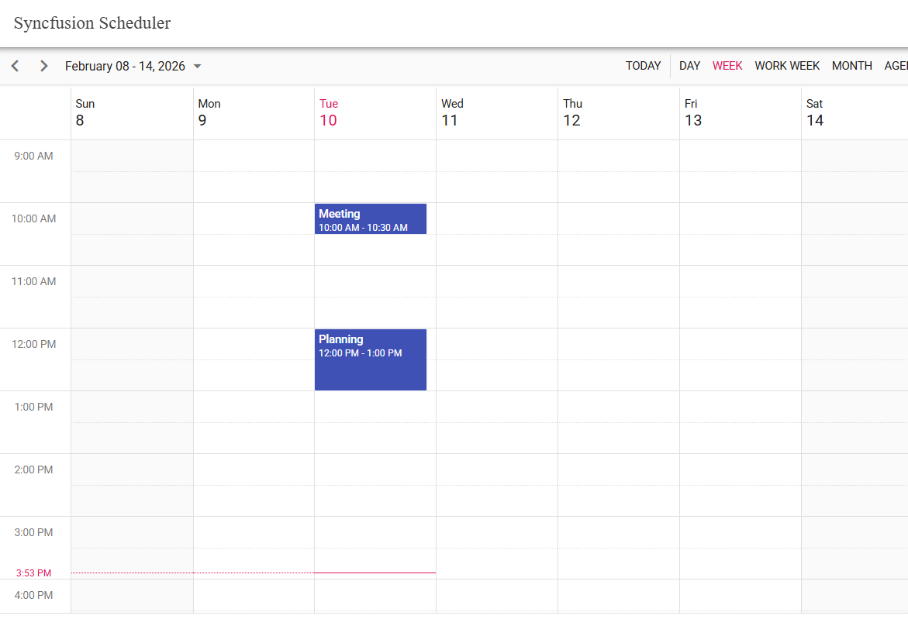

# Getting Started with Ionic and Angular with Syncfusion Scheduler
This guide provides a step-by-step walkthrough for creating an Angular application with the [Ionic Framework](https://ionicframework.com/), featuring integration of Syncfusion<sup style="font-size:70%">&reg;</sup> Angular UI components for modern, responsive interfaces.

## Prerequisites

Before beginning, ensure the following are installed:

* [System requirements for Syncfusion Angular UI components](https://ej2.syncfusion.com/angular/documentation/system-requirement)
* Ionic CLI version `^8.0.0` or later
* Node.js (latest LTS version is recommended)
* Angular CLI compatible with your Ionic version

## Create an Application

To set up a new Ionic Angular project, install the Ionic CLI and initialize your application:

```bash
npm i -g @ionic/cli
```
> We are utilizing Node.js version 22 and Ionic version 8.0.0 to support Angular 19.

Once the development setup is complete, create a new project by running:

```bash
ionic start syncfusion-angular-ionic blank --type=angular 
```

This creates an Ionic application in the `syncfusion-angular-ionic` directory with default npm packages.

> Refer to this [Ionic getting started guide](https://ionicframework.com/docs/intro/cli) for more framework installation details.

## Installing Syncfusion<sup style="font-size:70%">&reg;</sup> Schedule Package

Add the Syncfusion<sup style="font-size:70%">&reg;</sup> Schedule package to your project using the following command:

```bash
npm install @syncfusion/ej2-angular-schedule --save
```
## Adding CSS References

To apply the required styles for the Schedule component, update `src/global` file with the following imports:




@import '../node_modules/@syncfusion/ej2-base/styles/material3.css';
@import '../node_modules/@syncfusion/ej2-buttons/styles/material3.css';
@import '../node_modules/@syncfusion/ej2-calendars/styles/material3.css';
@import '../node_modules/@syncfusion/ej2-dropdowns/styles/material3.css';
@import '../node_modules/@syncfusion/ej2-inputs/styles/material3.css';
@import '../node_modules/@syncfusion/ej2-lists/styles/material3.css';
@import '../node_modules/@syncfusion/ej2-popups/styles/material3.css';
@import '../node_modules/@syncfusion/ej2-navigations/styles/material3.css';
@import '../node_modules/@syncfusion/ej2-angular-schedule/styles/material3.css';




## Adding Syncfusion<sup style="font-size:70%">&reg;</sup> Schedule Component

After installation, include the following code in your `~/src/app/home/home.page.ts` file to render the Syncfusion Schedule:

```typescript
import { Component, ViewChild } from '@angular/core';
import { IonicModule } from '@ionic/angular';
import { CommonModule } from '@angular/common';

import {
  ScheduleModule,
  ScheduleComponent,
  EventSettingsModel,

  // View services
  DayService, WeekService, WorkWeekService, MonthService, AgendaService,

  DragAndDropService, ResizeService
} from '@syncfusion/ej2-angular-schedule';

@Component({
  selector: 'app-home',
  standalone: true,
  imports: [IonicModule, CommonModule, ScheduleModule],

  // Inject views
  providers: [
    DayService, WeekService, WorkWeekService, MonthService, AgendaService
  ],
  template: `
    <ion-header>
      <ion-toolbar>
        <ion-title>Syncfusion Scheduler</ion-title>
      </ion-toolbar>
    </ion-header>

    <ion-content class="ion-padding">
      <ejs-schedule
        #schedule
        width="100%"
        height="650px"
        [selectedDate]="selectedDate"
        [views]="views"
        [eventSettings]="eventSettings"
      >
      </ejs-schedule>
    </ion-content>
  `
})
export class HomePage {
  @ViewChild('schedule', { static: true }) public scheduleObj!: ScheduleComponent;

  public selectedDate: Date = new Date();
  public views: string[] = ['Day', 'Week', 'WorkWeek', 'Month', 'Agenda'];

  public events: object[] = [
    {
      Id: 1,
      Subject: 'Meeting',
      StartTime: new Date(new Date().setHours(10, 0, 0, 0)),
      EndTime: new Date(new Date().setHours(10, 30, 0, 0))
    },
    {
      Id: 2,
      Subject: 'Planning',
      StartTime: new Date(new Date().setHours(12, 0, 0, 0)),
      EndTime: new Date(new Date().setHours(13, 0, 0, 0))
    }
  ];

  public eventSettings: EventSettingsModel = { dataSource: this.events };
}    
```
## Configure Routing

Update `src/app/app.routes.ts` to route to the `HomePage` component:

```typescript
import { Routes } from '@angular/router';
import { HomePage } from './home/home.page';

export const routes: Routes = [
  { path: '', component: HomePage }
];
```

## Running the Application

To run the application and view the integrated Syncfusion<sup style="font-size:70%">&reg;</sup> Angular Schedule component, use the following command:

```bash
ionic serve
```

## Output


> For additional help, see the [Angular sample with Ionic framework on GitHub](https://github.com/SyncfusionExamples/How-to-integrate-Syncfusion-Angular-Scheduler-with-Ionic)
