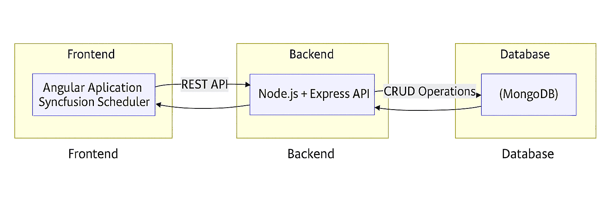
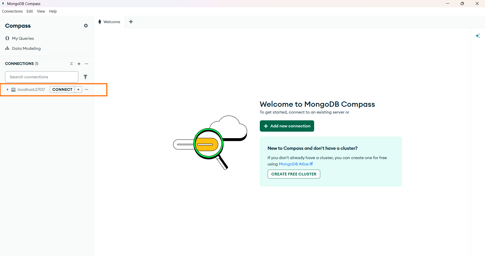
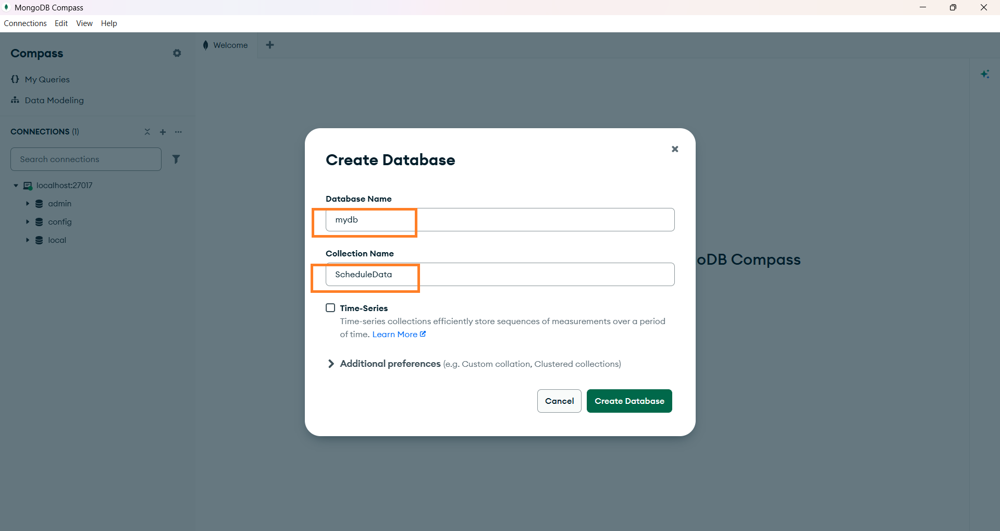
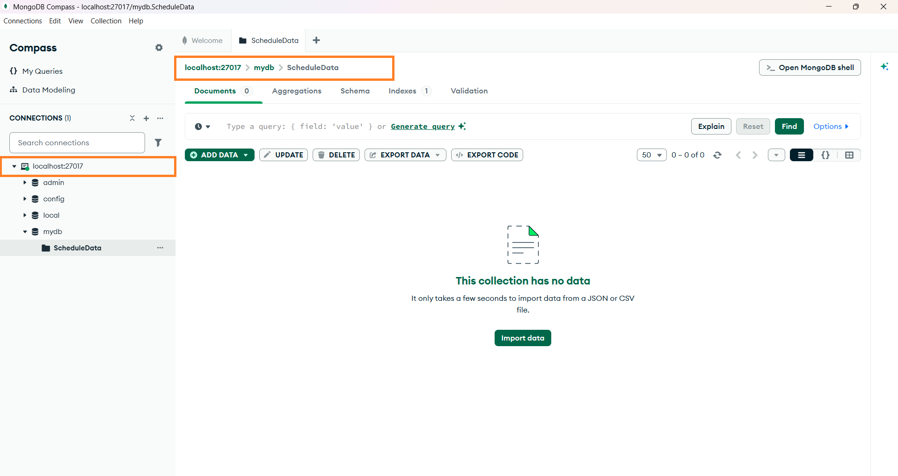
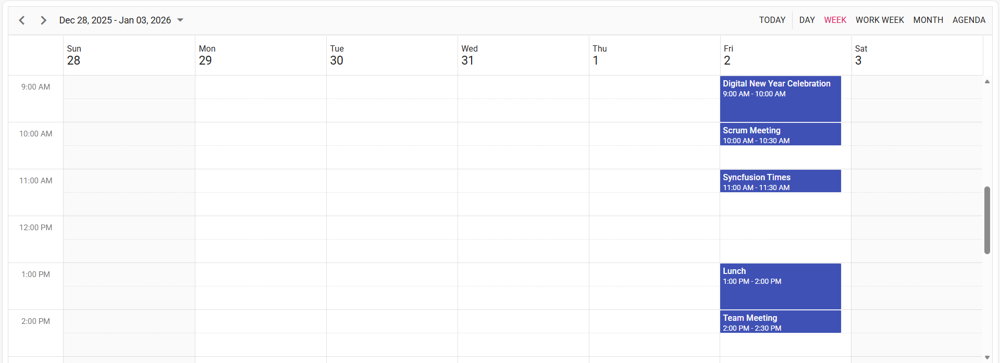
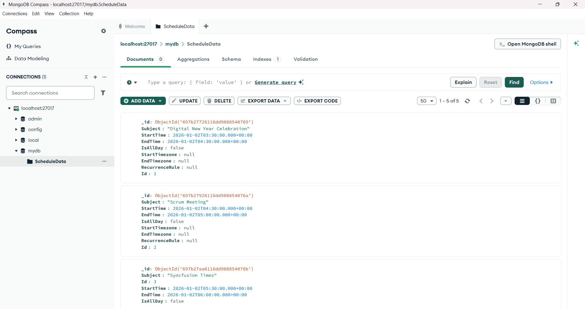

# Getting started with Syncfusion Angular Scheduler and MongoDB

The Syncfusion [Angular Schedule](https://ej2.syncfusion.com/angular/documentation/schedule/getting-started) combined with MongoDB provides a robust, scalable, and flexible data-driven application architecture suitable for modern event-management systems.

MongoDB's schema-less design seamlessly supports complex scheduling data, making it ideal for storing events, resources, recurrence rules, and user-specific calendar configurations.

## What is MongoDB?

[MongoDB](https://www.mongodb.com) is a highly scalable, document-oriented NoSQL database designed to store and manage large volumes of flexible, JSON-like data. It enables developers to work with dynamic schemas, making it easy to model complex and evolving application data without rigid table structures.

## Overview
This integration enables full CRUD (Create, Read, Update, Delete) operations for calendar events using:

* Frontend: **Angular + Syncfusion Angular Scheduler**
* Backend: **Node.js + Express**
* Database: **MongoDB**
* Communication: **REST APIs via Syncfusion DataManager**

Users can create, edit, and delete appointments in the Scheduler UI, with all changes persisted in MongoDB.

## Prerequisites

Before getting started, ensure the following prerequisites are met:

* **Node.js ≥ 20.19.0**  
Required for optimal performance and full compatibility with MongoDB Node.js Driver v7.0 and modern ES features.

* **MongoDB (Latest Stable Version)**   
Required for storing and retrieving application data. Supports both local installation and MongoDB Atlas.

* **Angular CLI (v17+ recommended)**  
To install Angular CLI, run the following command.




npm install -g @angular/cli




## Architecture Diagram

## Database Setup 
Follow the steps below to set up the MongoDB database for the application:

1. Download the MongoDB Community Edition from the official website: [MongoDB](https://www.mongodb.com/try/download/community)

2. Install MongoDB by following the platform‑specific installation instructions (Windows / macOS / Linux).

3. Launch MongoDB Compass after successful installation.

4. Open MongoDB Compass and connect the default connection string: `mongodb://localhost:27017`

*Image illustrating the MongoDB connection string*

5. Create a new Database `mydb` and a Collection `ScheduleData` in default connection string.

*Image illustrating the MongoDB database & collection*

6. Confirm that MongoDB Compass shows the database in the connected state, as illustrated in the screenshot.

*Image illustrating the MongoDB connectivity*

## Create an Angular Application
To create a new Angular application, use Angular CLI — it provides a modern, optimized build system with faster builds, hot reload (HMR), and an improved developer experience.




ng new angular-app   
cd angular-app




The Angular application is now created with default settings.
Next, we will proceed with integrating Syncfusion® Angular Scheduler component into the project after setting up the server.

## Create a Server Application
### Step 1: Install required libraries
To set up the backend for the application, Install the required packages and make a new directory for server in the Angular project folder itself.




npm install express mongodb cors




* Express – A minimal and flexible web framework used to build API endpoints
* MongoDB (Node.js Driver) – The official MongoDB driver that allows your server to communicate with the database
* CORS – A package that enables your application (running on a different port) to access the server’s API




mkdir server




### Step 2: Create a file server.js
Create a new file named `server.js` inside the directory `server` created above and add the following code to set up the server.
    



const { MongoClient } = require('mongodb');
const express = require('express');
const cors = require('cors');
const app = express();
const mongoUrl = 'mongodb://127.0.0.1:27017/';
const PORT = 5000;

app.use(express.json());
app.use(express.urlencoded({ extended: false }));

// CORS configuration
app.use(cors({
    origin: 'http://localhost:4200',
    methods: ['GET', 'POST', 'PUT', 'PATCH', 'DELETE'],
    allowedHeaders: ['Content-Type'],
    credentials: false
}));

app.listen(PORT, () => {
    console.log(`✅ Server running on http://localhost:${PORT}`);
});

(async () => {
    const client = new MongoClient(mongoUrl);
    await client.connect();
    const db = client.db('mydb');
    const collection = db.collection('ScheduleData');

    // Fetch all scheduler events
    app.post('/GetData', async (req, res) => {
        try {
            const data = await collection.find({}).toArray();
            res.json(data);
        } catch (err) {
            res.status(500).json({ error: err.message });
        }
    });

    // Handle batch CRUD operations
    app.post('/BatchData', async (req, res) => {
        try {
            const body = req.body;
            let events = [];

            // INSERT
            if (body.action === 'insert' || (body.added && body.added.length)) {
                events = body.added || [body.value];
                for (const e of events) {
                e.StartTime = new Date(e.StartTime);
                e.EndTime = new Date(e.EndTime);
                await collection.insertOne(e);
                }
            }

            // UPDATE
            if (body.action === 'update' || (body.changed && body.changed.length)) {
                events = body.changed || [body.value];
                for (const e of events) {
                delete e._id; // Critical: remove _id to avoid immutable field error
                e.StartTime = new Date(e.StartTime);
                e.EndTime = new Date(e.EndTime);
                await collection.updateOne(
                    { Id: e.Id },
                    { $set: e }
                );
                }
            }

            // DELETE
            if (body.action === 'remove' || (body.deleted && body.deleted.length)) {
                events = body.deleted || [{ Id: body.key }];
                for (const e of events) {
                await collection.deleteOne({ Id: e.Id });
                }
            }
            res.json(body);
        } 
        catch (err) {
            res.status(500).json({ error: err.message });
        }
    });
})();




Here database name is `mydb` and collection name is `ScheduleData`, both were previously created during the database setup process.
    
### Step 3: Add server script to package.json
To enable running the Node.js backend directly from the Angular project’s root, add the following script inside your root `package.json` under the "scripts" section.




"scripts": {
    "server": "node ./server/server.js"
}




## Integrating Syncfusion Angular Scheduler
This section integrates [Syncfusion Angular Scheduler](https://www.syncfusion.com/angular-components/angular-scheduler) to the above created application.

### Step 1: Install required libraries
Install the required [Syncfusion Angular Scheduler package](https://www.npmjs.com/package/@syncfusion/ej2-angular-schedule) by the following command.
    



npm install @syncfusion/ej2-angular-schedule




### Step 2: Add CSS references
Add CSS references for the Schedule in `src/styles.css`.




@import '../node_modules/@syncfusion/ej2-base/styles/material.css';
@import '../node_modules/@syncfusion/ej2-buttons/styles/material.css';
@import '../node_modules/@syncfusion/ej2-calendars/styles/material.css';
@import '../node_modules/@syncfusion/ej2-dropdowns/styles/material.css';
@import '../node_modules/@syncfusion/ej2-inputs/styles/material.css';
@import '../node_modules/@syncfusion/ej2-lists/styles/material.css';
@import '../node_modules/@syncfusion/ej2-popups/styles/material.css';
@import '../node_modules/@syncfusion/ej2-navigations/styles/material.css';
@import '../node_modules/@syncfusion/ej2-angular-schedule/styles/material.css';




### Step 3: Add the Schedule component
In the `src/app/app.ts` file, use the following code snippet to render the Syncfusion Angular Schedule component.




import { Component } from '@angular/core';
import { ScheduleModule, DayService, WeekService, WorkWeekService, MonthService, AgendaService } from '@syncfusion/ej2-angular-schedule';

@Component({
selector: 'app-root',
templateUrl: 'app.html',
imports: [ScheduleModule],
providers: [DayService, WeekService, WorkWeekService, MonthService, AgendaService],
})

export class App {
    // you can add functionalities here....
}




Create a template for the component in `src/app/app.html` and make reference in `src/app/app.ts`.




<ejs-schedule width="100%" height="550px"></ejs-schedule>




### Step 4: Perform CRUD operations using Syncfusion's DataManager URL Adaptor
This connects the scheduler to your backend through REST endpoints and enables create, read, update, and delete from the UI.




import { Component, OnInit } from '@angular/core';
import { ScheduleModule, EventSettingsModel, DayService, WeekService, WorkWeekService, MonthService, AgendaService } from '@syncfusion/ej2-angular-schedule';
import { DataManager, UrlAdaptor } from '@syncfusion/ej2-data';

@Component({
selector: 'app-root',
templateUrl: 'app.html',
imports: [ScheduleModule],
providers: [DayService, WeekService, WorkWeekService, MonthService, AgendaService],
})

export class App implements OnInit {
    private dataManager: DataManager = new DataManager({
        url: 'http://localhost:5000/GetData',
        crudUrl: 'http://localhost:5000/BatchData',
        adaptor: new UrlAdaptor,
        crossDomain: true
    });
    public eventSettings: EventSettingsModel = { dataSource: this.dataManager };
    public selectedDate: Date | undefined;
    ngOnInit(): void {
            this.selectedDate = new Date(2026, 0, 1);
    }
}




Modify the template of the component to perform CRUD operations.




<ejs-schedule #scheduleObj width="100%" height="550px" [eventSettings]='eventSettings' [selectedDate]="selectedDate"></ejs-schedule>




* The Scheduler is connected to a backend service using **Syncfusion’s DataManager**, a powerful data-handling component built to seamlessly manage remote data operations.
* DataManager is configured with two API endpoints:
    * url → to read event data
    * crudUrl → to handle create, update, and delete actions
* The UrlAdaptor ensures standard REST-style communication with your server.
* Once this is set, the Scheduler automatically sends requests when users add, edit, drag, resize, or delete events.
* The server processes these operations and returns updated event data, allowing the Scheduler to stay perfectly in sync with the backend.

## Run the Application
### Step 1: Start the backend server
From the project directory `angular-app/`, start the backend server.




npm run server




Once started, the Node.js backend will be available at: `http://localhost:5000/`

### Step 2: Start the Angular application
Open a new terminal window from the same `angular-app/` directory and run the Angular application.
    



npm start




After the build completes, the Angular application will run at: `http://localhost:4200/`

You can now create, read, update, and delete events directly in the **Syncfusion Angular Scheduler**.
All changes will be reflected in the connected **MongoDB** database in real time.

## Output Preview
**Syncfusion Angular Scheduler**

*Image illustrating the Syncfusion Angular Scheduler* 

**Syncfusion Angular Scheduler Events in MongoDB**

*Image illustrating the Syncfusion Angular Scheduler Events in MongoDB*

## Common Pitfalls & Solutions

1. **CORS blocked:** Register app.use(cors(...)) before routes, and match origin with your Angular dev URL (http://localhost:4200). Enable credentials only if you send cookies/Authorization and configure headers in DataManager.

2. **Dates stored as strings:** Convert StartTime/EndTime to Date objects on the server before inserting/updating. Otherwise, Scheduler rendering/timezone math may be off.

3. **Immutable _id on update:** Remove _id from payload prior to updateOne (MongoDB forbids changing _id) [mongodb.com](https://www.mongodb.com/docs/drivers/node/v6.15/usage-examples/updateOne).

4. **Missing CSS → broken editor/pickers:** Include Scheduler CSS (via ng add or styles.css) per [getting‑started docs](https://ej2.syncfusion.com/angular/documentation/schedule/getting-started#adding-css-reference).

 

> Please find the sample in this [GitHub location](https://github.com/SyncfusionExamples/ej2-angular-scheduler-mongodb)