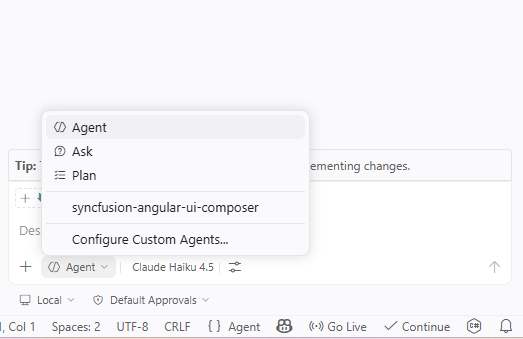

# Syncfusion® Angular UI Composer Skill for AI Assistants

**Syncfusion® Angular UI Composer** is an AI-powered skill and companion agent that accelerates Angular application development by transforming natural-language UI requirements into production-ready components using Syncfusion® Angular UI libraries. 

Integrated with your AI-powered IDE, it leverages deep knowledge of **Syncfusion® components** to deliver accurate and ready-to-use code.
By combining intelligent code generation with best practices, accessibility standards, and design-system consistency, Angular UI Composer helps you rapidly build scalable dashboards and user interfaces without leaving your development workflow.

## Prerequisites

Before installing Angular UI Composer, ensure the following:

- Install [APM (Agent Package Manager)](https://microsoft.github.io/apm/getting-started/installation/#quick-install-recommended)
- Required [Node.js](https://nodejs.org/en) version ≥ 18
- Angular application (existing or new); see [Quick Start](https://ej2.syncfusion.com/angular/documentation/getting-started/angular-cli)
- A supported AI agent or IDE that integrates with the Skills (VS Code, Cursor, Syncfusion® Code Studio, etc.)
- Active Syncfusion<sup style="font-size:70%">&reg;</sup> license(any of the following):  
  - [Commercial](https://www.syncfusion.com/sales/unlimitedlicense)  
  - [Community License](https://www.syncfusion.com/products/communitylicense)  
  - [Free Trial](https://www.syncfusion.com/account/manage-trials/start-trials)

## Key Benefits

### **AI-Driven UI Generation**
- Converts prompts into complete Angular components—not just snippets
- Automatically selects appropriate Syncfusion® components and features
- Produces structured, maintainable code

### **Component Usage & API Accuracy**
- Uses correct Syncfusion® component APIs
- Injects required feature modules (paging, sorting, filtering, etc.)
- Avoids unsupported or deprecated patterns

### **Patterns & Best Practices**
- Recommended component composition and services
- Event handling aligned with Angular standards
- Secure and scalable coding patterns

### **Accessibility & Responsiveness**
- WCAG 2.1 AA–aligned output
- Semantic HTML with ARIA support
- Mobile-first responsive layouts

### **Design-System Integration**
- Supports Tailwind, Bootstrap, Material, or custom themes
- Ensures consistent Syncfusion® styling and theme usage

## Installation

Before installing Angular UI Composer, ensure that APM (Agent Package Manager) is installed and available in your environment.

### Verify APM Installation

Run the following command to confirm APM is installed:

```bash
apm --version
```

### Install the Syncfusion® Angular UI Composer package using APM

Use the APM CLI to install the Angular UI Composer skill for your preferred environment:




apm install syncfusion/angular-ui-composer -t copilot




apm install syncfusion/angular-ui-composer -t cursor




apm install syncfusion/angular-ui-composer -t codex




apm install syncfusion/angular-ui-composer -t claude




After installation, the following artifacts are added to your project for the GitHub Copilot target:

- `.agent/skills/` – contains the skill files
- `.github/agents/` – contains the agent configuration

Refer to the [documentation](https://microsoft.github.io/apm/reference/cli/targets/#detection-signals) for details about supported deployment targets.

> For Syncfusion® Code Studio, use the Copilot command above to install the Angular UI Composer.

## How the Syncfusion® Angular UI Composer Skill Works

1. **Intent Analysis** — Parse the user's prompt to identify component types and high-level layout intent.
2. **Project Detection** — Automatically detects project framework, package manager, and existing themes.
3. **Component Mapping** — Map intent to Syncfusion® components and required feature modules.
4. **Theming & Design System**  
   Load required theming guidelines and confirm key design choices:
   - CSS framework (Tailwind, Bootstrap, Material, or Greenfield(custom theme)). If no themes detected in the existing project, Greenfield and Syncfusion Tailwind3 theme are shown as the default option—proceed with this or change the theme as preferred.
   - Syncfusion theme (Tailwind3, Bootstrap5, Material3, fluent2)
   - Light and Dark Mode
   - Core design basics (colors, spacing, typography, responsiveness, accessibility)
5. **Code Generation** — Produce Angular components with TypeScript, HTML templates, and CSS/SCSS styling.
6. **Dependency Management** — Recommend or install required Syncfusion® packages and peer dependencies.
7. **Validation** — Run accessibility and basic security checks, request confirmation for changes.
8. **Code Insertion** — Create files or patch existing files following project structure and conventions.

Key enforcement points:

- Adds correct theme and CSS imports for chosen Syncfusion® themes
- Injects only the feature modules required by generated components
- Generates semantic HTML with ARIA attributes and keyboard support
- Avoids unsupported or deprecated API usages for Syncfusion® components

> The assistant handles most stages automatically and may request confirmation where required.

## Using the AI Assistant

After installing Angular UI Composer with APM, the relevant agent and skill files are added to your project under:

- `.agent/skills/` (skill files)
- `.github/agents/` (Angular UI composer agent configuration, based on the selected target)

To start using the skill:

1.Open your supported IDE.
2.In the chat panel, select the `syncfusion-angular-ui-composer` agent from the **Agent dropdown**.



3.Start prompting the agent with a clear description of your UI requirements.

**Examples Prompts:**



Create a login page with the Tailwind 3 theme using a centered card layout containing email and password input fields with validation. Include a "Remember Me" checkbox, a forgot password link, and a primary login button. Add a secondary "Create Account" button below. Ensure the layout is responsive and works on mobile, tablet, and desktop.


Design a full-viewport premium admin dashboard that feels fluid, spacious, and visually rich—avoid boxed or narrow layouts. Use a soft neutral background (#F8FAFC) with layered white surfaces, subtle shadows, soft borders, and light gradients to create depth. Include a floating glass-style header (logo, search, notifications, avatar dropdown) and a stylish collapsible sidebar with tinted background, smooth animations, and highlighted active states. Structure the main area with an asymmetrical, responsive grid layout using generous spacing (24–32px), featuring larger, visually dominant cards (with icons, gradients, trend indicators, and hover lift), charts (line/bar/pie in cards), and an enhanced data grid (sticky header, sorting, filtering, badges, hover states, pagination). Apply a modern design system (Inter font, 4/8px spacing, muted grays, indigo/blue accents, semantic colors) with smooth 150–250ms transitions, micro-interactions, tooltips, and high accessibility (WCAG AA, ≥44px targets).




Generated code follows best practices with accessible, semantic HTML, responsive mobile-first layouts, strong TypeScript typing, and built-in security measures such as input validation and avoidance of embedded secrets.

## Best Practices

Follow these guidelines to get the most out of UI Composer and ensure high-quality production-ready result:

- **Stay consistent** — Maintain consistent file organization, naming conventions, and coding standards throughout your project.
- **Use advanced AI models** — For best results, use **Claude Sonnet 4.6 or higher** capability models to produce better code quality and more accurate implementations.
- **Review all content and assets before production** — Replace any placeholder images or icons (e.g., from Unsplash or emoji sets) with your brand assets. Also validate the logic, security, and compatibility with your existing code before deployment.

## Troubleshooting

- **APM installation failure**: Refer to this [documentation](https://microsoft.github.io/apm/getting-started/installation/#troubleshooting)

- **Skills not loading**: Ensure the **.agent/** and **.github/agents/** folders exist in your project and that the skill was installed successfully using APM. Verify that the correct agent is selected from the Agent dropdown in your IDE.

- **Component not rendering**: Retry generation using the specific component skill to resolve the issue, and ensure required Syncfusion® packages and themes are properly configured.

- **Syncfusion license banner appears**: Use the licensing skill to correctly register and validate your Syncfusion® license key in the application.


## FAQ

**Which agents/IDEs are supported?**
Any Skills-compatible agent that reads local skill files (Code Studio, VS Code, Cursor, etc.).

**Are skills loaded automatically?**  
Yes. Supported agents automatically load relevant skills based on your query.

**Can I customize the generated styles?**
Yes. The skill supports choosing Tailwind, Bootstrap, Material, or a custom theme; generated components include clear integration points for style adjustments.

**Does it modify files automatically?**
The skill proposes changes and requires confirmation for insertion; automatic dependency installation may be offered depending on agent permissions.

## See also

- [Agent Skills Standards](https://agentskills.io/home)
- [Agent Package Manager](https://microsoft.github.io/apm/getting-started/quick-start/)
