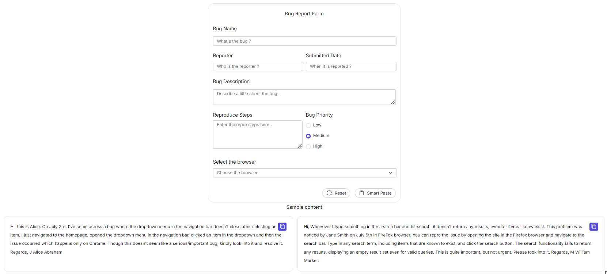

# Annotations (data-smartpaste-description)

The `data-smartpaste-description` attribute provides a way to customize the behavior of the Smart Paste Button. By using this attribute, pasted content is handled based on specific requirements. This customization can include setting content validation rules, formatting instructions, and defining acceptable content types.

## Purpose of data-smartpaste-description:

* This is a custom data attribute that can be added to HTML elements. It provides metadata about the expected content for those elements when used in conjunction with the Smart Paste Button.

* The main purpose is to control and enhance the paste operation by providing contextual information about what kind of data is expected. This can include formats like plain text, email, phone numbers, or even more complex validation patterns.

* It helps maintain data consistency, integrity, and formatting in forms, ensuring that users paste content that adheres to predefined standards.

## How to Use Annotations for Customizing the Paste Behavior

Add the **data-smartpaste-description** attribute to the form fields where the smart paste feature should be applied. Specify the expected content type as the value of the attribute.

```html
<ejs-textarea id="reporter-name" name="reporter-name" cssClass="form-input" data-smartpaste-description="Name must follow the format: Initial Firstname Lastname"></ejs-texarea>
```

## Example Cases Demonstrating the Use of Annotations to Enhance User Experience

These examples illustrate how using **data-smartpaste-description** attributes can provide fine-grained control over pasting behaviors, ensuring that the Smart Paste Button meets specific requirements and enhances the user experience.




import { Component, OnInit, viewChild, ViewChild} from '@angular/core';
import { FormBuilder, FormGroup } from '@angular/forms';
import {ButtonComponent, ButtonAllModule, SmartPasteButtonAllModule , RadioButtonAllModule, ChipListModule, ClickEventArgs } from '@syncfusion/ej2-angular-buttons';
import {  ComboBoxModule} from '@syncfusion/ej2-angular-dropdowns';
import { TextAreaAllModule,TextBoxAllModule } from '@syncfusion/ej2-angular-inputs';
import {DatePickerAllModule} from '@syncfusion/ej2-angular-calendars';
import { getAzureChatAIRequest } from './ai-model';
import { VirtualElementHandler } from '@syncfusion/ej2-angular-grids';
import { createSpinner, showSpinner } from '@syncfusion/ej2-angular-popups';

@Component({
  selector: 'app-smart-paste',
  standalone: true,
  imports: [ButtonAllModule, ChipListModule,TextBoxAllModule,RadioButtonAllModule,SmartPasteButtonAllModule,ComboBoxModule, TextAreaAllModule,DatePickerAllModule],
  templateUrl: './smart-paste.component.html',
  styleUrls: ['./smart-paste.component.css']
})
export class SmartPasteComponent implements OnInit {
  @ViewChild('smart') public smartPaste: any;
  @ViewChild('copyButton1', { static: true } ) public copyButton1!: ButtonComponent;
  @ViewChild('copyButton2', { static: true } ) public copyButton2!: ButtonComponent;
  public buttonInstance: { [key: string]: HTMLElement | null } = {};
  public idArray: string[] = ['1', '2'];
  bugForm!: FormGroup;
  browsers: string[] = ['Chrome', 'Firefox', 'Edge', 'Safari'];

  constructor(private fb: FormBuilder) {}

  ngOnInit(): void {
   
    this.bugForm = this.fb.group({
      bugName: [''],
      reporterName: [''],
      submittedDate: [''],
      bugDescription: [''],
      reproduceSteps: [''],
      bugPriority: [''],
      browser: ['']
    });
    this.buttonInstance = {
      button1: this.copyButton1.element,
      button2: this.copyButton2.element,
  };
  }
// Property Pane Code

 public bugPresets: string[] = [
  "Issue with the dropdown menu",
  "Trouble logging into the website",
  "Search functionality not working",
  "Images missing on the product page"
];

public  bugReports: string[] = [
  `Hi, this is Alice. On July 3rd, I've come across a bug where the dropdown menu in the navigation bar doesn't close after selecting an item. I just navigated to the homepage, opened the dropdown menu in the navigation bar, clicked an item in the dropdown and then the issue occurred which happens only on Chrome. Though this doesn't seem like a serious/important bug, kindly look into it and resolve it. Regards, J Alice Abraham`,
  `Hey team, On May 2nd, K John Doe reported an issue where the login page refreshes instead of logging in when the user clicks the login button. This problem prevents users from accessing their accounts, making it a critical issue that needs immediate attention. The issue has been observed across all major browsers. To reproduce the issue, open any browser and navigate to the website's login page. Enter a valid username and password, then click the Login button.`,
  `Hi, Whenever I type something in the search bar and hit search, it doesn't return any results, even for items I know exist. This problem was noticed by Jane Smith on July 5th in FireFox browser. You can repro the issue by opening the site in the Firefox browser and navigate to the search bar. Type in any search term, including items that are known to exist, and click the search button. The search functionality fails to return any results, displaying an empty result set even for valid queries. This is quite important, but not urgent. Please look into it. Regards, M William Marker`,
  `Hello, When I selected the category option on the landing page and chose the electronics category, the images were missing on the product page. The placeholders are there, but no actual images are loading. This happens on all browsers. I reported this on July 3rd. It's not urgent, but it does affect the user experience. Regards, L Mike Johnson`
];

  onReset(): void {
    this.bugForm.reset();
  }
  
public serverAIRequest = async (settings: any) => {
  let output = '';
  try {
      console.log(settings);
      const response = await getAzureChatAIRequest(settings) as string;
      console.log("Success:", response);
      output = response;
  } catch (error) {
      console.error("Error:", error);
  }
  return output;
};
  onCreated(): void {
    this.smartPaste.aiAssistHandler = this.serverAIRequest;
  }

async copyContent(id: string) {
  if (!document.hasFocus()) {
    window.focus(); // Bring the document into focus
  }
  let text = document.getElementById('copy-content' + id)?.innerText;
  await navigator.clipboard.writeText(text as string);
  let inactive: string = this.idArray.filter((item) => item !== id)[0];
  this.buttonInstance['button' + inactive]?.querySelector('span')?.classList.replace('e-check', 'e-copy');
  this.buttonInstance['button' + id]?.querySelector('span')?.classList.replace('e-copy', 'e-check');
}
  
}



<h2 style="text-align:center;">Data Smart Paste Button</h2>

<h3 style="text-align:center;">Bug Report</h3>
<div class="description-container e-card">
  <div class='e-card-content'>
    <p>
      The <b>SmartPasteButton</b> is an AI-powered upgrade of Syncfusion's Button, adding smart pasting
      features. It uses AI to paste clipboard data in the right context and format automatically.
  </p>
  <p>
      To quickly fill out the bug report form, copy the sample content and click the Smart Paste button. Know
      more <a href="https://github.com/syncfusion/smart-ai-samples/blob/master/typescript/src/app/smartpaste/Readme.md">here</a>.
  </p>
  </div>
</div>

<form class="form-container container bug-form-container" style="max-width: 900px; line-height: 35px; background-color: #f3f4f6;">
  <div style="text-align:center;"><span>Bug Report Form</span></div>
  <div class="single-row-group">
    <label for="bug-name" class="e-form-label">Bug Name</label>
    <ejs-textbox id="bug-name" name="bug-name" formControlName="bugName" cssClass="form-input"></ejs-textbox>
  </div>

  <div class="row-group">
    <div>
      <label for="reporter-name" class="e-form-label">Reporter</label>
      <ejs-textbox id="reporter-name" name="reporter-name" formControlName="reporterName" cssClass="form-input" data-smartpaste-description="Name must follow the format: Initial Firstname Lastname"></ejs-textbox>
    </div>
    <div>
      <label for="submitted-date" class="e-form-label">Submitted Date</label>
      <ejs-textbox id="submitted-date" name="submit-date" formControlName="submittedDate" cssClass="form-input" data-smartpaste-description="Date must follow the format: Month Day. For ex: May 01"></ejs-textbox>
    </div>
  </div>

  <div class="form-group">
    <label for="bug-description" class="e-form-label">Bug Description</label>
    <ejs-textarea id="bug-description" formControlName="bugDescription" cssClass="form-textarea" multiline="true" placeholder="Describe a little about the bug."></ejs-textarea>
  </div>

  <div class="row-group">
    <div style="display: flex; flex-direction: column;">
      <label for="reproduce-steps" class="e-form-label">Reproduce Steps</label>
      <ejs-textbox id="reproduce-steps" name="reproduce-steps" formControlName="reproduceSteps" cssClass="form-textarea" multiline="true" data-smartpaste-description="Structure each steps in a Numbered format."></ejs-textbox>
    </div>
    <div>
      <label class="form-label">Bug Priority</label>
      <div class="row">
        <ejs-radiobutton id="radio1" label="Low" name="bugPriority" formControlName="bugPriority" value="Low"></ejs-radiobutton>
      </div>
      <div class="row">
        <ejs-radiobutton id="radio2" label="Medium" name="bugPriority" formControlName="bugPriority" value="Medium" [checked]="true"></ejs-radiobutton>
      </div>
      <div class="row">
        <ejs-radiobutton id="radio3" label="High" name="bugPriority" formControlName="bugPriority" value="High"></ejs-radiobutton>
      </div>
    </div>
  </div>

  <div>
    <label for="browser" class="form-label">Select the browser</label>
    <ejs-combobox id="browser" name="browser" formControlName="browser" [dataSource]="browsers"  placeholder="Choose the browser"></ejs-combobox>
  </div>

  <div class="form-footer">
    <button ejs-button type="reset" id="reset" iconCss="e-icons e-reset" cssClass="form-button" (click)="onReset()">Reset</button>
    <button #smart ejs-smart-paste-button  type="button" id="smart-paste" iconCss="e-icons e-paste" cssClass="form-button" (created)="onCreated()">Smart Paste</button>
  </div>
</form>

<div class="col-lg-12 property-section" style="padding-top: 5px;">
  <h4 style="text-align: center; font-size: 1.2rem;">Sample content</h4>
  <div class="content-flexed">
    <div class="content-body" data-index="0">
      <div class="copy-container" style="float: right;">
        <button #copyButton1 ejs-button id="copy1" (click)="copyContent('1')" cssClass="e-control e-btn e-lib custom-copy-icon e-primary e-icon-btn">
          <span class="e-icons e-copy e-btn-icon"></span>
        </button>
      </div>
      <div id="copy-content1">
        Hi, this is Alice. On July 3rd, I've come across a bug where the dropdown menu in the navigation bar doesn't close after selecting an item. I just navigated to the homepage, opened the dropdown menu in the navigation bar, clicked an item in the dropdown, and then the issue occurred, which happens only on Chrome. Though this doesn't seem like a serious/important bug, kindly look into it and resolve it. Regards, J Alice Abraham
      </div>
    </div>

    <div class="content-body" data-index="1">
      <div class="copy-container" style="float: right;">
        <button #copyButton2 ejs-button id="copy2" (click)="copyContent('2')" cssClass="e-control e-btn e-lib custom-copy-icon e-primary e-icon-btn">
          <span class="e-icons e-copy e-btn-icon"></span>
        </button>
      </div>
      <div id="copy-content2">
        Hi, Whenever I type something in the search bar and hit search, it doesn't return any results, even for items I know exist. This problem was noticed by Jane Smith on July 5th in FireFox browser. You can repro the issue by opening the site in the Firefox browser and navigating to the search bar. Type in any search term, including items that are known to exist, and click the search button. The search functionality fails to return any results, displaying an empty result set even for valid queries. This is quite important, but not urgent. Please look into it. Regards, M William Marker.
      </div>
    </div>
  </div>




import { generateText } from "ai"
import { createAzure } from '@ai-sdk/azure';
import { createGoogleGenerativeAI } from '@ai-sdk/google';

//Replace API_KEY and resourceName
const azure = createAzure({
    resourceName: 'ej2smart',
    apiKey: 'API_KEY',
});

const google = createGoogleGenerativeAI({
    baseURL: "https://generativelanguage.googleapis.com/v1beta",
    apiKey: "API_KEY"
});
 
const aiModel = azure('e.g: gpt4-o'); // update the model here

export async function getAzureChatAIRequest(options) {
    try {
        const result = await generateText({
            model: aiModel,
            messages: options.messages,
            topP: options.topP,
            temperature: options.temperature,
            maxTokens: options.maxTokens,
            frequencyPenalty: options.frequencyPenalty,
            presencePenalty: options.presencePenalty,
            stopSequences: options.stopSequences
        });
        return result.text;
    } catch (err) {
        console.error("Error occurred:", err);
        return null;
    }
}




import { bootstrapApplication } from '@angular/platform-browser';
import { appConfig } from './app/app.config';
import { AppComponent } from './app/app.component';

bootstrapApplication(AppComponent, appConfig)
  .catch((err) => console.error(err));




Below is the featured sample output:



## See also

* [Getting Started with Syncfusion Angular Smart Paste Button](./getting-started)