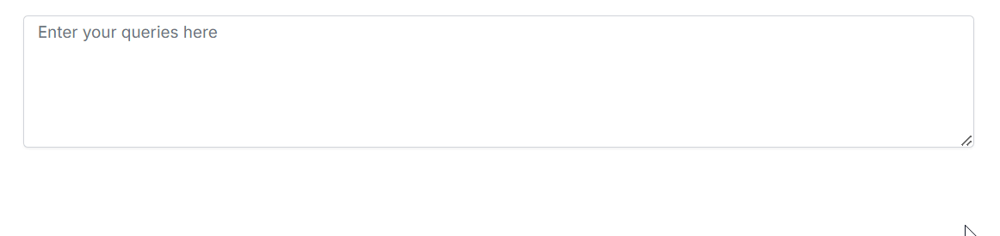
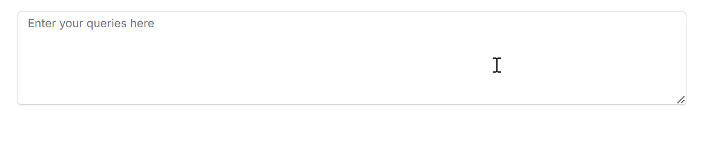

# Customizing Appearance of Suggestions

The [ShowSuggestionOnPopup](https://ej2.syncfusion.com/angular/documentation/api/smart-textarea/#aisuggestionhandler) property in Syncfusion Angular Smart TextArea allows you to control how text suggestions are displayed to the users.

* If `ShowSuggestionOnPopup` is `Enable`, suggestions displayed in the pop-up window




<ejs-smarttextarea  id="smart-textarea" #textareaObj  placeholder="Enter your queries here" floatLabelType="Auto" rows="5" userRole="Employee communicating with internal team" [UserPhrases]="defaultPreset"
[aiSuggestionHandler]="serverAIRequest" showSuggestionOnPopup="Enable"></ejs-smarttextarea>




* If `ShowSuggestionOnPopup` is `false`, suggestions displayed inline.




<ejs-smarttextarea  id="smart-textarea" #textareaObj  placeholder="Enter your queries here" floatLabelType="Auto" rows="5" userRole="Employee communicating with internal team" [UserPhrases]="defaultPreset"
[aiSuggestionHandler]="serverAIRequest" showSuggestionOnPopup="Disable"></ejs-smarttextarea>




By default `showSuggestionOnPopup` is `None`.

## See also

* [Getting Started with Syncfusion Angular Smart TextArea](./getting-started)