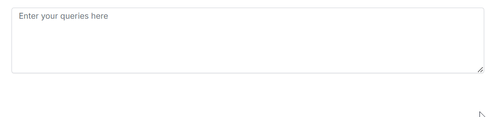

# Customization in Angular Smart TextArea

The [ShowSuggestionOnPopup](https://ej2.syncfusion.com/angular/documentation/api/smart-textarea/index-default#aisuggestionhandler) property in the Syncfusion® Angular Smart TextArea allows you to control how AI-generated text suggestions are presented to users. Depending on your application requirements, suggestions can be displayed in a popup window or directly within the text area as inline suggestions.

Use this property to provide the most suitable suggestion experience for your users and workflows.

The following values are supported:

| Value | Description |
|---------|-------------|
| `Enable` | Displays AI suggestions in a popup window. |
| `Disable` | Displays AI suggestions inline within the text area. |
| `None` | Uses the default suggestion behavior. |

By default, the `showSuggestionOnPopup` property is set to `None`.

## Display suggestions in a popup

Set the `showSuggestionOnPopup` property to `Enable` when you want AI suggestions to appear in a popup window. This mode helps users review and accept suggestions without interrupting the content already entered in the text area.




<ejs-smarttextarea  id="smart-textarea" #textareaObj  placeholder="Enter your queries here" floatLabelType="Auto" rows="5" userRole="Employee communicating with internal team" [UserPhrases]="defaultPreset"
[aiSuggestionHandler]="serverAIRequest" showSuggestionOnPopup="Enable"></ejs-smarttextarea>




In popup mode, the generated suggestion is displayed in a separate popup interface, allowing users to review and apply the suggested content conveniently.

## Display suggestions inline

Set the `showSuggestionOnPopup` property to `Disable` when you want AI suggestions to be displayed directly within the text area. This approach provides a seamless writing experience by showing suggestions in context as users type.




<ejs-smarttextarea  id="smart-textarea" #textareaObj  placeholder="Enter your queries here" floatLabelType="Auto" rows="5" userRole="Employee communicating with internal team" [UserPhrases]="defaultPreset"
[aiSuggestionHandler]="serverAIRequest" showSuggestionOnPopup="Disable"></ejs-smarttextarea>




In inline mode, suggestions appear directly within the text area, enabling users to continue writing naturally while reviewing AI-generated recommendations.

## See also

* [Getting Started with Syncfusion&reg; Angular Smart TextArea](./getting-started)