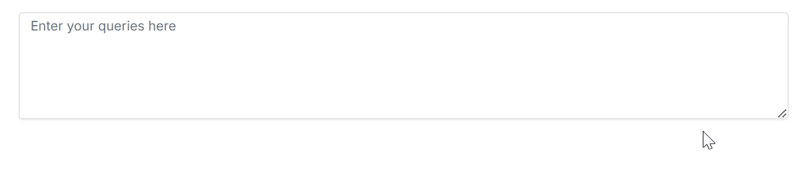

# Getting Started with Angular Smart TextArea Component

The **Smart TextArea** is an advanced component designed to elevate the text input experience by providing intelligent autocomplete suggestions for entire sentences through text-generative AI functionality. This component enhances user productivity by predicting and offering relevant completions based on the context of what is being typed.

This section briefly explains how to create a simple Smart TextArea and demonstrate the basic functionalities of the Smart TextArea component in an Angular environment.

## Prerequisites

* [System requirements for Syncfusion Angular UI components](https://ej2.syncfusion.com/angular/documentation/system-requirement)
* [OpenAI](https://github.com/syncfusion/smart-ai-samples/blob/master/angular/README.md#openai) or [Azure OpenAI Account](https://learn.microsoft.com/en-us/azure/ai-services/openai/how-to/create-resource)

## Dependencies

The following list of dependencies are required to use the Smart TextArea component in your application.

```js
|-- @syncfusion/ej2-angular-inputs
    |-- @syncfusion/ej2-angular-base
    |-- @syncfusion/ej2-inputs
        |-- @syncfusion/ej2-base
```

## Setup Angular environment

Users can use [Angular CLI](https://github.com/angular/angular-cli) to setup your Angular applications. To install Angular CLI use the following command.




npm install -g @angular/cli




## Create an Angular application

Start a new Angular application using below Angular CLI command.




ng new my-app
cd my-app




## Installing Syncfusion AppBar Package

Syncfusion packages are distributed in npm as `@syncfusion` scoped packages. You can get all the Angular Syncfusion package from npm [link]( https://www.npmjs.com/search?q=%40syncfusion%2Fej2-angular- ).

Currently, Syncfusion provides two types of package structures for Angular components,
1. Ivy library distribution package [format](https://angular.dev/tools/libraries/angular-package-format)
2. Angular compatibility compiler(Angular’s legacy compilation and rendering pipeline) package.

### Ivy library distribution package

Syncfusion Angular packages(`>=20.2.36`) has been moved to the Ivy distribution to support the Angular [Ivy](https://docs.angular.lat/guide/ivy) rendering engine and the package are compatible with Angular version 12 and above. To download the package use the below command.

Add [`@syncfusion/ej2-angular-inputs`](https://www.npmjs.com/package/@syncfusion/ej2-angular-inputs/v/20.2.38) package to the application.




npm install @syncfusion/ej2-angular-inputs --save




### Angular compatibility compiled package(ngcc)

For Angular version below 12, you can use the legacy (ngcc) package of the Syncfusion Angular components. To download the `ngcc` package use the below.

Add [`@syncfusion/ej2-angular-inputs@ngcc`](https://www.npmjs.com/package/@syncfusion/ej2-angular-inputs/v/20.2.38-ngcc) package to the application.




npm install @syncfusion/ej2-angular-inputs@ngcc --save




To mention the ngcc package in the `package.json` file, add the suffix `-ngcc` with the package version as below.




@syncfusion/ej2-angular-inputs:"20.2.38-ngcc"




N> If the ngcc tag is not specified while installing the package, the Ivy Library Package will be installed and this package will throw a warning.

## Adding CSS reference

Add Smart TextArea component's styles as given below in `styles.css`.




@import "../node_modules/@syncfusion/ej2-base/styles/fluent2.css";
@import "../node_modules/@syncfusion/ej2-angular-inputs/styles/fluent2.css";




## Adding Smart TextArea to the application

Modify the template in the [src/app/app.component.ts] file to render the Smart TextArea component. Add the Angular Smart TextArea by using the `<ejs-smarttextarea>` selector in the `template` section of the `app.component.ts` file.  In **Smart TextArea**, the [aiSuggestionHandler](https://ej2.syncfusion.com/angular/documentation/api/smart-textarea#aisuggestionhandler) property, which sends prompts to the `AI` model and receives context-aware suggestions. These suggestions appear inline for non-touch devices and as an overlay popup for touch devices by default, helping users type faster and more accurately.




import { SmartTextAreaModule, ChatParameters } from '@syncfusion/ej2-angular-inouts'
import { Component } from '@angular/core';

@Component({
    imports: [
        SmartTextAreaModule
    ],
    standalone: true,
    selector: 'app-root',
    // specifies the template string for the Kanban component
    template: `<ejs-smarttextarea  id="smart-textarea" #textareaObj  placeholder="Enter your queries here" floatLabelType="Auto"      rows="5" userRole="Employee communicating with internal team" [UserPhrases]="defaultPreset"
    [aiSuggestionHandler]="serverAIRequest"></ejs-smarttextarea>`
})
export class AppComponent {
    public rolesData: string[] = [
        "Maintainer of an open-source project replying to GitHub issues",
        "Employee communicating with internal team",
        "Customer support representative responding to customer queries",
        "Sales representative responding to client inquiries"
    ];
    public serverAIRequest = async (settings: ChatParameters) => {
        let output = '';
        try {
            const response = await getAzureChatAIRequest(settings) as string;
            output = response;
        } catch (error) {
            console.error("Error:", error);
        }
        return output;
    };
    public defaultPreset: string[] = [
        "Please find the attached report.",
        "Let's schedule a meeting to discuss this further.",
        "Can you provide an update on this task?",
        "I appreciate your prompt response.",
        "Let's collaborate on this project to ensure timely delivery."
    ];
}




## Running the application

* Run the application in the browser using the following command:




ng serve




* The following example shows the Smart TextArea component, and users can integrate any text-generative AI of their choice.




<div class="control-section" id="default">
    <div class="content-wrapper">
        <div class="example-label">Select a role</div>
        <div style="width: 80%;">
        <ejs-dropdownlist id="smart-dropdown"  placeholder="Select a role" id='dropdownlist' [dataSource]='rolesData'
            value="Maintainer of an open-source project replying to GitHub issues" popupHeight="200px"
            (change)="dropDownChange($event)"></ejs-dropdownlist>
        </div>
        <br />
        <div style="width:80%;">
        <ejs-smarttextarea  id="smart-textarea" #textareaObj  placeholder="Enter your queries here" floatLabelType="Auto" rows="5"
            userRole="Employee communicating with internal team" [UserPhrases]="defaulPreset" (created)="created()"
            [aiSuggestionHandler]="serverAIRequest"
            ></ejs-smarttextarea>
        </div>  
    </div>
</div>




import { Component, ViewChild } from '@angular/core';
import { DropDownListAllModule } from '@syncfusion/ej2-angular-dropdowns';
import { SmartTextAreaComponent, SmartTextAreaModule, ChatParameters } from '@syncfusion/ej2-angular-inputs';
import { getAzureChatAIRequest } from './ai-models';
@Component({
    selector: 'app-smart-text-area',
    standalone: true,
    imports: [DropDownListAllModule, SmartTextAreaModule],
    templateUrl: './app.component.html',
    styleUrl: './app.component.css'
})
export class SmartTextArea {
    @ViewChild('textareaObj') public textareaObj!: SmartTextAreaComponent;

    public rolesData: string[] = [
        "Maintainer of an open-source project replying to GitHub issues",
        "Employee communicating with internal team",
        "Customer support representative responding to customer queries",
        "Sales representative responding to client inquiries"
    ];

    public serverAIRequest = async (settings: ChatParameters) => {
        let output = '';
        try {
            console.log(settings);
            const response = await getAzureChatAIRequest(settings) as string;
            console.log("Success:", response);
            output = response;
        } catch (error) {
            console.error("Error:", error);
        }
        return output;
    };
    public presets: any = [
        {
            userRole: "Maintainer of an open-source project replying to GitHub issues",
            userPhrases: [
                "Thank you for contacting us.",
                "To investigate, we'll need a repro as a public Git repo.",
                "Could you please post a screenshot of NEED_INFO?",
                "This sounds like a usage question. This issue tracker is intended for bugs and feature proposals. Unfortunately, we don't have the capacity to answer general usage questions and would recommend StackOverflow for a faster response.",
                "We don't accept ZIP files as repros."
            ]
        },
        {
            userRole: "Customer support representative responding to customer queries",
            userPhrases: [
                "Thank you for reaching out to us.",
                "Can you please provide your order number?",
                "We apologize for the inconvenience.",
                "Our team is looking into this issue and will get back to you shortly.",
                "For urgent matters, please call our support line."
            ]
        },
        {
            userRole: "Employee communicating with internal team",
            userPhrases: [
                "Please find the attached report.",
                "Let's schedule a meeting to discuss this further.",
                "Can you provide an update on this task?",
                "I appreciate your prompt response.",
                "Let's collaborate on this project to ensure timely delivery."
            ]
        },
        {
            userRole: "Sales representative responding to client inquiries",
            userPhrases: [
                "Thank you for your interest in our product.",
                "Can I schedule a demo for you?",
                "Please find the pricing details attached.",
                "Our team is excited to work with you.",
                "Let me know if you have any further questions."
            ]
        }
    ];
    public width: string = '80%';
    public defaulPreset: string[] = [
        "Please find the attached report.",
        "Let's schedule a meeting to discuss this further.",
        "Can you provide an update on this task?",
        "I appreciate your prompt response.",
        "Let's collaborate on this project to ensure timely delivery."
    ];
    public dropDownChange(args: any): void {
        let selectedRole: string = args.value;
        let selectedPreset: any = this.presets.find((preset: any) => preset.userRole === selectedRole);
        this.textareaObj.userRole = selectedRole;
        this.textareaObj.UserPhrases = selectedPreset.userPhrases;
    }
}




import { generateText } from "ai"
import { createGoogleGenerativeAI } from '@ai-sdk/google';
import { createAzure } from '@ai-sdk/azure';
import { createOpenAI } from '@ai-sdk/openai';

//Warning: Do not expose your API key in the client-side code. This is only for demonstration purposes.

const google = createGoogleGenerativeAI({
    baseURL: "https://generativelanguage.googleapis.com/v1beta",
    apiKey: "API_KEY"
});
const azure = createAzure({
    resourceName: 'RESOURCE_NAME',
    apiKey: 'API_KEY',
});
const groq = createOpenAI({
    baseURL: 'https://api.groq.com/openai/v1',
    apiKey: 'API_KEY',
});

const aiModel = azure('MODEL_NAME'); // Update the model here

export async function getAzureChatAIRequest(options: any) {
    try {
        const result = await generateText({
            model: aiModel,
            messages: options.messages,
            topP: options.topP,
            temperature: options.temperature,
            maxTokens: options.maxTokens,
            frequencyPenalty: options.frequencyPenalty,
            presencePenalty: options.presencePenalty,
            stopSequences: options.stopSequences
        });
        return result.text;
    } catch (err) {
        console.error("Error occurred:", err);
        return null;
    }
}




* Type 'To investigate' to experience instant sentence autocompletion.



> [View Angular Smart TextArea Sample in GitHub](https://github.com/syncfusion/smart-ai-samples/tree/master/angular/src/app/smart-text-area).