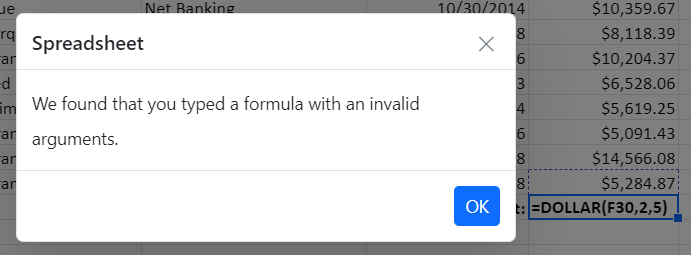

# Formulas in Angular Spreadsheet component

Formulas are used for calculating the data in a worksheet. You can refer the cell reference from same sheet or from different sheets.

## Usage

You can set formula for a cell in the following ways,

* Using the `formula` property from `cell`, you can set the formula or expression to each cell at initial load.
* Set the formula or expression through data binding.
* You can set formula for a cell by [`editing`](./editing).
* Using the [`updateCell`](https://ej2.syncfusion.com/angular/documentation/api/spreadsheet/#updatecell) method, you can set or update the cell formula.

## User Defined Functions

The list of formulas supported in the spreadsheet is sufficient for most of your calculations. If not, you can add your own custom function using the [`addCustomFunction`](https://ej2.syncfusion.com/angular/documentation/api/spreadsheet/#addcustomfunction) method. Use [`computeExpression`](https://ej2.syncfusion.com/angular/documentation/api/spreadsheet/#computeexpression) method, if you want to compute any formula or expression.

The following code example shows the calculation of data using supported and custom `formulas` in the spreadsheet.












  


## Formula bar

Formula bar is used to edit or enter cell data in much easier way. By default, the formula bar is enabled in the spreadsheet. Use the [`showFormulaBar`](https://ej2.syncfusion.com/angular/documentation/api/spreadsheet/#showformulabar) property to enable or disable the formula bar.

## Named Ranges

You can define a meaningful name for a cell range and use it in the formula for calculation. It makes your formula much easier to understand and maintain. You can add named ranges to the Spreadsheet in the following ways,

* Using the [`definedNames`](https://ej2.syncfusion.com/angular/documentation/api/spreadsheet/#definednames) collection, you can add multiple named ranges at initial load.
* Use the [`addDefinedName`](https://ej2.syncfusion.com/angular/documentation/api/spreadsheet/#adddefinedname) method to add a named range dynamically.
* You can remove an added named range dynamically using the [`removeDefinedName`](https://ej2.syncfusion.com/angular/documentation/api/spreadsheet/#removedefinedname) method.
* Select the range of cells, and then enter the name for the selected range in the name box.

The following code example shows the usage of named ranges support.












  


## Supported Formulas

The list of supported formulas can be find in following [`link`](https://ej2.syncfusion.com/documentation/spreadsheet/formulas#supported-formulas).

## Formula Error Dialog

If you enter an invalid formula in a cell, an error dialog with an error message will appear. For instance, a formula with the incorrect number of arguments, a formula without parenthesis, etc.

| Error Message | Reason |
|-------|---------|
| We found that you typed a formula with an invalid arguments | Occurs when passing an argument even though it wasn't needed. |
| We found that you typed a formula with an empty expression | Occurs when passing an empty expression in the argument. |
| We found that you typed a formula with one or more missing opening or closing parenthesis | Occurs when an open parenthesis or a close parenthesis is missing. |
| We found that you typed a formula which is improper | Occurs when passing a single reference but a range was needed. |
| We found that you typed a formula with a wrong number of arguments | Occurs when the required arguments were not passed. |
| We found that you typed a formula which requires 3 arguments | Occurs when the required 3 arguments were not passed. |
| We found that you typed a formula with a mismatched quotes | Occurs when passing an argument with mismatched quotes. |
| We found that you typed a formula with a circular reference | Occurs when passing a formula with circular cell reference. |
| We found that you typed a formula which is invalid | Except in the cases mentioned above, all other errors will fall into this broad category. |

## Note

You can refer to our [Angular Spreadsheet](https://www.syncfusion.com/angular-ui-components/angular-spreadsheet) feature tour page for its groundbreaking feature representations. You can also explore our [Angular Spreadsheet example](https://ej2.syncfusion.com/angular/demos/#/material/spreadsheet/default) to knows how to present and manipulate data.

## See Also

* [Editing](./editing)
* [Formatting](./formatting)
* [Open](./open-save#open)
* [Save](./open-save#save)
