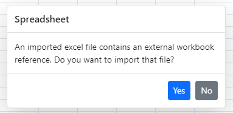

# Open save in Angular Spreadsheet component

In import an excel file, it needs to be read and converted to client side Spreadsheet model. The converted client side Spreadsheet model is sent as JSON which is used to render Spreadsheet. Similarly, when you save the Spreadsheet, the client Spreadsheet model is sent to the server as JSON for processing and saved. Server configuration is used for this process.

## Open

The Spreadsheet control opens an Excel document with its data, style, format, and more. To enable this feature, set [`allowOpen`](https://ej2.syncfusion.com/angular/documentation/api/spreadsheet/#allowopen) as `true` and assign service url to the [`openUrl`](https://ej2.syncfusion.com/angular/documentation/api/spreadsheet/#openurl) property.

**User Interface**:

In user interface you can open an Excel document by clicking `File > Open` menu item in ribbon.

The following sample shows the `Open` option by using the [`openUrl`](https://ej2.syncfusion.com/angular/documentation/api/spreadsheet/#openUrl) property in the Spreadsheet control. You can also use the [`beforeOpen`](https://ej2.syncfusion.com/angular/documentation/api/spreadsheet/#beforeopen) event to trigger before opening an Excel file.










  


Please find the below table for the beforeOpen event arguments.

 | **Parameter** | **Type** | **Description** |
| ----- | ----- | ----- |
| file | FileList or string or File | To get the file stream. `FileList` -  contains length and item index. <br/> `File` - specifies the file lastModified and file name. |
| cancel | boolean | To prevent the open operation. |
| requestData | object |  To provide the Form data. |

> * Use `Ctrl + O` keyboard shortcut to open Excel documents.
> * The default value of the [allowOpen](https://ej2.syncfusion.com/angular/documentation/api/spreadsheet/#allowopen) property is `true`. For demonstration purpose, we have showcased the [allowOpen](https://ej2.syncfusion.com/angular/documentation/api/spreadsheet/#allowopen) property in previous code snippet.

### Open an external URL excel file while initial load

You can achieve to access the remote excel file by using the [`created`](https://ej2.syncfusion.com/angular/documentation/api/spreadsheet/#created) event. In this event you can fetch the excel file and convert it to a blob. Convert this blob to a file and [`open`](https://ej2.syncfusion.com/angular/documentation/api/spreadsheet/#open) this file by using Spreadsheet component open method.










  


### To add custom header during open

You can add your own custom header to the open action in the Spreadsheet. For processing the data, it has to be sent from server to client side and adding customer header can provide privacy to the data with the help of Authorization Token. Through the [`beforeOpen`](https://ej2.syncfusion.com/angular/documentation/api/spreadsheet/#beforeopen) event, the custom header can be added to the request during open action.














### Open excel file into a read-only mode

You can open excel file into a read-only mode by using the [`openComplete`](https://ej2.syncfusion.com/angular/documentation/api/spreadsheet/#opencomplete) event. In this event, you must protect all the sheets and lock its used range cells by using [`protectSheet`](https://ej2.syncfusion.com/angular/documentation/api/spreadsheet/#protectsheet) and [`lockCells`](https://ej2.syncfusion.com/angular/documentation/api/spreadsheet/#lockcells) methods.













### Configure JSON deserialization options

Previously, when opening a workbook JSON object into the Spreadsheet using the [openFromJson](../api/spreadsheet/#openfromjson) method, the entire workbook, including all features specified in the JSON object, was processed and loaded into the Spreadsheet. 

Now, you have the option to selectively ignore some features during the opening of the JSON object by configuring deserialization options and passing them as arguments to the `openFromJson` method. This argument is optional, and if not configured, the entire workbook JSON object will be loaded without ignoring any features.

```ts
spreadsheet.openFromJson({ file: file }, { ignoreStyle: true });
```

| Options | Description |
| ----- | ----- |
| onlyValues |  If **true**, only the cell values will be loaded. |
| ignoreStyle | If **true**, styles will be excluded when loading the JSON data. |
| ignoreFormula | If **true**, formulas will be excluded when loading the JSON data. |
| ignoreFormat | If **true**, number formats will be excluded when loading the JSON data. |
| ignoreConditionalFormat | If **true**, conditional formatting will be excluded when loading the JSON data. |
| ignoreValidation | If **true**, data validation rules will be excluded when loading the JSON data. |
| ignoreFreezePane | If **true**, freeze panes will be excluded when loading the JSON data. |
| ignoreWrap | If **true**, text wrapping settings will be excluded when loading the JSON data. |
| ignoreChart | If **true**, charts will be excluded when loading the JSON data. |
| ignoreImage | If **true**, images will be excluded when loading the JSON data. |
| ignoreNote | If **true**, notes will be excluded when loading the JSON data. |

### External workbook confirmation dialog

When you open an excel file that contains external workbook references, you will see a confirmation dialog. This dialog allows you to either continue with the file opening or cancel the operation. This confirmation dialog will appear only if you set the `AllowExternalWorkbook` property value to **false** during the open request, as shown below. This prevents the spreadsheet from displaying inconsistent data.

```csharp
public IActionResult Open(IFormCollection openRequest)
    {
        OpenRequest open = new OpenRequest();
        open.AllowExternalWorkbook = false;
        open.File = openRequest.Files[0];
        return Content(Workbook.Open(open));
    }
```

> This feature is only applicable when importing an Excel file and not when loading JSON data or binding cell data.



## Save

The Spreadsheet control saves its data, style, format, and more as Excel file document. To enable this feature, set [`allowSave`](https://ej2.syncfusion.com/angular/documentation/api/spreadsheet/#allowsave) as `true` and assign service url to the [`saveUrl`](https://ej2.syncfusion.com/angular/documentation/api/spreadsheet/#saveurl) property.

**User Interface**:

In user interface, you can save Spreadsheet data as Excel document by clicking `File > Save As` menu item in ribbon.

The following sample shows the `Save` option by using the [`saveUrl`](https://ej2.syncfusion.com/angular/documentation/api/spreadsheet/#saveurl) property in the Spreadsheet control. You can also use the [`beforeSave`](https://ej2.syncfusion.com/angular/documentation/api/spreadsheet/#beforesave) event to trigger before saving the Spreadsheet as an Excel file.










  


Please find the below table for the beforeSave event arguments.

| **Parameter** | **Type** | **Description** |
| ----- | ----- | ----- |
| url | string |  Specifies the save url.  |
| fileName | string | Specifies the file name. |
| saveType | SaveType | Specifies the saveType like Xlsx, Xls, Csv and Pdf. |
| customParams | object | Passing the custom parameters from client to server while performing save operation. |
| isFullPost | boolean | It sends the form data from client to server, when set to true. It fetches the data from client to server and returns the data from server to client, when set to false. |
| needBlobData | boolean | You can get the blob data if set to true. |
| cancel | boolean | To prevent the save operations. |

> * Use `Ctrl + S` keyboard shortcut to save the Spreadsheet data as Excel file.
> * The default value of [allowSave](https://ej2.syncfusion.com/angular/documentation/api/spreadsheet/#allowsave) property is `true`. For demonstration purpose, we have showcased the [allowSave](https://ej2.syncfusion.com/angular/documentation/api/spreadsheet/#allowsave) property in previous code snippet.
> * Demo purpose only, we have used the online web service url link.

### To send and receive custom params from client to server

Passing the custom parameters from client to server by using [`beforeSave`](https://ej2.syncfusion.com/angular/documentation/api/spreadsheet/#beforesave) event.










  


Server side code snippets:

```csharp

    public IActionResult Save(SaveSettings saveSettings, string customParams)
        {
            Console.WriteLine(customParams); // you can get the custom params in controller side
            return Workbook.Save(saveSettings);
        }
```

### To add custom header during save

You can add your own custom header to the save action in the Spreadsheet. For processing the data, it has to be sent from client to server side and adding customer header can provide privacy to the data with the help of Authorization Token. Through the [`fileMenuItemSelect`](https://ej2.syncfusion.com/angular/documentation/api/spreadsheet/#filemenuitemselect) event, the custom header can be added to the request during save action.










  


### To change the PDF orientation

By default, the PDF document is created in **Portrait** orientation. You can change the orientation of the PDF document by using the `args.pdfLayoutSettings.orientation` argument settings in the [`beforeSave`](https://ej2.syncfusion.com/angular/documentation/api/spreadsheet/#beforesave) event.

The possible values are:

* **Portrait** - Used to display content in a vertical layout.
* **Landscape** - Used to display content in a horizontal layout.













### Configure JSON serialization options

Previously, when saving the Spreadsheet as a workbook JSON object using the [saveAsJson](../api/spreadsheet/#saveasjson) method, the entire workbook with all loaded features were processed and saved as a JSON object. 

Now, you have the option to selectively ignore some features while saving the Spreadsheet as a JSON object by configuring serialization options and passing them as arguments to the `saveAsJson` method. This argument is optional, and if not configured, the entire workbook JSON object will be saved without ignoring any features.

```ts
spreadsheet.saveAsJson({ onlyValues: true });
```

| Options | Description |
| ----- | ----- |
| onlyValues |  If **true**, includes only the cell values in the JSON output. |
| ignoreStyle | If **true**, excludes styles from the JSON output. |
| ignoreFormula | If **true**, excludes formulas from the JSON output. |
| ignoreFormat | If **true**, excludes number formats from the JSON output. |
| ignoreConditionalFormat | If **true**, excludes conditional formatting from the JSON output. |
| ignoreValidation | If **true**, excludes data validation rules from the JSON output. |
| ignoreFreezePane | If **true**, excludes freeze panes from the JSON output. |
| ignoreWrap | If **true**, excludes text wrapping settings from the JSON output. |
| ignoreChart | If **true**, excludes charts from the JSON output. |
| ignoreImage | If **true**, excludes images from the JSON output. |
| ignoreNote | If **true**, excludes notes from the JSON output. |

### Methods

To save the Spreadsheet document as an `xlsx, xls, csv, or pdf` file, by using [save](https://ej2.syncfusion.com/angular/documentation/api/spreadsheet/#save) method should be called with the `url`, `fileName` and `saveType` as parameters. The following code example shows to save the spreadsheet file as an `xlsx, xls, csv, or pdf` in the button click event.










  


## Server Configuration

In Spreadsheet control, Excel import and export support processed in `server-side`, to use importing and exporting in your projects, it is required to create a server with any of the following web services.

* WebAPI
* WCF Service
* ASP.NET MVC Controller Action

The following code snippets shows server configuration using `WebAPI` service,

```csharp

    [Route("api/[controller]")]
    public class SpreadsheetController : Controller
    {
        //To open excel file
        [AcceptVerbs("Post")]
        [HttpPost]
        [EnableCors("AllowAllOrigins")]
        [Route("Open")]
        public IActionResult Open(IFormCollection openRequest)
        {
            OpenRequest open = new OpenRequest();
            open.File = openRequest.Files[0];
            return Content(Workbook.Open(open));
        }

        //To save as excel file
        [AcceptVerbs("Post")]
        [HttpPost]
        [EnableCors("AllowAllOrigins")]
        [Route("Save")]
        public IActionResult Save([FromForm]SaveSettings saveSettings)
        {
            return Workbook.Save(saveSettings);
        }
    }
```

## Server Dependencies

Open and save helper functions are shipped in the Syncfusion.EJ2.Spreadsheet package, which is available in Essential Studio and [`nuget.org`](https://www.nuget.org/). Following list of dependencies required for Spreadsheet open and save operations.

* Syncfusion.EJ2
* Syncfusion.EJ2.Spreadsheet
* Syncfusion.Compression.Base
* Syncfusion.XlsIO.Base

And also refer [this](https://ej2.syncfusion.com/aspnetcore/documentation/spreadsheet/open-save/#server-dependencies) for more information.

## Supported File Formats

The following list of Excel file formats are supported in Spreadsheet:

* MS Excel (.xlsx)
* MS Excel 97-2003 (.xls)
* Comma Separated Values (.csv)

## Note

You can refer to our [Angular Spreadsheet](https://www.syncfusion.com/angular-ui-components/angular-spreadsheet) feature tour page for its groundbreaking feature representations. You can also explore our [Angular Spreadsheet example](https://ej2.syncfusion.com/angular/demos/#/material/spreadsheet/default) to knows how to present and manipulate data.

## See Also

* [Filtering](./filter)
* [Sorting](./sort)
* [Hyperlink](./link)
