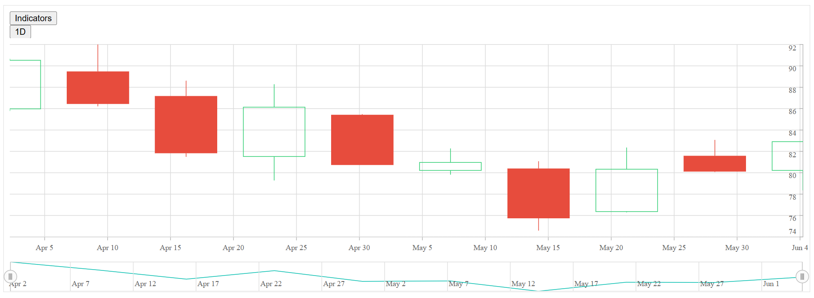

# Getting Started with Angular Stock Chart Component

This section explains the steps required to create a simple [stock chart](https://www.syncfusion.com/angular-components/angular-stock-chart) and demonstrates the basic usage of the stock chart component.

> **Ready to streamline your Syncfusion<sup style="font-size:70%">&reg;</sup> Angular development?** Discover the full potential of Syncfusion<sup style="font-size:70%">&reg;</sup> Angular components with Syncfusion<sup style="font-size:70%">&reg;</sup> AI Coding Assistant. Effortlessly integrate, configure, and enhance your projects with intelligent, context-aware code suggestions, streamlined setups, and real-time insights—all seamlessly integrated into your preferred AI-powered IDEs like VS Code, Cursor, Syncfusion<sup style="font-size:70%">&reg;</sup> CodeStudio and more. [Explore Syncfusion<sup style="font-size:70%">&reg;</sup> AI Coding Assistant](https://ej2.syncfusion.com/angular/documentation/mcp-server/ai-coding-assistant/getting-started)

To get started quickly with Angular Stock Chart using CLI and Schematics, view the following video:



## Prerequisites

Before getting started, ensure that your development environment meets the [system requirements for Syncfusion® Angular UI components](https://ej2.syncfusion.com/angular/documentation/system-requirement).

## Before You Begin

This guide uses the standalone application structure generated by the latest Angular CLI.

The main files used in this guide are:

- `src/app/app.ts` — Defines the root standalone component.
- `src/index.html` — Contains the Angular root element.

N> In newer Angular CLI standalone projects, the root component may be generated as `src/app/app.ts`. In NgModule-based Angular projects, the equivalent file is typically `src/app/app.component.ts`.

N> If your application uses an older NgModule-based structure, import `StockChartModule` in the application module, such as `app.module.ts`, instead of adding it to the standalone component `imports` collection.

## Step 1: Create a Project Folder

Create a folder named `my-project` in your desired location. This folder will contain your Syncfusion Stock Chart Angular project.

## Step 2: Set up the Angular environment

Start by opening your project in the terminal on your system **(Command Prompt, PowerShell, or Terminal)**.

Use [Angular CLI](https://github.com/angular/angular-cli) to create and manage Angular applications. Install Angular CLI globally using the following command:

```bash
npm install -g @angular/cli
```

## Step 3: Create an Angular application

Create a new Angular application using the following command.

```bash
ng new my-stock-chart-app
```

During project creation, Angular CLI may prompt you to choose stylesheet, SSR/SSG, and AI tool configuration options. For this basic Stock Chart sample, you can use the following options:

* **Stylesheet system**: Choose any option. This guide uses `CSS` for simplicity and applies the Syncfusion® Tailwind 3 theme through CSS imports.
* **SSR and SSG/Pre-rendering**: Select `No`.
* **AI tools configuration**: Select `None`.

Navigate to the project folder:

```bash
cd my-stock-chart-app
```

## Step 4: Install the Syncfusion® Angular Stock Chart package

All Syncfusion Essential® JS 2 packages are available in the [npmjs.com](https://www.npmjs.com/~syncfusionorg) registry.

Install the Angular Stock Chart package using the following command:

```bash
npm install @syncfusion/ej2-angular-charts --save
```

N> Installing `@syncfusion/ej2-angular-charts` automatically installs the required dependency packages.

## Step 5: Register the Stock Chart module and add the component

Import `StockChartModule` from `@syncfusion/ej2-angular-charts` and add it to the `imports` collection of the standalone component. Then, add the Angular Stock Chart component using the `<ejs-stockchart>` selector in the component template.

Update the `src/app/app.ts` file as follows:

```typescript
import { Component } from '@angular/core';
import { StockChartModule } from '@syncfusion/ej2-angular-charts';

@Component({
  selector: 'app-root',
  standalone: true,
  imports: [StockChartModule],
  providers: [],
  template: `<ejs-stockchart id='stock-chart-container'></ejs-stockchart>`
})
export class App {}
```

This renders an empty stock chart in the application.

N> The component selector must match the root element used in the `src/index.html` file. Angular CLI commonly uses `<app-root></app-root>`, so this example uses `selector: 'app-root'`.

## Step 6: Create your first Stock Chart with data source and series type

This section explains how to create a simple stock chart by binding financial data, configuring the time-based axis, and rendering a series using Angular Stock Chart components.

The following example demonstrates how to visualize stock price data using a candle series. It also shows how to configure the horizontal axis for date-time values and map financial data fields using the `dataSource`, `xName`, `open`, `high`, `low`, and `close` properties.

Update the `src/app/app.ts` file as follows:

```typescript
import { Component, OnInit } from '@angular/core';
import { StockChartModule, DateTimeService, CandleSeriesService } from '@syncfusion/ej2-angular-charts';

@Component({
    selector: 'app-root',
    standalone: true,
    imports: [StockChartModule],
    providers: [DateTimeService, CandleSeriesService],
    template: `
        <ejs-stockchart 
            id="stock-chart-container" 
            [primaryXAxis]='primaryXAxis'
        >
            <e-stockchart-series-collection>
                <e-stockchart-series 
                    [dataSource]='stockchartData' 
                    type='Candle' 
                    xName='date' 
                    High='high' 
                    Low='low' 
                    Open='open' 
                    Close ='close'
                >
                </e-stockchart-series>
            </e-stockchart-series-collection>
        </ejs-stockchart>
    `
})
export class App implements OnInit {
    public primaryXAxis?: Object;
    public stockchartData?: Object[];
    ngOnInit(): void {
        this.stockchartData = [
            {
                date: new Date('2012-04-02'),
                open: 85.9757,
                high: 90.6657,
                low: 85.7685,
                close: 90.5257,
                volume: 660187068
            },
            {
                date: new Date('2012-04-09'),
                open: 89.4471,
                high: 92,
                low: 86.2157,
                close: 86.4614,
                volume: 912634864
            },
            {
                date: new Date('2012-04-16'),
                open: 87.1514,
                high: 88.6071,
                low: 81.4885,
                close: 81.8543,
                volume: 1221746066
            },
            {
                date: new Date('2012-04-23'),
                open: 81.5157,
                high: 88.2857,
                low: 79.2857,
                close: 86.1428,
                volume: 965935749
            },
            {
                date: new Date('2012-04-30'),
                open: 85.4,
                high: 85.4857,
                low: 80.7385,
                close: 80.75,
                volume: 615249365
            },
            {
                date: new Date('2012-05-07'),
                open: 80.2143,
                high: 82.2685,
                low: 79.8185,
                close: 80.9585,
                volume: 541742692
            },
            {
                date: new Date('2012-05-14'),
                open: 80.3671,
                high: 81.0728,
                low: 74.5971,
                close: 75.7685,
                volume: 708126233
            },
            {
                date: new Date('2012-05-21'),
                open: 76.3571,
                high: 82.3571,
                low: 76.2928,
                close: 80.3271,
                volume: 682076215
            },
            {
                date: new Date('2012-05-28'),
                open: 81.5571,
                high: 83.0714,
                low: 80.0743,
                close: 80.1414,
                volume: 480059584
            },
            {
                date: new Date('2012-06-04'),
                open: 80.2143,
                high: 82.9405,
                low: 78.3571,
                close: 82.9028,
                volume: 517577005
            }
        ];
        this.primaryXAxis = {
            valueType: 'DateTime'
        };
    }
}
```

In this example:

* [`primaryXAxis`](https://ej2.syncfusion.com/angular/documentation/api/stock-chart/index-default#primaryxaxis) defines the configuration of the horizontal axis.
* [`dataSource`](https://ej2.syncfusion.com/angular/documentation/api/stock-chart/stockchartseriesdirective#datasource) provides the financial data used to render the stock chart.
* [`type`](https://ej2.syncfusion.com/angular/documentation/api/stock-chart/stockchartseriesdirective#type) specifies the series type, such as Candle, Hilo, or HiloOpenClose.
* [`xName`](https://ej2.syncfusion.com/angular/documentation/api/stock-chart/stockchartseriesdirective#xname) maps the date field from the data source to the x-axis.
* [`High`](https://ej2.syncfusion.com/angular/documentation/api/stock-chart/stockchartseriesdirective#high) maps the highest price of the stock.
* [`Low`](https://ej2.syncfusion.com/angular/documentation/api/stock-chart/stockchartseriesdirective#low) maps the lowest price of the stock.
* [`Open`](https://ej2.syncfusion.com/angular/documentation/api/stock-chart/stockchartseriesdirective#open) maps the opening price of the stock.
* [`Close`](https://ej2.syncfusion.com/angular/documentation/api/stock-chart/stockchartseriesdirective#close) maps the closing price of the stock.
* [`<e-stockchart-series-collection>`] and [`<e-stockchart-series>`] directives are used to define and render one or more series in the stock chart.

## Step 7: Run the application

Run the application using the following command:

```bash
npm start
```

Open the generated local URL (for example, `http://localhost:4200/`) from terminal in the browser. The application displays the stock chart as shown below:

 
