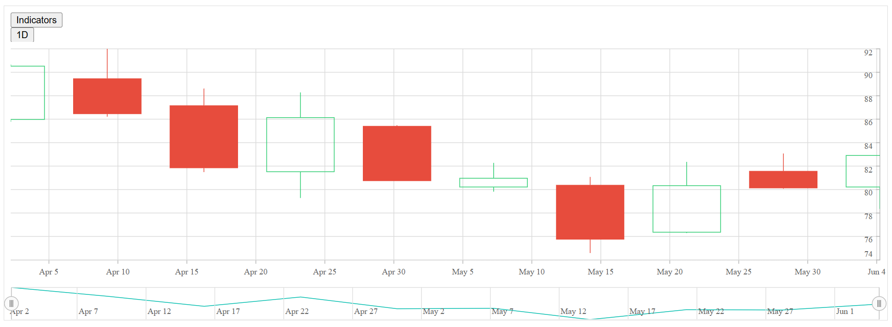

# Getting Started with Angular Stock Chart Component

This section explains the steps required to create a simple [stock chart](https://www.syncfusion.com/angular-components/angular-stock-chart) and demonstrates the basic usage of the Angular Stock Chart component.

> **Ready to streamline your Syncfusion<sup style="font-size:70%">&reg;</sup> Angular development?** Discover the full potential of Syncfusion<sup style="font-size:70%">&reg;</sup> Angular components with Syncfusion<sup style="font-size:70%">&reg;</sup> AI Coding Assistant. Effortlessly integrate, configure, and enhance your projects with intelligent, context-aware code suggestions, streamlined setups, and real-time insights—all seamlessly integrated into your preferred AI-powered IDEs like VS Code, Cursor, Syncfusion<sup style="font-size:70%">&reg;</sup> CodeStudio and more. [Explore Syncfusion<sup style="font-size:70%">&reg;</sup> AI Coding Assistant](https://ej2.syncfusion.com/angular/documentation/mcp-server/ai-coding-assistant/getting-started)

To get started quickly with Angular Stock Chart using CLI and Schematics, view the following video:



## Prerequisites

Before getting started, ensure that your environment meets the [system requirements for Syncfusion® Angular UI components](https://ej2.syncfusion.com/angular/documentation/system-requirement), which covers supported Node.js, Angular, and `@syncfusion/ej2-angular-charts` versions.

## Before You Begin

This guide uses the standalone application structure generated by the latest Angular CLI.

The main files used in this guide are:

- `src/app/app.ts` — Defines the root standalone component.
- `src/index.html` — Contains the Angular root element.

> **Note:** In newer Angular CLI standalone projects, the root component may be generated as `src/app/app.ts`. In NgModule-based Angular projects, the equivalent file is typically `src/app/app.component.ts`.

> **Note:** If your application uses an older NgModule-based structure, import `StockChartModule` in the application module, such as `app.module.ts`, instead of adding it to the standalone component `imports` collection.

## Step 1: Install the Angular CLI

Use [Angular CLI](https://github.com/angular/angular-cli) to create and manage Angular applications. Install Angular CLI globally using the following command:

```bash
npm install -g @angular/cli
```

Verify the installation:

```bash
ng version
```

## Step 2: Create an Angular application

Create a new Angular application using the following non-interactive command:

```bash
ng new my-stock-chart-app --style=css --ssr=false --defaults
```

This command creates the `my-stock-chart-app` folder and applies the recommended options (CSS stylesheet, no SSR, and default settings). If you prefer interactive prompts, choose the following options:

* **Stylesheet system**: Choose any option. This guide uses `CSS` for simplicity and applies the Syncfusion Tailwind 3 theme via CSS imports.
* **SSR and SSG/Pre-rendering**: Select `No`.
* **AI tools configuration**: Select `None`.

Navigate to the project folder:

```bash
cd my-stock-chart-app
```

Open the project in Command Prompt, PowerShell, or Terminal before proceeding to the next step.

## Step 3: Install the Syncfusion® Angular Stock Chart package

All Syncfusion Essential® JS 2 packages are available in the [npmjs.com](https://www.npmjs.com/~syncfusionorg) registry. The [Angular Chart package](https://www.npmjs.com/package/@syncfusion/ej2-angular-charts) can be installed using the following command:

```bash
npm install @syncfusion/ej2-angular-charts
```

> **Note:** Installing `@syncfusion/ej2-angular-charts` automatically installs the required dependency packages.

## Step 4: Adding CSS References

Syncfusion<sup style="font-size:70%">&reg;</sup> Angular Stock Chart component themes can be applied using CSS or SASS from the [npm theme packages](https://ej2.syncfusion.com/angular/documentation/appearance/overview#theme-packages). Themes can also be applied via CDN, CRG, or [Theme Studio](https://ej2.syncfusion.com/angular/documentation/appearance/theme-studio). For more information, refer to the [themes documentation](https://ej2.syncfusion.com/angular/documentation/appearance/overview).

This example uses the [Material 3](https://www.npmjs.com/package/@syncfusion/ej2-material3-theme) theme for the Stock Chart component. To install the theme package, use the following command:

```bash
npm install @syncfusion/ej2-material3-theme
```

Reference the theme CSS in `src/styles.css` as follows:

```css
@import "@syncfusion/ej2-material3-theme/styles/stock-chart/index.css";
```

## Step 5: Register the Stock Chart module

Import `StockChartModule` from `@syncfusion/ej2-angular-charts` and add it to the `imports` collection of the standalone component. Then, add the Angular Stock Chart component using the `<ejs-stockchart>` selector in the component template.

Update the `src/app/app.ts` file as follows:

```typescript
import { Component } from '@angular/core';
import { StockChartModule } from '@syncfusion/ej2-angular-charts';

@Component({
  selector: 'app-root',
  standalone: true,
  imports: [StockChartModule],
  template: `<ejs-stockchart id='stock-chart-container'></ejs-stockchart>`
})
export class App {}
```

This renders an empty stock chart in the application's view.

> **Note:** The component selector must match the root element used in the `src/index.html` file. Angular CLI commonly uses `<app-root></app-root>`, so this example uses `selector: 'app-root'`.

Run the application with `npm start` and verify that an empty stock chart renders before proceeding to the next step.

## Step 6: Populate the chart with data and add a series

This section explains how to create a simple stock chart by binding financial data, configuring the time-based axis, and rendering a series using the Angular Stock Chart component.

The following example demonstrates how to visualize stock price data using a candle series. It also shows how to configure the horizontal axis for date-time values and map financial data fields using the [dataSource](https://ej2.syncfusion.com/angular/documentation/api/stock-chart/stockchartseriesdirective#datasource), [xName](https://ej2.syncfusion.com/angular/documentation/api/stock-chart/stockchartseriesdirective#xname), [open](https://ej2.syncfusion.com/angular/documentation/api/stock-chart/stockchartseriesdirective#open),  [high](https://ej2.syncfusion.com/angular/documentation/api/stock-chart/stockchartseriesdirective#high), [low](https://ej2.syncfusion.com/angular/documentation/api/stock-chart/stockchartseriesdirective#low), [close](https://ej2.syncfusion.com/angular/documentation/api/stock-chart/stockchartseriesdirective#close), and [volume](https://ej2.syncfusion.com/angular/documentation/api/stock-chart/stockchartseriesdirective#volume) properties.

Update the `src/app/app.ts` file as follows:










        


The chart renders a candle series with one candle per week showing the open, high, low, and close prices for the period from April to June 2012. The horizontal axis displays dates, and the vertical axis shows the price. Hovering over a candle displays a tooltip with the date and OHLC values.

## Step 7: Run the application

Run the application using the following command:

```bash
npm start
```

Open the generated local URL (for example, `http://localhost:4200/`) from the terminal in the browser. The application displays a candle stock chart showing weekly price data from April to June 2012, as shown below:



## Troubleshooting

If the stock chart does not render as expected, check for these common issues:

* **"No provider for DateTimeService" error**: Confirm that `DateTimeService` and `CandleSeriesService` are added to the component's `providers` array. Each stock chart series type requires its corresponding service.
* **Chart not visible**: Verify that the `<ejs-stockchart>` element has a unique `id` and that the component's `selector` matches the root element used in `src/index.html` (commonly `<app-root>`).
* **Date axis not displaying correctly**: Confirm that `primaryXAxis.valueType` is set to `DateTime` and that the `date` field in your data source is a valid JavaScript `Date` object.
* **Data not displayed**: Check that the `xName`, `high`, `low`, `open`, `close`, and `volume` values match the field names in your data source exactly.
* **Build errors**: Run `ng version` to confirm that Node.js, Angular CLI, and `@syncfusion/ej2-angular-charts` are on supported versions, and check the terminal output for the specific error.
* **Port already in use**: If `npm start` fails because port `4200` is in use, run `ng serve --port 4201` (or another free port) instead.

## See also

* [Configure the period selector below the chart](period-selector)
* [Add a range selector for interactive zoom and pan](range-selector)
* [Add technical indicators such as RSI, MACD, and Bollinger Bands](technical-indicators)
* [Add trendlines to the stock chart](trend-lines)
