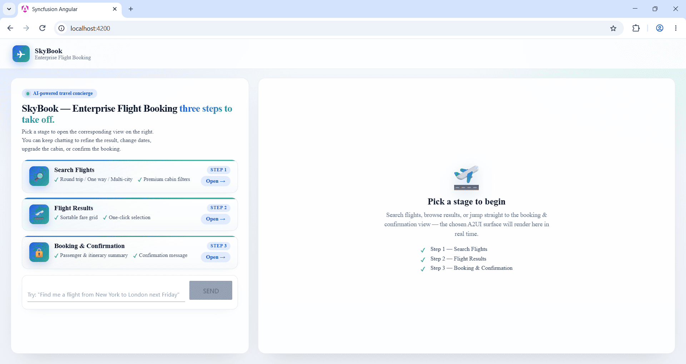

# Build the SkyBook Sample

This page is a complete end-to-end walkthrough: you will create a small but real Angular application, the **SkyBook** flight-booking app, using the Composer Playground, an A2A agent, and the [Syncfusion A2UI for Angular package](https://www.npmjs.com/package/@syncfusion/ej2-angular-a2ui) renderer.

You will:

1. Use the Composer to author three surfaces for SkyBook (Search Flight, Flight Results, Booking Confirmed).
2. Copy the JSON files out of the Composer.
3. Bind them to a Syncfusion A2UI Agent with one method call: `agent.set_design(...)`.
4. Build the SkyBook Angular app and run it against the agent.

By the end you will have a running chat app whose agent emits three locked A2UI surfaces on demand.

If any Composer terminology is unfamiliar (Create, Workspace, Gallery, Playground, Catalog), see [Walkthrough](./walkthrough) first.

## What you will build

`SkyBook` is a three-stage flight-booking experience. Each stage is one surface, copied from the Composer as its own JSON file:

| Stage | Trigger | Purpose |
| --- | --- | --- |
| **1 — Search Flight** | Any booking request | Collect flight route, cabin, dates, passenger details, accessibility needs |
| **2 — Flight Results** | Button click with `event:{name:"submit_booking"}` | Recap captured fields, show computed fare breakdown, require explicit agreement |
| **3 — Booking Confirmed** | Button click with `event:{name:"confirm_booking"}` | Final receipt with booking reference, itinerary, passenger summary, and amount paid |

## Step 1 — Create the three SkyBook surfaces in the Composer

For each of the three stages below, you author one surface in the Composer. The flow per surface is identical:

1. Open the Composer and go to the **Create** page.
2. Paste the corresponding prompt (provided below) into the prompt box and click **Generate UI**.
3. Review the surface on the **Workspace** page. Use the AI Assistant tab to tweak fields or labels as needed.
4. Click **Copy JSON**.
5. Save the JSON to the matching file in your agent repo (see [Step 2](#step-2--save-the-copied-json-into-your-agent)).

You can also start from the **Gallery** and copy the closest template, then refine it in Workspace.

### Surface 1 — Search Flight form

**Composer prompt**



Build a single-page SkyWave Airlines flight booking form. Use two Card sections stacked vertically with 16px gaps. Card 1 'Flight Details' has, in order, a 'From' TextBox, a 'To' TextBox, a 'Trip Type' DropDownList with options One-Way and Round-Trip, a 'Cabin Class' DropDownList with options Economy / Business / First Class, a 'Departure Date' DatePicker, a 'Return Date' DatePicker, and an 'Adults' NumericTextBox defaulting to 1 with min 1 and max 9. Card 2 'Passenger Details' has a 'Full Name' TextBox, a 'Date of Birth' DatePicker, an 'Email' TextBox, a 'Phone' TextBox, and a 'Wheelchair assistance required' CheckBox. Below both cards place a primary 'Review Booking' button aligned to the right edge. Use the SkyWave brand: green primary AppBar, soft borders, 16px gaps.



**Save as:** `examples/designs/stage1-flight-search.json`

### Surface 2 — Flight Results

**Composer prompt**



Build a single-page SkyWave Airlines booking confirmation page. Use four Card sections stacked vertically with 20px gaps. Card 1 'Flight Details' shows the route as '{origin} → {destination}' as a large heading, with a row of four labeled pairs: Departure, Cabin, Passengers (e.g. '2 Adults'), and Trip Type. Card 2 'Passenger Details' shows three labeled pairs: Full Name, Email, Phone. Card 3 'Fare Breakdown' lists Base Fare, Taxes & Fees, and a bold Total Payable, with an information note that the fare is non-refundable after 24 hours. Card 4 'Confirm Booking' has an agreement Checkbox for fare rules followed by two buttons in a row: a 'Modify Booking' outline button and a primary 'Confirm & Pay' success button. Use the SkyWave brand: green primary AppBar, soft borders, 16px gaps.



**Save as:** `examples/designs/stage2-flight-results.json`

### Surface 3 — Booking Confirmed

**Composer prompt**



Build a single-page SkyWave Airlines booking confirmed page. At the top, render a green Success Message with the text 'Booking Confirmed! Reference: {bookingRef}.' Below it, render four Card sections stacked vertically with 20px gaps. Card 1 'Booking Reference' shows the booking reference as a large bold purple heading. Card 2 'Flight Details' shows the route '{origin} → {destination}' as a heading, then a labeled summary list of Departure Date, Cabin Class, Trip Type, and Passengers. Card 3 'Passenger Details' shows the full name, email, and phone as labeled pairs. Card 4 'Amount Paid' lists Base Fare, Taxes & Fees, and a bold Total Paid. Below the cards, render an information Message reminding the customer that a confirmation email has been sent and they need a valid photo ID on the day of travel. Use the SkyWave brand: green primary AppBar, soft borders, 16px gaps.



> **

**Save as:** `examples/designs/stage3-booking-confirmation.json`

> For the canonical, full JSON for each surface, see the `examples/designs/` directory in the syncfusion-a2ui-agent repository.

## Step 2 — Save the copied JSON into your agent

After copying each surface from the Composer, drop each JSON into a designs folder inside the agent project:

```text
syncfusion-a2ui-agent/
└── examples/
    └── designs/
        ├── stage1-flight-search.json
        ├── stage2-flight-results.json
        └── stage3-booking-confirmation.json
```

The directory becomes a multi-page catalog. When the agent is asked for a flight, it picks the right page based on the request; when the user clicks a button in a surface, the action loops back to the agent and the next surface replaces it.

## Step 3 — Bind the designs to the agent with set design

The reference agent, `FlightBookingAgent`, lives in `examples/flight_booking_agent.py`. It calls `agent.set_design(...)` once in its constructor and locks the three designs into the system prompt.

```python
from __future__ import annotations
import logging
import os
from typing import Union
from syncfusion_a2ui_agent import SyncfusionAgent
from syncfusion_a2ui_agent.providers.base import AIProvider

_log = logging.getLogger("syncfusion_a2ui_agent")

DESIGNS_DIR = os.path.join(os.path.dirname(os.path.abspath(__file__)), "designs")
_LLM_SPEED_KNOBS: dict[str, Union[str, int]] = {
    "reasoning_effort": "low", "verbosity": "low", "max_completion_tokens": 4096,
}

_REQUIRED_ENV_VARS = ("AZURE_API_KEY", "AZURE_API_BASE", "AZURE_API_VERSION", "MODEL_NAME",)

class FlightBookingAgent(SyncfusionAgent):
    """Echoes one of the three pre-defined SkyWave pages per request."""
    def __init__(self, model: Union[str, AIProvider, type[AIProvider]]) -> None:
        super().__init__(model=model)
        if not os.path.isdir(DESIGNS_DIR):
            raise FileNotFoundError(
                f"Designs directory not found: {DESIGNS_DIR!r}. "
                "Create it with stage1/stage2/stage3 .json files before "
                "starting the agent."
            )
        self.set_design(DESIGNS_DIR)

        skills_path = os.environ.get("SKILLS_PATH", "")
        if skills_path:
            registry = self.enable_skills(skills_path)
            skills = registry.all_skills()
            _log.info("Loaded %d skill(s) from %s: %s", len(skills), skills_path, [s.name for s in skills])
        else:
            _log.warning("SKILLS_PATH not set - skill routing disabled. Add SKILLS_PATH=<path> to your .env to enable it.")

    def extend_system_prompt(self) -> str:
        return (
            "You are the SkyWave Airlines flight-booking assistant. "
            "Echo the design above verbatim (same surfaceId, same components, "
            "same dataModel). Vary only the data values. "
            "Out of scope -> workspace surface with AppBar + Message "
            "(severity Information, content 'I can only assist with "
            "SkyWave Airlines flight bookings.') + Button 'Book a Flight'."
        )


def _require_env(env_path: str) -> None:
    if not os.path.isfile(env_path):
        raise FileNotFoundError(
            f".env file not found at {env_path!r}. Copy .env.example to .env "
            "and fill in your Azure OpenAI credentials before starting the agent."
        )
    missing = [name for name in _REQUIRED_ENV_VARS if not os.environ.get(name)]
    if missing:
        raise EnvironmentError("Missing required environment variables: " + ", ".join(missing) + ".")


def main() -> None:
    from dotenv import load_dotenv
    from syncfusion_a2ui_agent.providers.azure_openai_provider import AzureOpenAIProvider
    env_path = os.path.join(os.path.dirname(__file__), ".env")
    load_dotenv(env_path)
    _require_env(env_path)
    provider = AzureOpenAIProvider(
        api_key=os.environ["AZURE_API_KEY"],
        azure_endpoint=os.environ["AZURE_API_BASE"],
        api_version=os.environ["AZURE_API_VERSION"],
        azure_deployment=os.environ["MODEL_NAME"],
        **_LLM_SPEED_KNOBS,
    )
    agent = FlightBookingAgent(model=provider)
    agent.serve(host="127.0.0.1", port=10006)

if __name__ == "__main__": main()
```

The call to self.set_design(DESIGNS_DIR) loads and validates the designs: every design in `designs/` is loaded, validated, concatenated into a single markdown catalog, and embedded into the system prompt. The LLM is told to echo the design verbatim and only vary data values.

## Step 4 — Start the agent

```bash
# 1. Clone the agent repo
git clone https://github.com/syncfusion/syncfusion-a2ui-agent.git
cd syncfusion-a2ui-agent

# 2. Install the ADK and the example package (contains FlightBookingAgent)
python -m pip install -e ".[dev]"
python -m pip install -e examples

# 3. Configure your AI provider credentials
cp examples/.env.example examples/.env
# Open examples/.env and fill in AZURE_API_KEY, AZURE_API_BASE, MODEL_NAME, etc.

# 4. Drop your Composer JSON files into examples/designs/
#    (stage1-flight-search.json, stage2-flight-results.json, stage3-booking-confirmation.json)

# 5. Start the FlightBookingAgent as an A2A server
python examples/flight_booking_agent.py
# A2A server listening on http://127.0.0.1:10006
```

## Step 5 — Create the Angular app

In a separate terminal, scaffold the Angular app that consumes the agent.

```bash
ng new skybook --style=scss --routing=false
cd skybook
npm install @syncfusion/ej2-angular-a2ui @syncfusion/ej2-angular-inputs @syncfusion/ej2-angular-buttons @syncfusion/ej2-base --save
npm install @syncfusion/ej2-tailwind3-theme --save
```

For the full prerequisite list (Node.js version, Angular 17+, theme selection), see [Getting Started with A2UI for Angular](./../getting-started).

**Configure the agent URL** in `src/environments/environment.ts` (create if missing):

```bash
# Agent serves at 127.0.0.1:10006 (from Step 4)
# Reusable via `environment.agentUrl` in app code, or `import.meta.env.AGENT_URL`
AGENT_URL=http://127.0.0.1:10006
```

**Replace `src/app/app.ts` with the chat + surface shell. The TypeScript wires up the welcome view, the chat view, the three stage cards, the `MessageProcessor`, and the `<syncfusion-a2ui-provider>` renderer.













**Run the app**:

```bash
npm start
```

Open the URL it prints (typically `http://localhost:4200/`).



## Step 6 — Walk through it

1. The welcome view opens with three stage cards (Search Flights, Flight Results, Booking & Confirmation) and a free-form prompt input.
2. Click a stage card, or type a free-form flight request, to switch to the chat view.
3. Type into the prompt box and hit **Send**. The browser posts a JSON-RPC **message/send** request to the agent and renders the returned surface.
4. Click any button inside the rendered surface. The button's `event` is summarized into a chat bubble and re-posted to the agent; the next surface replaces the current one.

That is the whole loop, repeated:

| What you write | What happens at runtime |
| --- | --- |
| `SyncfusionTextBox` (welcome prompt + chat input) | User picks a stage card, or types a free-form request. |
| `SyncfusionButton` (`Ask SkyBook` / `Send`) | Browser fires `sendPrompt(...)` and switches to the chat view. |
| `fetch(AGENT_URL, …)` with `parts: [{ text }]` | The browser POSTs a JSON-RPC `message/send` envelope carrying the user's text query. |
| `processor.processMessages(messages)` | The agent's `a2uiEnvelope` is validated; on every `createSurface` the matching `SurfaceModel` is stored and fires `onSurfaceCreated`. |
| `<syncfusion-a2ui-provider [surface]="surface"/>` | The Syncfusion component tree mounts in the right-hand surface pane. |
| User clicks a button inside the surface | The processor's action callback fires; the action is summarized into a chat bubble and re-posted to the agent as a `{ data: action }` part on the next `message/send` request (A2UI v0.9 production format). |

## Troubleshooting

Most A2UI JSON, agent binding, and prompt issues are covered in [Common Questions](./common-questions). The one environment-specific item for the SkyBook sample:

| Issue | Solution |
| --- | --- |
| **SkyBook app cannot find the agent** | Confirm `AGENT_URL` in the app's environment config matches the URL the agent is serving on (default `http://127.0.0.1:10006`). Restart `npm start` after editing the environment file so the new value is picked up. |

## What you have built

You have a working template for any A2UI app:

- **Composer side**: three surfaces authored in the Composer, locked into agreed-upon JSON.
- **Agent side**: `set_design(...)` binds those surfaces into the system prompt, locking structure across requests.
- **App side**: a small Angular shell that posts JSON-RPC, runs the `MessageProcessor`, and renders surfaces with `<syncfusion-a2ui-provider>`.

Add a fourth surface to `examples/designs/`, refresh the agent, and the Angular app picks it up automatically.

## See also

* [A2UI Composer Overview](./overview)
* [Composer Pages Walkthrough](./walkthrough)
* [Common Questions](./common-questions)
* [Overview](./../overview)
* [Getting Started with A2UI for Angular](./../getting-started)
* [AI Integration with Syncfusion A2UI for Angular](./../ai-integration)
* [A2UI v0.9 Protocol](https://a2ui.org/specification/v0.9-a2ui/)