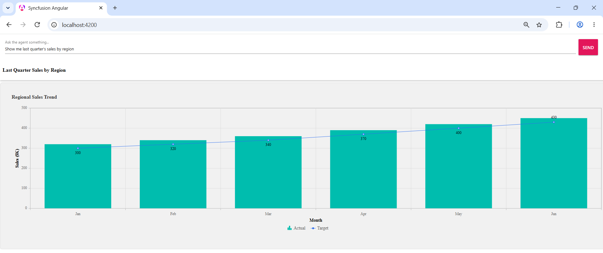

# AI Integration with Syncfusion A2UI

This page shows the production wiring between a Syncfusion A2UI Angular host and a remote [A2UI v0.9](https://a2ui.org/specification/v0.9-a2ui/) agent that speaks [JSON-RPC 2.0](https://www.jsonrpc.org/specification) over HTTP. The [Getting Started](./getting-started) page showed how to render a Syncfusion surface from a static A2UI v0.9 message list. This page covers the next step: connecting your Angular app to a remote, A2UI-compatible agent so the agent's responses drive the surface in real time, and the user's interactions inside the surface are forwarded back to the agent.

N> Syncfusion A2UI for Angular is currently in **preview (beta)** and is published on npm. The A2UI v0.9 wire format is stable, but the package API, catalog id, and Zod schemas may evolve before the first stable release. See the [Overview](./overview) for the full preview terms.

## Prerequisites

The following tools and runtime are required to build and run an A2UI-integrated Syncfusion Angular application.

| Tool | Version |
|------|---------|
| Node.js | 20 or higher |
| Angular CLI | 17 or higher |

### Angular supported versions

| Angular version | Minimum `@syncfusion/ej2-angular-*` version |
|-----------------|------------------------------------|
| Angular v19 | 29.1.33 and above |
| Angular v18 | 27.1.48 and above |
| Angular v17 | 23.2.6 and above |

You also need:

- An existing Angular app that already uses [Syncfusion A2UI for Angular package](https://www.npmjs.com/package/@syncfusion/ej2-angular-a2ui) and renders a static surface as described in the [Getting Started](./getting-started) page.
- A running A2UI v0.9-compatible agent exposed over HTTP that accepts [JSON-RPC 2.0](https://www.jsonrpc.org/specification) `message/send` requests. The reference implementation is the `syncfusion-a2ui-agent` ADK, which ships ready-to-run example agents you can launch locally. The example below targets the bundled Contoso Dynamics demo at `http://localhost:10004`; replace it with the URL of your own agent.
- A registered Syncfusion license key. See [License key generation](../licensing/license-key-generation) and [License key registration](../licensing/license-key-registration).

## What "AI integration" means here

The [Syncfusion A2UI for Angular package](https://www.npmjs.com/package/@syncfusion/ej2-angular-a2ui) is the rendering half of an A2UI flow. The agent half (the LLM, the tool-calling loop, the JSON-RPC server) is a separate concern. To wire the two together, your host app needs to:

1. **Send the user's prompt** to the agent as a JSON-RPC `message/send` request whose `params.message.parts[0]` is `{ text: query }`.
2. **Receive the agent's response** as a JSON-RPC envelope whose `result.artifacts[0].parts[0].data.a2uiEnvelope` is an array of A2UI v0.9 messages (`createSurface`, `updateComponents`, `updateDataModel`, …).
3. **Pass that array** to `processor.processMessages(messages)`. The processor validates each message, builds a `SurfaceModel`, and emits it on `onSurfaceCreated`.
4. **Forward component interactions** to the agent. The `MessageProcessor` takes an `actionHandler` as the second constructor argument; whenever the user clicks a button, sorts a grid, picks a date, or selects a row, the adapter calls your handler with the action payload. Forward that payload to the agent as a new `message/send` request whose `params.message.parts[0]` is `{ data: action }`, and the cycle repeats.

## How it works


*Figure: End-to-end A2UI message processing workflow.*

The diagram from the [Overview](./overview) applies here too, with one extra back arrow: every component action flows back to the agent as a `message/send` request whose `params.message.parts[0]` is `{ data: action }`. The agent decides what to do next, update the same surface (`updateComponents` / `updateDataModel`) or replace it (`createSurface` on a different `surfaceId`), and returns a new `a2uiEnvelope`. The cycle repeats for as long as the surface is active.

## Connect to a remote A2UI agent

Replace the contents of `src/app/app.component.ts`, `src/app/app.component.html`, and `src/styles.css` with the snippets below. They build on the Getting Started example and add a small chat input, a JSON-RPC `message/send` request, and the round-trip back to the agent on every user interaction inside the surface.
















### Import the component styles

The stylesheets imported on the [Getting Started](./getting-started) page cover the components used in the static example. For an agent-driven app, add an `@import` line in `src/styles.css` for every Syncfusion component family the agent might generate; A2UI surfaces are dynamic, so missing stylesheets turn into poor widgets at runtime.

For example, if your chat often surfaces text inputs and buttons, append to `src/styles.css`:

```css
@import "@syncfusion/ej2-tailwind3-theme/styles/inputs/index.css";
@import "@syncfusion/ej2-tailwind3-theme/styles/textbox/index.css";
@import "@syncfusion/ej2-tailwind3-theme/styles/buttons/index.css";
```

If you are using a different theme (`@syncfusion/ej2-material-theme`, `@syncfusion/ej2-fluent2-theme`, `@syncfusion/ej2-material3-theme`, `@syncfusion/ej2-bootstrap5-theme`), replace `tailwind3` with the matching package name. See the Syncfusion EJ2 theme package and import the stylesheets for every component the agent can render.

## How the round-trip works

1. **Initial prompt.** The user types a query ("Show me last quarter's sales by region") and clicks **Send**. `sendQuery()` POSTs a JSON-RPC `message/send` request whose `params.message.parts[0]` is `{ text: query }` to `AGENT_URL`.
2. **Agent response.** The agent runs the LLM, decides which A2UI components to render, and returns a JSON-RPC envelope whose `result.artifacts[0].parts[0].data.a2uiEnvelope` is an array of A2UI v0.9 messages (typically `createSurface` → `updateComponents` → `updateDataModel`).
3. **Process the messages.** `processor.processMessages(messages)` validates each message against the bundled Zod schemas, builds a `SurfaceModel`, and fires `onSurfaceCreated`. `<syncfusion-a2ui-provider>` renders the surface.
4. **User interacts.** When the user clicks a button, sorts the grid, picks a date, or selects a row, the matching Syncfusion adapter calls the `actionHandler` passed to the `MessageProcessor` constructor with the action payload.
5. **Forward to agent.** The handler POSTs the action back to the agent as a new `message/send` request whose `params.message.parts[0]` is `{ data: action }`. The agent decides what to do next, update the same surface (`updateComponents` / `updateDataModel`), or replace it with a new one (`createSurface` on a different `surfaceId`), and returns a new `a2uiEnvelope`. The cycle repeats.

## Things to customize

- **Agent URL.** The example uses the default `http://localhost:10004` (the Contoso Dynamics demo's default port). Replace it with the URL of your own agent, or read it from an environment variable such as `import.meta.env.AGENT_URL`. Add the URL to a `.env` file:
  ```bash
  # .env
  AGENT_URL=http://localhost:10004
  ```
- **Authentication.** Most production agents require a bearer token, an API key, or a session cookie. Add an **Authorization** header (or whatever your agent expects) to both fetch calls before deploying.
- **Error handling.** The example does not include comprehensive error handling. In production, wrap both fetch calls in `try/catch` blocks, surface the error to the user (for example with a `<SyncfusionMessage severity="Error" />`), and clear loading even when the request fails.
- **Pre-locked designs.** If you want the agent to always echo the same surface structure, paste the Composer's A2UI v0.9 JSON into `examples/designs/` and bind it with `agent.set_design(...)`. See [Build the SkyBook Sample](./a2ui-composer/skybook-sample) for the full pattern.
- **Styling.** The example uses a small `.a2ui-chat` class in `styles.css` for the input and button. Move any production styling into your own design system or theme.
- **Multiple surfaces.** A single `MessageProcessor` can hold many surfaces at once (one per `surfaceId`). Subscribe to `onSurfaceCreated` with a `Map<surfaceId, SurfaceModel>` if your agent emits more than one surface in the same response.

## Run the agent

The example agent referenced above is the Contoso Dynamics demo that ships in the `syncfusion-a2ui-agent` repository. To run it locally:

```bash
# 1. Clone the agent repo
git clone https://github.com/syncfusion/syncfusion-a2ui-agent.git
cd syncfusion-a2ui-agent

# 2. Install the ADK and the example package
#    Use `python -m pip` instead of `pip` so the command works on every
#    platform (Windows, macOS, Linux), even if `pip` is not on PATH.
#    On Windows, use `py -m pip …` if `python` is not on PATH.
python -m pip install -e ".[dev]"
python -m pip install -e examples

# 3. Configure your AI provider credentials
cp examples/.env.example examples/.env
# Open examples/.env and fill in AZURE_API_KEY, AZURE_API_BASE, MODEL_NAME, etc.

# 4. Start the agent as an A2A server on http://localhost:10004
python examples/generic_demo_agent.py --serve
```

**Which example should I run?** Two ship with the repository:

| Example | Port | Use it for |
| --- | --- | --- |
| `python examples/generic_demo_agent.py --serve` | `10004` | Contoso Dynamics enterprise dashboards, grounded on `demo_examples.json` (employees, sales, inventory, calendar events). The default choice for the snippet above. |
| `python examples/flight_booking_agent.py --serve` | `10006` | SkyWave Airlines three-stage flight booking workflow (search → results → booking & confirmation). See [Build the SkyBook Sample](./a2ui-composer/skybook-sample) for the end-to-end walkthrough. |

The snippet above targets port `10004` (Contoso). If you switch to the SkyWave example, change `AGENT_URL` to `http://localhost:10006`.

The agent boots an HTTP server that speaks [JSON-RPC 2.0](https://www.jsonrpc.org/specification) `message/send` over `/`. Leave the terminal running and start the Angular app in a second terminal.

## Run the application

In the project where the [Syncfusion A2UI for Angular package](https://www.npmjs.com/package/@syncfusion/ej2-angular-a2ui) is installed, start the Angular app:

```bash
npm start
```

Open the generated local URL (typically, `http://localhost:4200/`) in the browser.



Type a query such as "Show me last quarter's sales by region" and press **Send**. The agent's response renders as a working Syncfusion surface inside the page; any interaction you perform in that surface (clicks, sorts, row selections) is sent back to the agent in real time.

## Verify the integration

Confirm the Angular app, the agent, and the JSON-RPC round-trip are wired up end-to-end:

1. The agent terminal prints the listening URL (default `http://localhost:10004`). The browser console shows no errors when the Angular app loads.
2. Type a query such as "Show me last quarter's sales by region" and click **Send**. The Network tab shows a `POST` to `AGENT_URL` with a JSON-RPC body whose `params.message.parts[0]` is `{ text: query }`, and a `200 OK` response whose `result.artifacts[0].parts[0].data.a2uiEnvelope` is an array.
3. The matching Syncfusion widget (chart, grid, KPI tile, etc.) renders in the page within a few seconds. No Zod-validation error in the console.
4. Click a button or sort a column inside the surface. The **Network** tab shows a second `POST` to `AGENT_URL`, this time with `params.message.parts[0]` shaped as `{ data: { ... } }`, and the surface updates (or is replaced with a new one) based on the agent's reply.
5. Stop the agent process (**Ctrl+C**). Repeat the same query; the fetch should reject with a network error and the surface should not silently freeze — your`try/catch` handler should surface the error to the user.

If any step fails, check both terminals for stack traces. Common causes at this point: wrong `AGENT_URL`, agent process not running, missing stylesheet for the generated component, or the message handler missing the `actionHandler` arg to `MessageProcessor`.

## Common questions

Most errors and edge cases are covered in [A2UI Composer Common Questions](./a2ui-composer/common-questions). Quick picks for this page:

- *Why am I seeing "No root component found"?* — every surface must include `{ "id": "root", "component": "Column", ... }`.
- *Why does the same prompt produce a different layout each time?* — bind a design file via `agent.set_design(...)` so the structure is locked across requests.
- *Why does the SkyBook app in my shell not connect to the agent?* — confirm `AGENT_URL` matches the port the agent is listening on.

## See also

- [Overview](./overview)
- [Getting Started](./getting-started)
- [Supported Components](./supported-components)
- [A2UI v0.9 protocol](https://a2ui.org/specification/v0.9-a2ui/)