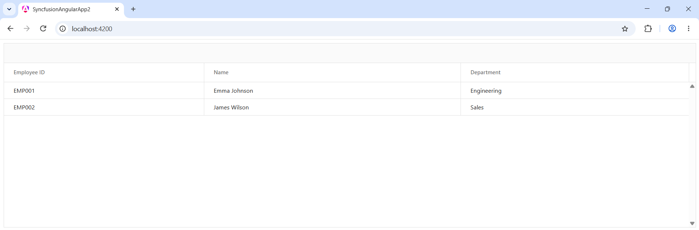

# Getting Started with Syncfusion A2UI

This section walks through creating a simple Angular app that renders a Syncfusion EJ2 Angular component from a list of [A2UI v0.9](https://a2ui.org/specification/v0.9-a2ui/) messages using the [Syncfusion A2UI for Angular package](https://www.npmjs.com/package/@syncfusion/ej2-angular-a2ui). The example below uses a **DataGrid** for illustration, but the same pattern — define an A2UI v0.9 message list, feed it to a `MessageProcessor` configured with `syncfusionCatalog`, and render the result with `<syncfusion-a2ui-provider>` — works for every component in the catalog (**Chart**, **Scheduler**, **Calendar**, **RichTextEditor**, **Diagram**, **Spreadsheet** and more).

## Prerequisites

The following tools and runtime are required to build and run a Syncfusion A2UI Angular application.

| Tool | Version |
|------|---------|
| Node.js | 20 or higher |
| Angular CLI | 17 or higher |

### Angular supported versions

| Angular version | Minimum `@syncfusion/ej2-angular-*` version |
|-----------------|------------------------------------|
| Angular v19 | 29.1.33 and above |
| Angular v18 | 27.1.48 and above |
| Angular v17 | 23.2.6 and above |


## Set up a development environment

To set up an Angular application quickly, use the [Angular CLI](https://angular.dev/tools/cli), which scaffolds a workspace, generates components, builds, and serves the app.

To create a new Angular application, run one of the following commands based on your preferred styling and routing setup:

**Angular with CSS**

```bash
ng new my-app --style=css --routing=false
```

**Angular with SCSS**

```bash
ng new my-app --style=scss --routing=false
```

Both commands scaffold an Angular workspace named `my-app` with the selected styling and no routing module. If you omit the flags, the Angular CLI walks you through the choices interactively.

After the scaffold completes, install the dependencies and start the dev server once to confirm the project is wired up:

```bash
cd my-app
npm install
npm start
```

(or `ng serve`, if `npm start` is not configured). Verify the dev server starts (the terminal prints a `http://localhost:4200/` URL), then stop it and proceed to the next step. You do not need to navigate again; the `cd my-app` above already places you in the project directory.

## Install the Syncfusion A2UI Angular package

The [Syncfusion A2UI for Angular](https://www.npmjs.com/package/@syncfusion/ej2-angular-a2ui) package is published to the npm registry. It bundles the A2UI v0.9 runtime, all Syncfusion EJ2 Angular adapters, and `Zod` as regular dependencies, so a single install line is enough:




npm install @syncfusion/ej2-angular-a2ui




### Install a Syncfusion theme package

Themes for Syncfusion Angular components can be applied using CSS or SASS files from the npm theme packages, CDN, CRG, or Theme Studio.

This guide uses the **Tailwind 3** theme as an example. In this package, each component includes an `index.css` file that automatically loads all the required dependency styles. To install the Tailwind 3 theme package, use the following command:




npm install @syncfusion/ej2-tailwind3-theme




N> Replace `@syncfusion/ej2-tailwind3-theme` with the theme package that matches your design system.

### Clear Angular's default styles

By default, Angular projects include a `src/styles.css` file with default styles. These default styles may conflict with Syncfusion component styles. Clear all content from `src/styles.css` to prevent style conflicts.

### Import the component styles

The required styles for each component family the agent will render are imported in the `src/styles.css` file. The example below imports the stylesheet for the **DataGrid** used in the getting-started code sample; add an `@import` line for every additional component family the agent may use (chips, buttons, schedule, chart, etc.):




@import "@syncfusion/ej2-tailwind3-theme/styles/grid/index.css";




## Render your first Syncfusion A2UI surface

Replace the contents of `src/app/app.component.ts` and `src/app/app.component.html` with the snippets below. They wire up the `MessageProcessor` with `syncfusionCatalog`, subscribe to `onSurfaceCreated`, and process three A2UI v0.9 messages that together render a DataGrid with two employee rows.










N> Based on the configuration of your angular app, update the `src/app.config.ts` and `main.ts` files.

What the snippet does, in order:

1. Imports the `SyncfusionA2UIProvider` and `syncfusionCatalog` from the package, plus the `MessageProcessor` and types from `@a2ui/web_core/v0_9` and `@a2ui/angular/v0_9`.
2. Declares a static **MESSAGES** array with three A2UI v0.9 messages: a `createSurface`, an `updateComponents` that adds a `Column` containing a `SyncfusionDataGrid`, and an `updateDataModel` that supplies the grid's rows.
3. Creates the `MessageProcessor` once during component initialization so it survives re-renders, and registers `syncfusionCatalog` as the catalog it should resolve components against.
4. In the life cycle hook (`ngOnInit`), subscribes to `onSurfaceCreated` (so the latest `SurfaceModel` lands in component state) and immediately calls `processor.processMessages(MESSAGES)` to render the surface.
5. Renders the surface with `<syncfusion-a2ui-provider [surface]="surface"></syncfusion-a2ui-provider>`. The provider is generic, swap `SyncfusionDataGrid` for any other component in the catalog (`SyncfusionChart`, `SyncfusionScheduler`, `SyncfusionCalendar`, `SyncfusionTextBox`, …) and the same pipeline renders it.

## Run the application

Run the application using the following command:

```bash
npm start
```
Open the generated local URL (typically, `http://localhost:4200/`) in the browser.

Click `Render Employee Grid`. The sample grid renders as follows:



The application displays a Syncfusion EJ2 `DataGrid` with the two employee rows, paging, and sorting enabled, rendered entirely from the static A2UI v0.9 message list above.

## Verify the application

Confirm the surface is wired up end-to-end:

1. The browser loads the dev URL without console errors.
2. Clicking **Render Employee Grid** triggers a surface render — the **DataGrid** appears with two rows, **ID** and **Name** columns, plus the grid features such as sorting, searching, and paging
3. Resize a column header, change a page, or sort a column. Each interaction should be smooth, with no Angular warnings in the browser console.
4. Open the browser DevTools **Network** tab and reload the page — verify that no data requests leave the browser when the grid renders. This proves the `MessageProcessor` synthesized the surface entirely from the static `MESSAGES` array in `src/app/app.component.ts`, with no external backend in the loop.

If any step fails, check the browser console for Zod-schema validation errors — most failures at this point are caused by a miscopying `MESSAGES` array or a missing `syncfusionCatalog` registration.

## Register the Syncfusion license key

Syncfusion<sup style="font-size:70%">&reg;</sup> EJ2 Angular components require a valid license key to be registered before they render without a trial-license watermark. The A2UI adapters call into the same EJ2 components under the hood, so a registered key is required even when the UI itself is generated by an agent.

For instructions on generating and registering a license key, see:

* [How to generate a Syncfusion Angular license key](../licensing/license-key-generation)
* [How to register a Syncfusion Angular license key](../licensing/license-key-registration)

## See also

* [Overview](./overview)
* [AI Integration](./ai-integration)
* [Supported Components](./supported-components)
* [A2UI v0.9 protocol](https://a2ui.org/specification/v0.9-a2ui/)